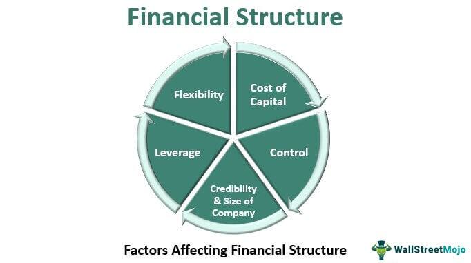

Understanding the diverse world of investing involves exploring a wide array of financial instruments and strategies. As investors seek to build wealth and secure financial futures, they encounter various approaches designed to optimize the balance between risk and potential return. This article offers a comprehensive guide to key investment strategies, particularly focusing on financial options, derivatives, and algorithmic trading—a trio of intricately related domains that have transformed modern investing.

Investment strategies form the backbone of financial decision-making. These strategies encompass techniques like asset allocation, which determines the proportion of investments across various asset classes, as well as value investing, characterized by purchasing undervalued securities with strong fundamentals. Growth investing, targeting securities with potential for significant capital appreciation, also plays a pivotal role. The overarching objective of these strategies is to harmonize risk and reward in alignment with an investor's unique objectives.



Among the tools available to seasoned investors are financial options and derivatives. These instruments derive their value from the performance of underlying assets, such as stocks or commodities. They include various contracts like call and put options, which provide the right but not the obligation to buy or sell the underlying asset at a predetermined price. Futures and swaps further enrich this category, each offering sophisticated means of hedging against market fluctuations or engaging in speculative activities.

Algorithmic trading has gained prominence in recent years, harnessing the power of computer algorithms to execute trades rapidly and with precision. This approach bypasses the limitations of manual trading, enabling strategies that rely on speed and efficiency. High-frequency trading, a subset of algorithmic trading, and notable strategies such as trend following and arbitrage, illustrate the technological advancements reshaping financial markets.

By dissecting these elements, this article aims to guide investors and enthusiasts through the complexities of financial options, derivatives, and algorithmic trading. It seeks to equip readers with the knowledge needed to navigate these intricate yet rewarding investment avenues successfully.

## Table of Contents

## Understanding Investment Strategies

Investment strategies represent the structured approaches that investors employ to make informed financial decisions. These strategies are critical as they help investors achieve specific objectives by balancing risk and reward.

One of the fundamental strategies is **asset allocation**, which involves distributing investments among various asset categories, such as stocks, bonds, and real estate. The rationale behind this strategy is diversification, aiming to maximize returns by investing in different areas that would react differently to the same event. For example, the performance of investments in equities might not correlate with bonds or commodities, thereby spreading risk and potentially increasing overall returns.

**Value investing** is another popular strategy. It involves picking stocks that appear to be trading for less than their intrinsic or book value. Value investors seek stocks they believe the market has undervalued. They typically look for stocks of companies that have consistent earnings, are in strong financial health, and possess attractive dividend yields. This approach is often associated with the principle of "buying low and selling high," as investors aim to purchase undervalued stocks and profit when the market corrects its pricing.

Conversely, **growth investing** focuses on capital appreciation. Growth investors target companies expected to grow at an above-average rate compared to their industry or the overall market. Instead of looking for underpriced stocks, growth investors often consider companies with high earnings growth potential, even if they come with higher price-to-earnings ratios. This strategy assumes that the rapid earnings growth will justify the high valuations over time, leading to substantial price appreciation.

Other notable strategies include **dividend investing**, which emphasizes investing in stocks that pay high dividends, providing a steady income stream in addition to capital gains, and **[momentum](/wiki/momentum) investing**, where investors aim to capitalize on existing market trends. In momentum investing, the belief is that stocks that have performed well in the past will continue to do so, and vice versa, in the short term.

The unifying goal across these strategies is to achieve a balance between risk and reward that aligns with an investor's financial goals and risk tolerance. While high returns are desirable, they often come with increased risk. Conversely, reducing risk might limit potential returns. Thus, a sound investment strategy not only aims to maximize returns but also ensures that the level of risk taken is appropriate for the investor's individual circumstances. 

In conclusion, understanding and selecting the appropriate investment strategy is crucial for the success of one's financial planning, especially given market volatilities and economic changes. It requires a thorough analysis of personal financial goals, risk appetite, and market opportunities.

## Financial Options and Derivatives

Options and derivatives are fundamental components of modern financial markets, allowing investors and institutions to manage risk and explore speculative opportunities. These contracts derive their value from the performance of an underlying asset, which can range from stocks and bonds to commodities and foreign exchange.

### Variety of Financial Instruments

Options and derivatives encompass a wide array of financial instruments, each with its unique characteristics and applications. Call and put options are among the most common types, providing the right, but not the obligation, to buy or sell an asset at a predetermined price before the option expires. This characteristic makes options highly versatile tools for both hedging against potential losses and profiting from expected price movements.

Futures contracts, another type of derivative, obligate the parties involved to transact an asset at a predetermined future date and price. Unlike options, futures impose an obligation, which can be used to hedge against price [volatility](/wiki/volatility-trading-strategies) or to speculate. Swaps, on the other hand, are agreements between two parties to exchange cash flows or other financial instruments, often used to manage [interest rate](/wiki/interest-rate-trading-strategies) or currency exposure.

### Applications in Financial Markets

The primary utility of options and derivatives lies in their ability to hedge against risks or to enhance returns through speculation. Hedging involves taking a position in a derivative to offset potential losses in an associated asset. For instance, an investor holding a stock portfolio might purchase put options to protect against a decline in stock prices. The protective put strategy limits potential losses while preserving gains from rising stock prices.

Conversely, derivatives can be employed to speculate on the direction of market prices. Traders might purchase call options if they anticipate an asset's price will rise, aiming to profit from the leverage options provide. Similarly, selling options or entering into futures contracts can facilitate speculation on falling prices.

The mathematical modeling of derivatives pricing, such as the Black-Scholes model for options, helps traders assess fair values and implied volatility. This mathematical foundation underscores the complexity of these instruments and supports informed trading decisions.

In conclusion, options and derivatives offer powerful tools for navigating financial markets, enabling diverse strategies for risk management and speculative ventures alike. Proper understanding and usage of these instruments require a grasp of their underlying mechanics and the financial environments in which they operate.

## The Anatomy of Options

Options are financial instruments that provide the holder the right, but not the obligation, to purchase or sell an asset at a predetermined price, known as the strike price, prior to or on a specified expiration date. This flexibility allows for strategic decision-making, allowing investors to capitalize on market movements without committing to the underlying asset until necessary.

### Key Components

1. **Strike Price**: This is the fixed price at which the option holder can buy (in the case of a call option) or sell (in the case of a put option) the underlying asset. The relationship between the strike price and the market price of the asset significantly influences the value of an option.

2. **Expiration Date**: Options have a limited life span, defined by the expiration date. This date marks the deadline by which the option must be exercised if the holder decides to do so. The time remaining until expiration affects the option's premium, as the longer the duration, the higher the potential for the underlying asset's price to move favorably.

3. **Premium**: The premium is the price at which the option is purchased. It represents the cost to the option buyer and the income to the option seller. The premium is influenced by various factors, including the current price of the underlying asset, time until expiration, volatility, and prevailing interest rates.

### Understanding 'The Greeks'

To manage and understand the risks associated with options, traders analyze various parameters known as 'The Greeks'. These measures indicate how sensitive an option's price is to changes in market conditions.

#### Delta (Δ)

Delta measures the rate of change of the option price with respect to changes in the underlying asset's price. For instance, a delta of 0.5 implies that for a $1 increase in the underlying asset's price, the option's price will increase by $0.50. Delta values range from 0 to 1 for call options and -1 to 0 for put options.

#### Gamma (Γ)

Gamma measures the rate of change of delta over the price of the underlying asset. It provides insight into the stability of delta, highlighting how much delta is expected to change if the asset price moves significantly. High gamma values suggest that delta is likely to undergo rapid changes, indicating potential volatility in option pricing.

#### Theta (Θ)

Theta represents the rate at which the option's price declines as the expiration date approaches, known as time decay. It quantifies the non-linear rate at which options lose value as they near expiration. Typically, options experience greater time decay as expiration approaches, emphasizing the importance of timing in options trading.

Understanding these concepts empowers investors to engage in more sophisticated risk management and trading strategies, enhancing their ability to respond to market dynamics effectively.

## Algorithmic Trading

Algorithmic trading, often referred to as algo trading, employs the use of sophisticated computer algorithms to execute trades at speeds and frequencies that a human trader cannot achieve. These algorithms utilize predefined criteria, which can include conditions based on price, [volume](/wiki/volume-trading-strategy), and timing, to make informed trading decisions. 

High-frequency trading ([HFT](/wiki/high-frequency-trading-strategies)), a subset of [algorithmic trading](/wiki/algorithmic-trading), is characterized by its ability to execute a large number of orders within fractions of a second, capitalizing on minute price discrepancies in the market. This is made possible by advanced technology and substantial computational power, which enables the execution of trades faster than traditional manual trading methods.

Several popular strategies underpin algorithmic trading, each leveraging different market dynamics for potential profitability:

1. **Trend Following**: This strategy focuses on capturing gains through the analysis of an asset’s momentum in a particular direction. Algorithms track indicators such as moving averages, channel breakouts, or related technical signals to identify the onset of new trends. The objective is to enter trades in the direction of sustained trends, which are assumed to continue based on historical data of price movements.

2. **Arbitrage**: This strategy exploits price inefficiencies or discrepancies in different markets or instruments. A common example is statistical arbitrage, where short-term dependencies between securities are leveraged for profit. Automated trading systems are particularly effective for arbitrage due to the need for rapid order execution to take advantage of fleeting opportunities. For example, if the same stock is trading at different prices on two exchanges, an algorithm can simultaneously buy at the lower price and sell at the higher price, capturing the spread.

3. **Mean Reversion**: This strategy is based on the assumption that asset prices and historical returns eventually revert to their long-term mean or average level. Algorithms examine price, historical series data, or other financial indicators to identify instances where the current price deviates significantly from its average. The trading system then predicts a reversion, and places trades to benefit from the return to this average value.

Algorithmic trading is often conducted with the aid of complex mathematical models and data-driven analysis. An example of a simplistic moving average crossover strategy in Python might look like this:

```python
import pandas as pd
import numpy as np

# Sample function for a simple moving average crossover strategy
def moving_average_strategy(price_data, short_window=40, long_window=100):
    signals = pd.DataFrame(index=price_data.index)
    signals['price'] = price_data['price']
    signals['short_mavg'] = price_data['price'].rolling(window=short_window, min_periods=1, center=False).mean()
    signals['long_mavg'] = price_data['price'].rolling(window=long_window, min_periods=1, center=False).mean()
    signals['signal'] = 0.0

    # Create signals
    signals['signal'][short_window:] = np.where(
        signals['short_mavg'][short_window:] > signals['long_mavg'][short_window:], 1.0, 0.0)

    signals['position'] = signals['signal'].diff()

    return signals
```

This simple model calculates the short-term and long-term moving averages of a stock price and generates buy or sell signals based on their crossover. While basic, such models form the basis for more complex strategies involving [machine learning](/wiki/machine-learning) or advanced statistical analysis. 

Despite its efficiencies, algorithmic trading requires meticulous planning and testing. Strategies must be rigorously backtested against historical data to determine their viability without incurring significant risk in real markets. Moreover, the technical infrastructure required for algo trading, including access to real-time data and low-latency execution platforms, is critical for success.

## Benefits of Algorithmic Trading

Algorithmic trading, often abbreviated as algo trading, uses automated processes and computer algorithms to execute trades in financial markets. This method offers numerous benefits, revolutionizing how trading is conducted by enhancing speed, precision, and efficiency.

One of the primary advantages of algorithmic trading is the increase in execution speed and accuracy, achieved by reducing human error. Automated systems can react to market conditions and execute trades within milliseconds, a feat human traders cannot achieve. This capability is essential in modern markets, where price fluctuations and opportunities can emerge quickly. For instance, when a pre-defined market condition is met, algorithms can instantly execute trades, capturing profits or limiting losses with precision.

Additionally, algorithmic trading is adept at handling complex calculations and managing multiple trades simultaneously. Financial markets often require the analysis of vast datasets and intricate calculations that are cumbersome for manual processing. Algorithms can effortlessly execute complex trading strategies across various assets and markets. This multi-tasking capability ensures that trades are executed at optimal prices, minimizing slippage and maximizing profitability.

Furthermore, algorithmic trading offers the significant advantage of [backtesting](/wiki/backtesting) strategies using historical data. Backtesting involves applying trading algorithms to historical market data to evaluate their effectiveness before deploying them in live markets. This process enables traders to fine-tune their strategies, optimize parameters, and assess potential risks and returns. Python, a popular programming language for algorithmic trading, provides libraries such as `[backtrader](/wiki/backtrader)` that facilitate backtesting:

```python
import backtrader as bt

class MyStrategy(bt.Strategy):
    def next(self):
        if not self.position:
            # Example condition for entering a buy trade
            if self.data.close[0] < self.data.close[-1]:
                self.buy(size=100)
        elif self.position:
            # Example condition for exiting a trade
            if self.data.close[0] > self.data.close[-1]:
                self.sell(size=100)

cerebro = bt.Cerebro()
data = bt.feeds.YahooFinanceData(dataname='AAPL')
cerebro.adddata(data)
cerebro.addstrategy(MyStrategy)
cerebro.run()
```

This code exemplifies how a strategy might be designed and tested, helping traders evaluate performance and make data-driven improvements.

In conclusion, algorithmic trading is valuable for increasing trading efficiency, minimizing errors, and optimizing strategies. As financial markets continue to evolve, the advantages offered by algorithmic trading ensure its growing role in modern investment strategies.

## Risks and Challenges in Algo Trading

Algorithmic trading, though highly efficient, poses several risks and challenges that traders must navigate to ensure successful implementation. One significant risk is technical failure. Algorithmic trading systems are heavily dependent on technology infrastructure, including computers, networks, and software platforms. A failure in any of these components, such as a hardware crash, network outage, or software bug, can lead to substantial trading losses. Moreover, latency, or delays in communication between these systems, can result in trades being executed at undesirable prices or even failure to execute.

Another challenge is inadequate risk management. While algorithmic systems can manage complex strategies involving multiple assets and markets, they must be complemented by robust risk management protocols. The absence of such systems can lead to excessive exposure and significant financial setbacks, particularly in volatile markets. Risk management strategies may involve setting stop-loss orders, size limits on positions, and dynamic adjustments based on market conditions.

Over-optimization is a common pitfall in algorithmic trading. This occurs when a trading algorithm is excessively fine-tuned to perform well on historical data, a process known as backtesting, without considering the potential variability in future market environments. Such overfitting can lead to algorithms that fail to adapt, resulting in poor performance in real market conditions where unforeseen events and anomalies occur.

The infrastructure supporting algorithmic trading must be robust and capable of handling high-frequency data inputs and outputs. Real-time data access is crucial for algorithms that rely on the latest market information to make trading decisions. This requires high-speed data feeds, reliable connectivity, and low-latency processing capabilities. Traders must ensure their systems are capable of handling bursts of activity and unexpected market events efficiently.

In summary, while algorithmic trading offers significant advantages in speed and execution, it is crucial for traders to account for the risks associated with technical failures and the need for precise risk management frameworks. Additionally, avoiding over-optimization and ensuring robust infrastructural capabilities are essential to mitigate these challenges. This comprehensive risk management approach can significantly enhance the effectiveness of algorithmic trading systems in dynamic market environments.

## Combining Options and Algo Trading

Combining options strategies with algorithmic trading leverages the respective strengths of both methodologies, creating a robust investment approach capable of enhancing market opportunities and optimizing risk management.

Options strategies, such as straddles and condors, require precise execution due to their complexity and the need to respond swiftly to market changes. A straddle strategy involves buying a call and a put option at the same strike price and expiration date, betting on significant price movements in either direction. The iron condor, on the other hand, is a strategy that combines two vertical spreads and aims to profit from low volatility by limiting both gains and losses. The precise timing and multifaceted nature of these options strategies make them ideal candidates for algorithmic trading.

Algorithmic trading systems can be programmed to identify the exact market conditions under which to implement these strategies, reacting faster than a human trader ever could. By automating the execution process, algorithms help to mitigate the errors that often accompany the manual execution of complex strategies. An algorithm might be written in Python as follows:

```python
import numpy as np

# Hypothetical function for identifying trade signals
def identify_trade_signal(market_data):
    # Analyze market data for predefined patterns or signals
    signal = np.mean(market_data) > threshold  # Simplified logic
    return signal

# Execute straddle strategy
def execute_straddle(options_data):
    if identify_trade_signal(options_data):
        # Place orders for call and put options at the same strike price
        place_order('call', strike_price, quantity)
        place_order('put', strike_price, quantity)

# Place order function
def place_order(option_type, strike_price, quantity):
    # Logic to place an options order
    print(f"Placing {option_type} option order at strike {strike_price} for {quantity} contracts.")

# Example execution with dummy data
market_data = np.random.rand(100) * 10  # Dummy market data
options_data = market_data  # For simplicity, using the same dummy data
execute_straddle(options_data)
```

This combination of algorithmic processing power and sophisticated options strategies not only enhances market opportunities but also significantly bolsters risk management. By leveraging high-speed computations and complex risk assessment algorithms, it becomes feasible to optimize the risk-return profile of investment portfolios in real-time. Algorithms can continuously assess risk parameters, such as delta and gamma, allowing for dynamic hedging that adjusts positions based on real-time market data.

Moreover, this integration facilitates access to a broader spectrum of market opportunities. Algorithms can scan multiple markets simultaneously, identifying and executing trades that meet specified criteria without human intervention. This ability to process vast amounts of data efficiently increases the likelihood of capitalizing on favorable market conditions.

Therefore, the synchronization of options strategies with algorithmic trading represents a significant advancement in modern investment techniques. It allows investors to approach financial markets with a level of precision and resilience that is increasingly necessary in today's fast-paced trading environment.

## Getting Started with Algo Trading in Options

To begin algorithmic trading in options, it is essential to first identify trading strategies that align with your risk tolerance and investment goals. This involves understanding different options trading strategies such as covered calls, straddles, or iron condors, and evaluating which ones are feasible for your risk profile. 

Next, you should select platforms and software that facilitate algorithmic trading with options. Popular platforms such as MetaTrader, TC2000, and ThinkOrSwim provide tools for creating and executing algorithm-driven trades. Many of these platforms offer extensive libraries and APIs, often in Python, which enable traders to develop customized algorithms. Here is a basic example of what a simple options trading algorithm might look like in Python:

```python
import numpy as np

def simple_moving_average(data, window_size):
    return np.convolve(data, np.ones(window_size), 'valid') / window_size

# Mock price data
option_prices = [100, 102, 101, 98, 99, 101, 103, 105, 107, 106]

# Calculate the moving averages
short_window = 3
long_window = 5
short_moving_avg = simple_moving_average(option_prices, short_window)
long_moving_avg = simple_moving_average(option_prices, long_window)

print("Short Moving Average:", short_moving_avg)
print("Long Moving Average:", long_moving_avg)

# Example strategy: Buy when short MA crosses above long MA
for i in range(1, len(short_moving_avg)):
    if short_moving_avg[i] > long_moving_avg[i-1] and short_moving_avg[i-1] <= long_moving_avg[i-2]:
        print(f"Buy signal on day {i+long_window-1}")
```

This code snippet demonstrates a simple strategy using moving averages, a common technique in algorithmic trading, to generate buy signals when the short-term average crosses above the long-term average.

Before committing real capital, it's critical to perform thorough backtesting and paper trading. Backtesting involves simulating the algorithm on historical data to ensure it behaves as expected. This process helps identify potential pitfalls and refine strategies without financial risk. For backtesting, platforms like QuantConnect and AlgoTrader provide extensive historical data and testing environments that replicate live trading conditions. Paper trading, on the other hand, involves executing trades in a simulated environment that mimics real-world trading, allowing for practice and adjustment without financial exposure.

By following these steps, traders can effectively enter the world of algorithmic options trading, harnessing technology to enhance their investment processes while carefully managing risk.

## Conclusion

Investment strategies that incorporate derivatives and algorithmic trading present significant opportunities for achieving high returns. These methodologies, when effectively implemented, can exploit market inefficiencies, diversify portfolio exposure, and optimize trade execution. However, the inherent complexity and volatility associated with these financial instruments necessitate a thorough understanding and careful management of risk.

Risk management is fundamental to the successful application of derivatives and algorithmic trading. Derivatives, by their nature, can amplify gains but also magnify losses. Employing disciplined strategies, such as setting stop-loss orders and maintaining a diversified portfolio, can mitigate potential downsides. Algorithmic trading requires meticulous attention to the algorithms' design and execution, ensuring they align with predefined risk parameters and market conditions. Additionally, implementing real-time monitoring systems can help in promptly addressing any unforeseen market events or technical glitches.

The financial markets are dynamic, with conditions that can rapidly shift due to economic, political, and technological factors. Therefore, continuous learning is crucial for investors and traders. Keeping abreast of market trends, advancements in trading technologies, and regulatory changes enhances the ability to adapt strategies effectively. This adaptability not only aids in maximizing returns but also ensures resilience against adverse market changes.

Staying informed about market innovations and refining techniques is essential for navigating the complexities of derivatives and algorithmic trading. Engaging in educational opportunities, participating in trading forums, and analyzing successful case studies can provide valuable insights and inspire strategic improvements.

In conclusion, while the pursuit of high returns through derivatives and algorithmic trading is enticing, success hinges on a robust understanding of risk and a disciplined approach. By combining continuous learning with adaptive strategies, investors can enhance their ability to thrive within these sophisticated financial landscapes.

## References & Further Reading

[1]: Bergstra, J., Bardenet, R., Bengio, Y., & Kégl, B. (2011). ["Algorithms for Hyper-Parameter Optimization."](https://papers.nips.cc/paper/4443-algorithms-for-hyper-parameter-optimization) Advances in Neural Information Processing Systems 24.

[2]: ["Advances in Financial Machine Learning"](https://www.amazon.com/Advances-Financial-Machine-Learning-Marcos/dp/1119482089) by Marcos Lopez de Prado

[3]: ["Evidence-Based Technical Analysis: Applying the Scientific Method and Statistical Inference to Trading Signals"](https://www.amazon.com/Evidence-Based-Technical-Analysis-Scientific-Statistical/dp/0470008741) by David Aronson

[4]: ["Machine Learning for Algorithmic Trading"](https://github.com/stefan-jansen/machine-learning-for-trading) by Stefan Jansen

[5]: ["Quantitative Trading: How to Build Your Own Algorithmic Trading Business"](https://www.amazon.com/Quantitative-Trading-Build-Algorithmic-Business/dp/1119800064) by Ernest P. Chan