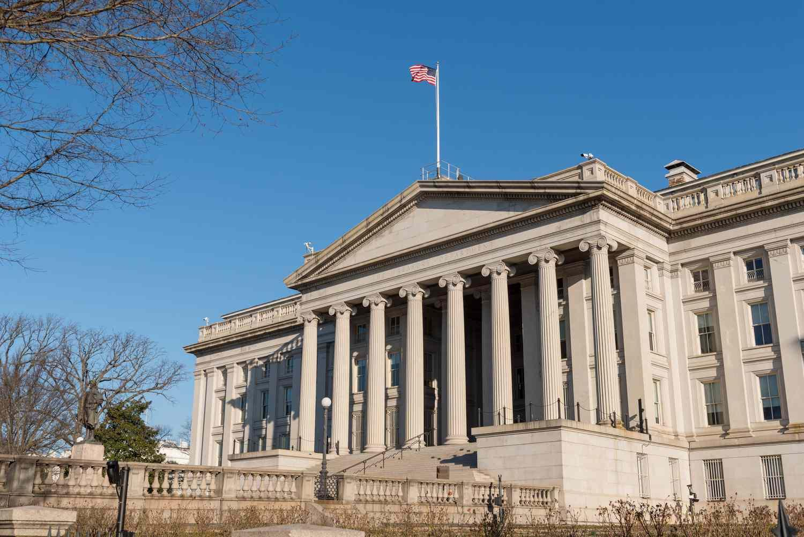

## Table of Contents

## What is the Office of the Comptroller of the Currency (OCC)?

The Office of the Comptroller of the Currency (OCC) is a part of the U.S. Department of the Treasury. It is responsible for making sure that national banks and federal savings associations follow the rules. The OCC was created in 1863 to help make the banking system safe and sound.

The OCC does its job by supervising banks, making rules, and taking action if banks do not follow the rules. It also gives out charters, which are like official permissions, for banks to operate. This helps to keep the banking system stable and trustworthy for everyone who uses it.

## When was the OCC established and why?

The Office of the Comptroller of the Currency (OCC) was established in 1863. This was during the Civil War, a time when the United States needed a more stable and reliable banking system. The country was using many different types of money, which made things confusing and risky. The government wanted to fix this problem and make sure people could trust banks.

So, they created the OCC to oversee national banks. The main goal was to make the banking system safer and more uniform across the country. The OCC would make sure banks followed the rules, which would help prevent bank failures and protect people's money. This was an important step in building a stronger financial system for the United States.

## What is the primary role of the Comptroller of the Currency?

The Comptroller of the Currency is the head of the OCC and has a big job. The main role is to make sure that national banks and federal savings associations follow the rules. This means the Comptroller checks that these banks are safe and sound, and that they treat their customers fairly. The Comptroller also makes new rules and can take action if banks do not follow them.

Another important part of the job is to give out charters. A charter is like a special permission that lets a bank start operating. The Comptroller decides if a bank should get a charter by looking at things like the bank's plans and the people who will run it. By doing all these things, the Comptroller helps keep the banking system strong and trustworthy for everyone.

## How is the Comptroller of the Currency appointed?

The Comptroller of the Currency is appointed by the President of the United States. The President picks someone who they think will do a good job at making sure banks follow the rules and keep people's money safe. After the President chooses someone, the Senate has to agree with the choice. The Senate looks at the person's background and experience to make sure they are a good fit for the job.

Once the Senate agrees, the person can become the Comptroller of the Currency. They usually serve for a term of five years, but they can be asked to leave the job earlier if the President decides to do so. This way, the President can make sure the Comptroller is doing a good job and keeping the banking system strong and trustworthy.

## What types of institutions does the OCC regulate?

The Office of the Comptroller of the Currency (OCC) mainly regulates national banks. These are banks that have a special permission called a charter from the federal government. The OCC makes sure these banks follow the rules and stay safe and sound. This helps keep people's money safe and makes sure the banks treat their customers fairly.

The OCC also regulates federal savings associations. These are similar to banks but focus more on helping people save money and get home loans. Like with national banks, the OCC checks that federal savings associations follow the rules. This helps keep the whole banking system strong and trustworthy for everyone who uses it.

## What are the main powers of the OCC in supervising banks?

The Office of the Comptroller of the Currency (OCC) has big powers to make sure banks follow the rules. One main power is to check on banks regularly. They send people to look at how banks are doing their work. These checks help the OCC see if banks are safe and sound. If they find problems, they can tell the banks to fix them. This helps keep people's money safe and makes sure banks treat customers fairly.

Another important power is that the OCC can make new rules for banks to follow. These rules can be about how banks should handle money, treat customers, or even how they should run their business. If a bank does not follow these rules, the OCC can take action. They might fine the bank, stop it from doing certain things, or even take away its charter. This means the bank can't operate anymore. By using these powers, the OCC helps keep the banking system strong and trustworthy for everyone.

## How does the OCC ensure the safety and soundness of national banks?

The OCC makes sure national banks are safe and sound by checking on them regularly. They send people to look at how the banks are doing their work. These checks help the OCC see if the banks are following the rules and if they are safe for people to use. If they find any problems, they tell the banks to fix them. This helps keep people's money safe and makes sure the banks are doing things the right way.

The OCC also has the power to make new rules for banks to follow. These rules can be about how banks should handle money, treat customers, or run their business. If a bank does not follow these rules, the OCC can take action. They might fine the bank, stop it from doing certain things, or even take away its charter, which means the bank can't operate anymore. By using these powers, the OCC helps keep the banking system strong and trustworthy for everyone.

## What role does the OCC play in consumer protection?

The OCC helps protect people who use banks by making sure banks treat them fairly. They do this by checking on banks to see if they are following the rules about how to treat customers. If a bank is not treating people right, the OCC can make the bank fix the problem. This helps make sure that people's money is safe and that they are treated well when they go to the bank.

The OCC also makes rules that banks have to follow to protect customers. These rules can be about things like making sure people understand the fees they have to pay or how their money is being used. If a bank does not follow these rules, the OCC can take action. They might fine the bank or make it stop doing certain things. By doing all this, the OCC helps keep the banking system fair and safe for everyone who uses it.

## How does the OCC enforce compliance with banking laws and regulations?

The OCC makes sure banks follow the rules by checking on them regularly. They send people to look at how the banks are doing their work. These checks help the OCC see if the banks are safe and if they are treating customers fairly. If they find any problems, they tell the banks to fix them. This helps keep people's money safe and makes sure the banks are doing things the right way.

The OCC also has the power to make new rules for banks to follow. These rules can be about how banks should handle money, treat customers, or run their business. If a bank does not follow these rules, the OCC can take action. They might fine the bank, stop it from doing certain things, or even take away its charter, which means the bank can't operate anymore. By using these powers, the OCC helps keep the banking system strong and trustworthy for everyone.

## What is the process for chartering a new national bank under the OCC?

To start a new national bank, someone first needs to apply to the OCC. They fill out a special form and give the OCC a lot of information about their plans. This includes things like who will run the bank, how much money they will start with, and what kind of services the bank will offer. The OCC looks at all this information carefully to make sure the new bank will be safe and sound. They also check if the people running the bank have good experience and if the bank's plan makes sense.

After the OCC looks at everything, they might ask for more information or even visit the people who want to start the bank. If everything looks good, the OCC gives the bank a charter. This is like a special permission that lets the bank start working. But if the OCC finds problems or thinks the bank might not be safe, they can say no to the charter. This whole process helps make sure that only good, safe banks can open and start helping people with their money.

## How does the OCC coordinate with other federal and state regulatory agencies?

The OCC works with other federal and state agencies to make sure banks follow all the rules. They talk to agencies like the Federal Reserve and the FDIC to share information and make sure everyone is on the same page. This helps them see the big picture of how banks are doing and if there are any problems that need fixing. By working together, they can make sure banks are safe and sound and that people's money is protected.

The OCC also works with state regulators. Each state has its own rules for banks, and the OCC makes sure national banks follow both federal and state rules. They meet with state agencies to discuss any issues and to plan how to handle them. This teamwork helps keep the banking system strong and trustworthy for everyone who uses it.

## What recent reforms or changes have impacted the structure and powers of the OCC?

In recent years, the OCC has seen some changes that affect how it works and what it can do. One big change was in 2020 when the OCC started allowing banks to do business with companies that use cryptocurrencies, like Bitcoin. This was a big deal because it showed that the OCC was trying to keep up with new types of money and technology. Another change happened in 2021 when the OCC proposed new rules about how banks should handle climate change risks. This means banks need to think about how things like storms and floods could affect their business.

These changes show that the OCC is trying to stay modern and handle new challenges. By allowing banks to work with cryptocurrencies, the OCC is making sure banks can use new technology safely. And by focusing on climate change, the OCC is helping banks prepare for future problems that could affect their customers and the economy. These reforms help the OCC keep the banking system strong and trustworthy as the world changes.

## References & Further Reading

[1]: Office of the Comptroller of the Currency. ["What We Do."](https://www.occ.gov/about/who-we-are/index-who-we-are.html)

[2]: Federal Reserve. ["Supervisory Guidance on Model Risk Management."](https://www.federalreserve.gov/supervisionreg/srletters/sr1107.htm)

[3]: Aldridge, I. (2013). ["High-Frequency Trading: A Practical Guide to Algorithmic Strategies and Trading Systems."](https://www.amazon.com/High-Frequency-Trading-Practical-Algorithmic-Strategies/dp/1118343506) Wiley Finance.

[4]: Hasbrouck, J., & Saar, G. (2013). ["Low-latency trading."](https://www.sciencedirect.com/science/article/abs/pii/S1386418113000165) The Review of Financial Studies, 26(9), 2092–2137.

[5]: MacKenzie, D., & Spears, T. (2014). ["'The formula that killed Wall Street'? The Gaussian copula and modelling practices in investment banking."](https://www.research.ed.ac.uk/en/publications/the-formula-that-killed-wall-street-the-gaussian-copula-and-model) Social Studies of Science, 44(3), 393–417. 

[6]: Kissell, R. (2014). ["The Science of Algorithmic Trading and Portfolio Management."](https://www.sciencedirect.com/book/9780124016897/the-science-of-algorithmic-trading-and-portfolio-management) Academic Press.

[7]: Cartea, Á., Jaimungal, S., & Penalva, J. (2015). ["Algorithmic and High-Frequency Trading."](https://assets.cambridge.org/97811070/91146/frontmatter/9781107091146_frontmatter.pdf) Cambridge University Press.