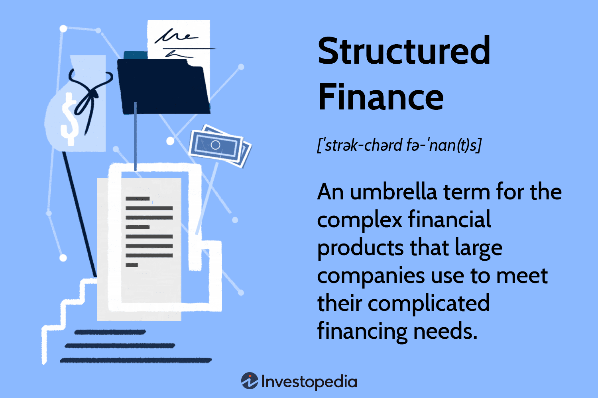

Structured finance and algorithmic trading have emerged as two of the most significant innovations in modern finance, reshaping the way financial transactions are structured and executed. These two concepts, while distinct, often intersect to create synergies that enhance the effectiveness of financial strategies. Structured finance involves the creation of tailored financial instruments that address unique and complex financing needs. These instruments, such as collateralized debt obligations (CDOs) and credit default swaps (CDSs), are utilized to redistribute risk and improve liquidity.

On the other hand, algorithmic trading leverages computer algorithms to automate and optimize trading processes, providing rapid execution that manual trading cannot match. Today's financial landscape is characterized by high volatility and the need for sophisticated risk management strategies. As such, understanding structured finance and algorithmic trading is crucial for investors, financial institutions, and businesses that operate within this complex environment. 



The following exploration will detail the financial benefits of structured finance through various real-world case studies, highlighting how these bespoke financial solutions have been strategically employed to manage risk and enhance capital allocation. Additionally, we will examine how algorithmic trading acts as a catalyst in maximizing these benefits by providing computational power and predictive analytics, which are essential in today's high-frequency trading markets. By integrating these two disciplines, organizations can navigate financial complexities more effectively, positioning themselves for better stability and growth.

## Table of Contents

## Understanding Structured Finance

Structured finance refers to the innovative use of customized financial products designed to address complex financing needs that cannot be effectively met by traditional financial mechanisms. This sophisticated financial engineering is essential for redirecting cash flows and achieving objectives such as risk transfer, regulatory capital relief, or liquidity enhancement.

Common instruments in structured finance include collateralized debt obligations (CDOs), credit default swaps (CDSs), and synthetic financial instruments. Each of these tools serves a unique purpose in managing financial risk and optimizing portfolio performance.

**Collateralized Debt Obligations (CDOs):**
CDOs are financial instruments that pool various income-generating assets such as mortgages, bonds, and loans, and then repurpose them into tranches that can be sold to investors. Each tranche carries different levels of risk and return, allowing investors to choose based on their risk appetite. The creation of CDOs revolutionized capital markets by enabling the distribution of risk across a wider range of investors, rather than concentrating it with a single entity.

**Credit Default Swaps (CDSs):**
A CDS is a derivative that allows an investor to "swap" credit risk. In essence, it functions like an insurance contract, where the buyer of a CDS receives protection against the default of a borrower or a credit event. If such an event occurs, the CDS seller compensates the buyer. CDSs provide a mechanism for credit risk transfer and played a pivotal role during the 2008 financial crisis by exposing systemic vulnerabilities.

**Synthetic Financial Instruments:**
Synthetic financial instruments are created to mimic the performance of other financial instruments without having to invest directly in those instruments. For example, a synthetic CDO gains exposure to the credit risk of a portfolio via derivatives rather than direct ownership of the underlying assets. This allows financial engineers to tailor risk-paying criteria to investor preferences.

**Historical Evolution:**
Structured finance began to emerge prominently in the 1980s and has evolved considerably since then. The decade saw the rise of mortgage-backed securities (MBS) and asset-backed securities (ABS). Innovations grew through the 1990s and early 2000s, culminating in the widespread use of CDOs and CDSs. These instruments gained notoriety during the 2008 financial crisis when their inherent risks were exposed due to failures in risk assessment and management practices. Enhanced regulatory scrutiny and technological advances have since driven the development of more robust and transparent structured finance products.

Structured finance continues to evolve, providing crucial solutions for complex financial scenarios and laying the groundwork for enhanced capital flows and risk management across diverse sectors.

## Financial Benefits of Structured Finance

Structured finance serves as a powerful tool for large corporations seeking substantial capital and offers distinct financial benefits such as enhanced risk management, off-balance-sheet financing, and increased [liquidity](/wiki/liquidity-risk-premium) through securitization.

Risk management is significantly enhanced through structured finance by allowing organizations to isolate and manage specific risks. By utilizing complex financial instruments like collateralized debt obligations (CDOs) and credit default swaps (CDSs), companies can transfer the risk to third parties or spread it across multiple entities. This functionality is crucial for corporations dealing with volatile markets, as it provides a means to hedge against potential losses and stabilize cash flows.

Off-balance-sheet financing presents another advantage by enabling entities to improve their financial statements without reflecting additional debt. This aspect of structured finance allows organizations to pursue growth and expansion strategies without impacting their debt-to-equity ratio. By leveraging special purpose vehicles (SPVs) or entities for asset acquisition, corporations can segregate certain financial activities, which aids in maintaining an optimal balance sheet structure.

Securitization is integral to structured finance, enhancing liquidity by converting illiquid assets into marketable securities. This process allows corporations to access immediate capital by selling future cash flows, such as receivables or loans, to investors. For instance, mortgage-backed securities, a type of securitization, have played a pivotal role in transforming mortgage cash flows into tradeable instruments. This not only provides immediate liquidity but also introduces a broader investor base, ultimately reducing the cost of capital.

Moreover, structured finance aids in transforming cash flows by aligning them with the firm's strategic objectives. By using bespoke financial instruments, corporations can customize payment streams to match projected cash inflows and outflows. This capability proves essential in maintaining liquidity while ensuring the firm can meet its financial obligations, especially during periods of significant financial expenditure or revenue fluctuations.

In reshaping financial portfolios, structured finance offers corporations the flexibility to repackage and reorganize asset holdings. This enables optimization of the portfolio's risk-return profile by either reducing exposure to identified risks or achieving desired asset allocation. The ability to strategically manage portfolios can lead to improved performance metrics and align the portfolio with the long-term financial goals of the entity.

Thus, structured finance stands as a sophisticated framework within the financial system, offering strategic advantages to corporations by optimizing their financial operations and paving the way for sustained growth and innovation.

## Case Studies: Success Stories in Structured Finance

Structured finance has played a pivotal role in addressing complex financial requirements across various sectors. Through strategic deployment of structured finance products, organizations have been able to manage risk and achieve expansion effectively. Here, we examine notable case studies that demonstrate the successful application of structured finance.

### Case Study 1: General Electric’s Securitization Strategy

General Electric (GE), a multinational conglomerate with diverse business interests, has effectively leveraged structured finance to optimize its financial operations. In the early 2000s, GE capitalized on securitization, a form of structured finance, to improve its liquidity and balance sheet stability. By securitizing assets like their equipment leases and receivables, GE was able to transform illiquid assets into liquid financial instruments, thereby enhancing cash flow and reducing financing costs.

This approach allowed GE to maintain robust operational flexibility while managing risks associated with asset obsolescence and market fluctuations. By securitizing future cash flows, GE not only improved its liquidity position but also strategically lowered borrowing costs, providing a competitive advantage in capital-intensive industries.

### Case Study 2: Credit Suisse and Collateralized Loan Obligations (CLOs)

Credit Suisse, a prominent global financial services company, effectively utilized Collateralized Loan Obligations (CLOs) to manage and redistribute credit risk. CLOs, which pool together a collection of loans and issue tranches with varying risk profiles, provided Credit Suisse with a mechanism to diversify its portfolio and mitigate potential losses from individual loan defaults.

In the wake of the 2008 financial crisis, Credit Suisse adeptly managed its exposure to distressed loans by repackaging them into CLOs. This strategy not only distributed risk more evenly across the financial ecosystem but also attracted a broad range of investors seeking varied risk-return profiles. Through its CLO program, Credit Suisse was able to stabilize its asset base and enhance return on invested capital.

### Case Study 3: Toyota’s Asset-Backed Securities (ABS)

Toyota Financial Services, the finance arm of Toyota Motor Corporation, has been a leader in utilizing Asset-Backed Securities (ABS) to fund its consumer financing activities. By securitizing auto loans, Toyota raised substantial amounts of capital, which were then reinvested in its core business operations. This method of financing enabled Toyota to tap into a diverse investor base, offering different levels of risk tolerance.

The securitization of auto loans allowed Toyota to maintain a steady flow of capital, essential for supporting its automotive expansion efforts. The successful issuance of ABS also underscored the company's capacity to manage credit risk effectively while providing attractive returns to investors.

### Case Study 4: Enel’s Project Financing for Renewable Energy Initiatives

Enel, a multinational energy company, has adopted structured finance to support its renewable energy ventures. In a strategic effort to fund large-scale projects, Enel deployed project financing as a means to attract substantial investment while mitigating associated risks. This approach involved establishing special purpose vehicles (SPVs) to manage project-specific risks and cash flows independently from the parent company's balance sheet.

By harnessing project financing, Enel could expand its portfolio within the renewable energy sector sustainably. This strategy not only attracted partnerships and joint ventures but also underscored the viability of structured finance solutions in supporting environmentally conscious projects that require considerable upfront investment.

These case studies illustrate the varied applications and benefits of structured finance across different industries. From improving liquidity and managing credit risk to funding substantial capital investments, structured finance continues to be instrumental in enabling companies to address intricate financial challenges and drive business growth.

## The Role of Algorithmic Trading in Structured Finance

Algorithmic trading has significantly altered the landscape of structured finance by enhancing the precision and speed of executing financial strategies. At its core, [algorithmic trading](/wiki/algorithmic-trading) refers to the use of computer algorithms to automate trading decisions based on predefined criteria, enabling the rapid execution of trades with minimal human intervention.

### Optimization of Trade Execution

One of the primary contributions of algorithmic trading to structured finance is the optimization of trade execution. Algorithms can be designed to analyze market conditions and execute trades at the most opportune moments, thereby minimizing transaction costs and maximizing profit potential. For example, algorithms can be programmed to split a large order into smaller trades to reduce the market impact and obtain a better average price.

Python code can be used to illustrate a simple algorithm for executing a large order:

```python
def execute_order(total_shares, market_data):
    for i in range(total_shares):
        if market_data[i]['price'] < some_threshold:
            place_order(market_data[i])

def place_order(order_details):
    # Code to place order
    pass
```

### Management of Large Datasets

Algorithmic trading involves the processing and analysis of vast amounts of data. Algorithms can quickly sift through large datasets to identify trends and patterns that inform trading strategies. This capability is particularly valuable in structured finance, where complex financial instruments require detailed analysis to assess their risks and returns. Machine learning techniques, such as regression analysis and neural networks, can be employed to generate predictive insights based on historical data.

### Predictive Analytics

Predictive analytics is a crucial component of algorithmic trading, facilitating informed decision-making in structured finance. Algorithms can utilize historical data to forecast future market movements, assess the potential impact of economic events, and devise strategies tailored to anticipated conditions. Techniques such as time series analysis and stochastic modeling are often used within these predictive frameworks.

Example of a simple predictive model using Python:

```python
import pandas as pd
from sklearn.linear_model import LinearRegression

# Sample dataset
data = pd.DataFrame({
    'historical_price': [100, 102, 101, 105, 108],
    'predicted_price': [None]*5
})

# Train a simple linear regression model
X = data.index.values.reshape(-1, 1)
y = data['historical_price']
model = LinearRegression().fit(X, y)

# Predict future prices
future_prices = model.predict([[5], [6]])
data.loc[5, 'predicted_price'] = future_prices[0]
data.loc[6, 'predicted_price'] = future_prices[1]
```

### Synergy in Capital Markets

The synergy between algorithmic trading and structured finance is evident in capital markets, where the combination results in enhanced market efficiency and liquidity. Algorithmic trading enables market participants to manage complex portfolios with structured finance products, such as derivatives and asset-backed securities, by facilitating rapid adjustments in response to changing market conditions.

In conclusion, algorithmic trading provides essential tools for the effective management of structured finance strategies. Through optimized trade execution, efficient data analysis, and robust predictive analytics, algorithms empower financial institutions and investors to navigate the complexities of contemporary capital markets effectively.

## Challenges and Risks

Structured finance and algorithmic trading have reshaped financial markets by providing tailored solutions and executing trades with high efficiency. However, they also introduce a set of challenges and risks that must be managed carefully. 

### Risks Associated with Structured Finance

**1. Credit Risk:** In structured finance, credit risk arises when borrowers fail to meet their obligations. This is particularly salient in instruments like collateralized debt obligations (CDOs) where the underlying assets may include subprime loans or other debts. If significant defaults occur, the financial product can rapidly lose value, affecting all stakeholders involved.

**2. Market Risk:** Market risk in structured finance involves fluctuations in market variables like interest rates, currency exchange rates, or asset prices which can adversely impact the value of financial instruments. For example, a rise in interest rates might reduce the market value of fixed-income securities within a structured product, making it hard to liquidate at a favorable price.

**3. Operational Risk:** This includes the failure of internal processes, systems, or controls within financial institutions. In structured finance, operational risk can result from errors in the structuring or execution of deals, potentially leading to losses and reputational damage. System errors or inadequate oversight can amplify these risks.

**Ethical Considerations:**

The complexity of structured finance products can pose ethical challenges. Investors might not fully understand the risks, leading to misinformed decisions. Transparency issues can exacerbate this lack of understanding, and there may be cases where products are intentionally misrepresented.

In algorithmic trading, ethical issues arise when high-frequency trading ([HFT](/wiki/high-frequency-trading-strategies)) algorithms are programmed to manipulate markets. Such strategies can lead to unfair advantages and undermine market integrity.

### Risk Mitigation Strategies

**1. Diversification:** By diversifying the underlying assets, financial institutions can spread the risk and reduce the impact of any individual asset experiencing distress.

**2. Stress Testing and Scenario Analysis:** Regular stress testing of structured finance products against extreme but plausible market conditions can help in understanding potential vulnerabilities and preparing mitigation strategies.

**3. Enhanced Due Diligence and Transparency:** Thorough vetting of the underlying assets before packaging them into structured finance products is essential. Transparency in how these products are structured and valued can build investor trust and reduce ethical concerns.

**4. Regulatory Compliance:** Adhering to regulatory requirements is critical. Implementing robust compliance frameworks ensures that both structured finance and algorithmic trading adhere to financial regulations, reducing legal risks.

### Regulatory Measures

Regulatory bodies like the Securities and Exchange Commission (SEC) have established frameworks to govern the structuring and trading of complex financial products. Guidelines imposed post-2008 financial crisis, such as the Dodd-Frank Act, emphasize enhanced transparency and accountability in structured finance. Similarly, MiFID II in Europe has established rules for fair and transparent execution in algorithmic trading environments.

In conclusion, while structured finance and algorithmic trading offer immense benefits, the associated risks necessitate rigorous management, ethical consideration, and adherence to regulatory standards. These measures are vital to safeguarding the interests of all market participants and ensuring the stability of financial markets.

## Future Trends and Innovations

As financial markets continue to evolve, structured finance and algorithmic trading are expected to witness substantial transformations, primarily driven by technological advancements and regulatory changes.

A significant trend is the integration of [artificial intelligence](/wiki/ai-artificial-intelligence) (AI) and [machine learning](/wiki/machine-learning) (ML) into algorithmic trading. These technologies facilitate the development of sophisticated models capable of identifying complex patterns and making data-driven decisions at unprecedented speeds. With AI and ML, trading algorithms can process vast quantities of real-time data, adapt to volatile market conditions, and predict asset price movements with enhanced accuracy. For instance, AI-driven algorithms can use natural language processing to analyze news articles and social media feeds, determining market sentiments and potential impacts on asset prices.

Python, widely used in finance for algorithmic trading strategies, supports numerous libraries for AI and ML, such as TensorFlow and scikit-learn. A basic example of implementing a machine learning algorithm for predicting stock prices could look like this:

```python
import numpy as np
from sklearn.model_selection import train_test_split
from sklearn.ensemble import RandomForestRegressor

# Assuming 'data' is a pandas DataFrame containing historical stock prices
X = data.drop('Target', axis=1)  # Features
y = data['Target']  # Target variable

X_train, X_test, y_train, y_test = train_test_split(X, y, test_size=0.2, random_state=42)

# Initialize the model
model = RandomForestRegressor(n_estimators=100, random_state=42)

# Train the model
model.fit(X_train, y_train)

# Predicting
predictions = model.predict(X_test)
```

In addition to AI innovations, structured finance is expanding into emerging markets. Developing countries aim to leverage these financial instruments to address infrastructure deficits and stimulate economic growth. Structured finance allows these markets to attract foreign investment by offering tailored financial solutions that accommodate unique risk profiles and financing needs.

Furthermore, blockchain technology promises to revolutionize structured finance by enhancing transparency and efficiency. Smart contracts, automatically executed and enforced agreements, can streamline cumbersome processes inherent in complex structured finance deals. This reduces operational risks and costs, offering a more secure and reliable method for managing financial transactions.

To prepare for these advancements, businesses should invest in talent acquisition and skills development, focusing on expertise in AI, data science, and blockchain technologies. Financial institutions could also establish partnerships with fintech companies to co-develop innovative solutions and stay competitive in the rapidly evolving landscape.

Ultimately, these trends underscore the importance of adaptability and forward-thinking strategies in capitalizing on future opportunities in finance. Businesses and investors who harness these innovations can gain a strategic edge, ensuring sustainability and growth in the face of market changes.

## Conclusion

Structured finance and algorithmic trading stand as pivotal mechanisms for addressing and navigating the complexities inherent in contemporary financial markets. The synergy between these financial innovations enables organizations to effectively manage risks, optimize resources, and maximize returns. By understanding and strategically utilizing structured finance products like collateralized debt obligations (CDOs) and credit default swaps (CDSs), businesses and financial institutions can achieve enhanced financial stability and operational efficiency. These products allow for sophisticated risk management strategies and provide access to capital that might otherwise be inaccessible through traditional financing methods.

Algorithmic trading complements structured finance by improving the precision and speed of trade execution, thus enhancing the ability to respond to market dynamics with agility. This technology facilitates the handling of large datasets and leverages predictive analytics to forecast market trends, making it possible to execute complex trading strategies with minimized human error. Therefore, the integration of algorithmic technology in structured finance transactions ensures a streamlined and more secure process, positioning financial entities to capitalize on market opportunities swiftly and effectively.

To fully harness the advantages offered by structured finance and algorithmic trading, investors and financial professionals must remain vigilant and informed about ongoing advancements in these areas. Continuous education and adaptation to emerging trends, such as artificial intelligence and machine learning, will be crucial in navigating future financial landscapes. By staying abreast of these developments, organizations can better position themselves to leverage the tools and strategies that structured finance and algorithmic trading afford, ultimately ensuring long-term success and sustainability in a rapidly evolving market environment.

## References & Further Reading

[1]: Gorton, G. B., & Metrick, A. (2012). [“Securitized Banking and the Run on Repo.”](https://www.sciencedirect.com/science/article/pii/S0304405X1100081X) Journal of Financial Economics, 104(3), 425-451.

[2]: Hull, J. C. (2018). [“Options, Futures, and Other Derivatives.”](https://www.semanticscholar.org/paper/Options%2C-Futures%2C-and-Other-Derivatives-Hull/89bdee500c8623864fc9eb7a471546aa713acc44) Pearson Education.

[3]: Pasquariello, P. (2014). [“Strategic Trading in the Market for Lemons.”](https://pmc.ncbi.nlm.nih.gov/articles/PMC4080309/) Journal of Financial Economics, 115(2), 292-310.

[4]: McDonald, R. L. (2013). [“Derivatives Markets.”](https://www.amazon.com/Derivatives-Markets-3rd-Pearson-Finance/dp/0321543084) Pearson Education.

[5]: De Prado, M. L. (2018). [“Advances in Financial Machine Learning.”](https://www.amazon.com/Advances-Financial-Machine-Learning-Marcos/dp/1119482089) Wiley.