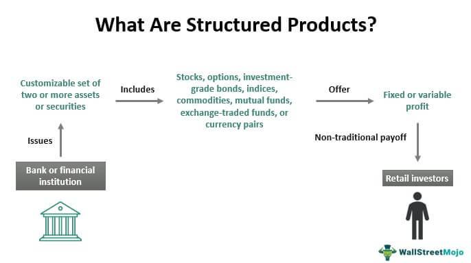

Investment strategies in today's financial markets are manifold, showcasing a diverse array of instruments and technologies. Investors now have unprecedented choices ranging from traditional equities and bonds to more sophisticated options like structured products and algorithmic trading. These advancements reflect significant evolution in financial markets, offering a broad spectrum of opportunities and complexities.

Structured products combine traditional securities and derivatives to offer tailored investment solutions, often linked to market indices. They represent a significant innovation in catering to individual risk-return preferences. In contrast, algorithmic trading leverages computational power and advanced algorithms to enhance trading efficiency and execution speed, minimizing human error and emotional bias.



Understanding and effectively employing these tools is crucial for constructing a diversified portfolio. They are instrumental in managing risk and optimizing return, key objectives in achieving long-term investment success. By familiarizing themselves with the intricacies of structured products and algorithmic strategies, investors can gain a competitive advantage, adapting to evolving markets and enhancing their financial outcomes.

## Table of Contents

## Understanding Financial Instruments

Financial instruments are foundational components of modern investment strategies, functioning as contracts that stipulate certain financial obligations, such as the payment of money or the delivery of a commodity. These instruments are designed to facilitate the transfer of capital in various forms, catering to the diverse financial objectives and risk appetites of investors.

### Types of Financial Instruments

#### Equities
Equities represent ownership interests in companies, typically in the form of stocks. These instruments offer investors potential profit through dividends and capital appreciation. Equities are generally considered high-risk, high-return investments, suitable for individuals with a higher risk tolerance and a long-term investment horizon.

#### Fixed Income Securities
Fixed income securities, such as bonds and treasury bills, provide regular interest payments and the return of principal upon maturity. These instruments are typically used by investors seeking a more stable income stream and lower risk compared to equities. The interest rates and creditworthiness of the issuer are critical factors that determine the attractiveness of these securities.

#### Derivatives
Derivatives are financial contracts whose value is derived from the performance of underlying assets, indices, or rates. Common forms include options, futures, and swaps. Derivatives can be used for hedging risk, speculating on future price movements, or increasing leverage in an investment portfolio. However, they are complex instruments that require a thorough understanding of the underlying market dynamics.

#### Structured Products
Structured products represent a newer class of financial instruments that combine elements of traditional securities with derivatives. These pre-packaged investment vehicles can be tailored to offer customized risk-return profiles, making them an appealing option for investors with specific financial goals. Structured products can provide capital protection, income generation, or enhanced returns, depending on the investor's needs. The design of these instruments often involves linking their performance to various asset classes such as equities, commodities, or currencies.

### Importance in Investment Strategies

Financial instruments are integral to the construction and diversification of investment portfolios. They offer a range of risk and return profiles, enabling investors to align their portfolios with their individual financial objectives. For example, a mix of equities and fixed income securities may be used to balance high growth potential with stability, while derivatives can be employed to hedge against specific risks or to express strategic views on market movements.

Structured products, by integrating traditional securities with derivatives, provide additional sophistication and customization in portfolio management. They allow investors to leverage opportunities across different markets and potentially achieve outcomes that are challenging to replicate with standalone assets.

In conclusion, understanding the characteristics and functions of various financial instruments is crucial for effective investment strategy formulation. This knowledge empowers investors to select and utilize the appropriate instruments to achieve their desired financial outcomes, accounting for their specific risk tolerance and investment horizons.

## Investment Strategies: A Framework

Investment strategies are crucial elements in navigating financial markets and achieving specific financial objectives. At their core, these strategies serve as the methodologies by which investors allocate resources to maximize their returns and meet their financial goals, whether it be capital preservation, income generation, or capital appreciation.

Conservatism in investment strategy often centers on capital protection. Investors with low risk tolerance might prefer this approach to safeguard their principal, even if it means sacrificing potential higher returns. Common conservative strategies include the buy-and-hold approach, which involves purchasing securities and holding them over a long period regardless of market fluctuations. This strategy mitigates the transactional costs associated with frequent trading and leverages market appreciation and dividends over time.

In contrast, aggressive strategies seek substantial growth and accept higher levels of risk. Growth investing exemplifies this approach by focusing on companies that exhibit above-average growth, even if their current earnings are modest. This strategy anticipates future earnings expansion and subsequent stock price appreciation. Value investing, another aggressive strategy, involves identifying undervalued stocks that are trading for less than their intrinsic values, with the expectation that the market will eventually recognize their true worth.

Beyond traditional methods, investors often explore alternative investments like structured products. These products combine elements of derivative instruments with securities to create hybrid investment vehicles that offer customized risk-return profiles. Structured products can cater to specific investor needs, providing opportunities for capital protection, enhancement, or both, depending on the investor's objectives.

The selection of an appropriate investment strategy is contingent upon several factors: an investor’s risk tolerance, the time horizon for their investment, and their overall financial goals. Risk tolerance is the degree to which an investor is willing to endure financial loss for the possibility of higher returns. It varies widely and dictates whether an investor leans toward conservative or aggressive strategies. An investor’s time horizon, or the period they expect to hold an investment before taking the money out, also influences strategy selection. Longer time horizons often allow for more aggressive investments due to the potential for recovery from market downturns. Lastly, individual financial goals, such as saving for retirement, buying a house, or funding education, play a crucial role in shaping the investment strategy.

In summary, the choice of investment strategy is a personalized decision that requires careful consideration of one's financial landscape, risk appetite, and ultimate objectives. By aligning these criteria, investors can map out a pathway towards their financial targets, balancing risk and potential return in accordance with their individual circumstances.

## Structured Products: Innovation in Investing

Structured products are pre-packaged investment solutions engineered to meet specific financial goals by linking to market indices or various financial instruments. They integrate bonds with derivatives to craft bespoke risk-return profiles tailored to investor preferences. These products typically have a fixed maturity date and are designed to offer benefits such as capital protection or the potential for enhanced returns, often dependent on the performance of an underlying asset.

The creation of structured products involves combining a zero-coupon bond with an option. The zero-coupon bond ensures the return of the principal at maturity, while the option can provide additional gains based on the performance of an underlying asset like an equity index, a commodity, or a foreign currency. For example, a simple structured product might invest 90% of the capital in a zero-coupon bond that matures to the face value, ensuring the return of the principal, and the remaining 10% in a call option on an equity index to capture potential market upside.

Mathematically, the expected return of a structured product can be expressed as:

$$
\text{Expected Return} = P \times (1 + r)^t + OP
$$

where $P$ is the principal amount, $r$ is the yield of the zero-coupon bond, $t$ is the time to maturity, and $OP$ is the payoff from the option component.

Investors might select structured products for their ability to tailor specific investment needs, whether for seeking potential high returns linked to risky assets or preserving capital with a safety net. They provide the flexibility to align financial commitments with market outlooks, allowing investors to benefit from anticipated market movements while managing downside risks.

A notable advantage of structured products is their versatility, which allows customization to meet diverse investor requirements, including varying risk tolerances and market expectations. This enables the creation of products that can cater to conservative investors who prioritize capital protection, as well as aggressive investors eager for leveraged exposure to market movements.

Despite their advantages, structured products come with certain risks, such as counterparty risk, [liquidity](/wiki/liquidity-risk-premium) risk, and complexity risk, which can obscure understanding among retail investors. Hence, it is crucial for investors to thoroughly comprehend the product's mechanics and underlying assumptions before investment.

In summary, structured products serve as innovative investment vehicles that offer tailored solutions for portfolio diversification and risk management. The dynamic nature of these financial instruments allows investors to strategically position themselves to meet specific financial goals and market conditions.

## Algorithmic Trading: Harnessing Technology

Algorithmic trading involves leveraging advanced computer algorithms to automate trading actions and processes in the financial markets. This approach has profoundly transformed the nature of trading by enhancing efficiency and transaction speed, which are critical in the fast-paced trading environment. By automating trading strategies, [algorithmic trading](/wiki/algorithmic-trading) significantly mitigates human errors and eliminates emotional biases that can negatively impact decision-making. This method provides traders with a systematic and disciplined approach to buying and selling financial instruments, ensuring consistency and precision.

Several common strategies are employed in algorithmic trading. One of these is [arbitrage](/wiki/arbitrage), which exploits price differentials of the same asset in different markets or forms. This strategy relies on the quick execution to capitalize on fleeting opportunities, a task well-suited for algorithmic processes. Trend-following is another prevalent strategy, where algorithms track market data to identify and follow uptrends or downtrends. This strategy does not attempt to predict or forecast market changes but rather relies on the technical analysis of market movements and [momentum](/wiki/momentum). Market-making is yet another strategy where algorithms provide liquidity to the markets by continuously offering buy and sell prices, [earning](/wiki/earning-announcement) the spread between these prices. This strategy requires rapid calculations and is highly effective only when orchestrated through sophisticated algorithmic systems.

Despite the manifold advantages, algorithmic trading presents a spectrum of risks. The reliance on technology introduces vulnerabilities, such as system failures or cyber threats, which could potentially lead to significant financial losses. Additionally, algorithmic models can malfunction or generate erroneous trades if not properly coded, tested, and monitored. Rapid shifts in market conditions can overpower automated systems that are not adaptable, resulting in potential losses. Thus, significant oversight and continual adjustments based on market dynamics are required to ensure these algorithms perform effectively and minimize risks.

To implement algorithmic trading strategies efficiently, several programming languages are utilized, with Python being a popular choice due to its simplicity and robust library support for data analysis and [machine learning](/wiki/machine-learning) tasks. A basic example of a Python script for algorithmic trading might involve using libraries such as pandas for data analysis, NumPy for numerical operations, and sci-kit-learn for implementing machine learning-based models for predictive trading strategies. The use of [backtesting](/wiki/backtesting) frameworks is also crucial to evaluate the performance of trading algorithms under historical market conditions, ensuring their robustness before live deployment.

In conclusion, algorithmic trading harnesses technology to create a competitive advantage in the financial markets, enabling traders to execute strategies with increased precision and efficiency. However, due consideration must be given to the associated risks, necessitating diligent oversight and continuous improvement of trading algorithms.

## Risks and Considerations

Investment instruments, such as structured products and algorithmic trading systems, come with their own set of inherent risks that investors must carefully consider. These sophisticated financial tools can enhance portfolio performance, but they also entail complexities that can pose significant challenges.

Structured products, for instance, are often characterized by a lack of liquidity. Liquidity refers to the ease with which an asset can be bought or sold in the market without affecting its price. The bespoke nature of structured products means they are tailored to specific investor needs and may not be widely traded, making it difficult to sell them quickly or at a desirable price. Additionally, these products frequently involve complex underlyings—financial instruments such as options, swaps, or a basket of securities. These components may not be insured by the Federal Deposit Insurance Corporation (FDIC), introducing an element of risk that investors need to thoroughly assess. Given these complexities, understanding the specific terms and conditions of each structured product is vital to mitigate potential risks.

Algorithmic trading, on the other hand, involves using pre-programmed instructions for executing trades based on various market signals and conditions. While this approach brings increased speed and efficiency, it also requires robust risk management strategies. The automated nature of algorithmic systems can lead to rapid and significant movements in asset prices, especially during periods of market [volatility](/wiki/volatility-trading-strategies). This potential for rapid losses necessitates sophisticated oversight and continual adjustment of the algorithms to reflect changing market dynamics.

To illustrate the potential pitfalls of algorithmic trading, consider the issue of overfitting in model design. Overfitting occurs when a model learns the training data too well, including noise and outliers, resulting in a decrease in predictive performance on new data. In Python, regularization techniques can help mitigate this risk:

```python
from sklearn.linear_model import Ridge
from sklearn.model_selection import train_test_split
from sklearn.datasets import make_regression

# Generate synthetic dataset
X, y = make_regression(n_samples=1000, n_features=20, noise=0.1, random_state=42)

# Split the dataset into training and testing sets
X_train, X_test, y_train, y_test = train_test_split(X, y, test_size=0.2, random_state=42)

# Apply Ridge regression to prevent overfitting
ridge_model = Ridge(alpha=1.0)
ridge_model.fit(X_train, y_train)

# Evaluate the model
train_score = ridge_model.score(X_train, y_train)
test_score = ridge_model.score(X_test, y_test)

print(f"Training score: {train_score:.2f}")
print(f"Testing score: {test_score:.2f}")
```

In the code above, ridge regression is employed to limit the model's sensitivity to overfitting by adding a penalty term to the loss function. This technique helps ensure that the model generalizes well to unseen data, illustrating an essential aspect of risk management in algorithmic systems.

Investors must be well-versed in the risks associated with both structured products and algorithmic trading, integrating comprehensive safeguards into their investment strategies. These measures may include diversifying portfolios, regularly reviewing financial models, and utilizing risk assessment tools. Such an approach will help investors navigate the complexities of modern financial instruments, ultimately supporting their long-term investment goals.

## Conclusion

The modern financial landscape offers immense potential for strategic investment, having evolved significantly with the advent of innovative financial instruments and trading techniques. Structured products, characterized by their ability to cater to specific investor needs, enable the crafting of uniquely tailored investment profiles. By combining traditional securities with derivatives, these instruments offer varied risk-return characteristics, accommodating both capital protection seekers and those pursuing enhanced returns. Meanwhile, algorithmic trading capitalizes on technological advancements, enabling investors to execute trades with unprecedented speed and efficiency. This automation reduces human error and circumvents emotional biases, which can often impede rational decision-making processes.

To harness these opportunities effectively, investors must develop a comprehensive understanding of the instruments they choose to integrate into their portfolios. A strategic investment plan should be formed with consideration of individual financial goals, risk tolerance, and time horizon. Continuous education and awareness are paramount as the financial markets and associated technologies are in a constant state of evolution. It is crucial for investors to remain vigilant, regularly assessing market conditions and modifying their strategies in response to both market developments and shifts in personal circumstances. By aligning their strategies to their objectives, investors can significantly enhance their potential for achieving long-term financial success.

## References & Further Reading

[1]: Bergstra, J., Bardenet, R., Bengio, Y., & Kégl, B. (2011). ["Algorithms for Hyper-Parameter Optimization."](https://papers.nips.cc/paper/4443-algorithms-for-hyper-parameter-optimization) Advances in Neural Information Processing Systems 24.

[2]: ["Advances in Financial Machine Learning"](https://www.amazon.com/Advances-Financial-Machine-Learning-Marcos/dp/1119482089) by Marcos Lopez de Prado

[3]: ["Evidence-Based Technical Analysis: Applying the Scientific Method and Statistical Inference to Trading Signals"](https://www.amazon.com/Evidence-Based-Technical-Analysis-Scientific-Statistical/dp/0470008741) by David Aronson

[4]: ["Machine Learning for Algorithmic Trading"](https://github.com/PacktPublishing/Machine-Learning-for-Algorithmic-Trading-Second-Edition) by Stefan Jansen

[5]: ["Quantitative Trading: How to Build Your Own Algorithmic Trading Business"](https://www.amazon.com/Quantitative-Trading-Build-Algorithmic-Business/dp/1119800064) by Ernest P. Chan