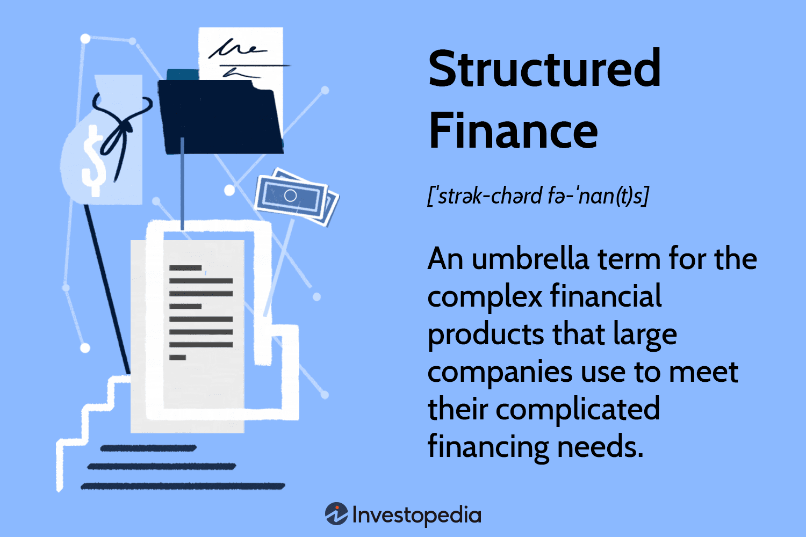

## Table of Contents

## What are structured financial products?

Structured financial products are investments that combine different financial instruments to create a single product with specific risk and return characteristics. They are designed to meet the needs of investors who want more than what traditional investments like stocks and bonds can offer. These products can be based on assets like stocks, commodities, currencies, or interest rates, and they often use derivatives to achieve their goals.

These products can be complex and are usually created by banks or financial institutions. They might offer the potential for higher returns, but they also come with higher risks. For example, a structured product might promise to protect your initial investment while also offering the chance to earn more if a certain stock index performs well. However, if the market doesn't perform as expected, you could lose money or not earn as much as you hoped. It's important for investors to understand these products well before investing in them.

## What are the main types of structured financial products?

Structured financial products come in many forms, but some of the main types are principal-protected notes, reverse convertible notes, and equity-linked notes. Principal-protected notes are designed to return your initial investment at the end of the term, no matter how the market performs. They might also offer a chance to earn more if the market does well. Reverse convertible notes, on the other hand, can give you higher interest payments, but they come with a risk: if the linked asset, like a stock, falls below a certain level, you might get that asset instead of your money back. Equity-linked notes tie your returns to the performance of a stock or a stock index, offering the potential for higher returns but also more risk.

Another type is the autocallable note, which can end early if certain conditions are met, like if the linked asset reaches a certain level. If it does, you might get your money back plus some extra returns. If it doesn't, you might have to wait until the end of the term to see what happens. Lastly, there are range accrual notes, which pay you based on how often a linked asset stays within a certain range. If the asset stays in the range more often, you earn more; if it doesn't, you earn less. Each of these products has its own set of rules and risks, so it's important to understand them before investing.

## How do structured financial products work?

Structured financial products are special investments made by mixing different financial tools to create something new. They are designed to meet specific needs of investors who want more than what simple stocks or bonds can offer. These products can be linked to things like stocks, commodities, or interest rates, and they often use other financial tools called derivatives to work. The goal is to give investors a chance to earn more money or protect their initial investment in different ways, depending on how the markets perform.

For example, a principal-protected note is a type of structured product that promises to give your initial investment back at the end of the term, no matter what happens in the market. It might also offer a chance to earn extra if the market does well. On the other hand, a reverse convertible note might pay you higher interest, but if the linked stock falls too much, you could end up with the stock instead of your money back. These products can be complex, and they come with different levels of risk and reward, so it's important to understand them well before deciding to invest.

## What are the benefits of investing in structured financial products?

Structured financial products can offer several benefits to investors. One key benefit is the potential for higher returns than traditional investments like stocks or bonds. These products are designed to take advantage of different market conditions, which can lead to bigger profits if things go well. Another benefit is the ability to customize the investment to fit specific needs. For example, some structured products can be set up to protect your initial investment, which can be reassuring for investors who are worried about losing money.

Another advantage is that structured financial products can help diversify an investment portfolio. By including different types of assets and using derivatives, these products can spread out risk in ways that traditional investments might not. This can be helpful for investors looking to balance their risk and potential rewards. However, it's important to remember that while structured products can offer these benefits, they can also be complex and come with higher risks, so it's crucial to understand them fully before investing.

## What are the risks associated with structured financial products?

Structured financial products can be risky because they are often complex and hard to understand. They might promise higher returns, but they also come with a higher chance of losing money. For example, if a product is linked to a stock or an index, and that stock or index does not perform well, you could lose part or all of your investment. Also, these products often use derivatives, which can make them even riskier because derivatives can be unpredictable and can lead to big losses if the market moves the wrong way.

Another risk is that structured products can be less liquid than other investments. This means it can be hard to sell them quickly if you need your money back. Some products have long terms, and you might have to wait until the end to get your money, even if you want to get out earlier. Plus, the fees and costs for these products can be high, which can eat into your returns. It's important to think about all these risks and maybe talk to a financial advisor before deciding to invest in structured financial products.

## Who typically invests in structured financial products?

People who invest in structured financial products are often looking for more than what regular investments like stocks and bonds can give them. They might be wealthy individuals or big investors like pension funds and insurance companies. These investors are usually okay with taking on more risk because they want the chance to earn higher returns. They also might have the money and time to learn about these complex products and understand how they work.

Sometimes, people who are close to retiring or already retired might invest in structured products, especially if they want to protect their money while still trying to earn a bit more. These investors might choose products that promise to return their initial investment, even if the market goes down. But no matter who is investing, it's really important for them to understand the risks and rewards of structured financial products before they put their money in.

## How are structured financial products priced?

Structured financial products are priced based on a few key things. First, they look at the value of the assets they are linked to, like stocks or commodities. If those assets are doing well, the price of the structured product might be higher. Second, they consider the costs of using derivatives, which are special financial tools that help create the product. These costs can make the product more expensive. Lastly, the price includes fees for the bank or financial institution that created the product. These fees can be high because structured products are complex and need a lot of work to set up.

The pricing also depends on how risky the product is. If there's a bigger chance of losing money, the price might be lower to attract investors who are willing to take that risk. On the other hand, if the product promises to protect your initial investment, it might cost more because that protection has value. Overall, the price of a structured financial product is a mix of the value of the linked assets, the costs of the derivatives, the fees, and the level of risk involved. It's important for investors to understand all these parts to know if the price is fair.

## What is the role of derivatives in structured financial products?

Derivatives play a big part in structured financial products. They are special financial tools that help create these products. Think of derivatives like bets on how things like stocks, commodities, or interest rates will move in the future. By using derivatives, the people who make structured products can design them to do different things, like protect your initial investment or give you a chance to earn more money if the market does well.

Derivatives can make structured products more complex and riskier. They can help the product work in ways that regular investments can't, but they also add uncertainty. If the market moves in a way that the derivatives didn't expect, it could lead to big losses. That's why it's important for investors to understand how derivatives are used in the structured products they are thinking about buying.

## How do regulatory frameworks impact structured financial products?

Regulatory frameworks have a big impact on structured financial products. They set rules that banks and financial institutions have to follow when they create and sell these products. These rules are there to protect investors and make sure that everyone is playing fair. For example, regulators might require that all the risks and costs of a structured product are clearly explained to investors before they buy it. This helps people understand what they are getting into and make better choices.

Regulations can also affect how much money banks can make from structured products. If the rules are strict, it might be harder for banks to offer these products, or they might have to charge more to cover the costs of following the rules. This can make structured products less attractive to investors. On the other hand, if the rules are too relaxed, it could lead to more risky products being sold, which might not be good for investors. So, finding the right balance in regulations is important to keep the market safe and fair for everyone.

## What are some common strategies used in structuring financial products?

When people create structured financial products, they often use a few common strategies to meet the needs of investors. One popular strategy is to offer principal protection. This means the product promises to return the initial investment at the end of the term, no matter how the market performs. This can be attractive to investors who want to try for higher returns but are worried about losing their money. To make this work, the product might use derivatives to hedge against market drops, which can make the product more complex but also safer.

Another strategy is to link the product's returns to the performance of a specific asset, like a stock or an index. This can give investors a chance to earn more if the asset does well, but it also means they could lose money if it doesn't. For example, an equity-linked note might pay out based on how a stock index performs. This strategy can be appealing to investors who want to take on more risk for the possibility of higher rewards. By using derivatives, the creators of these products can tailor the returns to fit different market conditions, making the product more flexible and potentially more profitable.

## How can one evaluate the performance of structured financial products?

Evaluating the performance of structured financial products can be tricky because they are often complex. You need to look at how the product has done over time compared to what it promised. For example, if a product said it would protect your initial investment and also give you extra returns if a certain stock index went up, you would check if it did both of those things. You can also compare the product's performance to other investments like stocks or bonds to see if it did better or worse. It's important to consider any fees or costs that come with the product, as these can eat into your returns.

Another way to evaluate the performance is by looking at the risks involved. Structured products can be riskier than traditional investments, so you need to think about whether the returns you got were worth the risk you took. If the product used derivatives, you should see how those affected the performance. Sometimes, the market might not move the way the product expected, which can lead to losses. Talking to a financial advisor can help you understand all these factors and decide if the product performed well for you.

## What are the latest trends and innovations in structured financial products?

Lately, there have been some cool new trends and innovations in structured financial products. One big trend is using technology to make these products easier to buy and understand. Some companies are using apps and online platforms to help people see how these products work and what they might earn. This can make it simpler for more people to invest in them. Another trend is focusing on environmental, social, and governance ([ESG](/wiki/esg-investing)) factors. More and more structured products are being tied to things like green energy or companies that do good for the world. This way, investors can try to make money while also supporting causes they care about.

Another innovation is the use of more flexible and personalized products. Instead of one-size-fits-all, some financial institutions are making products that can be changed to fit what each investor wants. For example, they might let you pick the level of risk you're okay with or the kind of asset you want to invest in. This can make structured products more appealing to a wider range of people. Also, with markets changing fast, some new products are being designed to adapt to these changes, using things like [machine learning](/wiki/machine-learning) to make quick adjustments to how they work.

## What are Structured Products and how do they represent innovation in investing?

Structured products are pre-packaged investment solutions engineered to meet specific financial goals by linking to market indices or various financial instruments. They integrate bonds with derivatives to craft bespoke risk-return profiles tailored to investor preferences. These products typically have a fixed maturity date and are designed to offer benefits such as capital protection or the potential for enhanced returns, often dependent on the performance of an underlying asset.

The creation of structured products involves combining a zero-coupon bond with an option. The zero-coupon bond ensures the return of the principal at maturity, while the option can provide additional gains based on the performance of an underlying asset like an equity index, a commodity, or a foreign currency. For example, a simple structured product might invest 90% of the capital in a zero-coupon bond that matures to the face value, ensuring the return of the principal, and the remaining 10% in a call option on an equity index to capture potential market upside.

Mathematically, the expected return of a structured product can be expressed as:

$$
\text{Expected Return} = P \times (1 + r)^t + OP
$$

where $P$ is the principal amount, $r$ is the yield of the zero-coupon bond, $t$ is the time to maturity, and $OP$ is the payoff from the option component.

Investors might select structured products for their ability to tailor specific investment needs, whether for seeking potential high returns linked to risky assets or preserving capital with a safety net. They provide the flexibility to align financial commitments with market outlooks, allowing investors to benefit from anticipated market movements while managing downside risks.

A notable advantage of structured products is their versatility, which allows customization to meet diverse investor requirements, including varying risk tolerances and market expectations. This enables the creation of products that can cater to conservative investors who prioritize capital protection, as well as aggressive investors eager for leveraged exposure to market movements.

Despite their advantages, structured products come with certain risks, such as counterparty risk, [liquidity](/wiki/liquidity-risk-premium) risk, and complexity risk, which can obscure understanding among retail investors. Hence, it is crucial for investors to thoroughly comprehend the product's mechanics and underlying assumptions before investment.

In summary, structured products serve as innovative investment vehicles that offer tailored solutions for portfolio diversification and risk management. The dynamic nature of these financial instruments allows investors to strategically position themselves to meet specific financial goals and market conditions.

## References & Further Reading

[1]: Bergstra, J., Bardenet, R., Bengio, Y., & Kégl, B. (2011). ["Algorithms for Hyper-Parameter Optimization."](https://papers.nips.cc/paper/4443-algorithms-for-hyper-parameter-optimization) Advances in Neural Information Processing Systems 24.

[2]: ["Advances in Financial Machine Learning"](https://www.amazon.com/Advances-Financial-Machine-Learning-Marcos/dp/1119482089) by Marcos Lopez de Prado

[3]: ["Evidence-Based Technical Analysis: Applying the Scientific Method and Statistical Inference to Trading Signals"](https://www.amazon.com/Evidence-Based-Technical-Analysis-Scientific-Statistical/dp/0470008741) by David Aronson

[4]: ["Machine Learning for Algorithmic Trading"](https://github.com/PacktPublishing/Machine-Learning-for-Algorithmic-Trading-Second-Edition) by Stefan Jansen

[5]: ["Quantitative Trading: How to Build Your Own Algorithmic Trading Business"](https://www.amazon.com/Quantitative-Trading-Build-Algorithmic-Business/dp/1119800064) by Ernest P. Chan