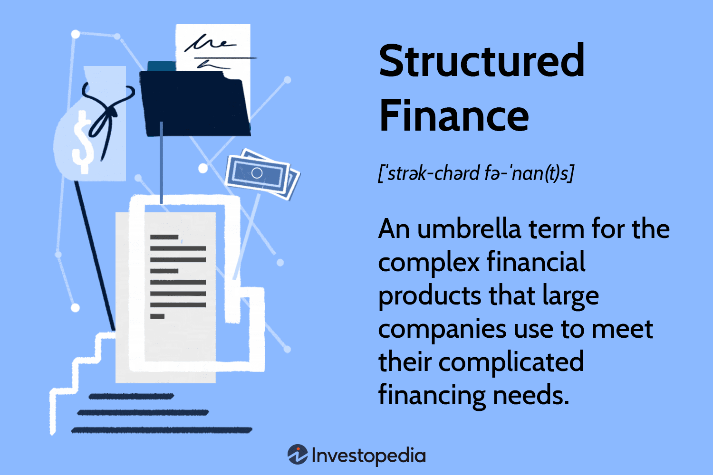

Investing can be intricate, with a multitude of avenues available to maximize returns while managing risks. Investors today are presented with a range of sophisticated investment strategies and financial products, offering potential for both diversification and enhanced portfolio performance. This guide examines some of these innovative pathways, notably structured funds and algorithmic trading, which have transformed the financial landscape.

Structured funds, a prominent investment vehicle, blend equity and fixed-income products to provide capital protection and appreciation opportunities. These funds appeal to conservative investors who prioritize safeguarding their capital while remaining open to the possibility of incremental growth. Financial institutions such as Fidelity and Goldman Sachs have developed various structured fund products tailored to diverse investment needs.



Algorithmic trading, commonly known as algo trading, is another revolutionary strategy that utilizes advanced computer algorithms to execute trades. This method focuses on minimizing human error and expediting transactions, thereby optimizing trade execution. Algo trading has significantly enhanced the speed and accuracy of trading, allowing traders to capitalize on market opportunities with increased precision.

This article offers a comprehensive exploration of structured funds and algorithmic trading, providing insights into how these concepts can be employed for informed financial decision-making. A clear understanding of these investment strategies will empower investors—both seasoned and novice—to navigate the complexities of modern financial markets more effectively, optimizing their portfolios in alignment with their financial goals.

## Table of Contents

## Understanding Structured Funds

Structured funds are a type of investment vehicle that merges equity and fixed-income financial instruments to provide investors with both capital protection and potential appreciation. These funds are designed for conservative investors who prioritize safeguarding their initial investment while seeking opportunities for growth. By incorporating both equity and fixed-income components, structured funds offer a balanced approach to investing.

The underlying mechanism of structured funds often involves the use of fixed-income securities, such as bonds, that focus on capital protection. These fixed-income components typically assure the return of the principal by the end of the investment term, thereby reducing risk for investors. Alongside these, structured funds may include derivatives that are tied to market indexes. These derivatives provide exposure to equity markets, offering potential for capital gains based on the performance of the underlying assets.

Derivatives are financial instruments whose value is dependent on an underlying asset or group of assets. In structured funds, these derivatives can be options, futures, or swaps linked to a market index like the S&P 500. This linkage allows investors to gain from market advancements. For example, a structured fund might include call options on the S&P 500 index, allowing participation in upward market movements while mitigating downside risks.

Prominent financial institutions, including Fidelity and Goldman Sachs, provide various structured fund products. These companies offer a range of options tailored to different risk tolerances and investment goals. Fidelity's Structured Fund offerings may involve investments in mutual funds with a target payoff, based on specific market conditions. Similarly, Goldman Sachs develops structured products that might include notes offering potential interest or returns aligned with market benchmarks.

Structured funds often have predetermined investment terms, ranging from three to seven years, depending on the specific product. At the end of the term, investors typically receive their initial capital plus any gains if the fund's conditions are satisfied. However, it's important to note that if the market conditions are unfavorable, the returns may be less than expected, although the capital protection component aims to mitigate such losses.

Investors must carefully assess structured funds' terms and conditions, potential fees, and the underlying market exposure. As with any investment, structured funds [carry](/wiki/carry-trading) certain risks and benefits. The ability to customize exposure to equities while maintaining a level of capital protection makes these funds appealing to many investors, particularly those who are risk-averse but still interested in participating in market upswings.

## Investing in Structured Funds: Benefits and Risks

Structured funds are a type of investment vehicle that combines elements of traditional fixed-income products with more complex financial instruments such as derivatives. One of the primary advantages of investing in structured funds is capital protection. These funds are typically designed to safeguard the principal investment while offering potential for returns that surpass those of standard money market funds. This capital protection is achieved through the use of fixed-income securities that form a stable foundation for the investment.

Additionally, structured funds provide opportunities for growth by incorporating derivatives linked to various market indexes. These derivatives allow investors to benefit from positive market movements without being fully exposed to potential declines, effectively balancing risk and return. The potential for higher returns compared to standard money market funds makes structured funds an attractive option for investors who prefer a conservative approach with an added growth component. 

However, structured funds are not without risks. One significant drawback is their limited [liquidity](/wiki/liquidity-risk-premium). Investors may face restrictions on when they can withdraw their money, often having to commit their funds for a predetermined period. This long-term commitment can be a disadvantage for those who might need quick access to their capital. Additionally, the complexity of structured funds means that their performance can be affected by the underlying components, such as derivatives, which may carry their own risks and require careful monitoring.

Investors considering structured funds need to weigh these pros and cons in light of their individual financial goals and risk tolerance. For those seeking capital preservation with the possibility of enhanced returns, these funds can be an appealing choice. However, the necessity to maintain a long-term perspective and accept limited liquidity means they may not be suitable for all investors.

Finally, the selection of a structured fund should be made based on thorough research and, if necessary, consultation with financial advisors. These professionals can provide insights into how well a particular structured fund aligns with an investor's overall strategy and financial objectives.

 to Algorithmic Trading

Algorithmic trading, often referred to as 'algo trading', involves the utilization of computer algorithms to execute trades in financial markets. This process is characterized by high-speed execution and large trading volumes, facilitated by a defined set of mathematical and statistical rules that dictate market decisions. The primary aim of [algorithmic trading](/wiki/algorithmic-trading) is to optimize trading execution and attain efficiencies that are unachievable through traditional manual trading.

One of the fundamental aspects of algo trading is its capability to minimize human error. By relying on algorithms, traders can eliminate psychological biases that commonly influence trading decisions. This automation not only increases precision but also enhances the speed of trade execution, which is crucial in markets where milliseconds can impact profitability significantly.

Algo trading strategies can be tailored to meet specific financial goals and trading strategies. These strategies are typically based on various forms of quantitative analysis, which can include statistical [arbitrage](/wiki/arbitrage), trend-following systems, or market-making algorithms. For example, a simple trend-following algorithm may look like the following in Python:

```python
import pandas as pd

# Assume 'data' is a pandas DataFrame with columns 'Date', 'Close'
# Calculate the short-term and long-term moving averages
data['Short_MA'] = data['Close'].rolling(window=40).mean()
data['Long_MA'] = data['Close'].rolling(window=100).mean()

# Define the trading signals
def generate_signal(row):
    if row['Short_MA'] > row['Long_MA']:
        return 'Buy'
    elif row['Short_MA'] < row['Long_MA']:
        return 'Sell'
    else:
        return 'Hold'

data['Signal'] = data.apply(generate_signal, axis=1)
```

This simple algorithm generates buy and sell signals based on the crossover of short-term and long-term moving averages, a popular method in trend-following strategies.

Furthermore, algorithmic trading provides significant advantages in terms of scalability. Large volumes of trades can be executed simultaneously across multiple markets, leveraging the vast computational power available to analyze market conditions and execute optimal trades. This scalability allows traders to capitalize on fleeting market opportunities that manual trading systems might miss.

Despite its strengths, algorithmic trading also poses challenges, including the risk of technical failures and the need for substantial initial investments to develop capable systems. As such, understanding the basics of algo trading is critical for investors who are interested in leveraging its capabilities to achieve specific trading objectives. This understanding enables investors to align algorithmic strategies with their financial goals, whether the aim is to enhance returns, manage risk, or both.

With advancements in technology, including [machine learning](/wiki/machine-learning) and [artificial intelligence](/wiki/ai-artificial-intelligence), the scope of algorithmic trading continues to expand, offering ever more sophisticated strategies and tools for modern investors.

## Popular Algorithmic Trading Strategies

Algorithmic trading, or algo trading, encompasses a variety of strategies designed to capitalize on market inefficiencies through the use of computer algorithms. Four of the most popular strategies are [trend following](/wiki/trend-following), arbitrage, mean reversion, and market timing. Each strategy utilizes technical analysis and market data to optimize trading execution and outcomes.

### Trend Following
Trend following strategies focus on identifying and exploiting the [momentum](/wiki/momentum) of an asset's price movement. This method assumes that assets which have been rising or falling consistently will continue to do so. Algorithms programmed for trend following analyze historical price data to establish potential entry and [exit](/wiki/exit-strategy) points based on pre-set conditions such as moving averages or breakouts. A popular trend-following indicator is the moving average crossover, where trades are initiated when a short-term moving average crosses a long-term moving average, signaling a trend change.

**Python Example:** 
```python
# Simple moving average crossover strategy
import pandas as pd

def moving_average_crossover(data, short_window=50, long_window=200):
    signals = pd.DataFrame(index=data.index)
    signals['signal'] = 0.0

    # Short moving average
    signals['short_mavg'] = data['close'].rolling(window=short_window, min_periods=1, center=False).mean()

    # Long moving average
    signals['long_mavg'] = data['close'].rolling(window=long_window, min_periods=1, center=False).mean()

    # Generate signals
    signals['signal'][short_window:] = np.where(signals['short_mavg'][short_window:] > signals['long_mavg'][short_window:], 1.0, 0.0)   

    signals['positions'] = signals['signal'].diff()
    return signals
```

### Arbitrage
Arbitrage strategies seek to exploit price discrepancies of identical or similar financial instruments across different markets or in different forms. The primary goal is to buy low in one market and simultaneously sell high in another to pocket the difference. High-frequency trading algorithms excel in this strategy due to their ability to execute numerous trades at lightning speed, far faster than human capabilities.

### Mean Reversion
Mean reversion strategies are based on the premise that asset prices oscillate around their historical average or mean. Algorithms detect when an asset's price deviates significantly from its mean and assume that it will revert back to the average over time. This strategy often uses statistical techniques like Bollinger Bands or standard deviation to set the parameters for trade execution.

**Python Example:** 
```python
# Mean reversion strategy using Bollinger Bands
import numpy as np

def bollinger_bands(data, window=20, no_of_std=2):
    signals = pd.DataFrame(index=data.index)
    signals['price'] = data['close']

    # Calculate rolling mean and standard deviation
    signals['rolling_mean'] = signals['price'].rolling(window).mean()
    signals['rolling_std'] = signals['price'].rolling(window).std()

    # Calculate Bollinger Bands
    signals['upper_band'] = signals['rolling_mean'] + (signals['rolling_std'] * no_of_std)
    signals['lower_band'] = signals['rolling_mean'] - (signals['rolling_std'] * no_of_std)

    # Generate trading signals
    signals['signal'] = 0.0
    signals['signal'] = np.where(signals['price'] > signals['upper_band'], -1.0, signals['signal'])
    signals['signal'] = np.where(signals['price'] < signals['lower_band'], 1.0, signals['signal'])

    # Calculate positions
    signals['positions'] = signals['signal'].diff()
    return signals
```

### Market Timing
Market timing involves predicting future price movements based on historical data, economic indicators, and technical analysis. Algorithms that employ market timing aim to enter or exit trades at the most opportune moments to maximize profits. This strategy can be particularly effective in volatile markets where rapid price changes are frequent.

Algorithmic trading strategies, through their reliance on advanced computational methods and real-time data analysis, can significantly enhance trading effectiveness and efficiency. By leveraging such strategies, traders can potentially achieve higher returns and reduce risks, although they must also remain aware of the inherent challenges these strategies can present.

## Benefits and Challenges of Algo Trading

Algorithmic trading, often referred to as 'algo trading,' has become a cornerstone of modern financial markets due to its ability to conduct high-speed, high-frequency trading with remarkable precision and efficiency. By leveraging computer algorithms, traders can execute trades at speeds far beyond human capability, thus capitalizing on even minute market opportunities that arise for mere milliseconds.

**Benefits of Algorithmic Trading:**

1. **Speed and Efficiency:** Computational algorithms can execute thousands of trades within seconds, ensuring that traders achieve the best possible price. This rapid execution reduces the time between decision-making and execution, which is crucial in volatile markets.

2. **Reduced Emotional Bias:** Traditional trading can often be influenced by human emotions such as fear and greed. By automating trading decisions based on predefined rules, algo trading minimizes these emotional biases, leading to a more disciplined approach to trading.

3. **Precision and Consistency:** Algorithms follow exact instructions without deviation, providing consistent execution of trading strategies. This precision allows for optimization of strategies tailored to specific market conditions.

4. **Backtesting Capabilities:** Algo trading allows for rigorous backtesting using historical data to determine the viability of a trading strategy without risking actual capital. This process helps refine strategies before live deployment.

**Challenges of Algorithmic Trading:**

1. **Technical Failures:** Despite the technological advancements, algo trading is not immune to technical failures. Issues may arise from hardware malfunctions, data feed errors, or connectivity disruptions, which can result in substantial financial losses.

2. **Over-Optimization:** There's a risk of over-optimizing a trading algorithm to fit historical data too closely, a phenomenon known as curve fitting. This can lead to strategies that perform exceptionally well in backtesting but fail to replicate the success in live trading conditions.

3. **High Initial Setup Costs:** Developing a robust algorithmic trading system requires significant investment in technology infrastructure, including hardware, software, and data feeds. The costs associated with research and development can be prohibitive for individual traders.

4. **Regulatory and Market Risks:** Algo trading systems need to be designed with regulatory compliance in mind, as various markets have different algorithms and trading frequency guidelines. Moreover, rapid trading can lead to market anomalies like flash crashes, which introduce additional risks.

Understanding these challenges is crucial for traders looking to apply algorithmic trading strategies effectively. By addressing the technical and strategic intricacies, traders can potentially enhance their portfolio's performance, thus making informed and profitable investment decisions.

## Choosing the Right Investment Strategy

Deciding on the appropriate investment strategy is a critical decision that depends heavily on individual financial objectives, risk tolerance, and understanding of the markets. Structured funds and algorithmic trading each offer unique advantages and challenges, making them suitable for different investor types.

Structured funds are often geared towards investors who prioritize capital preservation and are willing to trade off some potential returns for reduced risk. These funds blend elements of equity and fixed-income investments, thus providing a balanced approach that emphasizes security while offering the potential for modest growth. For investors whose primary concern is stability and who prefer a more hands-off approach to investment, structured funds are an attractive option. They are particularly suitable for those with a longer time horizon, given the common requirement for a term commitment to benefit from capital protection features.

Algorithmic trading, on the other hand, offers appeal to those interested in more active market participation. By automating trades through computer algorithms based on specific strategies and rules, algo trading allows for high-speed execution and the potential to exploit short-term market inefficiencies. It can be advantageous for investors who are comfortable with market dynamics and possess a higher risk appetite. This approach often requires a more advanced understanding of trading strategies and access to technological resources, and it suits individuals or firms that can manage the necessary setup and maintenance costs.

Investors need to assess their financial objectives comprehensively. If stability and gradual appreciation align with one’s goals, and if one's risk capacity is low, structured funds stand out as appropriate. In contrast, for those targeting potentially higher returns and who are prepared to navigate increased market [volatility](/wiki/volatility-trading-strategies), algorithmic trading may be more compelling.

Regardless of the choice, seeking professional financial advice is critical. A financial advisor can help clarify the intricacies of each option and align these with one's personal financial goals and market knowledge. They can provide insights into tax implications, market conditions, and other factors that could influence the choice between structured funds and algorithmic trading.

In a constantly evolving financial landscape, staying informed about new developments and revisiting one's investment strategy regularly ensures that it remains aligned with changing personal and market circumstances.

## Conclusion

Investment strategies such as structured funds and algorithmic trading provide innovative avenues for portfolio enhancement, bringing with them both opportunities and challenges for investors. These financial products have the potential to optimize returns and manage risks, yet they require a robust understanding of their mechanics to be employed effectively. Structured funds, with their combination of equity and fixed-income products, are designed to offer capital protection and growth potential. They appeal to conservative investors looking for stability combined with opportunity for appreciation. Conversely, algorithmic trading leverages technology to execute trades at high speeds and volumes, presenting opportunities for trading optimization but also necessitating substantial technical understanding and infrastructure. 

Investors must be mindful of both the benefits and the inherent risks associated with each strategy. While structured funds can offer a degree of safety, they may also involve long-term commitments and limited liquidity. Similarly, while algo trading reduces emotional biases and enhances speed, it comes with risks such as technical failures and requires significant initial setup costs. Informed decision-making thus plays a crucial role in effectively leveraging these financial products. 

As the financial landscape continues to evolve, keeping abreast of emerging trends and developments becomes an essential part of successful investing. Continuous learning and adaptability are key to navigating the complexities and opportunities presented by innovations in investment strategies. Staying educated and informed not only allows investors to optimize their current strategies but also equips them to adapt to future changes in the market environment. By aligning investment choices with personal financial goals and risk tolerances, individuals can better position themselves for financial success in an increasingly dynamic landscape.

## References & Further Reading

[1]: Bergstra, J., Bardenet, R., Bengio, Y., & Kégl, B. (2011). ["Algorithms for Hyper-Parameter Optimization."](https://dl.acm.org/doi/10.5555/2986459.2986743) Advances in Neural Information Processing Systems 24.

[2]: ["Advances in Financial Machine Learning"](https://www.amazon.com/Advances-Financial-Machine-Learning-Marcos/dp/1119482089) by Marcos Lopez de Prado

[3]: ["Evidence-Based Technical Analysis: Applying the Scientific Method and Statistical Inference to Trading Signals"](https://www.amazon.com/Evidence-Based-Technical-Analysis-Scientific-Statistical/dp/0470008741) by David Aronson

[4]: ["Machine Learning for Algorithmic Trading"](https://github.com/stefan-jansen/machine-learning-for-trading) by Stefan Jansen

[5]: ["Quantitative Trading: How to Build Your Own Algorithmic Trading Business"](https://www.amazon.com/Quantitative-Trading-Build-Algorithmic-Business/dp/1119800064) by Ernest P. Chan