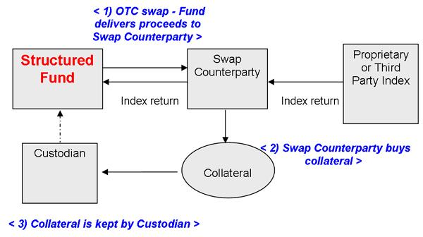

## Table of Contents

## What are structured funds?

Structured funds are a type of investment that combines different financial products into one package. They usually include a mix of stocks, bonds, and sometimes derivatives, which are designed to achieve specific investment goals. These goals can range from protecting your initial investment to generating higher returns, depending on the market conditions.

These funds are often created by financial institutions and can be tailored to meet the needs of individual investors. They might have a set time period during which they operate, and the returns can depend on the performance of an underlying index or asset. Structured funds can be complex, so it's important to understand how they work and what risks they carry before investing in them.

## How do structured funds differ from traditional mutual funds?

Structured funds and traditional mutual funds are both investment options, but they work in different ways. Structured funds are made up of a mix of different financial products like stocks, bonds, and derivatives. They are designed to meet specific goals, like protecting your initial investment or aiming for higher returns based on how well certain markets or assets do. These funds are often put together by financial institutions and can be customized for individual investors. They usually have a set time period and their performance can depend on an underlying index or asset.

On the other hand, traditional mutual funds pool money from many investors to buy a diversified portfolio of stocks, bonds, or other securities. The goal of a mutual fund is to match the performance of a specific market index or to beat it through active management. Unlike structured funds, mutual funds do not usually have a set end date and their returns are more directly tied to the performance of the assets they hold. They are generally easier to understand and more straightforward in how they work.

In summary, structured funds are more complex and customizable, often with specific goals and time frames, while traditional mutual funds are simpler, more straightforward, and focused on long-term investment in a diversified portfolio. Both types of funds have their own risks and benefits, so it's important to understand them before choosing where to invest your money.

## What are the main components of a structured fund?

Structured funds are made up of different parts that work together to meet specific investment goals. The main part of a structured fund is usually a mix of stocks, bonds, and sometimes derivatives. Stocks are pieces of ownership in companies, bonds are like loans to companies or governments, and derivatives are financial contracts that get their value from something else, like a stock index. This mix is put together to try to reach the fund's goals, like protecting your initial investment or aiming for higher returns.

Another important part of a structured fund is the way it's set up to work over a certain time period. Unlike other funds that might go on forever, structured funds often have a set start and end date. During this time, the fund's performance can depend on how well an underlying index or asset does. This means the returns you get can be linked to how that index or asset performs, which adds a layer of complexity but also allows for specific strategies to be used.

Overall, the combination of these parts makes structured funds different from other types of investments. They are designed to be flexible and can be tailored to meet the needs of individual investors. However, because they can be complex, it's important to understand how they work and what risks they [carry](/wiki/carry-trading) before deciding to invest in them.

## What are the typical investment objectives of structured funds?

Structured funds have different goals depending on what the investor wants. One common goal is to protect the money you put in. This means the fund tries to make sure you don't lose your initial investment, even if the market goes down. They do this by using different financial tools like bonds and derivatives to create a safety net. This can be really helpful for people who want to be a bit safer with their money but still want to invest.

Another goal of structured funds is to try to get higher returns. They might aim to do better than the market by using a mix of stocks, bonds, and other financial products. The fund's performance can be tied to how well a certain index or asset does, which can lead to bigger gains if things go well. But, this also means there's more risk involved. So, these funds are good for people who are okay with taking some risk to possibly earn more money.

Structured funds can also be set up to meet very specific goals that are important to the investor. For example, they might be designed to give you regular income or to grow over a certain time period. Because they can be customized, structured funds can be a good choice for people who have clear ideas about what they want their investment to do. But, because they can be complex, it's important to understand how they work before you decide to invest.

## How are returns generated in structured funds?

Returns in structured funds come from a mix of different financial products like stocks, bonds, and derivatives. These funds are set up to meet specific goals, like protecting your initial investment or aiming for higher returns. If the goal is to protect your money, the fund might use bonds and derivatives to create a safety net. This means even if the market goes down, your initial investment is more likely to be safe. On the other hand, if the goal is to get higher returns, the fund might invest more in stocks or use derivatives to try to do better than the market.

The way returns are generated can also depend on how well an underlying index or asset does. For example, if the fund's performance is tied to a stock index, the returns you get will depend on how that index performs over the fund's set time period. If the index goes up, you might get higher returns. But if it goes down, your returns could be lower, or you might even lose money if the fund doesn't have enough protection. This link to an index or asset adds a layer of complexity but also allows the fund to use specific strategies to meet its goals.

## What are the risks associated with investing in structured funds?

Structured funds can be a bit risky because they are made up of different financial products like stocks, bonds, and derivatives. These funds often try to do better than the market, but that means there's a chance you could lose money if things don't go as planned. For example, if the fund is tied to a stock index and that index goes down, your returns could be lower or you might even lose some of your initial investment. Also, because structured funds can be complex, it might be hard to understand exactly how they work and what risks you're taking on.

Another risk is that structured funds usually have a set time period. If you need to get your money out before the end of that period, you might have to pay extra fees or you might not get as much money back as you hoped. This can be a problem if you need your money for something else. Plus, because these funds are often customized, they might not be as easy to sell or trade as other types of investments. So, it's really important to think about these risks and understand how the fund works before you decide to invest.

## How can one evaluate the performance of a structured fund?

To evaluate the performance of a structured fund, you need to look at how well it meets its goals. If the fund is meant to protect your initial investment, check if it managed to keep your money safe, even when the market went down. If the goal was to get higher returns, see if the fund did better than the market or the specific index it's tied to. It's also important to compare the fund's performance over its set time period to what was promised or expected when you first invested.

Another way to evaluate a structured fund is by looking at the fees and costs. Structured funds can have extra charges, especially if you need to take your money out before the end of the set time period. Make sure to understand all the fees and see if they are worth it compared to the returns you're getting. Also, think about how easy or hard it is to sell or trade the fund. If it's not easy to get your money out when you need it, that could be a problem. By considering these things, you can get a good idea of how well the structured fund is doing and if it's a good choice for you.

## What are the fees and costs involved in investing in structured funds?

Investing in structured funds can come with different fees and costs that you need to know about. One common fee is the management fee, which is what you pay the people who run the fund for their work. This fee is usually a small percentage of the money you have invested in the fund. There can also be other fees, like sales charges or commissions, which you might have to pay when you buy or sell the fund. These fees can add up, so it's important to understand them before you invest.

Another cost to think about is what happens if you need to take your money out of the fund before the end of its set time period. Structured funds often have a penalty for early withdrawal, which means you might have to pay extra money if you need your investment back sooner than planned. This can make a big difference in how much money you end up with, so it's a good idea to plan carefully and know all the costs involved before you decide to invest in a structured fund.

## Can structured funds be part of a diversified investment portfolio?

Yes, structured funds can be part of a diversified investment portfolio. They can help you spread your money across different types of investments, like stocks, bonds, and derivatives. This can be good because it means you're not putting all your eggs in one basket. If one part of the market goes down, the other parts might still do well, which can help protect your money.

But, you need to be careful because structured funds can be complex and have different risks. They often have a set time period, and if you need your money back before that time is up, you might have to pay extra fees. So, it's important to understand how the fund works and what the costs are before you decide to include it in your portfolio. By doing this, you can make sure that adding a structured fund helps you reach your investment goals without taking on too much risk.

## What are the tax implications of investing in structured funds?

Investing in structured funds can have different tax effects depending on how the fund is set up and where you live. If the fund makes money from things like stocks or bonds, you might have to pay taxes on those earnings. Sometimes, the fund might pay out money to you as dividends or interest, and you'll need to pay taxes on that too. It's a good idea to talk to a tax expert to understand how these rules apply to your situation.

Another thing to think about is if you sell your investment in the structured fund. If you make a profit when you sell, you might have to pay capital gains tax. The amount of tax you pay can depend on how long you held the investment. If you held it for a short time, you might pay more tax than if you held it for a long time. Always check with a tax advisor to make sure you know all the tax rules and how they might affect your investment choices.

## How do regulatory requirements affect structured funds?

Regulatory requirements can have a big impact on structured funds. These rules are made by government agencies to make sure that funds are run fairly and safely. For example, in the United States, the Securities and Exchange Commission (SEC) has rules about how structured funds can be sold and what information has to be given to investors. These rules can affect how the funds are set up, what they can invest in, and how they report their performance. This means that when you invest in a structured fund, the fund has to follow these rules to protect you and other investors.

Sometimes, these regulations can make structured funds more complex and harder to understand. For instance, there might be rules about how much risk the fund can take or what kind of financial products it can use. These rules can also change over time, which means the fund might have to adjust how it works. It's important for investors to stay informed about these regulations because they can affect how well the fund does and what kind of returns you might get. Talking to a financial advisor can help you understand how these rules might impact your investment in a structured fund.

## What advanced strategies can be employed using structured funds?

Structured funds can be used for advanced strategies like hedging and leveraging. Hedging means using the fund to protect your other investments from going down in value. For example, if you own a lot of stocks, you might invest in a structured fund that goes up when the stock market goes down. This can help balance out any losses you might have. Leveraging, on the other hand, means using the fund to try to make more money than you would with your initial investment. This can be done by using derivatives, which are financial tools that can increase your returns if the market goes your way, but they can also increase your losses if it doesn't.

Another advanced strategy is using structured funds for income generation. Some structured funds are set up to give you regular payments, which can be helpful if you need a steady income from your investments. These funds might invest in bonds or other assets that pay interest or dividends, and then pass that money on to you. This can be a good way to get income while still trying to grow your investment over time. However, it's important to understand that these strategies can be complex and come with their own risks, so it's a good idea to talk to a financial advisor before trying them out.

## References & Further Reading

[1]: Bergstra, J., Bardenet, R., Bengio, Y., & Kégl, B. (2011). ["Algorithms for Hyper-Parameter Optimization."](https://dl.acm.org/doi/10.5555/2986459.2986743) Advances in Neural Information Processing Systems 24.

[2]: ["Advances in Financial Machine Learning"](https://www.amazon.com/Advances-Financial-Machine-Learning-Marcos/dp/1119482089) by Marcos Lopez de Prado

[3]: ["Evidence-Based Technical Analysis: Applying the Scientific Method and Statistical Inference to Trading Signals"](https://www.amazon.com/Evidence-Based-Technical-Analysis-Scientific-Statistical/dp/0470008741) by David Aronson

[4]: ["Machine Learning for Algorithmic Trading"](https://github.com/stefan-jansen/machine-learning-for-trading) by Stefan Jansen

[5]: ["Quantitative Trading: How to Build Your Own Algorithmic Trading Business"](https://www.amazon.com/Quantitative-Trading-Build-Algorithmic-Business/dp/1119800064) by Ernest P. Chan