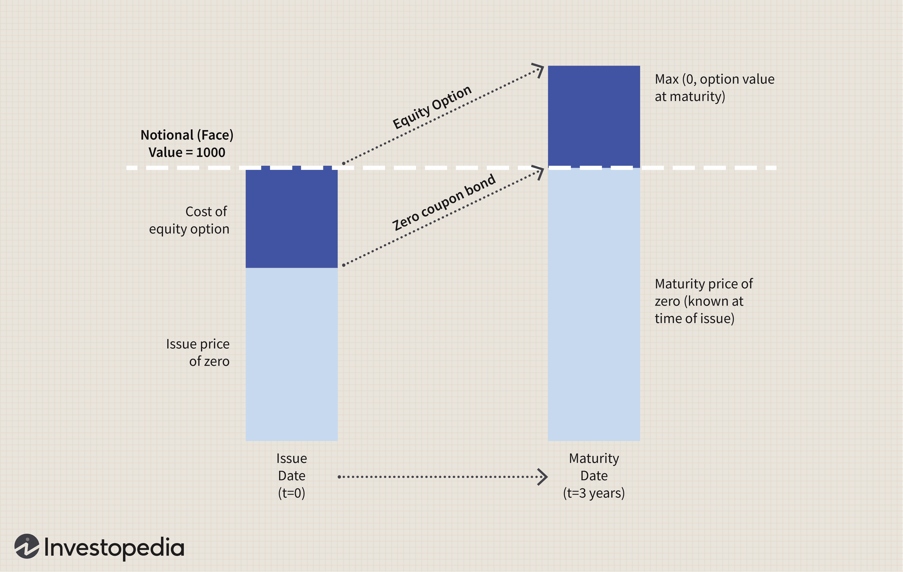

The modern financial landscape is characterized by a diverse array of investment opportunities, each offering unique potential for growth and portfolio diversification. Investors now have access to a range of financial instruments, including equities, bonds, structured products, and algorithmic trading. Each of these instruments plays a crucial role in facilitating investment strategies aligned with individual financial goals and risk appetites.

Equities offer investors ownership in companies, benefiting from capital appreciation and dividend income. Bonds provide a fixed income through interest payments, appealing to those seeking steady returns with lower risk. Structured products, tailored to achieve specific risk-return objectives, link to market indices or other financial instruments through the use of derivatives. These pre-packaged instruments offer principal protection while tapping into potential market gains, thereby meeting the diverse needs of sophisticated investors.

Algorithmic trading, leveraging advanced computer algorithms, automates trading processes, allowing for increased efficiency and precision in executing orders. It implements strategies such as arbitrage and trend-following, potentially sharpening investment performance through speed and reduced human error. However, these sophisticated trading techniques bear risks like system failures and increased volatility, necessitating careful strategy execution and rigorous risk management.

This article explores the intricacies of financial instruments and investment products, particularly focusing on structured finance and algorithmic trading. We will examine their applications, benefits, and associated risks as part of a comprehensive strategy for engaging with the contemporary investment landscape. Understanding these components can empower investors to navigate opportunities and optimize their financial outcomes.

## Table of Contents

## Understanding Financial Instruments

Financial instruments are essential components in the global financial system, acting as conduits for capital transfer between investors and entities seeking to raise funds. They are formal contracts that define financial obligations and rights between the involved parties. These instruments can be categorized into various types, each serving distinct purposes and risk-return profiles, thus acting as the building blocks for diversified investment strategies.

**Equities** represent ownership in a company, providing shareholders with voting rights and a claim on the company’s assets and earnings. Equities are known for their potential to generate substantial returns through capital appreciation and dividends, yet they also come with a higher level of risk compared to other financial instruments.

**Fixed Income Securities**, such as bonds and debentures, are instruments that offer regular income to investors in the form of interest payments. These are typically issued by governments or corporations and are perceived as less risky than equities, making them attractive to risk-averse investors seeking stable returns.

**Derivatives** are complex financial instruments whose value is derived from an underlying asset, index, or benchmark. These include options, futures, forwards, and swaps, each having distinct characteristics and trading mechanisms. Derivatives are often used for hedging purposes, allowing investors to manage risk exposure or speculate on price movements in underlying assets without owning them directly.

**Structured Products** combine traditional financial instruments like bonds with derivatives to tailor specific risk-return characteristics for investors. They are designed to meet specific investor needs by offering a customized investment approach that can include capital protection, leveraged returns, or exposure to a particular asset class.

By integrating these various types of financial instruments, investors can construct diversified portfolios that align with their risk tolerance, investment horizons, and financial objectives. This strategic allocation enables investors to maximize returns while managing potential risks. Understanding the distinct features and functions of each financial instrument is crucial for making informed investment decisions and crafting effective strategies.

## Investment Strategies: A Framework

Investment strategies serve as essential methodologies for efficiently allocating resources to meet distinct financial objectives. These strategies encompass a spectrum from conservative approaches, which focus primarily on the preservation of capital, to aggressive strategies that aim for substantial growth and potentially higher returns. The selection of an appropriate investment strategy is contingent upon several critical factors, including an investor’s risk tolerance, investment time horizon, and overall financial goals.

**Conservative Strategies**: These strategies are designed to facilitate capital preservation and are typically employed by investors with a low risk tolerance or a short investment horizon. Common conservative strategies include:

- **Fixed Income Investing**: Emphasizing stable returns through bonds or fixed-income securities, these strategies prioritize minimizing risk over maximizing growth.
- **Dividend Investing**: Focusing on stocks that offer regular dividends, providing a steady income while retaining potential capital appreciation.

**Moderate Strategies**: These strategies balance risk and reward, suitable for investors with a moderate risk tolerance and a medium-term investment horizon. Such strategies often involve:

- **Balanced Portfolios**: Combining equities and fixed-income securities in an optimal ratio, these portfolios are designed to achieve moderate growth while minimizing risk.
- **Asset Allocation**: Diversification across various asset classes to spread risk and potentially enhance returns.

**Aggressive Strategies**: Characterized by a pursuit of significant growth, aggressive strategies involve higher risk and are typically suited to investors with a higher risk tolerance and longer investment horizons. Examples include:

- **Growth Investing**: Focusing on stocks or sectors expected to grow at an above-average rate compared to the market.
- **Leverage Strategies**: Utilizing borrowed capital to increase the potential return on investment, which inherently magnifies potential losses as well.

The choice of investment strategy also involves understanding an investor's risk tolerance, typically gauged through questionnaires and simulations. A higher risk tolerance allows for a more aggressive investment approach, while a lower tolerance necessitates a conservative strategy. Additionally, the investment time horizon plays a critical role: longer horizons allow for more aggressive strategies, as time can help mitigate short-term [volatility](/wiki/volatility-trading-strategies). Conversely, shorter time horizons necessitate conservative approaches.

Mathematically, modern portfolio theory (MPT) helps in forming investment strategies by optimizing a portfolio's expected return based on a given level of market risk, as manifested in the formula:

$$
\text{Expected Return} = \sum (w_i \times r_i)
$$

where $w_i$ represents the weight of each asset in the portfolio and $r_i$ is the expected return of each asset. The variance of the portfolio's return, which measures risk, is given by:

$$
\text{Portfolio Variance} = \sum (w_i^2 \times \sigma_i^2) + \sum \sum (w_i \times w_j \times \sigma_{ij})
$$

where $\sigma_i^2$ is the variance of asset $i$, and $\sigma_{ij}$ is the covariance between assets $i$ and $j$.

Investment strategies are more than selecting asset classes; they involve a deep understanding of personal financial objectives and market dynamics. By aligning strategies with personal financial goals and risk profiles, investors can effectively navigate the complexities of financial markets.

## Structured Products: Innovation in Investing

Structured products represent a significant innovation in investing, designed to align with specific market indices or instruments via the use of derivatives. These financial instruments enable investors to customize their risk-return profiles, addressing unique investor needs and preferences. At their core, structured products typically comprise a zero-coupon bond component and an option component. This combination ensures the return of principal upon maturity, supplemented by the potential for additional gains contingent upon the performance of the linked assets.

The zero-coupon bond aspect of a structured product guarantees that, irrespective of market fluctuations, the investor's initial principal is preserved if held to maturity. A zero-coupon bond does not pay periodic interest, but is issued at a discount to its face value and matures at par. The protective feature offered by the zero-coupon bond is especially attractive to investors who prioritize capital protection.

Coupled with the bond is the option component, which provides upside potential based on the performance of an underlying asset such as a stock index or commodity. Options are financial derivatives that grant the rights, but not the obligation, to buy or sell an asset at a predetermined price up to a specific date. This feature enables investors to benefit from favorable movements in the market index or underlying asset, typically capped by a maximum return level to manage exposure.

Structured products are thus engineered to offer diverse exposure structures, which can be tailored to meet market expectations or specific goals. For example, an investor anticipating a moderate rise in stock prices may opt for a structured product linked to a stock index with capped returns, thus enjoying gains up to a certain point while safeguarding the principal.

However, the complex nature of structured products means they are often associated with higher levels of complexity and risk than traditional investments. It's vital for investors to possess a clear understanding of these products, including their fee structures, market risks, and potential impacts due to [interest rate](/wiki/interest-rate-trading-strategies) fluctuations.

In summary, structured products have emerged as a versatile investment instrument, allowing personalization and potential profitability while maintaining principal protection. They encapsulate the intersection of fixed income security with derivatives, offering a sophisticated avenue for gaining targeted market exposure.

## Algorithmic Trading: Harnessing Technology

Algorithmic trading leverages computer algorithms to automate a diverse array of trading strategies, significantly enhancing market efficiency and execution speed. This technological approach allows traders to capitalize on market conditions by executing large orders with minimal human intervention. Algorithmic trading has become increasingly prevalent in financial markets, driven by advancements in computational power and data availability.

### Common Strategies

1. **Arbitrage**: Arbitrage strategies exploit price discrepancies of identical or similar financial instruments across different markets or forms. For example, a classic arbitrage trade involves buying an asset in one market at a lower price and simultaneously selling it in another market at a higher price, capturing the price difference. Algorithmically, this can be represented as:
$$
   \text{Profit} = (\text{Sell Price} - \text{Buy Price}) \times \text{Quantity} - \text{Transaction Costs}

$$

   Algorithms detect these opportunities in real-time, executing trades rapidly to lock in profits before the market adjusts.

2. **Trend-Following**: These strategies use past price movements and technical indicators to predict future price directions, buying on upward trends and selling on downward trends. The moving average is a common tool:
$$
   \text{Moving Average} = \frac{(P_1 + P_2 + ... + P_n)}{n}

$$

   where $P$ represents the price at each time point, and $n$ is the number of periods. When the current price crosses above the moving average, a buy signal is generated, and vice versa for sell signals.

3. **Market-Making**: Market makers aim to provide liquidity by simultaneously quoting buy (bid) and sell (ask) prices, earning the bid-ask spread. The goal is to profit from the spread while minimizing risk through hedging. Algorithms dynamically adjust quotes based on inventory levels, volatility, and order flow.

### Risks

Despite its advantages, [algorithmic trading](/wiki/algorithmic-trading) is not devoid of risks. System failures can occur due to software bugs, connectivity issues, or hardware glitches, potentially leading to significant financial losses. Additionally, high-frequency trading can exacerbate market volatility, as seen during flash crashes when algorithms trigger massive sell-offs or buy-ups.

Algorithmic trading necessitates robust risk management practices to preempt rapid losses. Techniques include setting stop-loss orders, diversifying strategies, and conducting thorough [backtesting](/wiki/backtesting) to validate algorithm performance under various market conditions.

In summary, algorithmic trading offers unparalleled speed and precision but requires cautious execution and risk management to navigate its complexities and inherent risks efficiently.

## Risks and Considerations

Structured products and algorithmic trading are significant components of modern financial markets, yet they come with inherent risks that investors must manage effectively. Understanding these risks is crucial for mitigating potential financial repercussions.

One of the primary concerns with structured products is [liquidity](/wiki/liquidity-risk-premium) risk. Structured products often have limited secondary markets, which can make it difficult for investors to sell these instruments before maturity without incurring substantial losses. This illiquidity can lead to valuation challenges and increased transaction costs. Complexity risk is another [factor](/wiki/factor-investing), as structured products often integrate multiple financial derivatives, making them difficult for average investors to understand. This complexity can result in mispricing and inappropriate investment decisions.

Counterparty risk also plays a significant role in structured products. These products rely on the financial stability of the issuing institutions. If an issuer faces financial difficulties, investors are at risk of not receiving the expected returns or, in worst-case scenarios, losing their initial investment. As a safeguard, investors should scrutinize the credit ratings and financial health of issuers before investing in structured products.

Algorithmic trading introduces a different set of risks, notably operational risk arising from system failures or software bugs. Since these trading strategies rely on computer algorithms, any error in the coding or unexpected market scenarios can lead to rapid and potentially severe financial losses. For instance, a minor programming error or a misconfigured parameter can result in unintended trading positions or excessive transaction volumes.

To manage such risks, algorithmic traders must establish robust risk management protocols and continuous monitoring systems. These systems should include features like circuit breakers, which halt trading when anomalies are detected, and stringent backtesting practices to ensure algorithm reliability under various market conditions. Additionally, diversification is a key strategy; traders should employ multiple algorithms with different risk profiles to avoid dependence on a single strategy.

In conclusion, while structured products and algorithmic trading offer unique investment opportunities, they do [carry](/wiki/carry-trading) specific risks that investors must understand and address. Liquidity constraints, counterparty risks, and operational challenges are significant considerations. By employing comprehensive risk management strategies, such as thorough due diligence, diversification, and robust technological infrastructures, investors can mitigate these risks and harness the potential of these sophisticated financial instruments.

## Conclusion

The financial landscape today is rich with potential, offering an array of innovative instruments and trading techniques that continue to evolve with technological advancements. Among these, structured products have emerged as a pivotal tool for investors seeking tailored investment profiles. These products, which combine zero-coupon bonds with options, provide the dual benefit of principal protection and the potential for market-linked gains. Their structure allows for a customized risk-return profile that can meet specific investor goals, offering an attractive alternative for those looking to balance risk and reward.

On the technological frontier, algorithmic trading has fundamentally transformed how trades are executed in financial markets. Through the use of computer algorithms, this approach automates trading decisions, leading to greater efficiency and precision. By executing trades at speeds and volumes unachievable by humans, algorithmic trading optimizes the capture of market opportunities and arbitrages pricing inefficiencies. However, it requires careful risk management to mitigate potential pitfalls, such as system failures and unexpected market behavior.

Understanding and strategically navigating these financial instruments and methodologies is essential for investors aiming for long-term success. A comprehensive grasp of their mechanics, coupled with strategic allocation aligned with individual financial goals, can empower investors to leverage the full potential of the financial markets. As such, continual education and adaptation are paramount, ensuring that one remains attuned to the evolving dynamics of financial instruments and trading technologies.

## References & Further Reading

Bergstra, J., et al. 'Algorithms for Hyper-Parameter Optimization,' provides an in-depth analysis of methodologies used in refining algorithmic models to achieve optimal performance, particularly within financial [machine learning](/wiki/machine-learning) applications. This work is particularly relevant for those involved in algorithmic trading where fine-tuning model parameters is crucial.

Lopez de Prado, M.'s 'Advances in Financial Machine Learning' offers a comprehensive guide to employing machine learning techniques in finance. This book delves into key concepts such as backtesting, feature importance, and portfolio optimization, which are pivotal for creating efficient algorithmic trading systems.

Aronson, D. in 'Evidence-Based Technical Analysis' challenges traditional technical analysis techniques, emphasizing a scientific approach to financial market prediction and risk management. The book introduces rigorous statistical methods to evaluate trading strategies, an essential read for investors keen on developing robust and evidence-based trading systems.

Jansen, S.'s 'Machine Learning for Algorithmic Trading' explores how machine learning can be applied to develop and implement trading strategies. The book covers topics such as data sourcing, feature engineering, and the deployment of machine learning algorithms, all of which are integral to the process of building effective algorithmic trading systems.

Chan, E.P.'s 'Quantitative Trading: How to Build Your Own Algorithmic Trading Business' serves as a practical manual for aspiring algorithmic traders. It focuses on the technical and business aspects of starting a trading business, offering insights into strategy development, testing, and execution.

For further exploration of these topics, consult these resources to enhance your understanding of structured products and algorithmic trading, and their applications in the modern financial landscape.

