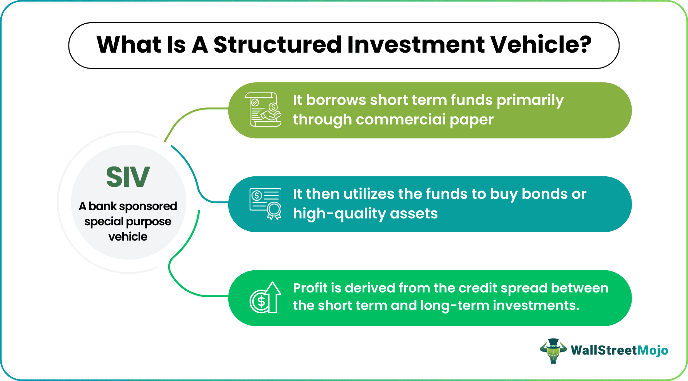

## Table of Contents

## What is a Structured Investment Vehicle (SIV)?

A Structured Investment Vehicle, or SIV, is a type of financial entity that pools money from investors to invest in various financial assets, like bonds and loans. The main goal of an SIV is to make money by borrowing at lower short-term rates and lending at higher long-term rates, earning the difference as profit. This is known as a maturity transformation strategy.

SIVs are designed to be low-risk, but they can face problems if the market changes suddenly. For example, if short-term borrowing costs rise quickly, it becomes harder for the SIV to make a profit. This can lead to financial trouble if the SIV cannot pay back its short-term debts. The 2007-2008 financial crisis showed how risky SIVs can be, as many collapsed when the market turned against them.

## How does an SIV operate?

An SIV works by taking money from investors and using it to buy different kinds of financial assets, like bonds and loans. These assets usually pay back over a long time, but the SIV borrows money to buy them using short-term loans. The idea is to borrow at a low short-term rate and lend at a higher long-term rate, making a profit from the difference. This is called a maturity transformation strategy. The SIV tries to keep this going by constantly paying back short-term loans with new short-term loans, while collecting money from the long-term assets.

However, this strategy can be risky. If the cost of short-term borrowing goes up suddenly, the SIV might find it hard to make a profit. This can cause problems because the SIV needs to keep paying back its short-term loans. If it can't, it might have to sell its long-term assets quickly, which could mean selling them for less than they're worth. This is what happened to many SIVs during the 2007-2008 financial crisis, when the market turned against them and many SIVs collapsed.

## What is the history behind the creation of SIVs?

Structured Investment Vehicles, or SIVs, started to become popular in the late 1980s. They were created as a way for banks to make more money without having to keep risky assets on their own balance sheets. Banks could move these assets to an SIV, which would then borrow money to buy them. This helped banks to keep their balance sheets looking good and to meet the rules about how much money they needed to keep on hand.

The idea of SIVs spread quickly in the 1990s and early 2000s. More and more banks and financial companies started using them because they seemed like a safe way to make money. But during the 2007-2008 financial crisis, it became clear that SIVs were not as safe as people thought. Many SIVs failed when they couldn't pay back their short-term loans, and this caused big problems for the banks that had created them. After the crisis, the use of SIVs dropped a lot because people realized how risky they could be.

## What are the main components of an SIV?

An SIV has a few main parts that help it work. First, there are the investors who give money to the SIV. This money is used to buy different kinds of financial assets, like bonds and loans. These assets are what the SIV uses to make money. The SIV also borrows money, usually for a short time, to help buy these assets. This borrowing is done at a lower rate than what the SIV earns from its assets, so the difference is the SIV's profit.

The other important part of an SIV is how it manages its money. The SIV uses a strategy called maturity transformation, which means it borrows money for a short time but invests in assets that pay back over a longer time. This can be risky because the SIV needs to keep borrowing new short-term money to pay back the old short-term loans. If the cost of borrowing goes up suddenly, the SIV might not be able to keep this going. This is what happened to many SIVs during the 2007-2008 financial crisis, showing how important it is to manage the SIV's money carefully.

## How do SIVs generate returns for investors?

SIVs make money for investors by using a special strategy called maturity transformation. They take money from investors and use it to buy long-term financial assets like bonds and loans. These assets pay back money over a long time, but the SIV borrows money to buy them using short-term loans. The SIV borrows at a lower short-term rate and lends at a higher long-term rate, [earning](/wiki/earning-announcement) the difference as profit. This difference is what the SIV uses to give returns to its investors.

However, this way of making money can be risky. If the cost of borrowing short-term money goes up suddenly, the SIV might find it hard to keep making a profit. This can cause problems because the SIV needs to keep paying back its short-term loans. If it can't, it might have to sell its long-term assets quickly, which could mean selling them for less than they're worth. This is what happened to many SIVs during the 2007-2008 financial crisis, when the market turned against them and many SIVs failed.

## What are the risks associated with investing in SIVs?

Investing in SIVs can be risky because they use a strategy called maturity transformation. This means they borrow money for a short time but invest it in assets that pay back over a longer time. If the cost of short-term borrowing goes up quickly, the SIV might not be able to make enough money to pay back its loans. This can cause big problems for the SIV and the people who invested in it.

Another risk is that SIVs might have to sell their long-term assets quickly if they can't pay back their short-term loans. Selling assets quickly often means selling them for less than they're worth, which can lead to losses. This is what happened to many SIVs during the 2007-2008 financial crisis, showing how risky they can be.

## Can you provide examples of successful SIVs?

One example of a successful SIV is the Sigma Finance Corporation, which was set up in 2002 by the Royal Bank of Scotland. Sigma was able to make money for a long time by borrowing at low short-term rates and lending at higher long-term rates. It managed to keep going even during some tough times in the financial markets, showing that with good management, an SIV could be successful.

Another example is the Cheyne Finance LLC, which was created in 2005 by Cheyne Capital Management. Cheyne Finance did well at first, making money for its investors by using the maturity transformation strategy. It was able to handle the ups and downs of the market until the 2007-2008 financial crisis, when many other SIVs failed. Cheyne Finance's success before the crisis shows that SIVs could work well if managed carefully.

## What role did SIVs play in the 2007-2008 financial crisis?

SIVs played a big part in the 2007-2008 financial crisis. They were set up by banks to make money by borrowing at low short-term rates and lending at higher long-term rates. But when the crisis hit, the cost of short-term borrowing went up a lot. This made it hard for SIVs to keep making money. They had to sell their long-term assets quickly, but they couldn't get a good price for them. This caused big losses for the SIVs and the banks that had created them.

The failure of SIVs made the financial crisis worse. When SIVs couldn't pay back their short-term loans, it caused panic in the financial markets. Banks that had set up SIVs had to take back the risky assets they had moved to the SIVs. This made the banks look weaker and less able to lend money. The problems with SIVs helped spread the crisis from the housing market to the whole financial system, making it harder for everyone to borrow and spend money.

## How have regulations regarding SIVs changed since the financial crisis?

After the 2007-2008 financial crisis, rules about SIVs changed a lot. People saw how risky SIVs could be, so governments and financial watchdogs made new rules to make them safer. One big change was that banks had to keep more money on hand if they were involved with SIVs. This was to make sure they could handle any problems that came up. Also, banks had to be more open about their SIVs, telling everyone what they were doing and what risks they were taking.

Another change was that SIVs had to follow stricter rules about how much they could borrow and what kinds of assets they could buy. This was to stop them from taking too many risks. The new rules also made it harder for banks to move risky assets to SIVs to make their own balance sheets look better. All these changes were meant to make the financial system safer and stop another big crisis from happening because of SIVs.

## What are the differences between SIVs and other investment vehicles like hedge funds or mutual funds?

SIVs are different from hedge funds and mutual funds in how they make money and what they invest in. SIVs use a strategy called maturity transformation, which means they borrow money for a short time but invest it in assets that pay back over a longer time. They try to make money by borrowing at a low short-term rate and lending at a higher long-term rate. Hedge funds, on the other hand, can use many different strategies to make money, like betting on which way the stock market will go or buying and selling different kinds of assets. Mutual funds usually invest in a mix of stocks, bonds, or other securities, and they try to make money by [picking](/wiki/asset-class-picking) good investments and holding onto them for a while.

Another big difference is how risky SIVs can be compared to hedge funds and mutual funds. SIVs can be very risky because if the cost of short-term borrowing goes up suddenly, they might not be able to pay back their loans. This can cause big problems, as many SIVs found out during the 2007-2008 financial crisis. Hedge funds can also be risky, but they often have more ways to manage that risk, like using different kinds of investments to balance things out. Mutual funds are usually seen as less risky because they invest in a wide range of assets and don't use as much borrowing as SIVs. This makes them a safer choice for many people who want to invest their money.

## How do SIVs manage their asset-liability mismatch?

SIVs try to manage their asset-liability mismatch by carefully balancing the money they borrow with the money they lend. They borrow money for a short time at a low rate and use it to buy long-term assets that pay back at a higher rate. This difference in rates is how they make money. To keep this going, SIVs need to keep borrowing new short-term money to pay back the old short-term loans. If they can do this smoothly, they can keep making money for their investors.

But this can be tricky. If the cost of short-term borrowing goes up suddenly, it becomes hard for the SIV to pay back its loans. To deal with this, SIVs might use something called a [liquidity](/wiki/liquidity-risk-premium) facility, which is like a backup plan to get more money if they need it. They also try to keep a mix of different assets so that if one type of asset starts to lose value, they can still make money from the others. This way, they hope to handle any problems that come up and keep their investors happy.

## What are the current trends and future outlook for SIVs in the global financial market?

Since the 2007-2008 financial crisis, the use of SIVs has gone down a lot. People saw how risky they could be, so banks and financial companies have been more careful about using them. New rules have made it harder for SIVs to take big risks, and banks have to keep more money on hand if they're involved with SIVs. This has made SIVs less popular, but some still use them because they can make money if managed well. The focus now is on making sure SIVs are safer and more transparent, so they don't cause big problems again.

Looking ahead, the future of SIVs will depend on how well they can adapt to the new rules and keep making money without taking too many risks. If they can do this, they might still have a place in the financial market. But if they can't, their use could keep going down. The key will be finding a balance between making money and staying safe, so that SIVs can be a useful tool for investors without causing another big crisis.

## What are Structured Investment Vehicles (SIVs)?

Structured Investment Vehicles (SIVs) are specialized financial entities designed to raise capital for investment in a variety of structured finance products. These entities operate by issuing short-term debt instruments, such as commercial paper or medium-term notes, which are typically sold to investors. The proceeds from these issuances are then used to purchase longer-term structured financial assets, including asset-backed securities, mortgage-backed securities, and other collateralized debt obligations.

The primary profit mechanism for SIVs is based on capturing the spread—also known as the yield spread—between the low cost of short-term borrowing and the higher returns generated by long-term investments. This strategy relies on the basic principle of duration mismatch, where the short-term liabilities mature before the long-term assets, allowing the SIV to roll over its debt at potentially lower interest rates while collecting interest from the higher-yielding assets. This interest rate spread can be described mathematically as:

$$
\text{Profit} = (\text{Interest Rate on Long-term Assets} - \text{Interest Rate on Short-term Liabilities}) \times \text{Amount Invested}.
$$

SIVs are typically structured to be bankruptcy-remote, meaning they are set up to avoid being embroiled in the financial difficulties of their sponsoring entities. This is achieved by creating a legal separation between the SIV and its sponsor, often through the establishment of an independent company or trust. Consequently, the assets and liabilities of a SIV are not consolidated into the balance sheet of the sponsor, allowing the sponsor to finance substantial investment undertakings without directly impacting its financial statements.

The origins of SIVs trace back to the late 1980s, when they were first created to take advantage of favorable [interest rate](/wiki/interest-rate-trading-strategies) conditions and the burgeoning market for structured finance products. During the early 2000s, SIVs saw a dramatic rise in popularity due to the increased demand for high-yield financial instruments and the growth of the securitization market. At their peak, SIVs managed assets worth several hundred billion dollars, attracting a range of institutional investors seeking enhanced returns. 

The intricate structure and substantial leverage involved in SIV operations require sophisticated financial management and a thorough understanding of market dynamics, making them both a lucrative yet complex investment vehicle.

## References & Further Reading

[1]: Acharya, V. V., Schnabl, P., & Suarez, G. (2013). ["Securitization without risk transfer."](https://www.sciencedirect.com/science/article/pii/S0304405X12001894) The Review of Financial Studies, 26(2), 249-301.

[2]: Coval, J. D., Jurek, J. W., & Stafford, E. (2009). ["The economics of structured finance."](https://pubs.aeaweb.org/doi/pdfplus/10.1257/jep.23.1.3) Journal of Financial Economics, 92(3), 387-406. 

[3]: Hendershott, T., Jones, C. M., & Menkveld, A. J. (2011). ["Does algorithmic trading improve liquidity?"](https://onlinelibrary.wiley.com/doi/full/10.1111/j.1540-6261.2010.01624.x) The Journal of Finance, 66(1), 1-33.

[4]: Gorton, G. B. (2009). ["Slapped in the Face by the Invisible Hand: Banking and the Panic of 2007."](https://papers.ssrn.com/sol3/papers.cfm?abstract_id=1401882) National Bureau of Economic Research Working Paper No. 14308.

[5]: Khandani, A. E., & Lo, A. W. (2007). ["What happened to the quants in August 2007? Virtual Risk Management."](https://web.mit.edu/Alo/www/Papers/august07.pdf) Journal of Investment Management, 5(4), 5-54.