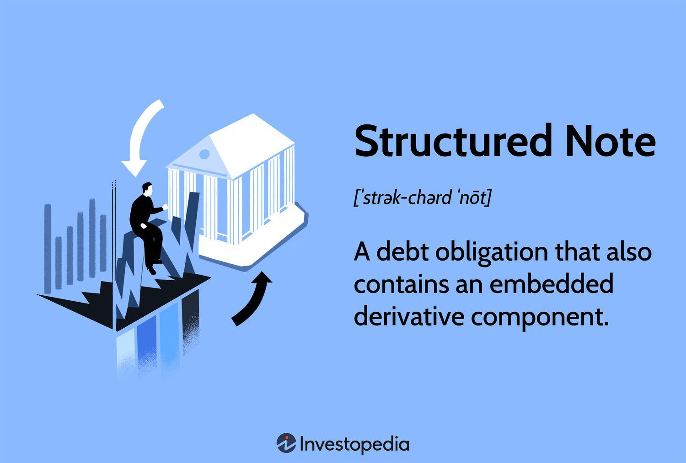

In today's complex financial markets, investors are continually seeking innovative investment products to optimize returns and manage risks. Traditional investment vehicles such as stocks, bonds, and mutual funds, while still prominent, do not always meet the evolving needs of investors who desire more customized solutions. Structured notes have emerged as a notable option in response to this demand, offering a blend of fixed-income and derivative components that can be tailored to fit specific investment strategies. 

Structured notes are hybrid securities that combine a bond with a derivative, which typically provides the option to link the return to the performance of an underlying asset. These assets can range from equity indexes and interest rates to currencies or commodities. As a result, structured notes can offer unique risk-return profiles that stand apart from conventional investment options, providing opportunities for higher yield or principal protection, depending on the investor's goals.



Exploring structured notes is crucial for understanding their potential role in an investment portfolio. They offer advantages such as potential for diversification, yields exceeding those of traditional fixed-income products, and customized risk exposure. However, they also come with their challenges, such as complexity and higher associated risks like market and issuer default risk.

Moreover, the advent of algorithmic trading has further transformed the landscape of modern investment. Algorithmic trading—a method of executing trades using automated, pre-programmed trading instructions—has become increasingly important in enhancing the trading and management of financial products such as structured notes. By leveraging sophisticated algorithms, investors can optimize trading decisions, improve execution speed, and potentially achieve better investment outcomes.

In this article, we will examine the various facets of structured notes, their benefits, and their possible challenges. Additionally, we'll look at how algorithmic trading intersects with structured notes, underscoring the importance of these innovative financial tools in contemporary portfolio management.

## Table of Contents

## Understanding Structured Notes

Structured notes are financial instruments that embody elements of both debt securities and derivatives. They are designed to provide a customizable investment product that aligns with specific financial objectives. At their core, structured notes function as hybrid securities, combining the traditional aspects of fixed-income investments with the strategic components of derivatives to deliver unique risk-return profiles that cater to investors' individual preferences.

The fundamental structure of a structured note consists of two primary components: the bond component and the derivative component. 

1. **Bond Component**: This element of the structured note is akin to a traditional bond, offering a degree of principal protection. The bond component ensures that a portion of the investment is relatively secure, with the principal typically returned upon maturity. The level of protection depends on the specific terms of the note and can vary widely.

2. **Derivative Component**: This portion of the note is designed to deliver return potential and is linked to the performance of an underlying asset or index. Derivatives can be used to create tailored payoffs that capitalize on specific market trends or conditions. The derivative component is what adds complexity and potential for higher returns relative to conventional fixed-income products.

Structured notes are associated with a wide range of underlying assets, such as equity indexes, interest rates, commodities, or currencies. The performance and payouts of structured notes are dependent on the movement or behavior of these underlying benchmarks. For instance, a structured note linked to an equity index could offer returns based on the index's performance over a specified period. If the index performs well, the investor could achieve returns higher than those offered by traditional bonds. However, if the index performs poorly, the investor might not receive any additional returns beyond the principal, depending on the structure of the note.

To illustrate, consider a structured note tied to an equity index like the S&P 500. The note might promise to return the initial investment plus a certain percentage of gains if the index rises beyond a specified threshold by the note's maturity date. This type of structured note allows investors to participate in equity market gains while still protecting their initial investment, assuming the issuer does not default.

By embedding a derivative component into a bond-like structure, structured notes offer a versatile tool for investors seeking to tailor their risk exposure and return opportunities. Such notes can be particularly appealing in scenarios where investors have specific expectations about market movements or wish to hedge against particular risks. Overall, structured notes enable diversified and innovative strategies that integrate traditional securities with modern financial engineering principles.

## Types of Structured Notes

Structured notes are versatile financial instruments, tailored to meet various investment goals. These notes can be categorized into several types, each offering unique features and advantages to investors.

**Absolute Notes**: Absolute notes are designed to provide returns based on the absolute performance of an underlying asset. Unlike traditional bonds, which may offer periodic coupon payments, absolute notes focus on delivering a payoff that is contingent on the overall change in value of the underlying asset over a specific period. These notes are particularly appealing to investors looking for the potential upside without depending on relative performance benchmarks. They are structured to ensure capital return, making them suitable for those cautious about principal risk while seeking a calculated risk-return profile.

**Digital Notes**: Digital notes, often referred to as binary or all-or-nothing notes, offer fixed returns if a specified condition is fulfilled. The payoff is typically dependent on the occurrence of a specific event related to the underlying asset, such as reaching a certain price level. For example, a digital note linked to a stock index may pay a fixed interest if the index surpasses a pre-defined threshold. The structure is attractive to investors who prefer clear, predetermined outcomes, akin to options, with less concern about the magnitude of asset movement beyond the set threshold.

**Growth Notes**: Growth notes aim to capitalize on the appreciation potential of underlying assets, such as equities or commodities. These notes often tie returns to the performance of these assets, with the possibility of leveraging mechanisms to amplify gains. Unlike income-focused instruments, growth notes typically reinvest any returns for compound growth, making them ideal for investors seeking long-term capital appreciation. The profit potential is balanced against higher risk exposure, as growth notes are susceptible to market volatility.

**Income Notes**: Income notes cater to investors prioritizing regular income streams, often structured to provide periodic coupon payments derived from the performance of underlying assets. These notes may incorporate a mix of fixed and variable interest components, catering to those who desire stability in cash flows alongside the opportunity for enhanced returns. The periodic payments depend on specific market conditions, such as the performance of a reference index, thus combining income certainty with the potential for additional yield.

Each type of structured note is crafted to align with distinct investor objectives—be it capital protection, fixed returns, or growth potential—demonstrating the adaptability of structured notes as an investment solution.

## Advantages of Investing in Structured Notes

Structured notes offer a unique investment avenue characterized by their flexibility and customization, which are among their most attractive advantages. At their core, structured notes are designed to provide tailored payoffs that adapt to the specific risk-return preferences of investors. This customization is achieved by combining a traditional bond component with a derivative component, allowing for structured notes to be linked to a wide variety of underlying assets. This setup provides the facility for investors to potentially achieve returns that are directionally tied to equity indexes, interest rates, commodities, or other metrics.

The ability of structured notes to serve as an effective tool for diversification within an investment portfolio is noteworthy. By offering exposure to a broad spectrum of underlying assets, structured notes enable investors to spread out risk and prevent over-concentration in any single asset class. For example, an investor could utilize a structured note tied to an equity index to counterbalance other fixed-income assets in their portfolio, thereby achieving a more balanced risk profile.

Regarding risk management, structured notes can be structured in such a way that they offer elements of capital protection, ensuring the preservation of an investor's principal under specified conditions. This characteristic can be particularly appealing in volatile market environments where the preservation of capital is a priority. Furthermore, the embedded derivatives within structured notes can be designed to hedge against specific market risks, enhancing the risk-adjusted return of the portfolio.

Structured notes also have the potential to deliver superior returns compared to traditional fixed-income products. The derivative component of a structured note can be tailored to optimize returns based on the anticipated movements of the underlying asset. For instance, should an investor believe that a particular equity index will rise, a structured note could include a derivative that amplifies returns when the index experiences gains. This arrangement is especially beneficial when market conditions favor the strategy embedded within the note.

In conclusion, the advantages of investing in structured notes lie in their considerable flexibility and the opportunity for enhanced returns, coupled with their capacity to significantly contribute to diversification and risk management strategies. These characteristics make structured notes a compelling consideration for investors seeking to navigate complex market environments while optimizing their portfolios.

## Challenges and Risks of Structured Notes

Structured notes, while offering potential benefits, also present several challenges and risks that investors must carefully consider before inclusion in their portfolios.

Structured notes are inherently complex financial instruments, combining the features of debt securities with derivatives. This complexity arises from their non-standardized structure, which is often tailored to specific market views or investor goals. Understanding the intricate details of both the bond and derivative components requires a high level of financial literacy. As a result, they are often less transparent than traditional investment products, making it challenging for investors to fully evaluate the associated risks and rewards.

One significant risk associated with structured notes is market risk. These instruments are usually linked to the performance of underlying assets such as equities, interest rates, or commodities. Thus, fluctuations in the value of these underlying assets can directly impact the returns of the structured notes. For instance, a structured note tied to an equity index will be susceptible to the [volatility](/wiki/volatility-trading-strategies) inherent in the stock market. If the associated market declines, the potential for financial loss increases.

Liquidity risk is another key consideration. Structured notes often have limited secondary market activity due to their bespoke nature, meaning they can be challenging to sell before maturity. The lack of [liquidity](/wiki/liquidity-risk-premium) can result in significant discounts if the investor needs to [exit](/wiki/exit-strategy) the position prematurely, thus impacting overall investment performance.

A critical risk aspect is the potential for principal loss. Although some structured notes offer principal protection, this feature is not a given and depends on the note's specific terms. Principal protection might only apply if the note is held to maturity, and even then, it may not cover all market scenarios. Investors may still incur losses if the structured note is redeemed or sold before its maturity date. Moreover, structured notes do not typically offer periodic interest payments, potentially impacting investors’ cash flow requirements.

Issuer default poses a further risk to investors. Structured notes are often issued by financial institutions, and their performance is directly linked to the issuer’s creditworthiness. In the event of an issuer default, investors could face the total loss of their principal investment. Therefore, it is crucial for investors to assess the financial stability of the issuing institution prior to investing.

Economic trends also influence the performance of structured notes. For example, changes in [interest rate](/wiki/interest-rate-trading-strategies) environments can affect the discounted value of future payoffs from structured notes. In a rising interest rate scenario, the present value of future cash flows from a structured note may decrease, negatively impacting the note's overall return potential. Additionally, broader economic conditions, such as inflation or geopolitical events, can affect the underlying assets to which structured notes are tied, further complicating their performance predictions.

In conclusion, while structured notes can offer unique investment opportunities, they come with potential complexities and significant risks. A thorough understanding and careful consideration of market and liquidity risks, potential principal loss, issuer default, and the broader economic landscape are essential for investors contemplating structured notes as part of their investment strategy.

## The Role of Algorithmic Trading in Structured Notes

Algorithmic trading, often referred to as algo-trading, is the use of computer algorithms to automate trading processes. These algorithms are capable of executing trades at speeds and frequencies that are impossible for human traders, leveraging predefined criteria such as timing, price, and [volume](/wiki/volume-trading-strategy). In modern finance, [algorithmic trading](/wiki/algorithmic-trading) is crucial due to its ability to enhance market liquidity, reduce transaction costs, and improve trading efficiency.

In the context of structured notes, algorithmic trading strategies offer significant advantages. These notes are financial products that combine fixed-income elements with derivatives and are typically linked to an underlying asset such as an equity index, interest rate, or commodity. The complexity inherent in these products necessitates precise and dynamic trading strategies, which can be effectively managed through algorithmic trading.

### Enhancements through Algorithmic Trading

1. **Dynamic Portfolio Management**: Structured notes require continuous monitoring and adjustments aligned with market conditions. Algorithmic trading facilitates real-time analysis and management of these complex securities. Algorithms can rapidly respond to market shifts, adjusting the structured note portfolio to optimize performance and manage risk effectively.

2. **Improved Hedging Strategies**: Hedging is integral to managing the risks associated with structured notes, primarily due to their exposure to the underlying assets. Algorithmic trading can be employed to dynamically hedge positions by automatically executing trades that mitigate potential losses from unfavorable market movements. This is achieved by continuously recalibrating the hedge as market conditions evolve.

3. **Cost Efficiency and Execution Speed**: By leveraging algorithmic trading, investors can significantly reduce the cost of executing trades associated with structured notes. Automated systems minimize manual intervention, thus reducing the likelihood of errors and slippage. Additionally, algorithms can identify and leverage arbitrage opportunities across different markets, enhancing profitability.

### Technological Benefits

The integration of technology in trading not only contributes to the precise execution of trades but also provides invaluable data analytics capabilities. Machine learning and data science can be incorporated into algorithmic trading systems to further refine decision-making processes:

```python
# Example of a simple algorithmic trading strategy using Python (pseudocode)

import talib
import numpy as np

# Initialize trading parameters
short_window = 50
long_window = 200

# Set up price data
prices = np.random.rand(1000)  # Example price data

# Calculate moving averages
short_mavg = talib.SMA(prices, timeperiod=short_window)
long_mavg = talib.SMA(prices, timeperiod=long_window)

# Generate trading signals
signals = np.where(short_mavg > long_mavg, 1, 0)

# Execute trades based on signals
def execute_trades(signals):
    for i in range(1, len(signals)):
        if signals[i] != signals[i-1]:  # Detect signal change
            if signals[i] == 1:
                print(f"Buy signal at index {i}")
            elif signals[i] == 0:
                print(f"Sell signal at index {i}")

execute_trades(signals)
```

In this example, a simple moving average crossover strategy generates buy and sell signals. While basic, such strategies can be scaled and adapted to accommodate the complexities of structured notes, taking into account various market conditions and asset volatilities.

Algorithmic trading represents a frontier for managing the intricacies of structured notes. By automating processes and incorporating data-driven insights, investors can not only enhance the management of these products but also potentially improve overall investment outcomes. As technology continues to evolve, the role of algorithmic trading in structured notes is expected to expand, offering more sophisticated solutions tailored to the needs of modern investors.

## Case Studies

Structured notes have gained popularity among investors for their ability to offer tailored financial solutions, particularly for hedging risks and generating income. This section presents real-world examples to illustrate how investors strategically utilize structured notes.

### Example 1: Hedging with Equity-Linked Notes

An investor concerned about potential declines in a major stock index might opt for equity-linked notes (ELNs) as a hedging tool. These notes combine a fixed-income instrument with an equity derivative, offering returns connected to the performance of the chosen equity index. For instance, an ELN could be tied to the S&P 500 index. If the index maintains or gains value, the investor stands to receive returns above the traditional bond yield, as defined by the embedded options. Conversely, if the index declines, the principal invested is at risk due to the structured note's inherent market exposure. However, the potential for higher returns compared to traditional bonds is the key attraction, presenting a calculated approach to mitigate risk while making a bet on the market's direction.

### Example 2: Income Generation through Interest Rate-Linked Notes

Investors seeking enhanced yields in a low interest rate environment may turn to interest rate-linked notes. These structured notes offer returns contingent upon specific interest rate movements, allowing investors to potentially earn higher coupons than typical fixed-income securities. For instance, an investor could purchase a structured note linked to the LIBOR rate. The note might offer periodic interest payments that increase if LIBOR rises above a predefined threshold. Such a strategy can be lucrative if interest rates climb, thus providing investors an opportunity to capitalize on rate hikes while still maintaining a degree of principal protection that a regular bond might not offer.

### Example 3: Commodities-Linked Notes for Diversification

Some investors aim to diversify their portfolios beyond equities and fixed-income securities by including commodities exposure through structured notes. A real-world application might involve notes linked to commodities like gold or oil. For example, an investor targets gold as a hedge against inflation by acquiring a structured note linked to gold's price performance. If gold prices rise, the structured note delivers returns reflecting this appreciation, thereby achieving both income generation and diversification. The product often includes mechanisms to protect against downside risk, appealing to investors wary of direct exposure to volatile commodities markets.

These case studies reveal the effectiveness of structured notes in real investment scenarios, whether for hedging equity exposure, leveraging interest rate movements, or achieving diversification with commodities. By customizing the components and underlying references, structured notes provide investors with versatile tools to align financial products with individual objectives and market outlooks.

## Conclusion

Structured notes represent a sophisticated investment vehicle that combines elements of both debt securities and derivatives, offering a unique blend of risk and reward that may appeal to certain investors. The primary advantage of structured notes lies in their customization potential. They provide tailored payoffs which can be structured to meet specific investor goals, such as capital protection, fixed income returns, or growth potential. They facilitate diversification and risk management within a portfolio, potentially delivering returns that surpass those from traditional fixed-income products.

However, structured notes also present significant challenges and risks. They are inherently complex instruments, with risks including market volatility, liquidity constraints, and the possibility of issuer default leading to principal loss. Moreover, the performance of structured notes is sensitive to broader economic trends, which requires investors to maintain an informed perspective on market dynamics.

Algorithmic trading further intersects with structured notes by offering advanced strategies that can enhance the trading and management of these instruments. Utilizing algorithmic techniques can optimize trade execution and risk management, thereby potentially improving investment outcomes.

Given the complexity and potential risk associated with structured notes, it is crucial for investors to possess a profound understanding of these instruments and the role of algorithmic trading. Making informed decisions requires analyzing individual risk tolerance and aligning investment objectives with the specific opportunities structured notes present. Therefore, consulting financial advisors is advisable. Financial professionals can provide guidance to tailor structured notes, ensuring they complement investor-specific goals and risk profiles effectively. This comprehensive approach can aid investors in harnessing the benefits of structured notes while mitigating associated risks.

## References & Further Reading

[1]: Bergstra, J., Bardenet, R., Bengio, Y., & Kégl, B. (2011). ["Algorithms for Hyper-Parameter Optimization."](https://papers.nips.cc/paper/4443-algorithms-for-hyper-parameter-optimization) Advances in Neural Information Processing Systems 24.

[2]: ["Advances in Financial Machine Learning"](https://www.amazon.com/Advances-Financial-Machine-Learning-Marcos/dp/1119482089) by Marcos Lopez de Prado

[3]: ["Evidence-Based Technical Analysis: Applying the Scientific Method and Statistical Inference to Trading Signals"](https://www.amazon.com/Evidence-Based-Technical-Analysis-Scientific-Statistical/dp/0470008741) by David Aronson

[4]: ["Machine Learning for Algorithmic Trading"](https://github.com/stefan-jansen/machine-learning-for-trading) by Stefan Jansen

[5]: ["Quantitative Trading: How to Build Your Own Algorithmic Trading Business"](https://www.amazon.com/Quantitative-Trading-Build-Algorithmic-Business/dp/1119800064) by Ernest P. Chan