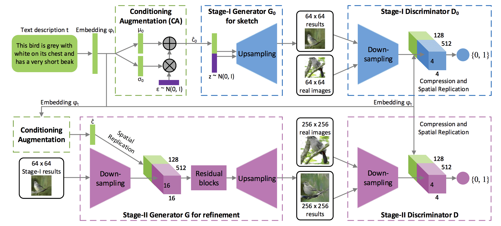

## Table of Contents

## What is structured prediction in machine learning?

Structured prediction is a type of machine learning where the goal is to predict complex outputs that have an internal structure. Instead of predicting a single number or category, like in regression or classification, structured prediction deals with outputs like sequences, trees, or graphs. For example, in natural language processing, you might want to predict a whole sentence, not just a word. This is harder because the relationships between the parts of the output are important.

To do structured prediction, we often use models that can handle these complex outputs. One common approach is to use a model that can score different possible outputs and pick the best one. For instance, in part-of-speech tagging, a model might look at a sentence and try to label each word with its part of speech, like noun or verb. The model would score different ways of labeling the sentence and choose the one with the highest score. This can be done using techniques like maximum entropy Markov models or conditional random fields, which are good at handling the dependencies between the different parts of the output.

## How does structured prediction differ from traditional classification tasks?

Structured prediction is different from traditional classification tasks because it deals with more complex outputs. In traditional classification, you're trying to put something into one of a few categories, like deciding if an email is spam or not. The output is simple - it's just one category. But in structured prediction, the output has parts that are connected in some way. For example, if you're trying to predict a whole sentence, you need to think about how the words fit together, not just pick one word at a time.

Because the outputs in structured prediction are more complicated, the methods used are different too. In traditional classification, you might use a model that looks at some features and then decides on a category. But in structured prediction, you need a model that can handle the relationships between the parts of the output. For instance, if you're doing part-of-speech tagging, you need a model that can look at the whole sentence and figure out how to label each word in a way that makes sense together. This often involves using more advanced models like conditional random fields that can score different possible outputs and pick the best one based on how well the parts fit together.

## What are some common applications of structured prediction?

Structured prediction is used in many areas where the output is more than just a single number or category. One common use is in natural language processing. For example, when you want to predict the structure of a sentence, like figuring out which words are nouns and which are verbs, you need structured prediction. This is called part-of-speech tagging. Another example is in machine translation, where you want to translate a whole sentence from one language to another, not just single words. The model has to understand how the words in the sentence fit together to make a good translation.

Another area where structured prediction is useful is in computer vision. For instance, when you want to label different parts of an image, like identifying where the eyes, nose, and mouth are in a face, you need a model that can predict these labels in a way that makes sense together. This is called image segmentation. Structured prediction is also used in bioinformatics, where you might want to predict the structure of a protein or the function of different parts of a DNA sequence. In all these cases, the model has to consider the relationships between the different parts of the output to make accurate predictions.

## Can you explain the concept of Conditional Random Fields (CRF) in structured prediction?

Conditional Random Fields (CRF) are a type of model used in structured prediction. They are good at handling outputs that have parts that are connected, like sentences or images. CRFs work by looking at all the possible ways to label the parts of the output and then picking the one that fits best. For example, if you're trying to label the parts of speech in a sentence, a CRF would look at different ways to label the words and choose the one that makes the most sense together. This is different from simpler models that might label each word without thinking about how the labels fit together.

CRFs use a scoring system to decide which labeling is best. They score each possible labeling using something called a "potential function," which looks at the features of the input and the labels. The model then picks the labeling with the highest score. The math behind this can be a bit complex, but the basic idea is to find the labeling that maximizes the probability of the output given the input. In simple terms, CRFs are good at figuring out how to label things in a way that makes sense as a whole, not just as separate parts.

## How do Latent Tree Learning Systems (LTLS) work in the context of structured prediction?

Latent Tree Learning Systems (LTLS) are a type of model used in structured prediction that focus on finding hidden structures in data. Imagine you have a bunch of data, like sentences or images, and you want to predict something about them. LTLS tries to find a tree-like structure that best explains how the parts of the data are connected. This hidden structure, or "latent tree," helps the model understand the relationships between different parts of the data better than just looking at them one by one.

To use LTLS, the model first learns what this hidden tree structure might look like. It does this by looking at a lot of examples and figuring out which tree structure fits best. Once the model has a good idea of the tree structure, it uses this to help predict the output. For example, if you're trying to predict the structure of a sentence, the LTLS model would use the hidden tree to understand how the words connect and then make a better prediction about the whole sentence. This way, LTLS can handle complex outputs by breaking them down into simpler, connected parts.

## What is the role of Deep Multi-View Fusion Networks (DMVFN) in structured prediction?

Deep Multi-View Fusion Networks (DMVFN) are used in structured prediction to combine different types of information, or "views," to make better predictions. Imagine you have different ways of looking at the same data, like different features or perspectives. DMVFN takes these different views and mixes them together in a smart way to get a better understanding of the data. This can be very helpful when the data is complex and you want to predict something that has many parts that are connected, like a sentence or an image.

For example, if you're trying to predict the structure of a sentence, you might have one view that looks at the words and another view that looks at the grammar. DMVFN would combine these views to make a better prediction about the whole sentence. By using deep learning techniques, DMVFN can learn how to mix these views in the best way possible, which can lead to more accurate predictions in structured prediction tasks.

## What are the key challenges faced when implementing structured prediction models?

Implementing structured prediction models can be tricky because the outputs are complex. Instead of just picking one number or category, these models need to predict things like sentences or images that have many parts that fit together. This makes the models harder to train and use. For example, in natural language processing, a model might need to predict a whole sentence, not just one word. This means the model has to understand how the words fit together, which is much harder than just picking one word at a time. Also, because the outputs are more complicated, the models often need more data to learn well, which can be hard to get.

Another challenge is that structured prediction models need to handle the relationships between the different parts of the output. For example, if you're trying to label the parts of speech in a sentence, the model has to think about how the labels fit together, not just label each word by itself. This can make the models more complex and harder to set up. Methods like Conditional Random Fields or Deep Multi-View Fusion Networks try to solve this by looking at all the possible ways to label the parts and picking the best one. But figuring out how to do this well can take a lot of time and effort.

## How can one evaluate the performance of a structured prediction model?

Evaluating the performance of a structured prediction model involves looking at how well the model predicts complex outputs like sentences or images. One common way to do this is by using metrics that measure how close the model's predictions are to the correct answers. For example, in natural language processing, you might use accuracy to see how many words the model labeled correctly in a sentence. But because the outputs are more complicated, you often need more advanced metrics. One popular metric is the F1 score, which looks at both how many correct predictions the model made and how many it missed. This helps give a better picture of the model's performance when the outputs have many connected parts.

Another way to evaluate structured prediction models is by using loss functions that are designed for complex outputs. For instance, in image segmentation, you might use a loss function that measures how well the model labeled different parts of an image. These loss functions can be more complicated than the ones used in simpler tasks like classification. They often need to take into account the relationships between the different parts of the output. By using the right loss function and metrics, you can get a good idea of how well your structured prediction model is working and where it might need to be improved.

## What are some advanced techniques used to improve the accuracy of structured prediction models?

One advanced technique to improve the accuracy of structured prediction models is to use deep learning methods, like neural networks. These models can learn complex patterns in data, which helps them predict things like sentences or images better. For example, a type of neural network called a recurrent neural network (RNN) is good at handling sequences, which makes it useful for tasks like machine translation. By using deep learning, the model can learn to understand the relationships between different parts of the output, which is important in structured prediction.

Another technique is to use ensemble methods, where you combine the predictions of several different models to get a better overall prediction. This can help because different models might be good at different parts of the task. For example, one model might be good at predicting the beginning of a sentence, while another is better at the end. By combining their predictions, you can get a more accurate result. Ensemble methods can be especially useful in structured prediction because the outputs are complex, and different models can help cover different aspects of the output.

## How does the choice of loss function impact structured prediction models?

The choice of loss function is really important for structured prediction models because it tells the model what to aim for. In structured prediction, the outputs are more complicated than just a single number or category. They have parts that are connected, like words in a sentence or parts of an image. So, the loss function needs to be able to handle these complex outputs. For example, if you're trying to predict a sentence, you might use a loss function that looks at how well the model predicts each word and how well the words fit together. This helps the model learn to make predictions that make sense as a whole, not just as separate parts.

Different loss functions can affect how the model learns and performs. For example, in image segmentation, you might use a loss function like the cross-entropy loss to see how well the model labels different parts of an image. But you might also use a loss function that looks at the boundaries between different parts, like the Dice loss. This can help the model learn to make sharper and more accurate predictions. By choosing the right loss function, you can guide the model to focus on what's important for the task, which can lead to better predictions in structured prediction.

## Can you discuss the computational complexity of training structured prediction models?

Training structured prediction models can be pretty tough because the outputs are more complicated than just a single number or category. Instead of predicting one thing at a time, these models need to predict things like whole sentences or images that have many parts that fit together. This means the models have to look at a lot of different possibilities and figure out which one is best. For example, if you're trying to predict a sentence, the model has to consider all the different ways to label each word and pick the one that makes the most sense together. This can take a lot of time and computer power, especially when the outputs are big or the data is complex.

One way to think about the computational complexity is to look at how long it takes to train the model. For structured prediction, this can be much longer than for simpler tasks like classification. The model has to do a lot of calculations to figure out the best way to label the parts of the output, which can slow things down. For example, if you're using a method like Conditional Random Fields (CRF), the model has to score all the possible labelings and pick the best one. This can be done using something called the Viterbi algorithm, which is good at finding the best path through a sequence, but it can still take a lot of time if the sequence is long. So, when you're training a structured prediction model, you need to be ready for it to take longer and use more computer resources than simpler models.

## What future developments can we expect in the field of structured prediction?

In the future, we can expect structured prediction to become even better at handling complex data. One big change might be the use of more advanced deep learning models. These models can learn to understand the relationships between different parts of the data better than current methods. For example, new types of neural networks might be developed that are specifically good at tasks like predicting sentences or labeling images. This could make structured prediction models more accurate and able to handle even more complicated outputs.

Another future development might be in making structured prediction models easier to use and train. Right now, these models can be hard to set up because they need to handle complex outputs. But in the future, we might see new tools and methods that make it simpler to train these models. This could mean that more people will be able to use structured prediction for different tasks, like understanding language or analyzing images. Overall, the field of structured prediction is likely to keep growing and improving, making it easier and more powerful for everyone to use.