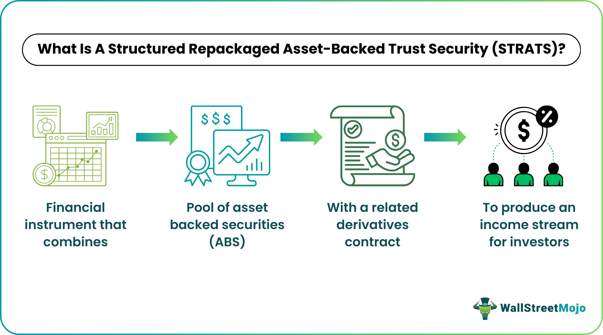

## Table of Contents

## What is a Structured Repackaged Asset-Backed Trust Security (SRATS)?

A Structured Repackaged Asset-Backed Trust Security, often called SRATS, is a type of financial product. It is made by taking different kinds of loans or debts, like mortgages or credit card debts, and bundling them together. Then, this bundle is divided into smaller pieces, called securities, which investors can buy. These securities are attractive because they can offer regular payments, similar to interest, based on the money collected from the original loans.

SRATS can be complex because they mix different types of debts, and the risk can vary depending on the quality of the loans included. If the people who took out the loans pay back on time, the investors get their payments. But if many borrowers struggle to pay, the value of the SRATS can drop, and investors might lose money. This makes it important for investors to understand the risks and the types of loans that are part of the SRATS before they decide to invest.

## How does a SRATS differ from traditional asset-backed securities?

A Structured Repackaged Asset-Backed Trust Security, or SRATS, is a bit different from traditional asset-backed securities. Traditional asset-backed securities are made from one type of loan, like car loans or home mortgages. They are simpler because they only deal with one kind of debt. On the other hand, SRATS are more complex because they mix different types of loans together. This means a SRATS might include car loans, credit card debts, and mortgages all in one package.

Because SRATS mix different types of loans, they can be riskier than traditional asset-backed securities. If one type of loan in the SRATS starts to have problems, like if a lot of people can't pay their car loans, it can affect the whole SRATS. Traditional asset-backed securities don't have this problem because they only have one type of loan. But SRATS can also be more attractive to some investors because they offer a way to spread out risk across different kinds of loans, which might make them a bit safer if the mix is done right.

## What types of assets are typically repackaged into SRATS?

SRATS usually include a mix of different kinds of loans or debts. These can be things like car loans, where people borrow money to buy cars, and mortgages, which are loans for buying houses. They might also include credit card debts, where people use credit cards to buy things and then pay back the money over time. Sometimes, SRATS can even have student loans, which are loans people take out to pay for school.

By mixing these different types of loans together, SRATS can offer investors a way to spread out their risk. If one type of loan, like car loans, starts to have problems because a lot of people can't pay them back, the other types of loans in the SRATS might still be doing okay. This can help protect the investors' money. But it also means that SRATS can be more complicated and harder to understand than simpler types of investments.

## What are the benefits of investing in SRATS for beginners?

Investing in SRATS can be a good way for beginners to start learning about more complex investments. SRATS mix different types of loans together, like car loans, mortgages, and credit card debts. This mix can help spread out the risk, which means if one type of loan has problems, the others might still be okay. This can make SRATS a bit safer than investing in just one type of loan. Plus, SRATS can offer regular payments, kind of like interest, which can be a nice way for beginners to see money coming in from their investments.

However, beginners should be careful because SRATS can be tricky to understand. They are more complicated than simpler investments like stocks or bonds. It's important for beginners to do their homework and maybe talk to a financial advisor before jumping into SRATS. Understanding the risks and the types of loans that are part of the SRATS is key to making a smart investment decision.

## How is the credit risk managed in SRATS?

Credit risk in SRATS is managed by mixing different types of loans together. This means if one type of loan, like car loans, starts to have problems because a lot of people can't pay them back, the other types of loans in the SRATS might still be doing okay. This spreading out of risk can help protect the investors' money. It's like not putting all your eggs in one basket. By having a mix of car loans, mortgages, credit card debts, and maybe even student loans, SRATS can balance out the risk better than if they only had one type of loan.

Another way credit risk is managed in SRATS is through careful selection and monitoring of the loans that go into them. Before a loan is included in a SRATS, it is checked to see how likely it is that the borrower will pay it back. This helps to make sure that the SRATS includes mostly good loans. After the SRATS is created, the loans are watched closely to see if anything changes. If a lot of borrowers start to have trouble paying back their loans, steps can be taken to try to fix the problem before it gets too bad. This careful watching and managing helps to keep the credit risk under control.

## What role do special purpose vehicles (SPVs) play in SRATS?

Special purpose vehicles, or SPVs, are really important for SRATS. An SPV is like a special company that is set up just to hold the loans that are going to be part of the SRATS. When the loans are put into the SPV, it keeps them separate from the company that originally made the loans. This is good because if the original company gets into financial trouble, the loans in the SPV are safe. This makes the SRATS safer for investors because their money is not tied to the original company's problems.

The SPV also helps with managing the SRATS. It collects the payments from the loans and then passes them on to the investors. This way, the investors get their money without having to deal with all the details of collecting from each borrower. The SPV makes sure everything is organized and that the payments are made on time. This makes the whole process smoother and more reliable for everyone involved.

## How are SRATS structured and what are the common tranches?

SRATS are structured by taking different kinds of loans and putting them into a special company called a special purpose vehicle, or SPV. This SPV holds all the loans and keeps them separate from the company that originally made the loans. This separation makes the SRATS safer for investors. The SPV then turns the loans into securities, which are like pieces of the loans that investors can buy. These securities are divided into different levels, called tranches, based on how risky they are and how much they might pay.

The common tranches in SRATS are senior, mezzanine, and equity tranches. Senior tranches are the safest because they get paid back first from the money collected from the loans. This makes them less risky, but they also usually pay less. Mezzanine tranches are in the middle. They are riskier than senior tranches but less risky than equity tranches. They get paid back after the senior tranches but before the equity tranches. Equity tranches are the riskiest. They get paid back last, so if a lot of people can't pay back their loans, the equity tranches might not get much money. But because they are riskier, they can also offer higher payments if everything goes well.

## What are the key legal and regulatory considerations for SRATS?

When it comes to SRATS, there are some important legal and regulatory things to keep in mind. First, SRATS are usually set up using special purpose vehicles (SPVs), which are separate from the company that made the original loans. This separation helps protect investors if the original company has financial problems. But setting up an SPV involves following strict rules about how it's created and how it operates. These rules can be different depending on the country, so it's important to know the local laws.

Another key thing is that SRATS need to follow securities laws. These laws are there to make sure investors get all the information they need to make smart choices. That means the people selling SRATS have to tell investors about the risks and how the SRATS are structured. They also have to follow rules about how they can advertise and sell the SRATS. Plus, there are rules about how the money from the loans is collected and shared with investors, which helps keep everything fair and clear.

## How do SRATS perform during different economic cycles?

SRATS can act differently depending on what's happening with the economy. When the economy is doing well, people usually have jobs and can pay back their loans on time. This means the SRATS can do well because they get regular payments from the loans. Investors are happy because they get their money back and maybe even a little extra. But SRATS are a mix of different kinds of loans, like car loans, mortgages, and credit card debts, so how well they do can depend on how those different loans are doing.

When the economy is not doing so well, like during a recession, SRATS can have a tougher time. More people might lose their jobs and struggle to pay back their loans. This can make it harder for the SRATS to get the money they need to pay investors. If a lot of loans in the SRATS start to have problems, the value of the SRATS can go down, and investors might lose money. But because SRATS mix different kinds of loans, they can sometimes handle tough times better than if they only had one type of loan. It's like having a safety net, but it's not perfect, and things can still go wrong.

## What advanced strategies can be used to optimize returns from SRATS?

To get the most out of investing in SRATS, one smart strategy is to carefully pick the right mix of loans that go into them. By choosing loans that have different levels of risk and are from different parts of the economy, you can spread out the risk. This means if one type of loan, like car loans, starts to have problems, the other types of loans, like mortgages or credit card debts, might still be doing okay. This can help keep your investment safer. Another good idea is to keep an eye on how the economy is doing and adjust your SRATS investments as things change. If you see that the economy is getting better, you might want to invest more in SRATS because people will be more likely to pay back their loans. But if you see signs that the economy might be heading for tough times, you might want to be more careful and maybe not invest as much in SRATS.

Another advanced strategy is to use something called tranching to your advantage. SRATS are split into different levels, called tranches, based on how risky they are and how much they might pay. By choosing the right mix of these tranches, you can balance risk and reward. For example, you might put more money into the safer senior tranches to protect your investment, but also invest a little in the riskier equity tranches to try to get higher returns. It's like not putting all your eggs in one basket. You can also use something called hedging to protect your investment. This means you buy other investments that will go up in value if your SRATS go down, helping to balance out any losses. By using these strategies, you can try to get the best possible returns from your SRATS investments while keeping the risks under control.

## How do you analyze the cash flow models of SRATS?

Analyzing the cash flow models of SRATS involves looking at how money moves in and out of the investment. You start by figuring out how much money comes in from the different loans that are part of the SRATS. This includes payments from car loans, mortgages, credit card debts, and any other types of loans. You need to see how often these payments come in and how likely it is that the people who took out the loans will keep paying on time. If a lot of people can't pay back their loans, the cash flow into the SRATS will go down, which can be a problem.

Next, you look at how the money that comes in is used. Some of it goes to pay the investors who bought the SRATS. The SRATS are divided into different levels, called tranches, and each level gets paid in a certain order. The safest tranches, called senior tranches, get paid first, then the middle ones, called mezzanine tranches, and finally the riskiest ones, called equity tranches. You also need to think about any costs, like fees for managing the SRATS, that need to be paid out of the cash flow. By understanding how the money flows in and out, you can see if the SRATS will be able to keep paying investors and how much risk there is that things might go wrong.

## What are the current market trends and future outlook for SRATS?

The market for SRATS is always changing, but right now, there's a lot of interest in them. People are looking for ways to get good returns on their investments, and SRATS can offer that because they mix different types of loans together. This mix can help spread out the risk, which is something investors like. Also, with interest rates going up and down, SRATS can be a good way to get regular payments. But because SRATS can be complicated, investors are being careful and doing a lot of research before they invest.

Looking ahead, the future of SRATS looks promising but also a bit uncertain. As the economy keeps changing, SRATS will need to adapt. If the economy stays strong, SRATS could do well because people will be able to pay back their loans. But if there's a big economic downturn, SRATS might have a harder time. New rules and regulations could also affect how SRATS are made and sold. So, while there's a lot of potential for SRATS to keep being a popular investment, investors will need to stay on top of things and be ready to adjust their strategies as the market changes.

## References & Further Reading

[1]: Gorton, G. B., & Metrick, A. (2012). ["Securitization."](https://www.nber.org/papers/w18611) Annual Review of Financial Economics, 4(1), 125-147.

[2]: Fabozzi, F. J., Bhattacharya, A. K., & Berliner, W. S. (2007). ["Mortgage-Backed Securities: Products, Analysis, Trading."](https://www.semanticscholar.org/paper/Mortgage-Backed-Securities%3A-Products%2C-Structuring%2C-Fabozzi-Bhattacharya/079a00b3778cd64b681de9581e75890513f35f01) Oxford University Press.

[3]: Lopez de Prado, M. (2018). ["Advances in Financial Machine Learning."](https://www.amazon.com/Advances-Financial-Machine-Learning-Marcos/dp/1119482089) Wiley.

[4]: Hull, J. C. (2018). ["Options, Futures, and Other Derivatives."](https://www.semanticscholar.org/paper/Options%2C-Futures%2C-and-Other-Derivatives-Hull/89bdee500c8623864fc9eb7a471546aa713acc44) Pearson.

[5]: Lintner, J. (1965). ["The Valuation of Risk Assets and the Selection of Risky Investments in Stock Portfolios and Capital Budgets."](https://www.jstor.org/stable/1924119) The Review of Economics and Statistics, 47(1), 13-37.

[6]: Narang, R. (2009). ["Inside the Black Box: The Simple Truth About Quantitative Trading."](https://onlinelibrary.wiley.com/doi/book/10.1002/9781118267738) Wiley.