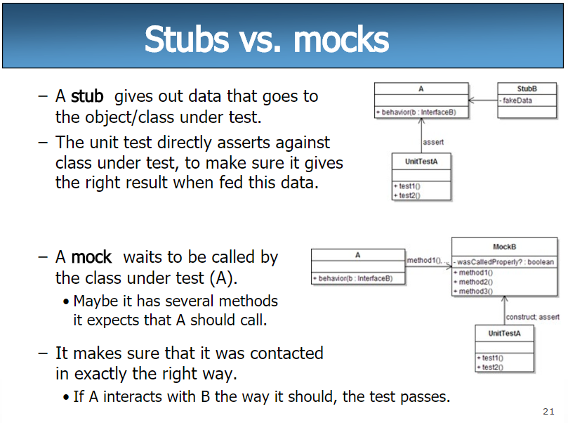

## Table of Contents

## What is a stub in programming?

A stub in programming is a small piece of code that acts as a placeholder for a function or method that hasn't been fully implemented yet. It's like a temporary stand-in that allows developers to test and build other parts of a program without having to wait for the entire function to be completed. For example, if you're working on a big project, you might use stubs to represent parts of the code that you or someone else will finish later.

Stubs are really helpful during the development process. They let you see how different parts of your program will work together, even if some parts aren't finished. By using stubs, you can keep working on other sections of your code and make sure everything connects properly. Once the actual function is ready, you can replace the stub with the real code, and your program will be complete.

## How does a stub function in software development?

In software development, a stub is like a temporary piece of code that stands in for a function that isn't finished yet. Imagine you're building a big puzzle, but some pieces are missing. You can use stubs as placeholders for those missing pieces. This way, you can keep working on the rest of the puzzle without waiting for the missing pieces to arrive. Stubs help developers test and build other parts of the program even if some functions aren't ready.

Stubs are super useful because they let you see how different parts of your program will work together, even if some parts are still under construction. For example, if you're making a game and the scoring system isn't done, you can use a stub to represent the scoring function. This allows you to test other parts of the game, like the graphics or sound, without needing the full scoring system. Once the real function is ready, you just swap out the stub with the actual code, and your program is complete.

## Can you provide a simple example of a stub in code?

Imagine you're making a program that needs to calculate the area of a circle. You know you'll need a function for this, but you haven't written it yet. So, you create a stub for the function. In Python, it might look like this:

```python
def calculate_circle_area(radius):
    # This is a stub. The real function will be implemented later.
    return 0
```

This stub function `calculate_circle_area` takes a `radius` as an argument, but it just returns 0 for now. It's a placeholder that lets you keep working on other parts of your program. Once you're ready, you can replace the stub with the actual code to calculate the area of a circle, like this:

```python
def calculate_circle_area(radius):
    # This is the real function.
    return 3.14159 * radius * radius
```

Now your program can use the real function to calculate the area of a circle. Stubs help you build and test your program step by step, even when some parts aren't finished yet.

## What is the difference between a stub and a mock object?

A stub and a mock object are both used in software development to help with testing, but they serve different purposes. A stub is a simple placeholder for a function or method that hasn't been fully implemented yet. It's like a temporary stand-in that returns a pre-defined value or does a minimal action, allowing you to test other parts of your program without waiting for the real function to be ready. For example, if you're building a game and the scoring system isn't done, you can use a stub to represent the scoring function and keep working on other parts of the game.

On the other hand, a mock object is used to simulate the behavior of complex objects or systems during testing. Mocks are more advanced than stubs because they can track how they are used, like which methods are called and with what arguments. This helps you make sure that different parts of your program interact correctly. For instance, if you're testing a part of your program that needs to interact with a database, you can use a mock object to simulate the database's behavior without actually connecting to a real database. This way, you can test your program's logic without worrying about the actual database connection.

## In what scenarios would you use a stub?

You would use a stub when you're working on a big project and some parts of your code aren't finished yet. Imagine you're building a game and the part that saves the player's progress isn't ready. You can use a stub for the save function so you can keep working on other parts of the game, like the graphics or the sound. The stub acts like a placeholder, letting you test how everything fits together without needing the real save function to be done.

Stubs are also helpful when you're working with a team. If different people are working on different parts of the program, stubs let everyone keep moving forward. For example, if one person is working on a function that calculates scores, they can use a stub for that function while someone else works on the part that displays the scores. This way, the team can test how the score display works with a temporary score, and once the real score calculation is ready, they can swap out the stub.

## How do stubs contribute to unit testing?

Stubs help a lot with unit testing by acting as placeholders for parts of your code that aren't finished yet. When you're testing a small piece of your program, you might need other parts to work correctly. If those other parts aren't ready, you can use stubs to stand in for them. This way, you can test the small piece you're working on without waiting for the whole program to be done. Stubs let you focus on testing one part at a time, making sure it works right before moving on.

For example, imagine you're testing a function that adds numbers to a shopping cart. The function that calculates the total cost might not be ready yet. You can use a stub for the cost calculation function that just returns a simple value, like zero. This lets you test the shopping cart function without needing the real cost calculation. Once the cost calculation is done, you can replace the stub with the real function and test everything together. Stubs make it easier to test your code step by step, helping you build a better program.

## What are the best practices for creating effective stubs?

When creating stubs, it's important to keep them simple and focused on the task they're replacing. A good stub should return a value that makes sense for the function it's standing in for. For example, if you're stubbing a function that calculates a total, the stub might return zero or a fixed number. This helps you test other parts of your program without getting confused by unexpected results. Also, make sure your stub is easy to spot in your code, maybe by adding a comment that says it's a stub. This way, you and your team know it's a placeholder and not the real thing.

Another best practice is to make sure your stubs behave consistently. If you're using a stub to represent a function that might fail sometimes, like a network request, your stub should sometimes return an error to mimic real-world conditions. This helps you test how your program handles different situations. Lastly, keep your stubs up to date with any changes in the function they're replacing. If the real function's interface changes, update the stub too. This makes sure your tests keep working correctly until the real function is ready.

## How can stubs be implemented in different programming languages?

In Python, you can create a stub by defining a function with the same name and parameters as the real function you're waiting for. For example, if you need a function to calculate the area of a circle but it's not ready yet, you can write a stub like `def calculate_circle_area(radius): return 0`. This stub will return zero for any input, letting you test other parts of your program. When the real function is ready, you can replace the stub with the actual code, like `def calculate_circle_area(radius): return 3.14159 * radius * radius`.

In JavaScript, stubs work similarly. You might have a function that's supposed to fetch data from a server, but it's not done yet. You can create a stub like `function fetchData() { return Promise.resolve({ data: 'placeholder' }); }`. This stub returns a promise that resolves with some placeholder data, allowing you to test other parts of your program that depend on this data. Once the real function is ready, you can swap out the stub with the actual code that makes the server request.

In Java, you can use interfaces to create stubs. If you have an interface called `DataService` with a method `getData()`, you can create a stub class that implements this interface. The stub might look like `public class DataServiceStub implements DataService { public String getData() { return "placeholder"; } }`. This stub returns a placeholder string, letting you test other parts of your program that use the `DataService`. When the real implementation is ready, you can replace the stub with the actual class that fetches the data.

## What are the limitations or potential drawbacks of using stubs?

Using stubs can sometimes make your tests less realistic. Stubs are simple placeholders, so they might not act exactly like the real functions they're standing in for. This means your tests might pass even if there are problems that would show up with the real code. For example, if a stub always returns the same value, your tests might not catch issues that happen when the real function returns different values.

Another drawback is that stubs can make your code harder to understand. If you have a lot of stubs in your program, it can be confusing to figure out which parts are real and which are placeholders. This can be especially tricky when working in a team, where someone might not know that a function is a stub and try to use it like it's the real thing. Keeping track of stubs and making sure to replace them with real code can also take extra time and effort.

## How do stubs fit into the broader context of test-driven development (TDD)?

In test-driven development (TDD), you write tests before you write the actual code. Stubs are really helpful in this process because they let you write and run tests even when some parts of your program aren't finished yet. Imagine you're building a game and you want to test how the game saves the player's progress. You can write a test for the save function, but if the save function isn't ready, you can use a stub to stand in for it. This way, you can keep writing and running tests without waiting for the whole program to be done.

Stubs help you focus on one part of your program at a time. In TDD, you write a test, see it fail, write the code to make it pass, and then keep improving your code. Stubs let you test small pieces of your program by filling in the gaps with simple placeholders. Once you've got the real function working, you can replace the stub with the actual code and run your tests again to make sure everything still works. This step-by-step approach makes it easier to build and test your program, helping you catch and fix problems early on.

## Can you explain an advanced use case of stubs in a complex system?

Imagine you're working on a big online shopping system. This system has lots of parts, like a part that shows products, a part that handles payments, and a part that manages the shopping cart. Let's say you're trying to test the shopping cart part, but the payment system isn't ready yet. You can use a stub to stand in for the payment system. The stub might just return a message saying the payment was successful, even though the real payment system isn't done. This way, you can test how the shopping cart works with the payment system without waiting for the whole thing to be finished.

In this complex system, stubs help you test different parts without needing everything to be ready. For example, if you're testing how the system handles orders, you might need to check what happens when a payment fails. You can create a stub for the payment system that sometimes returns a failure message. This lets you see how the rest of the system reacts to a failed payment, even though the real payment system isn't there yet. Using stubs like this helps you build and test your big online shopping system piece by piece, making sure everything works together smoothly when it's all done.

## What are some tools or frameworks that support stubbing in software development?

In software development, there are many tools and frameworks that help with stubbing. For example, in Python, you can use the `unittest.mock` module, which is part of the standard library. This module lets you create mock objects and stubs easily. It's really helpful for testing parts of your program without needing the real functions to be finished. Another tool is `pytest`, which is a popular testing framework that works well with `unittest.mock` and makes it easy to write and run tests with stubs.

In JavaScript, you might use a tool like `Sinon.js`. This library is great for creating stubs and mocks when you're testing your code. It works well with other testing frameworks like `Jest` or `Mocha`, making it easier to test how different parts of your program work together. Sinon.js can help you simulate the behavior of functions that aren't ready yet, so you can keep testing and building your program.

## References & Further Reading

[1]: ["Advances in Financial Machine Learning"](https://www.amazon.com/Advances-Financial-Machine-Learning-Marcos/dp/1119482089) by Marcos Lopez de Prado

[2]: ["Quantitative Trading: How to Build Your Own Algorithmic Trading Business"](https://www.amazon.com/Quantitative-Trading-Build-Algorithmic-Business/dp/1119800064) by Ernest P. Chan

[3]: ["Machine Learning for Algorithmic Trading"](https://github.com/stefan-jansen/machine-learning-for-trading) by Stefan Jansen

[4]: ["Evidence-Based Technical Analysis: Applying the Scientific Method and Statistical Inference to Trading Signals"](https://www.amazon.com/Evidence-Based-Technical-Analysis-Scientific-Statistical/dp/0470008741) by David Aronson

[5]: Padró, L. "Component-Based Design for Algorithmic Trading Systems." [Journal of Computational Finance](https://www.academia.edu/1231341/Complexity_and_Risk_in_IS_Projects_A_System_Dynamics_Approach), 2020.

[6]: ["Algorithmic Trading & DMA: An introduction to direct access trading strategies"](https://www.amazon.com/Algorithmic-Trading-DMA-introduction-strategies/dp/0956399207) by Barry Johnson