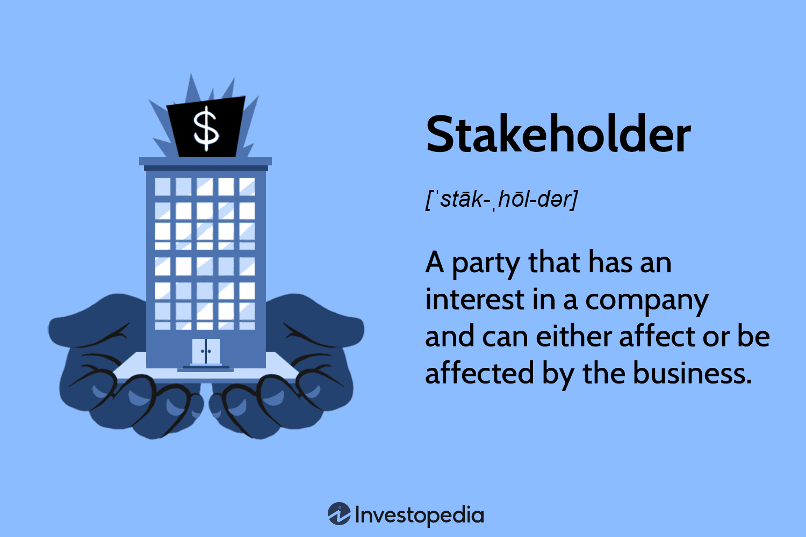

In the ever-evolving world of business and finance, terminology plays a crucial role in understanding the ecosystem. Terms such as 'stuckholder' and 'stakeholder' are often used interchangeably but hold distinct meanings, particularly when viewed through the lens of business operations and algorithmic trading. 'Stuckholder' predominantly refers to investors unable to liquidate their stock due to constraints like trading suspensions or regulatory hurdles, thus affecting short-term liquidity and trading strategies. On the other hand, 'stakeholder' is a broader term, encompassing any individual or group with an interest or stake in a company's activities, influencing long-term strategies through roles defined by financial, social, or ethical interests.

This article aims to clarify these terms, exploring their implications in a business context while investigating their relevance and intersections within algorithmic trading. Businesses today are intertwined with an array of stakeholders, both internal, like employees and management, and external, such as regulators and communities. Understanding these dynamics is pivotal for aligning strategic goals with societal expectations and ensuring sustainable practices.

Algorithmic trading, characterized by its use of technology and regulatory frameworks, presents unique challenges and opportunities in stakeholder engagement. The interplay between technological advancements and stakeholder roles can significantly impact trading strategies and market performance.

By the end of this article, readers will gain a comprehensive understanding of how 'stuckholders' and 'stakeholders' are applicable in the modern business environment and their influence on algorithmic trading strategies. This understanding is crucial for developing informed, proactive strategies that address stakeholder concerns while optimizing operational success and market competitiveness.

## Table of Contents

## Defining 'Stuckholder' and 'Stakeholder'

The term 'stuckholder' is a niche concept in the stock markets, identifying a specific group of investors trapped in a position due to certain market conditions, such as trading suspensions or regulatory measures. These circumstances prevent the investor from selling a security, resulting in their investment being essentially stuck. This scenario can occur in situations where stock exchanges halt trading of a security due to extreme [volatility](/wiki/volatility-trading-strategies) or other regulatory interventions. Such stifling conditions can severely impact trading liquidity and the ability to execute timely investment strategies. For example, when a regulatory body enforces a trading suspension due to investigations or compliance breaches, investors holding that particular stock become stuckholders, unable to react to market developments through selling.

Conversely, the concept of a 'stakeholder' is broader and more integrative, encompassing any individual or group impacted by or having an interest in a company's actions. This includes a wide array of parties such as employees, customers, investors, suppliers, communities, and even regulatory entities. Unlike stuckholders, stakeholders engage with the firm on various dimensions—financial, operational, social, and ethical. Stakeholders play pivotal roles in shaping corporate governance, influencing strategic decisions, emphasizing corporate social responsibility, and supporting sustainable practices.

While stuckholders represent a subset of stakeholders with their temporary predicament, stakeholders in general are crucial for long-term strategic planning. They influence policy-making and guide ethical standards and business conduct. Understanding the roles of these stakeholders is key to aligning corporate strategies with broader societal and environmental objectives, thereby strengthening a firm's overall governance and responsibility ethos. In any strategy, identifying both stuckholders and stakeholders is pivotal to addressing immediate challenges and aligning with long-term organizational objectives.

## Roles of Stakeholders in Business

Stakeholders are crucial to a business's ecosystem, categorized mainly into internal and external groups, each holding distinct interactions and interests in relation to the company. Internal stakeholders are comprised of employees, shareholders, and management. Employees are instrumental in operational execution, product development, and service delivery, directly impacting the quality and efficiency of business outcomes. Shareholders, as investors in the company, are primarily concerned with the financial performance and return on investment, influencing strategic decisions through voting rights and board interactions. Management acts as a linchpin, ensuring alignment between the company's strategic goals and the operational tasks necessary to achieve them.

External stakeholders, on the other hand, encompass customers, suppliers, creditors, regulators, and communities. Customers are pivotal to a business's profitability; their feedback and preferences drive product innovation and market strategy. Suppliers determine a company's input quality and cost structure, necessitating robust relationship management to ensure supply chain continuity and efficiency. Creditors provide the necessary capital for expansion and operational funding, requiring businesses to maintain strong financial health and transparent reporting practices.

Regulators oversee compliance and legal governance, ensuring that company practices align with industry standards and ethical norms, thereby preventing legal liabilities. Communities are increasingly seen as key stakeholders, as businesses must consider their local and global social and environmental impact to foster sustainable operations.

Understanding stakeholder roles and interests enables companies to synchronize their strategic objectives with broader societal and environmental aspirations. Stakeholder analysis is a valuable tool in discerning these roles, allowing for informed business strategy development that enhances operational effectiveness and upholds reputational integrity. By assessing stakeholder influence and interest, businesses can prioritize engagement efforts and allocate resources efficiently, ensuring robust stakeholder relationships and long-term success.

## Stakeholders in Algorithmic Trading

In [algorithmic trading](/wiki/algorithmic-trading), a diverse range of stakeholders interact to form a dynamic and multifaceted ecosystem. Institutional investors, technology providers, regulatory bodies, and individual traders each play distinct roles that contribute to the industry's evolution.

Institutional investors, such as hedge funds and mutual funds, are major players in algorithmic trading. They leverage substantial financial and technological resources to develop and implement sophisticated trading strategies. By utilizing complex algorithms, these stakeholders can execute trades at high speeds and volumes, thereby optimizing their investment strategies. The use of algorithms allows them to analyze large datasets, identify market trends, and execute decisions with minimal human intervention. This capability improves their efficiency and effectiveness in achieving desired financial outcomes.

Technology providers are pivotal in the development and deployment of tools and platforms that enable algorithmic trading. They offer the software, hardware, and infrastructure required for executing and managing trades. Their innovations drive advancements in trading technologies, such as low-latency connectivity, data analytics, and [artificial intelligence](/wiki/ai-artificial-intelligence), which in turn enhance the performance and capabilities of trading systems. By continually improving these technologies, they ensure that traders remain competitive in an ever-evolving market landscape.

Regulatory bodies serve a crucial function by establishing and enforcing rules that govern trading practices. They aim to maintain market integrity, protect investors, and prevent fraudulent activities. Organizations such as the Securities and Exchange Commission (SEC) in the United States and the Financial Conduct Authority (FCA) in the United Kingdom set the legal framework within which algorithmic trading operates. Compliance with these regulations is essential for preventing market manipulation and ensuring fair and transparent trading environments. Stakeholders in algorithmic trading must adapt their strategies and operations to align with these regulatory standards.

Individual traders, although smaller in scale compared to institutional investors, contribute to market [liquidity](/wiki/liquidity-risk-premium) and diversity. They often utilize algorithmic trading platforms to access sophisticated tools and execute trades with precision. By participating in the market, they benefit from algorithmic strategies that were once exclusive to larger financial institutions. These traders facilitate a broader distribution of resources and opportunities within the algorithmic trading ecosystem.

Effective engagement among these stakeholders is critical to navigating the challenges and opportunities presented by algorithmic trading. Collaborating across institutional and technological domains enhances risk management strategies and improves overall trading performance. For example, institutional investors working closely with technology providers can leverage cutting-edge tools to refine their algorithms, while regulatory compliance ensures their practices remain ethical and transparent.

In conclusion, stakeholders in algorithmic trading form an interconnected network that drives the industry forward. By optimizing trading strategies, advancing technological capabilities, and ensuring compliance with regulatory standards, they collectively enhance the efficiency, fairness, and sustainability of the algorithmic trading landscape.

## Challenges and Considerations

Engaging with stakeholders in algorithmic trading necessitates a nuanced approach to managing diverse interests and potential conflicts. The high-speed nature of financial markets requires traders to address several challenges effectively to ensure successful stakeholder engagement.

One of the foremost challenges is regulatory compliance. With rapidly changing legislations worldwide, traders must keep pace with evolving legal requirements to avoid non-compliance risks. This necessitates a robust understanding of local and international trading laws and continuous adaptation to new regulatory standards. For instance, algorithmic traders in the EU must comply with the Markets in Financial Instruments Directive II (MiFID II), which mandates transparency and fairness in trading practices (European Securities and Markets Authority, 2023).

Technological integrity is another critical aspect. Traders must maintain secure and reliable systems to protect against cyber threats that can compromise trading algorithms and sensitive financial data. Integrating advanced cybersecurity measures and regular system audits can fortify technological infrastructures. These efforts can be complemented by implementing algorithmic risk controls to detect and neutralize erroneous trading activities swiftly.

Managing stakeholder expectations is a multifaceted challenge that involves balancing the diverse concerns of institutional investors, regulatory bodies, and individual traders. Transparency in communication and decision-making processes can mitigate stakeholder concerns and build trust. Regular reporting on trading performance and strategic updates can demonstrate alignment with stakeholder interests and foster long-term loyalty.

To address these challenges, traders can employ proactive strategies that leverage stakeholder feedback and adaptive governance. Engaging with stakeholders through structured feedback mechanisms allows traders to gather valuable insights and adapt their strategies accordingly. For example, using customer relationship management (CRM) software can help traders track stakeholder interactions and actions effectively.

Adaptive governance models that incorporate ethical trading practices and technological innovation are crucial for achieving sustainable success in algorithmic trading. These models emphasize continuous learning and flexibility, enabling traders to respond adeptly to market shifts and stakeholder demands.

By prioritizing these challenges and implementing proactive solutions, traders can align their operations with stakeholder expectations, ensure regulatory compliance, and maintain the technological integrity necessary for enduring success in the fast-paced world of algorithmic trading.

## Conclusion

While the terms 'stuckholder' and 'stakeholder' hold distinct meanings, their implications are crucial in shaping business strategies and algorithmic trading frameworks. Understanding these differences allows businesses to strategically navigate both short-term trading challenges and long-term strategic goals.

Businesses must leverage a comprehensive understanding of stakeholder roles to build relationships that enhance both operational success and societal impact. This involves recognizing stakeholder needs and contributions, which significantly affect decision-making processes, policy development, and corporate governance. For instance, aligning business practices with the expectations of both internal and external stakeholders can lead to enhanced reputation, customer loyalty, and regulatory compliance.

Algorithmic trading systems can vastly benefit from stakeholder insights by aligning trading strategies with existing regulatory frameworks and emerging market trends. Stakeholders such as regulatory bodies enforce compliance and fairness, while technology providers offer cutting-edge innovations that drive efficient trading systems. Traders adopting algorithmic strategies must work collaboratively with these stakeholders to understand market dynamics, manage risks, and maintain technological integrity.

Effective stakeholder management not only optimizes trading outcomes but also ensures sustainability within the business environment. This can be achieved through proactive engagement and feedback mechanisms that address stakeholder concerns and adapt to market changes. Building trust and transparency with stakeholders can mitigate conflicts and foster cooperative efforts towards mutual goals.

The future of successful business operations and trading strategies lies in the robust management of stakeholder relationships and the ethical deployment of advanced trading technologies. By prioritizing stakeholder engagement and adopting socially responsible practices, companies can navigate complex trading environments and sustain competitive advantages in a rapidly changing landscape.

## References & Further Reading

[1]: Bergstra, J., Bardenet, R., Bengio, Y., & Kégl, B. (2011). ["Algorithms for Hyper-Parameter Optimization."](https://dl.acm.org/doi/10.5555/2986459.2986743) Advances in Neural Information Processing Systems 24.

[2]: ["Advances in Financial Machine Learning"](https://www.amazon.com/Advances-Financial-Machine-Learning-Marcos/dp/1119482089) by Marcos Lopez de Prado

[3]: ["Evidence-Based Technical Analysis: Applying the Scientific Method and Statistical Inference to Trading Signals"](https://www.amazon.com/Evidence-Based-Technical-Analysis-Scientific-Statistical/dp/0470008741) by David Aronson

[4]: ["Machine Learning for Algorithmic Trading"](https://github.com/stefan-jansen/machine-learning-for-trading) by Stefan Jansen

[5]: ["Quantitative Trading: How to Build Your Own Algorithmic Trading Business"](https://www.amazon.com/Quantitative-Trading-Build-Algorithmic-Business/dp/1119800064) by Ernest P. Chan

[6]: European Securities and Markets Authority. (2023). ["Markets in Financial Instruments Directive II (MiFID II)."](https://www.esma.europa.eu/press-news/esma-news/esma-publishes-analysis-evolution-eea-share-market-structure-application-mifid)

[7]: Securities and Exchange Commission. ["Algorithmic Trading: Risks and Opportunities."](https://blog.counselstack.com/algorithmic-trading-regulations-compliance-risk-controls/) 

[8]: Financial Conduct Authority. ["Algorithmic Trading Compliance in the UK."](https://www.fca.org.uk/publications/multi-firm-reviews/algorithmic-trading-compliance-wholesale-markets)