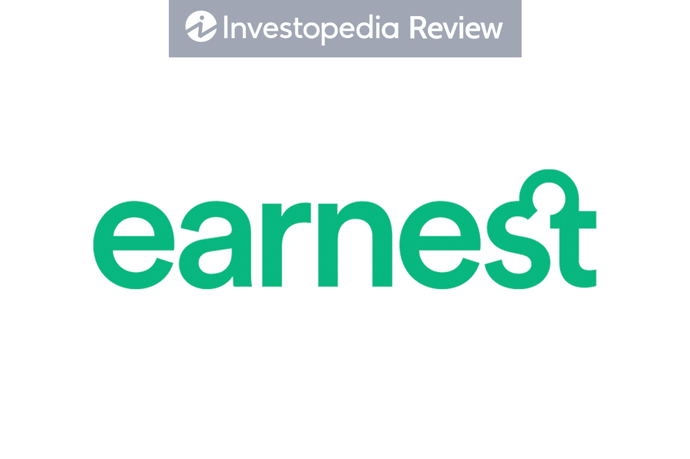

Studying abroad presents students with a unique opportunity to broaden their horizons and deepen their educational experience. This transformative journey allows individuals to immerse themselves in diverse cultures, acquire new languages, and develop skills that are crucial in today's interconnected world. Central to the journey is the necessity of obtaining a student visa. This requirement varies from country to country, each having specific stipulations and protocols to ensure a lawful stay for educational purposes. Navigating this process can be intricate and necessitates a thorough understanding of the legal prerequisites involved in securing a student visa.

In recent years, there has been a growing interest in integrating cutting-edge programs, such as algorithmic trading courses, into the overseas education experience. These courses offer students the opportunity to engage with advanced financial technology, providing a robust foundation for future careers in global markets. As such, understanding the student visa process becomes even more critical for students aiming to join such specialized programs at international institutions. This article aims to elucidate the steps involved in applying for a student visa, highlight vital considerations, and explore how algorithmic trading courses have become a valuable component of studying abroad. Grasping these elements is essential for students aspiring to achieve a successful transition into their international academic endeavors.



## Table of Contents

## Understanding Student Visas

Student visas are essential legal documents that allow individuals to reside in a foreign country for the sole purpose of pursuing their education. Primarily classified as non-immigrant visas, these permits ensure that the holder is in the country temporarily, solely for academic pursuits, and must comply with regulations to maintain their status.

To be eligible for a student visa, applicants are generally required to fulfill several key conditions. First and foremost, there must be a formal acceptance from an accredited educational institution. This acceptance is often documented in the form of an admission letter, which serves as the initial proof that the applicant intends to study in the host country. Many countries mandate that this institution be recognized by their government or educational regulatory bodies.

Another critical requirement is the demonstration of financial support. Applicants must prove they have sufficient funds to cover tuition fees and living expenses throughout their course of study. This is typically shown through bank statements, sponsorship letters, or scholarships. The evidence of financial backing assures the host country that the student will not require employment or public funds for sustenance.

In addition to financial and academic prerequisites, health screening is often a component of the visa application process. Many countries require proof of vaccinations or a health certificate to ensure that the applicant is in good health and poses no public health risk. This requirement aims to prevent the spread of contagious diseases and ensure the applicant's capability to handle the physical demands of university life abroad.

By meeting these requirements, students can secure their visas and begin their educational journey in a foreign nation, experiencing new cultures and broadening their academic horizons.

## Application Process for Student Visas

The application process for student visas is an integral step for international students aiming to pursue education abroad. It can be intricate and mandates meticulous attention to each requirement. Initially, students must secure admission from a recognized academic institution in the host country. This generally involves submitting an application to the desired university or college, after which an offer of admission is issued if the application is successful. This document is crucial as it serves as proof of intended study, which is necessary for visa application.

Subsequently, financial documents must be prepared and submitted to demonstrate the student's ability to support themselves financially during their stay. This may include bank statements, scholarship letters, or financial sponsorship proofs. The goal is to ensure that the applicant has sufficient funds to cover tuition fees, living expenses, and other miscellaneous costs without resorting to unauthorized employment.

Another critical component of the application process is the visa interview, which some countries require. During the interview, applicants may be asked about their study plans, financial status, and future intentions post-study. Answering honestly and confidently is advised, as this is an opportunity to reinforce the purpose of the stay.

It is imperative for students to become well-acquainted with the specific visa requirements of their destination country well before their intended departure. Each country has its regulations and timelines, which can differ significantly. Aspects such as processing times, documentation needs, and health insurance requirements can vary. Therefore, starting the visa application process well in advance is recommended to avoid last-minute discrepancies or delays.

Being conversant with the host country's regulations, maintaining organized documentation, and adhering to deadlines significantly increase the likelihood of a successful visa application, thereby enabling a smooth transition into the educational environment abroad.

## Advantages of Studying Abroad

Studying abroad offers a myriad of opportunities for students to expand their educational and personal development. One significant advantage is the access to unique educational programs that may not be available in the student's home country. These programs often incorporate cutting-edge research, innovative teaching methods, and specialized courses that cater to specific interests and career aspirations. For instance, a student interested in finance might find [algorithmic trading](/wiki/algorithmic-trading) courses in institutions abroad that provide comprehensive insights into the use of mathematical models and computational algorithms for systematic trading.

Furthermore, studying in a foreign country facilitates the development of language skills. Immersion in a new linguistic environment encourages students to learn and practice a foreign language daily, enhancing their proficiency and communication capabilities. This skill is invaluable in the globalized job market, where multilingualism can be a distinct advantage.

Cultural exposure is another significant benefit. Living in a different country allows students to experience diverse traditions, lifestyles, and perspectives, which fosters cultural awareness and sensitivity. This experience broadens their worldview, making them more adaptable and open-minded, qualities that are highly valued by employers worldwide.

Additionally, studying abroad broadens both personal and professional horizons by offering new perspectives and networking opportunities. Students often interact with a diverse peer group, faculty members, and professionals, expanding their social and professional network across international borders. These connections can lead to collaboration, mentorship, and career opportunities, enriching their professional journey.

Courses like algorithmic trading not only enhance technical skills but also provide a competitive edge in the global financial markets. Such courses typically require students to have a strong foundation in mathematics and computer science, as they involve developing algorithms to automate trading strategies. Here is a simple Python example of a basic moving average crossover strategy, a typical algorithmic trading approach:

```python
import numpy as np

def moving_average(data, window_size):
    return np.convolve(data, np.ones(window_size), 'valid') / window_size

def trading_strategy(prices, short_window, long_window):
    signals = np.zeros(len(prices))
    short_avg = moving_average(prices, short_window)
    long_avg = moving_average(prices, long_window)

    # Generate signals
    for i in range(1, len(short_avg)):
        if short_avg[i-1] < long_avg[i-1] and short_avg[i] > long_avg[i]:
            signals[i + long_window - 1] = 1  # Buy signal
        elif short_avg[i-1] > long_avg[i-1] and short_avg[i] < long_avg[i]:
            signals[i + long_window - 1] = -1  # Sell signal

    return signals

# Example usage with dummy prices
prices = np.random.normal(100, 1, 100)  # Simulated prices
signals = trading_strategy(prices, short_window=5, long_window=20)
```

In summary, the advantages of studying abroad are extensive, providing students with an enriched educational experience and a competitive edge in their future careers.

## Algorithmic Trading Courses for International Students

Algorithmic trading involves the utilization of mathematical models and computational algorithms to automate the process of trading in financial markets. These courses integrate finance, mathematics, and computer science, providing students with the skills to design, test, and execute trading strategies at a [high frequency](/wiki/high-frequency-trading) and scale. Key components of algorithmic trading include statistical [arbitrage](/wiki/arbitrage), [backtesting](/wiki/backtesting) strategies, and high-frequency trading.

International students have the opportunity to study algorithmic trading at prestigious institutions worldwide. These institutions offer programs that provide both theoretical knowledge and practical experience through state-of-the-art trading labs and market simulators. For example, institutions might offer courses that cover:

1. **Quantitative Analysis**: Students learn statistical tools and techniques to analyze market trends and price movements. Familiarity with concepts like mean reversion, cointegration, and time series analysis is crucial.

2. **Programming and Software Development**: Proficiency in programming languages such as Python, R, or C++ is essential for implementing trading algorithms. Students are often involved in projects that require coding complex trading strategies, using libraries like NumPy, pandas, or SciPy in Python.

   ```python
   import numpy as np
   import pandas as pd

   # Example of a simple moving average crossover strategy
   def moving_average_strategy(prices, short_window=40, long_window=100):
       short_mavg = prices.rolling(window=short_window, min_periods=1).mean()
       long_mavg = prices.rolling(window=long_window, min_periods=1).mean()

       # Create signals
       signals = pd.DataFrame(index=prices.index)
       signals['signal'] = 0.0
       signals['short_mavg'] = short_mavg
       signals['long_mavg'] = long_mavg

       signals['signal'][short_window:] = np.where(signals['short_mavg'][short_window:] > signals['long_mavg'][short_window:], 1.0, 0.0)
       signals['positions'] = signals['signal'].diff()

       return signals
   ```

3. **Risk Management**: Understanding and managing risks is a fundamental aspect of algorithmic trading. Courses often cover Value at Risk (VaR), stress testing, and portfolio diversification techniques.

4. **High-Performance Computing (HPC)**: Many algorithmic trading systems require low latency and high-speed data processing. Students might engage with subjects like distributed computing and parallel processing to manage large datasets and execute trades efficiently.

5. **Market Microstructure**: This branch of finance studies how market mechanisms, participant behavior, and regulatory policies affect trading activity and price formation. Students gain insight into order types, price impact, and transaction cost analysis.

These courses typically require a strong foundation in mathematics, [statistics](/wiki/bayesian-statistics), and computer science. Familiarity with calculus, linear algebra, probability, and data structures is essential for success in these programs. Upon graduation, students find themselves well-equipped to enter finance-related fields, such as quantitative analysis, trading, and risk management, where they can leverage their skills to contribute to strategic decision-making and innovation in trading technologies.

## Financial Considerations and Scholarships

Studying abroad represents a significant financial commitment, and prospective international students must navigate various costs such as tuition, living expenses, visa application fees, and health insurance. Despite these potential financial challenges, numerous scholarships and financial aid options are available to help ease the burden.

Scholarships for international students vary widely depending on the country, institution, and the student's field of study. Merit-based scholarships are awarded based on academic achievements or other exceptional talents, while need-based scholarships are given to students who demonstrate financial need. Additionally, some countries and universities offer scholarships specifically designed to attract international talent, which can cover partial or full tuition fees and sometimes even living expenses.

To increase the chances of obtaining financial aid, students should begin researching and applying for scholarships well in advance. Many scholarship applications require a comprehensive overview of the student's academic and personal achievements, as well as financial circumstances. It is critical for students to prepare these materials thoroughly and provide accurate documentation to support their applications.

In addition to scholarships, students should consider the overall budget for their study abroad experience. This includes not only tuition but also visa application fees, which can vary widely depending on the host country. Living expenses, such as accommodation, food, transportation, and personal expenses, should also be factored into the budget. Health insurance is another crucial component, as many countries require students to have adequate insurance coverage as a condition of their visa.

To effectively manage these financial considerations, students can utilize financial planning tools and software to create detailed budgets. For example, a simple Python script could help calculate total estimated expenses:

```python
def calculate_study_abroad_budget(tuition, visa_fee, monthly_living_expenses, months, health_insurance):
    total_living_expenses = monthly_living_expenses * months
    total_budget = tuition + visa_fee + total_living_expenses + health_insurance
    return total_budget

tuition = 15000  # Example tuition in USD
visa_fee = 500  # Example visa application fee in USD
monthly_living_expenses = 1000  # Example monthly living expenses in USD
months = 12  # Duration of study in months
health_insurance = 1200  # Example health insurance cost in USD

total_budget = calculate_study_abroad_budget(tuition, visa_fee, monthly_living_expenses, months, health_insurance)
print(f"Total estimated study abroad budget: ${total_budget}")
```

By proactively addressing these financial considerations and seeking out available scholarships, students can alleviate some of the financial pressures associated with studying abroad, allowing them to focus on maximizing their educational experience.

## The Impact of Study Abroad on International Careers

Studying in a foreign country can significantly enhance a student's career prospects by enriching their resumes with experiences of adaptability, independence, and cultural awareness. This exposure to diverse cultures and educational systems provides students with a global perspective, which is highly valued by international employers in today's interconnected world. Employers often seek candidates who can demonstrate flexibility and a willingness to learn from different environments, traits that are naturally developed during a study abroad program.

In addition to cultural and personal growth, studying internationally allows students to acquire skills that are critical in the global job market. One such skill set can be developed through specialization in areas like algorithmic trading. Algorithmic trading has gained prominence in finance due to its ability to process complex data and execute trades at speeds and frequencies that are not possible for human traders. This field relies heavily on mathematics, statistics, and computer science, making it an attractive option for students interested in the intersection of these disciplines.

Algorithmic trading courses offered by prestigious institutions abroad provide students with practical knowledge and hands-on experience. By integrating sophisticated quantitative models and computational strategies, students gain a comprehensive understanding of how markets operate. Furthermore, these programs often utilize languages like Python for algorithm development. Python, with libraries such as NumPy, pandas, and scikit-learn, enables students to create models and algorithms efficiently for backtesting and execution.

For instance, consider a basic mean reversion algorithm implemented in Python:

```python
import numpy as np
import pandas as pd
import matplotlib.pyplot as plt

# Simulated stock prices
np.random.seed(42)
stock_prices = pd.Series(np.random.normal(1, 0.05, 1000)).cumprod()

# Calculate moving averages
short_window = 40
long_window = 100

signals = pd.DataFrame(index=stock_prices.index)
signals['price'] = stock_prices
signals['short_mavg'] = stock_prices.rolling(window=short_window).mean()
signals['long_mavg'] = stock_prices.rolling(window=long_window).mean()

# Generate buy/sell signals
signals['signal'] = 0.0
signals['signal'][short_window:] = np.where(signals['short_mavg'][short_window:] > signals['long_mavg'][short_window:], 1.0, 0.0)
signals['positions'] = signals['signal'].diff()

# Plot stock prices, short and long moving averages, and buy/sell signals
plt.figure(figsize=(12, 6))
plt.plot(signals['price'], label='Price')
plt.plot(signals['short_mavg'], label='40-day MA', alpha=0.7)
plt.plot(signals['long_mavg'], label='100-day MA', alpha=0.7)

# Plot the buy signals
plt.plot(signals.loc[signals.positions == 1].index, signals.short_mavg[signals.positions == 1],
         '^', markersize=10, color='g', lw=0, label='Buy Signal')

# Plot the sell signals
plt.plot(signals.loc[signals.positions == -1].index, signals.short_mavg[signals.positions == -1],
         'v', markersize=10, color='r', lw=0, label='Sell Signal')

plt.title('Mean Reversion Strategy')
plt.xlabel('Days')
plt.ylabel('Price')
plt.legend()
plt.show()
```

This simple algorithm demonstrates a basic strategy where trades are executed based on the crossover of short-term and long-term moving averages. By mastering such techniques, students can greatly enhance their employability in finance-related fields, allowing them to make significant contributions to global finance sectors.

In conclusion, studying abroad not only enriches personal attributes but also imparts highly sought-after skills. Students specializing in dynamic fields such as algorithmic trading are well-positioned to leverage these skills in the global job market, potentially driving innovation and efficiency in international financial markets.

## Conclusion

Applying for a student visa is a critical step for students wishing to study abroad, involving careful planning and adherence to specific requirements. This process is fundamental as it enables students to legally reside and study in a foreign country, laying the groundwork for an immersive educational experience. The meticulous preparation required in terms of gathering requisite documents and understanding the visa process cannot be understated. Each country has distinct visa regulations, and students must ensure compliance with these to avoid any legal or educational disruptions.

The benefits of studying abroad are wide-ranging, offering students exposure to innovative courses such as algorithmic trading. Participating in such programs can significantly enrich a student’s academic and professional outlook. Algorithmic trading courses, often offered by esteemed institutions, equip students with cutting-edge skills in mathematics, computer science, and financial markets, thus preparing them for competitive roles in today's globalized economy. The chance to be part of such advanced educational paradigms is a key advantage of studying overseas.

With adequate preparation and understanding of the visa process, students can embark on a successful educational journey across borders. Taking advantage of scholarship opportunities and planning for financial logistics are essential components of this preparation. Successfully navigating these elements not only simplifies the transition into studying abroad but firmly positions students for future success, underscored by international exposure and the mastery of specialized knowledge such as algorithmic trading.

## References & Further Reading

[1]: Bergstra, J., Bardenet, R., Bengio, Y., & Kégl, B. (2011). ["Algorithms for Hyper-Parameter Optimization."](https://dl.acm.org/doi/10.5555/2986459.2986743) Advances in Neural Information Processing Systems 24.

[2]: ["Advances in Financial Machine Learning"](https://www.amazon.com/Advances-Financial-Machine-Learning-Marcos/dp/1119482089) by Marcos Lopez de Prado

[3]: ["Evidence-Based Technical Analysis: Applying the Scientific Method and Statistical Inference to Trading Signals"](https://www.amazon.com/Evidence-Based-Technical-Analysis-Scientific-Statistical/dp/0470008741) by David Aronson

[4]: ["Machine Learning for Algorithmic Trading"](https://github.com/stefan-jansen/machine-learning-for-trading) by Stefan Jansen

[5]: ["Quantitative Trading: How to Build Your Own Algorithmic Trading Business"](https://www.amazon.com/Quantitative-Trading-Build-Algorithmic-Business/dp/1119800064) by Ernest P. Chan