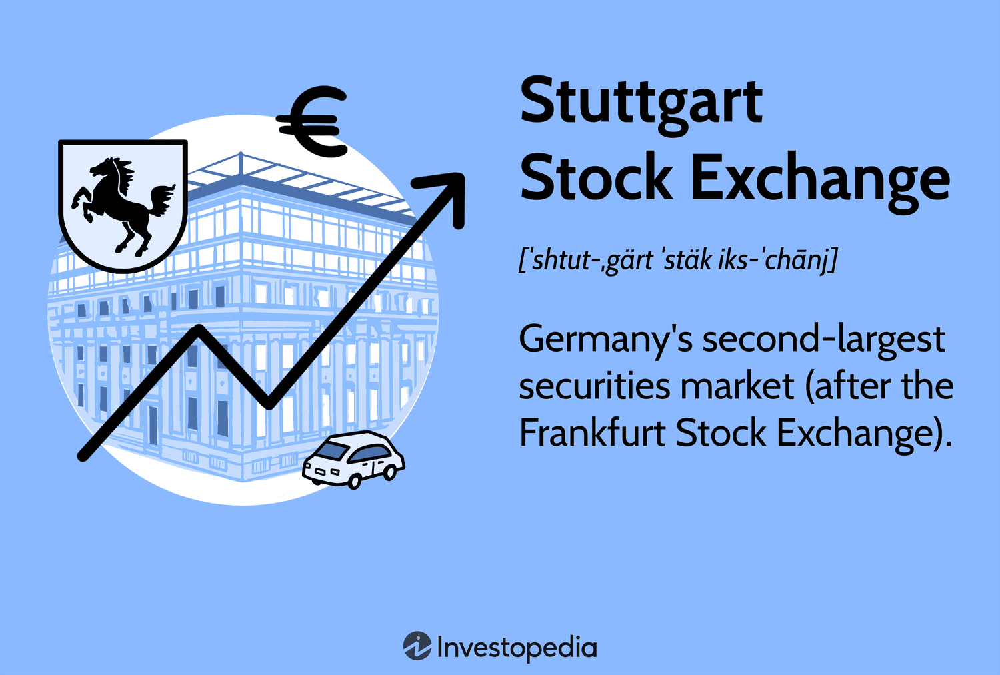

The Stuttgart Stock Exchange (STU), established in 1861, has grown to become a prominent institution in the German and European financial markets. As Germany's second-largest securities exchange, it plays a vital role in trading equities, bonds, derivatives, and digital assets. The STU's focus on innovation and its commitment to providing efficient trading solutions have made it a key player in the financial sector.

Algorithmic trading, often referred to as algo trading, has revolutionized financial exchanges worldwide. By utilizing complex mathematical models and computer algorithms, traders can execute orders at speeds unimaginable in traditional manual trading. These automated systems allow for increased efficiency, reduced transaction costs, and improved trading performance. The impact of algorithmic trading on modern financial exchanges is profound; it has not only transformed how trades are executed but has also influenced market dynamics and liquidity.



This article aims to explore the convergence of the Stuttgart Stock Exchange and algorithmic trading, highlighting the opportunities and challenges this intersection presents. By examining STU's initiatives in embracing algo trading, we aim to provide insights into how this institution is adapting to the ever-evolving landscape of financial technology.

In today's financial climate, marked by rapid technological advancements and increasing market complexity, understanding the role of algorithmic trading and its integration with traditional exchanges like the STU is crucial. This intersection represents not only the future of trading but also the broader transformation of financial interactions in the digital age. As such, the exploration of this topic is of paramount importance for market participants, stakeholders, and policymakers alike.

## Table of Contents

## History and Importance of Stuttgart Stock Exchange

The Stuttgart Stock Exchange (STU), established in 1861, stands as a pivotal institution in both the German and European financial landscapes. Its inception was fueled by the burgeoning industrial activity in the region, which demanded a structured and efficient marketplace for the trading of securities. As industries in Stuttgart grew, the stock exchange facilitated capital fundraising which played a crucial role in the economic development of the area. This foundational period set the stage for STU's enduring significance in the financial markets.

Throughout its history, the Stuttgart Stock Exchange has experienced substantial growth, evolving to become Germany's second-largest securities market. This accomplishment is largely attributed to its strategic initiatives and adaptability in the face of changing market demands and technological advancements. By embracing electronic trading as early as the late 20th century, STU marked a significant transition from traditional floor trading to more efficient and reliable digital trading platforms. This move not only enhanced the speed and accuracy of trades but also made the exchange more accessible to a broader range of investors.

One of the key milestones in STU's development was the introduction of the Börse Stuttgart Digital Exchange (BSDEX), a cutting-edge digital platform designed to cater to the increasing demand for [cryptocurrency](/wiki/cryptocurrency) and blockchain-based assets. BSDEX represents STU's commitment to innovation and its proactive approach to integrating emerging technologies into its operations. This platform provides a secure and transparent environment for trading digital assets, reinforcing STU's position as a leader in the digital trading space.

The historical growth and importance of the Stuttgart Stock Exchange underscore its role as a central hub for securities trading in Germany. Its dynamic evolution, marked by the adoption of electronic and digital trading platforms, highlights its adaptability and foresight in aligning with global financial trends. As a result, STU continues to be a critical platform for investors and companies seeking to engage in efficient and effective financial transactions.

## Understanding Algorithmic Trading

Algorithmic trading is a method of executing orders using automated pre-programmed trading instructions. These instructions account for variables such as timing, price, and [volume](/wiki/volume-trading-strategy), aiming to maximize efficiency and profitability while minimizing human error. At its core, [algorithmic trading](/wiki/algorithmic-trading) leverages mathematical models and sophisticated algorithms to make trading decisions. Instead of relying on human intuition and experience, trades are executed based on precise quantitative criteria.

A significant advantage of algorithmic trading is its speed. Algorithms can analyze market conditions and execute trades much faster than human traders; they can scan multiple markets for trading opportunities in seconds. The execution speed is crucial in taking advantage of short-lived opportunities, enabling traders to capitalize on even the smallest movements in the market.

Algorithms provide a mechanism for executing orders more efficiently by breaking large orders into smaller orders and controlling the order pace through strategic decision-making. This process, known as "iceberg" orders, allows traders to hide the true size of their trades, minimizing market impact and ensuring better average pricing.

The transition from traditional to algorithmic trading can be illustrated by comparing the strategies employed in each. Traditional trading often relies on [fundamental analysis](/wiki/fundamental-analysis) and the trader's intuition. Traders manually analyze financial statements, economic indicators, and market news to make trading decisions. This approach can be subjective and is limited by the trader's ability to process information.

In contrast, algorithmic trading employs strategies based on technical analysis and quantitative models. These include statistical [arbitrage](/wiki/arbitrage), trend-following, and mean-reversion strategies. A [statistical arbitrage](/wiki/statistical-arbitrage) strategy might exploit price inefficiencies between related securities, while a trend-following strategy would capitalize on the [momentum](/wiki/momentum) in price movements.

```python
# Example of a simple moving average crossover strategy
import numpy as np
import pandas as pd

def moving_average_crossover(prices, short_window, long_window):
    signals = pd.DataFrame(index=prices.index)
    signals['price'] = prices

    # Create short simple moving average
    signals['short_mavg'] = prices.rolling(window=short_window, min_periods=1).mean()

    # Create long simple moving average
    signals['long_mavg'] = prices.rolling(window=long_window, min_periods=1).mean()

    # Create buy/sell signals
    signals['signal'] = 0
    signals['signal'][short_window:] = np.where(signals['short_mavg'][short_window:] 
                                                 > signals['long_mavg'][short_window:], 1, 0)
    # Generate trading orders
    signals['positions'] = signals['signal'].diff()

    return signals

# Example usage
# Assume 'data' is a DataFrame containing historical price data
# signals = moving_average_crossover(data['close_price'], short_window=40, long_window=100)
```

The above Python code implements a simple moving average crossover strategy. It generates buy signals when the short-term moving average crosses above the long-term moving average, indicating a possible upward trend. Sell signals are generated when the short-term average crosses below the long-term average.

By incorporating computational power and big data analytics, algorithmic trading strategies can analyze vast amounts of information in real-time, making them highly adaptive to dynamic market conditions, and providing a competitive edge over traditional methods. Thus, the appeal of algorithmic trading lies in its potential for precision and efficiency, reshaping how trades are conducted in modern markets.

## Algo Trading Platforms and Tools at STU

The Stuttgart Stock Exchange (STU) is actively evolving with digital platforms tailored for algorithmic trading, most notably the Börse Stuttgart Digital Exchange (BSDEX). BSDEX is Germany's first regulated trading venue for digital assets, offering a decentralized framework that fosters a secure and efficient trading environment. This platform allows for direct trading of cryptocurrencies paired with the Euro, exemplifying the integration of modern trading practices with traditional financial systems.

Algorithmic traders at STU benefit from a set of robust features. High-speed execution is one such salient feature, facilitated by advanced technological infrastructure that minimizes latency—a critical [factor](/wiki/factor-investing) in securing favorable trading outcomes. This speed advantage ensures trades are executed with precision, even as market conditions fluctuate.

The transparency inherent in BSDEX is another virtue, achieved through the clear dissemination of information and pricing. This clarity is achieved by using the platform's unique architecture, which supports transparent trading processes, imperative for informed decision-making and strategic planning in algorithmic trading.

For traders, the market depth and [liquidity](/wiki/liquidity-risk-premium) provided by STU are significant advantages. Liquidity ensures that large volume trades can be conducted without dramatically impacting asset prices, which is crucial for the effectiveness of algorithmic strategies such as arbitrage and trend-following. Additionally, the comprehensive price discovery process at STU provides high pricing quality that algorithmic traders leverage for optimal entry and [exit](/wiki/exit-strategy) points.

BSDEX provides a range of tools and resources vital for efficient algorithmic trading. These include APIs (Application Programming Interfaces) that enable seamless integration with traders' custom-built or third-party trading software. These interfaces allow for automated, high-frequency trading strategies that require real-time data processing and rapid order execution.

Moreover, STU prioritizes safety and reliability by operating under stringent regulatory standards. This commitment to regulation is evident in its comprehensive risk management systems and real-time monitoring solutions, which safeguard traders and bolster confidence in the platform's integrity.

By integrating cutting-edge technology with regulatory assurances, STU offers a pioneering environment conducive to algorithmic trading, allowing traders to exploit market inefficiencies and optimize their trading strategies.

## Advantages of Algo Trading on STU

The Stuttgart Stock Exchange (STU) offers a compelling environment for algorithmic trading due to its advantageous features such as liquidity, trading volume, execution certainty, pricing quality, fee transparency, and regulatory supervision under public law. These elements contribute to an optimal trading environment that benefits both individual and institutional traders.

Liquidity in markets is synonymous with the ease of executing transactions without causing drastic shifts in price. At STU, the presence of substantial liquidity ensures that trades can be executed efficiently, reducing the risk of price [volatility](/wiki/volatility-trading-strategies) that algorithmic traders often seek to minimize. High levels of trading volume further complement liquidity by providing a continuous stream of market participants, thus supporting better price discovery and tighter bid-ask spreads. These conditions favor algorithmic strategies that rely on high-frequency trading and arbitrage to capture small price differentials.

Execution certainty is another critical factor. In algorithmic trading, the speed and reliability of trade execution are crucial for maintaining the efficacy of trading algorithms. The infrastructure of STU is designed to support rapid execution, ensuring that traders have confidence in the timing and completion of their trades. This reliability allows traders to implement complex strategies with lower risk of slippage, where an order is executed at a price less favorable than expected.

STU also stands out for its high pricing quality and transparency of fees. Pricing quality refers to the accuracy and fairness of trade executions in relation to the current market prices. Algorithmic traders benefit from precise and competitive pricing, which can influence the profitability of trading algorithms. Furthermore, the exchange's transparent fee structures enable traders to calculate costs accurately, which is vital for algorithmic models that need to account for every expense to optimize net returns.

The supervision of STU under public law adds a layer of security and confidence for traders. Regulatory oversight ensures that trading activities adhere to established legal frameworks, which helps maintain market integrity and protects traders from fraudulent activities. This oversight is especially crucial for algorithmic traders who operate in a fast-paced environment where regulatory breaches can have significant repercussions. Knowing that STU is subject to stringent public law supervision allows traders to focus on refining their strategies rather than concerning themselves with potential regulatory infractions.

Overall, the Stuttgart Stock Exchange provides an exceptional platform for algorithmic trading by integrating superior market conditions with robust regulatory frameworks, fostering a secure and efficient trading ecosystem. This comprehensive environment not only enhances the effectiveness of algorithmic strategies but also supports the broader objective of maintaining a fair and orderly marketplace.

## Regulatory Environment and Security

The regulatory environment surrounding algorithmic trading at the Stuttgart Stock Exchange (STU) is a critical component in ensuring market integrity and trader confidence. Governed by stringent German financial regulations, STU implements a comprehensive framework to monitor and control algorithmic trading activities. This framework aligns with the European Markets in Financial Instruments Directive II (MiFID II), which enforces transparency, market integrity, and investor protection across EU member states.

STU ensures compliance and security in algorithmic trading through a combination of advanced surveillance systems and strict adherence to regulatory requirements. Automated systems at STU are designed to detect and prevent market abuse, such as spoofing and layering, which are practices intended to manipulate market prices or fool traders into making unsupported trade decisions. These systems rely on real-time data analysis and [machine learning](/wiki/machine-learning) techniques to identify irregular trading patterns and flag suspicious activities for further investigation.

To support a secure trading environment, STU employs robust cybersecurity measures that protect sensitive trading data from unauthorized access and cyber threats. This includes the use of encryption protocols, multi-factor authentication, and regular security audits to safeguard the trading infrastructure.

Regulatory bodies play a pivotal role in maintaining market integrity at the Stuttgart Stock Exchange. BaFin (Federal Financial Supervisory Authority), which oversees financial markets in Germany, collaborates closely with STU to ensure that all trading activities comply with national and European regulations. BaFin conducts regular audits and assessments to verify the exchange's adherence to regulatory standards and its capability to manage risks associated with algorithmic trading.

Additionally, STU is proactive in engaging with stakeholders and regulatory bodies to refine and enhance its trading framework in response to evolving market dynamics and technological advancements. This collaborative approach ensures that STU remains a secure and compliant platform for algorithmic trade execution.

In conclusion, the regulatory environment and security measures at the Stuttgart Stock Exchange are integral to supporting a fair and reliable trading ecosystem. By prioritizing compliance, implementing sophisticated surveillance technologies, and working closely with regulatory authorities, STU fosters a culture of transparency and trust in algorithmic trading.

## Future of Algo Trading at Stuttgart Stock Exchange

The future of algorithmic trading at the Stuttgart Stock Exchange (STU) is poised for significant transformation driven by emerging trends and technologies. One of the key directions is the advancement in [artificial intelligence](/wiki/ai-artificial-intelligence) (AI) and machine learning algorithms that can enhance decision-making processes. These technologies enable traders to analyze massive datasets in real-time, predict market trends, and optimize trading strategies with increased accuracy. As AI continues to evolve, we can expect further improvements in predictive models which will potentially reduce risks and increase profitability for traders at STU.

The Stuttgart Stock Exchange is also focusing on expanding its digital trading platforms, particularly through the Börse Stuttgart Digital Exchange (BSDEX). This platform is designed to meet the increasing demand for digital assets and blockchain-based products. It brings together institutional and retail investors in a secure and efficient trading environment. By integrating more sophisticated algorithmic trading tools and APIs into BSDEX, STU aims to attract a broader spectrum of traders and enhance market participation.

Moreover, the integration of distributed ledger technology, such as blockchain, is anticipated to bring about more transparent and efficient trading processes. These technologies provide immutable records of transactions, which increases trust and helps prevent market manipulation.

The development of quantum computing could also influence the future of algo trading at STU. Quantum computers have the potential to solve complex computations at unprecedented speeds, which could revolutionize risk assessment, portfolio optimization, and arbitrage opportunities.

Looking ahead, these technological advancements will likely shape the future of trading at STU by fostering an environment of innovation and competitiveness. The implementation of these technologies may lead to more refined trading strategies, reduced operational costs, and improved market efficiencies. As STU continues to adopt and integrate these emerging trends, it is expected to strengthen its position as a leading exchange in the digital era, providing enhanced services and opportunities for traders in Germany and beyond.

## Conclusion

The Stuttgart Stock Exchange (STU) stands as a critical facilitator within the algorithmic trading ecosystem, illustrating the harmonious integration of tradition and technological innovation. As Germany's second-largest securities market, STU's adoption and promotion of algorithmic trading underscore its pivotal role in modernizing financial exchanges. Algorithmic trading, characterized by the use of complex algorithms to execute trades at high speed and frequency, has revolutionized the landscape by enhancing efficiency and liquidity, thereby redefining traditional trading paradigms.

STU's commitment to embracing cutting-edge technologies like algorithmic trading positions it as a leader in the evolution of the financial markets. These technologies have not only increased the speed and accuracy of trading but have also contributed to greater market transparency and fairness. The ability to process vast amounts of data quickly has enabled traders to make more informed decisions, creating a more robust and resilient trading environment. This transformation in financial interactions advocates for a deeper integration of advanced analytics and algorithmic systems into trading strategies, which can lead to more nuanced and efficient market operations.

Embracing such new technologies is strategically important for STU. It ensures that the exchange remains competitive and attractive to global traders and investors who are increasingly relying on data-driven decision-making processes. By continuously integrating new technological advancements, STU not only enhances its operational capacity but also fortifies its position as a forward-thinking institution in the financial sector. This strategic emphasis on innovation aligns with the growing demand for digital trading solutions and reflects a broader shift in the financial industry towards a more algorithm-centric approach. As the financial landscape continues to evolve, STU's proactive adoption of algorithmic trading ensures its continued relevance and leadership in the global financial ecosystem.

## References & Further Reading

[1]: Bell, A. (2017). ["Algorithmic Trading: A Beginner's Guide to Learning the Basics and Start Algorithmic Trading."](https://blog.quantinsti.com/learn-algorithmic-trading/) CreateSpace Independent Publishing Platform.

[2]: Cartea, Á., Jaimungal, S., & Penalva, J. (2015). ["Algorithmic and High-Frequency Trading."](https://assets.cambridge.org/97811070/91146/frontmatter/9781107091146_frontmatter.pdf) Cambridge University Press.

[3]: Gomber, P., Arndt, B., Lutat, M., & Uhle, T. (2011). ["High-frequency trading."](https://papers.ssrn.com/sol3/papers.cfm?abstract_id=1858626) Business & Information Systems Engineering, 3(2), 53-66.

[4]: Harris, L. (2003). ["Trading and exchanges: Market microstructure for practitioners."](https://www.amazon.com/Trading-Exchanges-Market-Microstructure-Practitioners/dp/0195144708) Oxford University Press.

[5]: Johnson, B., & Hult, N. (2007). ["Algorithmic Trading & DMA: An Introduction to Direct Access Trading Strategies."](https://archive.org/details/algorithmictradi0000john) 4Myeloma Press.

[6]: Lo, A. W. (2016). ["Adaptive Markets: Financial Evolution at the Speed of Thought."](https://archive.org/details/adaptivemarketsf0000loan) Princeton University Press.

[7]: Mutaf, D. (2023). ["Financial Programming: Analysis and Trading Strategies for Beginners."](https://journal.esrgroups.org/jes/article/download/4288/3134/7753) Independently published.