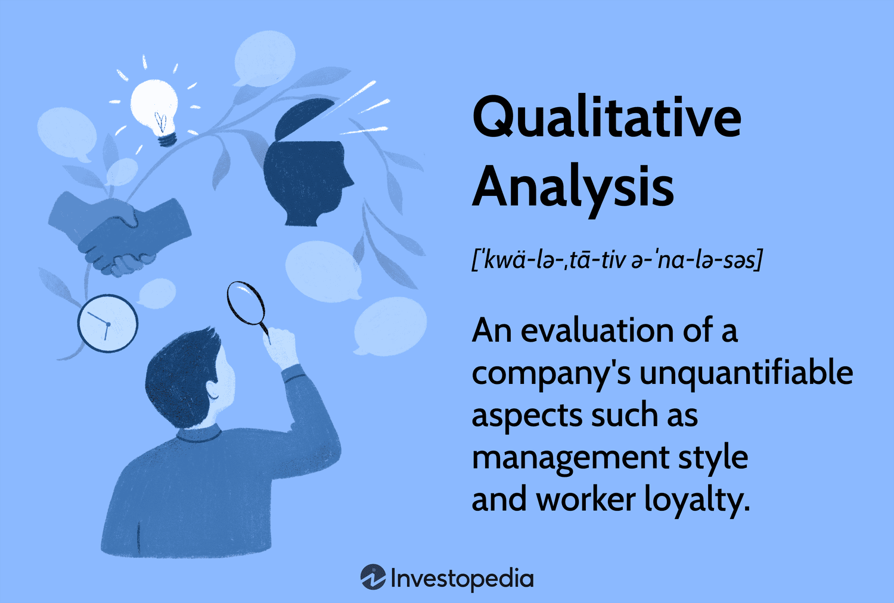

The financial world is ever-evolving, requiring investors to maintain a comprehensive understanding of various investment components to navigate it effectively. Investment strategies, style analysis, portfolio management, and algorithmic trading are pivotal elements that investors must master. Each of these components plays a distinct role in shaping financial success, yet they synergize effectively to form a cohesive strategy.

Investment strategies are the roadmap for tailoring asset allocation and managing risk. They cater to varying financial goals and risk appetites, whether aggressive, conservative, or moderate. Successful strategies rely heavily on understanding market dynamics and investor profiles, assessing factors like time horizon, risk tolerance, and financial objectives. Tools like quantitative analysis, exemplified by the Sharpe ratio or modern portfolio theory, are instrumental in this domain.



Style analysis scrutinizes the investment philosophy and decision-making behavior of investors or managers. Common styles, such as growth, value, and active trading, come with their unique characteristics and risk profiles. Aligning these styles with investor goals ensures adherence to strategy and sets performance expectations.

Portfolio management, on the other hand, involves crafting a mix of assets that aligns with investor goals and risk tolerance. It encompasses both active and passive management, utilizing asset allocation, diversification, and rebalancing to optimize risk and returns. These tasks are crucial in adapting to market changes.

Algorithmic trading automates trade decisions and execution using computer algorithms, allowing for high-speed and efficient trading. This reduces human error and emotional biases. However, it poses challenges like technical failures and potential volatility impact.

In this article, we examine how these elements interact and their significance in effective financial planning. We aim to provide a structured guide for both novice and experienced investors to optimize their financial outcomes, empowering them to make informed decisions in the complex and ever-changing financial markets.

## Table of Contents

## Investment Strategies

Investment strategies are foundational for adjusting asset allocation and managing risk, addressing diverse financial objectives and risk appetites. Investors typically choose from aggressive, conservative, and moderate approaches, each tailored to their specific goals and tolerance for risk.

Aggressive strategies focus on higher returns and accept increased risk, often involving significant allocations in equities and emerging markets. These strategies are suitable for investors with longer time horizons and higher risk tolerance, such as younger individuals with ample time to recover from potential losses.

Conversely, conservative strategies prioritize capital preservation and stable returns. These strategies favor fixed-income securities, such as bonds, and are suitable for risk-averse investors seeking steady income streams, often close to retirement or with lower risk tolerance.

Moderate strategies offer a balance, combining elements of both aggressive and conservative approaches. They aim for growth while maintaining a focus on risk management, using a diversified mix of equities and fixed-income investments.

A nuanced understanding of market dynamics and investor profiles is vital for crafting a successful investment strategy. Key aspects include time horizon, risk tolerance, and specific financial objectives. Time horizon refers to the length of time an investment is expected to be held before reaching a specific goal. It influences the choice of strategy, with longer horizons allowing for more aggressive tactics due to their capacity to weather market fluctuations.

Risk tolerance is the degree of variability in investment returns an investor is willing to withstand. It is crucial to align investment strategies with an investor's comfort level with risk to avoid panic-driven decisions during market downturns.

Financial objectives vary among investors, ranging from wealth accumulation to retirement planning. These objectives determine the strategic direction and asset composition of an investment portfolio.

Quantitative analysis tools are essential for evaluating and optimizing investment strategies. The Sharpe ratio, a measure of risk-adjusted return, is calculated as:

$$
\text{Sharpe Ratio} = \frac{R_p - R_f}{\sigma_p}
$$

where $R_p$ is the portfolio return, $R_f$ is the risk-free rate, and $\sigma_p$ is the portfolio's standard deviation. This ratio helps investors understand how well the return compensates for the risk taken.

Modern Portfolio Theory (MPT) is another cornerstone, focusing on maximizing returns for a given level of risk through diversification. MPT posits that a diversified portfolio can reduce unsystematic risk, achieved by spreading investments across uncorrelated asset classes.

By tailoring investment strategies through careful risk assessment and leveraging quantitative tools, investors can enhance their financial planning to achieve both short-term goals and long-term wealth accumulation.

## Style Analysis

Style analysis serves as a vital tool in understanding the investment philosophy and decision-making processes of investors and fund managers. It delves into the categorization of investment approaches to better align investor expectations with their financial objectives. At its core, style analysis identifies and evaluates various investment styles such as growth, value, and active trading, each distinguished by its unique characteristics and inherent risk profiles.

The growth investment style is characterized by the selection of stocks expected to grow at an above-average rate compared to their industry or the overall market. These stocks often reinvest earnings to fuel further growth, making them appealing to investors seeking capital appreciation. However, [growth stocks](/wiki/growth-stocks) typically come with higher [volatility](/wiki/volatility-trading-strategies) and risk, as high expectations may not always materialize in terms of company performance.

In contrast, the value investment style focuses on stocks that appear undervalued based on [fundamental analysis](/wiki/fundamental-analysis). Value investors seek to purchase stocks at a discount, believing the market has mispriced them. This style is typically associated with a lower risk profile compared to growth investing, as it involves companies with stable earnings and a history of dividend payments. The potential for solid returns arises when the market eventually recognizes and corrects these mispricings.

Active trading represents a more dynamic investment style that involves frequent buying and selling of securities to capitalize on short-term market movements. This approach requires constant market analysis and involves a high level of risk due to its speculative nature. Active traders rely heavily on technical analysis and market timing, aiming to outperform the market through strategic trades.

Analyzing the chosen investment style provides valuable insights into a manager's commitment to a particular methodology, offering a framework for evaluating future performance expectations. By understanding the intricacies of an investment manager's style, investors can align their personal goals with a suitable strategy, enhancing the likelihood of achieving desired financial outcomes.

Style analysis methodologies such as returns-based and holdings-based analysis are often employed to assess and authenticate an investment manager's style. Returns-based style analysis involves statistical methods to decompose a fund's historical returns, identifying the extent to which different factors or asset classes have contributed to performance. Holdings-based style analysis scrutinizes the individual securities within a portfolio to determine their alignment with specific style characteristics.

In summary, by providing clear insights into the investment styles practiced by fund managers, style analysis equips investors with the knowledge needed to make informed decisions. This alignment fosters a cohesive investment strategy that is attuned to the investor's financial goals and risk tolerance.

## Portfolio Management

Portfolio management is a crucial aspect of financial planning that involves the strategic selection and management of a collection of investments to achieve specific financial objectives. The process begins with identifying the investor's goals and risk tolerance, which guides the creation of a suitable asset mix. This alignment is essential to ensure that the portfolio can meet the desired financial targets while managing exposure to risk.

Two primary approaches in portfolio management are active and passive management. Active management involves a hands-on approach where portfolio managers make investment decisions based on research, forecasts, and judgment to outperform a market index. This approach can potentially lead to higher returns but often involves higher costs and risks due to frequent trading and the need for in-depth analysis.

Conversely, passive management seeks to replicate the performance of a specific market index, such as the S&P 500, by holding a representative sample of securities. This method is generally more cost-effective and offers lower transaction costs, as it involves less frequent trading. The predictability and stability of returns in passive management appeal to investors with a conservative risk profile.

A key task in portfolio management is asset allocation, which divides an investment portfolio among different asset categories such as stocks, bonds, and cash. The allocation reflects the investor's risk tolerance, investment goals, and time horizon. Diversification, another core principle, spreads investments across various asset classes and sectors to minimize risk. The underlying idea is that a diversified portfolio is less likely to experience significant losses since the performance of different asset classes usually does not move in tandem.

Rebalancing is also a critical element of portfolio management, ensuring that the portfolio maintains its original or desired level of asset allocation. This process involves periodic adjustment of the portfolio by buying or selling assets to realign with the target allocation. For instance, if a portfolio initially designated 60% to stocks and 40% to bonds, and an equity market surge results in a 70% equity exposure, rebalancing would involve selling some equity holdings and reinvesting in bonds to return to the chosen allocation. Rebalancing mitigates risk by preventing overexposure to any particular asset class, especially during volatile market conditions.

Overall, portfolio management is a dynamic and ongoing process that adapts to changes in market conditions and the investor's personal circumstances, ensuring that the portfolio remains aligned with both current realities and future objectives.

## Algorithmic Trading

Algorithmic trading uses computer algorithms to automate both execution and decision-making in financial markets. These algorithms, designed to process vast amounts of market data, execute trades with high speed and efficiency, often outpacing human traders. This automation minimizes human error and reduces the influence of emotions during trading, a significant advantage over manual trading methods.

One of the most well-known algorithmic strategies is the moving average crossover. This approach involves calculating two moving averages of a stock's price — one short-term and one long-term. When the short-term average crosses above the long-term average, it signals a potential buy, and when it crosses below, it signals a potential sell. This logic can be easily implemented using Python, exploiting libraries like pandas for data manipulation and NumPy for numerical operations. Here is a basic example of how this strategy might be coded in Python:

```python
import pandas as pd
import numpy as np
import matplotlib.pyplot as plt

# Sample data: replace with real stock data
data = pd.read_csv('stock_data.csv')
short_window = 40
long_window = 100

# Calculate moving averages
data['Short_MA'] = data['Close'].rolling(window=short_window, min_periods=1).mean()
data['Long_MA'] = data['Close'].rolling(window=long_window, min_periods=1).mean()

# Generate signals
data['Signal'] = 0
data['Signal'][short_window:] = np.where(data['Short_MA'][short_window:] > data['Long_MA'][short_window:], 1, -1)

# Plot results
plt.figure(figsize=(12,6))
plt.plot(data['Close'], label='Close Price')
plt.plot(data['Short_MA'], label=f'{short_window}-Day MA')
plt.plot(data['Long_MA'], label=f'{long_window}-Day MA')
plt.legend(loc='best')
plt.show()
```

Algorithmic trading is not without its challenges. Technical failures, such as software bugs or connectivity issues, can disrupt trading. Additionally, algorithmic strategies can contribute to market volatility. For instance, the rapid buying and selling typical of algorithmic trades can exacerbate price swings, particularly during periods of market stress.

Despite these challenges, [algorithmic trading](/wiki/algorithmic-trading) has become a cornerstone of modern trading environments because it provides unparalleled speed and the ability to handle complex and sophisticated strategies across multiple markets simultaneously. By continually evolving, it supports traders and firms in maintaining competitive edges within the financial industry.

## Integration and Synergy

Integrating investment strategies, portfolio management, and algorithmic trading is essential for enhancing financial success. Each component, with its unique strengths, complements the others to create a robust investment structure that can effectively address market complexities and enhance financial returns.

Investment strategies lay the groundwork by defining how assets are allocated and risk is managed, based on an investor's financial goals and risk tolerance. For instance, an aggressive strategy might focus on high-risk, high-reward assets, while a conservative one might prioritize stability and preservation of capital. These strategies provide the framework upon which portfolio management operates, ensuring that the chosen asset mix remains aligned with investor objectives.

Portfolio management, whether active or passive, involves critical tasks such as asset allocation, diversification, and rebalancing. These tasks ensure that the portfolio continuously reflects the investor's evolving circumstances and market conditions. For example, rebalancing helps maintain the intended portfolio structure by adjusting asset weights, which can mitigate risks attached to market volatility. The formula for calculating the new weights after rebalancing might be:

$$
\text{New Weight} = \left(\frac{\text{Current Value of Asset}}{\text{Total Portfolio Value}}\right)
$$

Algorithmic trading leverages technology to automate trade decisions and executions. This not only accelerates trading processes but also minimizes human errors and emotional interventions. By integrating algorithmic trading with investment strategies and portfolio management, investors can respond to market changes swiftly and strategically. For example, a moving average crossover strategy can be implemented in Python to automate buy/sell signals as follows:

```python
def moving_average_crossover(prices, short_window, long_window):
    signal = []
    short_mavg = prices.rolling(window=short_window, min_periods=1).mean()
    long_mavg = prices.rolling(window=long_window, min_periods=1).mean()

    for short, long in zip(short_mavg, long_mavg):
        if short > long:
            signal.append('buy')
        elif short < long:
            signal.append('sell')
        else:
            signal.append('hold')

    return signal
```

This synergy not only enhances decision-making precision but also adapts investment strategies to evolving market conditions proactively. For instance, during times of market downturn, an integrated approach might signal for an increased allocation towards defensive assets, effectively managing risk.

Detailed examples of effective integration show that leveraging these components collectively can lead to superior financial outcomes. A well-integrated investment strategy with efficient portfolio management and algorithmic trading allows investors to navigate the complex financial landscape with greater agility and foresight, optimizing their financial results. By building a cohesive investment ecosystem that leverages the strengths of each component, investors can achieve a more balanced and resilient financial strategy.

## Future Trends

Technological advancements are increasingly transforming investment strategies and portfolio management. The rise of [artificial intelligence](/wiki/ai-artificial-intelligence) (AI) and [machine learning](/wiki/machine-learning) (ML) has introduced powerful tools that enhance predictive analysis and risk management, allowing investors to make more informed decisions. AI and ML algorithms analyze vast datasets to recognize patterns and forecast market trends, offering a competitive edge in an ever-evolving financial landscape. For instance, machine learning models are employed to predict stock prices or assess credit risk by identifying subtle data patterns that traditional analysis might overlook.

Algorithmic trading, a domain greatly influenced by technological progress, continues to enhance decision-making precision and efficiency. By automating trade execution through sophisticated algorithms, market participants can capitalize on speed and accuracy, reducing reliance on human intuition and minimizing emotional biases. These algorithms can execute trades at high frequencies and employ strategies like moving averages, [momentum](/wiki/momentum), and market-making. Additionally, Python, with libraries like NumPy, pandas, and scikit-learn, offers a robust framework for developing and [backtesting](/wiki/backtesting) trading strategies, automating aspects from data analysis to trade execution.

Emerging trends in AI and ML are seamlessly integrating with traditional financial practices, offering new opportunities for innovation. Developments in natural language processing (NLP) allow analysts to extract sentiment and news insights from textual data, potentially informing investment decisions. Likewise, the incorporation of [reinforcement learning](/wiki/reinforcement-learning) models fosters adaptive trading strategies that evolve based on market feedback.

As these technologies advance, they hold the promise of redefining portfolio management by facilitating more dynamic and responsive strategies. For instance, robo-advisors use AI to provide personalized investment advice and portfolio rebalancing, democratizing access to sophisticated financial planning tools. Consequently, the symbiosis between cutting-edge technology and traditional financial methodologies heralds an era of increased precision and opportunity, positioning investors to optimize their financial endeavors in the face of ongoing market change.

## Conclusion

Embracing a holistic approach to investment is essential for effectively navigating the complexities of modern financial markets. By integrating investment strategies, style analysis, portfolio management, and algorithmic trading, investors can create a comprehensive financial blueprint that enhances their ability to achieve their financial goals.

Investment strategies lay the groundwork for asset allocation and risk management, ensuring that investments align with an individual's financial objectives and risk tolerance. Style analysis offers deeper insight into investment philosophy, allowing investors to select managers whose approaches resonate with their own goals. This alignment ensures consistency in decision-making and performance expectations.

Portfolio management complements these elements by maintaining an optimal asset mix and responding to market fluctuations through active rebalancing. This process helps in controlling risk and maximizing returns, safeguarding the investor's financial interests across varying market conditions.

Algorithmic trading introduces precision and efficiency, automating trade decisions and executing them with minimal human intervention. This technological advancement reduces the influence of emotional biases and human error, enabling quicker response times to market changes.

By leveraging these interconnected components, investors are better equipped to make informed decisions. A thorough understanding and application of these elements empowers investors to optimize their financial well-being, ensuring they are well-prepared to adapt to changes and opportunities in the financial landscape. The synergy of strategies, analysis, management, and technology forms a solid foundation for sustained financial success, and adopting these practices is key to achieving and maintaining financial goals in a dynamic environment.

## References & Further Reading

### References & Further Reading

1. **Books**:
   - "The Intelligent Investor" by Benjamin Graham is a seminal work on value investing and offers timeless principles for financial security and growth.
   - "A Random Walk Down Wall Street" by Burton Malkiel provides insights into the world of investments, covering everything from stocks to real estate, and outlining the benefits of a diverse portfolio.
   - "Quantitative Finance For Dummies" by Steve Bell offers an accessible introduction to complex financial concepts, making it suitable for newcomers to quantitative trading.

2. **Articles**:
   - "Modern Portfolio Theory and Investment Analysis" by Edwin J. Elton and Martin J. Gruber in the *Journal of Finance* explores the concepts of portfolio diversification and risk management using mathematical models.
   - "Algorithmic Trading Strategies" in *The Economist* sheds light on the use of algorithms in financial markets, explaining how these strategies have transformed trading efficiency and accuracy.

3. **Online Resources**:
   - Investopedia (www.investopedia.com) provides a comprehensive range of articles and tutorials on every aspect of investment planning, style analysis, and portfolio management.
   - Khan Academy (www.khanacademy.org) offers free courses on fundamental financial topics, including algorithmic trading and quantitative strategies.

4. **Podcasts**:
   - "BiggerPockets Money Podcast" covers various aspects of financial investing with expert guests providing actionable insights and real-world advice.
   - "The Meb Faber Show" examines quantitative investing strategies with industry professionals, offering deep dives into specific areas like trend following and asset allocation.

5. **Webinars and Online Courses**:
   - Coursera's "Investment Management Specialization" provides a structured learning path, featuring lectures from leading industry experts on investment strategies and modern portfolio theory.
   - edX's "Algorithmic Trading and Computational Finance" course is designed for those looking to understand the mathematical underpinnings and practical applications of algorithmic trading.

These resources are recommended for investors aiming to expand their understanding of contemporary investment strategies, enhance their financial planning skills, and explore the dynamic field of algorithmic trading.

