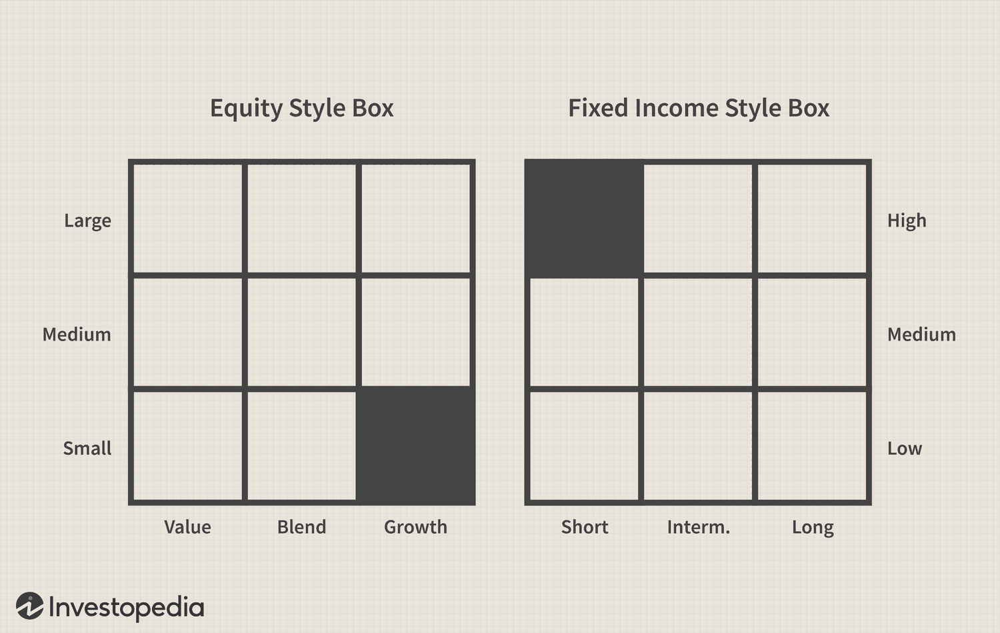

## Table of Contents

## What is a Style Box and what is its purpose?

A Style Box is a tool used in the world of investing to help people understand and choose their investments better. It's like a map that shows where a mutual fund or a stock fits based on its investment style. The Style Box has different sections, usually shown as a grid, where each section represents a different type of investment based on things like the size of the companies it invests in and whether it focuses on growth or value.

The main purpose of a Style Box is to make it easier for investors to see how their investments are spread out. For example, if someone wants to invest in big companies that are expected to grow a lot, they can look at the part of the Style Box that shows large growth stocks. This helps investors pick funds that match what they want to achieve with their money and helps them keep their investment choices balanced and diverse.

## Who created the Style Box and when was it introduced?

The Style Box was created by Morningstar, a company that helps people with investing. It was introduced in 1992. Morningstar wanted to make it easier for people to understand where their money was being invested and how different funds compared to each other.

The idea behind the Style Box was to give investors a simple way to see if a fund was investing in big or small companies, and whether it was focusing on growth or value. This tool became very popular because it helped people make smarter choices about their investments by showing them in a clear and easy-to-understand way.

## What are the main parameters used in a Style Box?

A Style Box uses two main parameters to help people understand where a fund or stock fits in the investment world. The first parameter is the size of the companies the fund invests in. This is split into three categories: large, medium, and small. Large companies are usually well-known and stable, while small companies might grow a lot but can also be riskier. The second parameter is the investment style, which is divided into value, growth, and a mix of both called blend. Value investments are about finding good deals on stocks that might be underpriced, while growth investments focus on companies expected to grow quickly.

These parameters are shown on a grid in the Style Box. The grid has nine boxes, with the size of the companies on one axis and the investment style on the other. This makes it easy for anyone to see at a glance whether a fund is investing in large value companies, small growth companies, or something in between. By using these simple categories, the Style Box helps investors pick funds that match their goals and keeps their investments spread out across different types of companies and styles.

## How does a Style Box categorize investments?

A Style Box helps people understand where their money is being invested by sorting investments into different groups. It looks at two main things: the size of the companies the fund invests in and the way the fund picks its investments. The size of the companies can be large, medium, or small. Large companies are usually big and stable, while small companies might grow a lot but can also be riskier. The way the fund picks its investments is split into value, growth, and a mix of both called blend. Value investments are about finding good deals on stocks that might be underpriced, while growth investments focus on companies expected to grow quickly.

The Style Box shows these groups on a grid that has nine boxes. One side of the grid shows the size of the companies, and the other side shows the investment style. This makes it easy to see at a glance if a fund is investing in large value companies, small growth companies, or something in between. By using these simple categories, the Style Box helps people pick funds that match what they want to achieve with their money and keeps their investments spread out across different types of companies and styles.

## Can you explain the difference between value and growth in a Style Box?

In a Style Box, value and growth are two different ways of [picking](/wiki/asset-class-picking) investments. Value investments are like finding bargains. They focus on buying stocks that seem to be priced lower than they should be. These stocks might be from companies that are not growing quickly but are stable and might give you good returns if their prices go up to what they should be. Think of it as buying something on sale because you believe it's worth more than what you're paying.

On the other hand, growth investments are all about finding companies that are expected to grow a lot in the future. These companies might not pay big dividends now, but they are expected to increase in value over time. Growth stocks can be riskier because if the company doesn't grow as expected, their stock prices can drop. It's like betting on a young, fast-growing company that could become very successful.

The Style Box uses these two ideas to help people understand where a fund is putting its money. If a fund is in the value part of the Style Box, it's focusing on those bargain stocks. If it's in the growth part, it's betting on future growth. And there's also a middle ground called blend, where the fund mixes both value and growth strategies.

## What does the size dimension represent in a Style Box?

The size dimension in a Style Box shows how big the companies are that a fund or stock invests in. It's split into three groups: large, medium, and small. Large companies are usually well-known and have been around for a while. They are often more stable and less risky than smaller companies. Medium-sized companies, or mid-caps, are in the middle. They might not be as well-known but can still be quite stable and have room to grow. Small companies, or small-caps, are often newer or less known. They can grow a lot but are also riskier because they might not do as well as expected.

This size dimension helps people understand the risk and potential growth of their investments. If someone wants to play it safe, they might choose a fund that invests in large companies. But if they're okay with taking more risk for the chance of bigger rewards, they might go for a fund that invests in small companies. By looking at where a fund falls on the size dimension of the Style Box, people can pick investments that match how much risk they're willing to take and what they hope to achieve with their money.

## How can a Style Box help in portfolio management?

A Style Box can really help people manage their portfolios by showing them where their money is being invested. It's like a map that tells you if your investments are in big, stable companies or smaller, riskier ones. It also shows if your money is going into companies that are expected to grow a lot or ones that might be a good deal right now. By using a Style Box, you can see if your investments are spread out enough. If you find that all your money is in one type of company, like small growth companies, you can decide to move some of it to other types, like large value companies, to balance things out.

This helps in keeping your investments diverse, which is important because it can lower your risk. If one type of investment doesn't do well, having different types means you're not putting all your eggs in one basket. The Style Box also makes it easier to see if your investments match your goals. If you want to be safe, you might choose more large and value investments. If you're okay with taking more risks for the chance of bigger rewards, you might go for small and growth investments. So, the Style Box is a simple but powerful tool that helps you make smarter choices about your money.

## What are the limitations of using a Style Box for investment decisions?

A Style Box can help people see where their money is invested, but it has some limits. One big limit is that it only looks at the size of the companies and whether they are value or growth. It doesn't show other important things like how risky the investments are, how much they might grow, or if they pay dividends. So, even if two funds are in the same box, they might be very different in other ways that matter a lot to investors.

Another problem is that the Style Box can make things seem simpler than they are. Companies and funds can change over time. A company that was small and growing might become big and stable, but it might take a while for the Style Box to show this change. This means the Style Box might not always give the most up-to-date picture of where your money is going. Also, some funds might invest in many different kinds of companies, so it's hard to put them in just one box. This can make it tricky to use the Style Box to make all your investment choices.

## How does a Style Box fail to capture certain investment characteristics?

A Style Box helps people see if their money is in big or small companies and if those companies are expected to grow a lot or are a good deal right now. But it doesn't show everything that's important about an investment. For example, it doesn't tell you how risky the investment is or if it pays you money regularly through dividends. Two funds might be in the same box, but one might be much riskier or give you more money back than the other. So, while the Style Box is useful, it misses out on these other important details that can make a big difference in what you choose to invest in.

Another way the Style Box can be limited is that it makes things seem simpler than they really are. Companies and funds change over time, but the Style Box might not show these changes quickly enough. A small company that's growing fast might become a big, stable company, but the Style Box might still show it as small for a while. Also, some funds invest in lots of different kinds of companies, so it's hard to put them in just one box. This means the Style Box can give you a good starting point, but you need to look at other things too to make the best choices for your money.

## Are there any alternatives to the Style Box for investment classification?

One alternative to the Style Box is the Morningstar Category system. This system groups funds based on what they invest in, like stocks, bonds, or a mix of both. It also looks at the size of the companies and if they are growth or value. But it goes a bit further by considering things like the region of the world the companies are from or the type of industry they are in. This can give a more detailed picture of where your money is going, helping you pick investments that match what you want.

Another way to classify investments is by using risk and return metrics. Tools like the Sharpe Ratio or the Sortino Ratio look at how much risk you're taking for the returns you're getting. These metrics help you see if an investment is worth it by comparing the potential gains to the potential losses. This can be really useful if you want to know if an investment is a good deal, not just where it fits in a box.

There are also sector-based classifications, where investments are grouped by the industry they belong to, like technology, healthcare, or energy. This can be helpful if you want to focus on certain areas of the economy that you think will do well. By looking at different sectors, you can spread out your investments and maybe find opportunities that a simple size and style box might miss.

## How can investors use a Style Box in conjunction with other tools for better analysis?

Investors can use a Style Box along with other tools to get a better understanding of their investments. For example, they can combine the Style Box with the Morningstar Category system. The Style Box shows where a fund fits based on the size of the companies and if they are growth or value. The Morningstar Category system adds more details, like what part of the world the companies are from or what industry they are in. By using both, investors can see not just where their money is going, but also get a fuller picture of what types of companies they are investing in.

Another way to improve analysis is by using risk and return metrics like the Sharpe Ratio or the Sortino Ratio alongside the Style Box. These metrics help investors see how much risk they are taking for the returns they are getting. While the Style Box tells you about the size and style of the investments, these ratios tell you if the investment is worth it. By looking at both, investors can make smarter choices about which investments might give them the best bang for their buck, considering both the potential gains and the risks involved.

## What advanced strategies can be applied using the insights from a Style Box?

Investors can use the insights from a Style Box to create a balanced portfolio by spreading their money across different types of investments. For example, if someone notices that all their money is in small growth companies, they might decide to move some of it into large value companies to reduce risk. By looking at where their funds fall in the Style Box, investors can make sure they have a mix of big and small companies, as well as a mix of growth and value investments. This helps them avoid putting all their eggs in one basket, which can lower the overall risk of their portfolio.

Another advanced strategy is using the Style Box to time the market. Investors might see that certain parts of the Style Box, like small [growth stocks](/wiki/growth-stocks), are doing really well. They could then decide to invest more money in those areas, hoping to ride the wave of success. On the other hand, if they see that large value stocks are not doing so well, they might wait for a better time to invest in those. By keeping an eye on how different parts of the Style Box perform over time, investors can try to buy low and sell high, making the most of market trends.

## What are the advantages of algorithmic trading in mutual fund investment?

Algorithmic trading significantly enhances the efficiency and effectiveness of mutual fund investment, offering several key advantages that modern investors can leverage. 

Firstly, [algorithmic trading](/wiki/algorithmic-trading) provides scalability by efficiently processing large volumes of data and executing trades rapidly. This allows mutual fund managers to respond promptly to market movements, ensuring that trades are conducted at optimal times to capitalize on favorable market conditions. The ability to process vast amounts of information quickly is crucial in today's fast-paced financial markets, where data-driven insights can mean the difference between profit and loss.

Moreover, algorithms improve [liquidity](/wiki/liquidity-risk-premium) and price discovery by continuously analyzing market conditions. This constant monitoring facilitates the optimization of trade prices, helping to ensure that transactions occur at the most advantageous rates. By efficiently scanning the market for price anomalies and trends, algorithms aid in maintaining competitive pricing structures that ultimately benefit mutual fund performance.

Risk management is another area where algorithmic trading excels. Predictive analytics embedded within algorithms enable real-time assessment of market risks and facilitate strategic adjustments to investment portfolios. By recognizing patterns and potential market shifts, algorithms can forecast price changes and [volatility](/wiki/volatility-trading-strategies), allowing fund managers to preemptively adjust their strategies to mitigate identified risks. This not only safeguards the portfolio but also positions it to take advantage of emerging opportunities.

Finally, algorithms offer enhanced risk mitigation capabilities. They employ advanced modeling techniques to estimate potential market declines and adjust portfolios proactively. This involves techniques such as VaR (Value at Risk), stress testing, and scenario analysis, which provide a comprehensive view of potential risks and their impact on the portfolio. For instance, employing a simple VaR model could be expressed as:

$$

\text{VaR} = \text{Investment} \times \text{Z-score} \times \text{Standard Deviation}
$$

This formula quantifies the potential loss in value of an investment with a given probability over a set time period, allowing managers to understand and mitigate risks effectively.

In summary, algorithmic trading enhances mutual fund investment by providing scalability, improving liquidity and price discovery, and strengthening risk management protocols. By combining these capabilities, mutual funds can better navigate the complexities of today's dynamic financial landscape, ensuring that they remain competitive and aligned with investors' financial goals.

## References & Further Reading

[1]: Morningstar, Inc. (2023). ["The Style Box Methodology."](https://advisor.morningstar.com/Enterprise/VTC/MSB2024FAQ.pdf)

[2]: Lopez de Prado, M. (2018). ["Advances in Financial Machine Learning."](https://www.amazon.com/Advances-Financial-Machine-Learning-Marcos/dp/1119482089) Wiley.

[3]: Chan, E.P. (2009). ["Quantitative Trading: How to Build Your Own Algorithmic Trading Business."](https://github.com/ftvision/quant_trading_echan_book) Wiley. 

[4]: Jansen, S. (2018). ["Machine Learning for Algorithmic Trading."](https://github.com/stefan-jansen/machine-learning-for-trading) Packt.

[5]: Aronson, D.R. (2006). ["Evidence-Based Technical Analysis: Applying the Scientific Method and Statistical Inference to Trading Signals."](https://www.amazon.com/Evidence-Based-Technical-Analysis-Scientific-Statistical/dp/0470008741) Wiley.