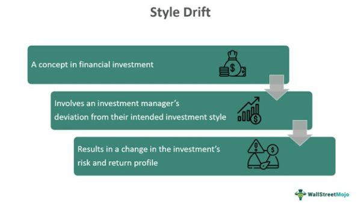

Investment management is a vital service that aids clients in wealth accumulation through strategic portfolio allocation. This process involves selecting a mix of asset classes—such as equities, bonds, and real estate—to maximize returns while managing risk. A fundamental component of investment management is due diligence, a thorough evaluation process to ensure investment strategies align with a client's specific financial goals and risk tolerance. This rigorous scrutiny mitigates potential risks and identifies growth opportunities by analyzing factors like market conditions and asset performance.

In the rapidly evolving landscape of finance, style drift and algorithmic trading are two critical phenomena that investment managers must carefully manage. Style drift refers to the deviation of a fund from its stated investment style or objective. This shift can affect a portfolio's risk-return profile and, thus, must be managed to maintain the promise made to investors. Algorithmic trading, on the other hand, employs computer algorithms to execute trades at speeds and efficiencies unattainable through manual methods. While beneficial for optimizing trades, its integration necessitates a careful balancing act to ensure that it supports the overarching strategy tailored to client needs.



Through an exploration of these elements, this article seeks to provide important insights into maintaining optimal portfolio performance in today's complex market environment. With a strong emphasis on due diligence, style drift management, and algorithmic trading, investment managers can strategically position themselves to achieve their clients' financial goals while adapting to the dynamic nature of global markets.

## Table of Contents

## Understanding Investment Management Due Diligence

Due diligence is a fundamental aspect of investment management, serving as a meticulous evaluation process that assesses the viability and potential of investments. In the context of investment management, due diligence involves a thorough analysis aimed at understanding whether potential investment opportunities align with the financial goals and risk tolerance of clients.

Investment managers conduct due diligence to uncover a comprehensive picture of investment prospects. This involves evaluating financial statements, assessing market conditions, and understanding the economic environment that could influence investment performance. Key components of this evaluation also include examining a company's management team, reviewing past performance, and forecasting future potential. The objective is to identify any inherent risks, such as market volatility, credit risk, and operational challenges, which might impact returns.

The process of due diligence serves as a critical mechanism for identifying growth opportunities while avoiding potential pitfalls. By evaluating market trends and competitive positioning, managers can gauge the potential for value creation and anticipate sectors that may experience significant growth.

Robust due diligence practices are vital for maintaining the integrity of investment strategies. They ensure that each investment decision is based on accurate, reliable, and comprehensive information. While it is impossible to eliminate all risks, due diligence aims to mitigate them by providing a structured framework for investment analysis. This not only enhances the decision-making process but also builds trust with clients, reinforcing the investment manager's commitment to aligning strategies with client objectives.

Through comprehensive due diligence, investment managers can develop strategies that optimize performance by balancing risk and return. In turn, this fosters a more resilient investment portfolio that aligns with long-term financial objectives, ensuring sustainable success for both the managers and their clients.

## Style Drift: Causes and Implications

Style drift occurs when a fund deviates from its initially stated investment style or objective, which can have significant implications for both investors and fund managers. This phenomenon can arise due to several factors, including capital appreciation, tactical shifts, or changes in fund management.

Capital appreciation is a common cause of style drift. As certain assets within a portfolio gain value, a fund may inadvertently shift from its original classification. For example, a fund initially categorized as small-cap might morph into a mid-cap or large-cap fund if its holdings appreciate significantly over time. Such scenarios necessitate active rebalancing to maintain the original investment strategy.

Tactical shifts are another contributing [factor](/wiki/factor-investing). Fund managers may adjust their investment strategies in response to market conditions, economic forecasts, or emerging opportunities. These strategic changes can lead to departures from the fund's declared investment objective. Although tactical management can optimize returns in the short term, it poses a risk to investment consistency if not closely monitored and justified.

Furthermore, changes in fund management can introduce style drift. New managers often bring different perspectives, strategies, and risk appetites, potentially steering the fund away from its original style. This change necessitates transparent communication with investors to maintain trust and understanding.

While style drift might appear subtle, its impact on a portfolio's risk-return profile can be substantial. Deviations from the expected investment style can introduce unforeseen risks and alter the expected return of an investment. For instance, a drift from a conservative income-focused fund to a growth-oriented strategy could elevate portfolio [volatility](/wiki/volatility-trading-strategies), unsettling investors whose risk tolerance aligns with the original mandate.

Therefore, monitoring style drift is crucial for preserving investment consistency and sustaining investor confidence. Fund managers should regularly review portfolio compositions, assess the alignment with stated objectives, and communicate any significant shifts to stakeholders. This proactive management ensures that investors are aware of the underlying changes that may affect their investments, thereby fostering a transparent and trust-based relationship.

## Algorithmic Trading in Modern Investment

Algorithmic trading leverages computer algorithms to execute trades at speeds and prices that would be unattainable for human traders. These algorithms are programmed to make rapid decisions based on market data, enhancing trading efficiency and minimizing human error. By analyzing vast amounts of data in real-time, [algorithmic trading](/wiki/algorithmic-trading) systems can identify patterns and trends that point to profitable opportunities.

One of the main advantages of algorithmic trading is its ability to reduce the latency in trade execution. With high-frequency trading ([HFT](/wiki/high-frequency-trading-strategies)), trades are conducted at a millisecond level, allowing algorithms to take advantage of fleeting price discrepancies. These rapid trades often rely on sophisticated strategies that integrate statistical models or [machine learning](/wiki/machine-learning) to predict market movements.

Algorithmic trading isn't limited to high-frequency strategies. It also encompasses longer-term investment approaches that benefit from automating routine processes, such as portfolio rebalancing and risk management. For example, algorithms can be used to maintain a portfolio's target asset allocation by automatically buying or selling assets when their allocations drift beyond set thresholds.

For investment managers, the integration of algorithms requires a balance between automating trades and aligning these with client objectives. Due diligence is crucial here, as it ensures that the automated strategies adhere to investment mandates and risk tolerance levels. Managers must regularly evaluate the performance of algorithms, adjusting parameters or even the model itself to ensure continued alignment with strategic goals.

Furthermore, algorithmic trading can include tools for compliance and oversight. Automated systems can monitor trades for compliance breaches and generate real-time alerts, facilitating a proactive approach to risk management. This integration of algorithmic systems with compliance checks enhances transparency and ensures that trading activities remain within regulatory frameworks.

In summary, algorithmic trading is an indispensable tool in modern investment management, offering unprecedented speed, accuracy, and efficiency in executing trades. Its versatility in covering various trading strategies allows investment managers to optimize their approach, provided they conduct rigorous due diligence to align these strategies with client goals.

## Mitigating Risks with Due Diligence and Technology

The combination of rigorous due diligence and advanced technology is fundamental in minimizing investment risks and achieving optimal portfolio management. Due diligence, a systematic process of evaluation, allows investment managers to thoroughly assess potential investments, understanding both the opportunities and inherent risks. This methodological approach ensures that investment strategies are aligned with clients' goals and risk tolerance, setting a solid foundation for portfolio decisions.

Incorporating technology into this framework enhances the efficacy and precision of investment management. Technology provides real-time data, which is indispensable for making informed investment decisions. The availability of current market data and analytics allows managers to quickly adapt to changing market conditions, reducing the likelihood of adverse outcomes due to delayed responses. Real-time data analytics tools can identify trends and anomalies in market behavior, offering insights that might be missed by manual analysis.

Moreover, technology helps in monitoring portfolio drift, particularly related to style drift, where a fund deviates from its stated investment strategy. Automated monitoring systems can track performance metrics and investment style adherence, alerting managers to any deviation from established parameters. This consistent oversight ensures that a portfolio remains aligned with its predefined risk-return profile and the investor’s expectations.

Automation also plays a crucial role in compliance checks and strategy adherence. Regulatory environments are complex and constantly evolving, and investment managers must navigate these challenges to maintain institutional and fiduciary standards. Technological solutions offer automated compliance checklists and reporting tools that reduce the risk of human error, ensuring that all investment activities comply with relevant regulations.

In programming terms, leveraging Python for investment management can streamline these processes. For example, Python code could be designed to scrape financial data from various sources, process it for relevant insights, and provide models for predictive analysis. Below is a simple example of how Python can be used to automate the collection and analysis of financial data:

```python
import pandas as pd
import yfinance as yf

# Download historical data for a given stock
def get_historical_data(ticker, start_date, end_date):
    stock_data = yf.download(ticker, start=start_date, end=end_date)
    return stock_data

# Calculate moving average
def calculate_moving_average(data, window):
    return data['Close'].rolling(window=window).mean()

# Example usage
ticker = 'AAPL'
start_date = '2023-01-01'
end_date = '2023-10-01'
data = get_historical_data(ticker, start_date, end_date)
moving_average = calculate_moving_average(data, window=20)
print(moving_average.tail())  # Print the last few moving average calculations
```

This code snippet highlights how data acquisition and processing can be automated to facilitate timely decision-making in investment management.

Ultimately, integrating due diligence processes with technological advancements fosters transparency and boosts overall investment performance. By maintaining a proactive stance, managers can anticipate potential market shifts and align investment strategies accordingly, securing long-term investment success.

## Conclusion

Investment management is fundamentally aimed at optimizing returns while effectively managing risks. Achieving this balance requires a multi-faceted approach, where due diligence, style drift awareness, and algorithmic trading play pivotal roles. Investment managers are tasked with integrating these elements into coherent strategies that align with client goals, thereby necessitating a meticulous balance between human intuition and technological capabilities.

Due diligence serves as the bedrock of sound investment decision-making, ensuring that all potential investments are scrutinized thoroughly to align with client objectives. This process not only mitigates risks but also identifies opportunities for growth within acceptable risk parameters. Style drift monitoring further complements this by maintaining the consistency of investment strategies, ensuring that any deviation from the predefined investment style does not inadvertently increase risk or misalign with investor expectations.

Algorithmic trading introduces a technological edge, allowing for precise and rapid execution of trades, essential for exploiting market inefficiencies and trends. By leveraging algorithms, investment managers can enhance the execution quality, reduce human error, and maintain a competitive edge in fast-paced markets. However, the integration of algorithmic trading must be aligned with overarching investment strategies through rigorous due diligence.

The use of technology extends beyond algorithmic trading, offering tools that provide real-time data analytics and compliance automation. Such technological advancements enable investment managers to monitor portfolios dynamically, ensuring adherence to strategic goals and prompt adjustment in response to market changes. This capability supports transparency and provides clients with confidence in the management process.

Ultimately, consistent monitoring and adaptability are critical to the long-term success of investment strategies. The ability to adapt to evolving market conditions, technological innovations, and changing client objectives ensures that portfolios remain optimized and risks are effectively managed. By maintaining a proactive stance, investment managers can achieve sustained success, delivering optimal returns while managing risks to meet client needs effectively.

## References & Further Reading

[1]: ["Advances in Financial Machine Learning"](https://www.amazon.com/Advances-Financial-Machine-Learning-Marcos/dp/1119482089) by Marcos Lopez de Prado

[2]: Kim, K., & Kim, J. (2020). ["Algorithmic Trading Strategy Based on Deep Learning."](https://www.semanticscholar.org/paper/Deep-Learning-in-Intrusion-Detection-System%3A-An-Aminanto-Kim/c0fa578c1fae002e02834806a576d811002cb4a4) In: Advanced Technology in Data Mining and Machine Learning.

[3]: ["Quantitative Trading: How to Build Your Own Algorithmic Trading Business"](https://www.amazon.com/Quantitative-Trading-Build-Algorithmic-Business/dp/1119800064) by Ernest P. Chan

[4]: Cremers, M., & Petajisto, A. (2009). ["How Active Is Your Fund Manager? A New Measure That Predicts Performance."](https://papers.ssrn.com/sol3/papers.cfm?abstract_id=891719) The Review of Financial Studies.

[5]: Grinold, R. C., & Kahn, R. N. (1999). ["Active Portfolio Management: A Quantitative Approach for Producing Superior Returns and Controlling Risk"](https://www.amazon.com/Active-Portfolio-Management-Quantitative-Controlling/dp/0070248826) 

[6]: ["Evidence-Based Technical Analysis: Applying the Scientific Method and Statistical Inference to Trading Signals"](https://www.amazon.com/Evidence-Based-Technical-Analysis-Scientific-Statistical/dp/0470008741) by David Aronson

[7]: Lowe, D. J., & Reckers, P. M. J. (1994). ["The Relation Between Analyst Forecast Dispersion and Stock Trading Volume."](https://onlinelibrary.wiley.com/doi/abs/10.1111/j.1540-5915.1994.tb00811.x) The Journal of Finance.