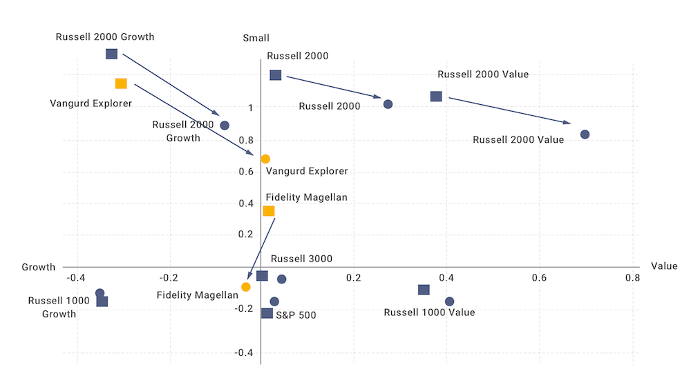

## Table of Contents

## What is style drift in investment management?

Style drift in investment management happens when a fund manager starts to invest in a way that is different from the fund's original investment style or strategy. For example, if a fund is supposed to invest only in large companies but starts buying stocks of small companies, that's style drift. This can confuse investors who chose the fund because they liked its original style.

Style drift can be a problem because it might change the risk and return of the fund in ways that investors did not expect. If investors are not happy with the new direction, they might take their money out of the fund. Fund managers need to be careful and clear about any changes they make to the fund's strategy, so investors know what to expect.

## How can style drift affect an investment portfolio?

Style drift can mess up an investment portfolio by changing how risky it is and how much money it might make. If you picked a fund because it was supposed to invest in a certain way, like only in big companies, and then the manager starts buying stocks of small companies, your portfolio might end up riskier than you wanted. This can be a surprise and might not fit with your overall plan for your money.

Also, if the fund's style changes, it might not do as well as you hoped. For example, if the fund was good at [picking](/wiki/asset-class-picking) big company stocks but starts picking small company stocks and isn't as good at it, your returns could go down. This can be frustrating and might make you want to move your money to a different fund that sticks to the style you like.

## What are the common causes of style drift?

Style drift often happens when a fund manager decides to chase better returns by changing what they invest in. For example, if a fund that usually invests in big companies sees small companies doing better, the manager might start buying those stocks instead. This can be tempting, especially if the manager thinks it will make the fund look better compared to other funds. But it can also mean the fund is no longer doing what it promised to do when investors put their money in.

Another reason for style drift is when the market changes a lot. If the economy goes through big ups and downs, what used to work might not work anymore. A fund manager might feel they need to change the fund's strategy to keep up with these changes. This can lead to the fund investing in different things than before, which can be confusing for investors who expected the fund to stick to its original plan.

## Can you provide examples of style drift in real-world investment scenarios?

Imagine you put your money into a fund that says it will only invest in big, stable companies. You like this because you want your money to be safe and grow slowly but surely. But then, the fund manager starts buying stocks of smaller, riskier companies because they think these will make more money quickly. This is style drift. Now, your investment is riskier than you wanted, and you might not be happy with the change.

Another example is a fund that usually invests in technology companies. The manager has been good at picking tech stocks, and the fund has done well. But then, the tech market starts to slow down, and the manager decides to start investing in healthcare companies instead. This is a big change from the original plan, and it's style drift. Investors who chose the fund because they believed in the manager's tech expertise might be surprised and unhappy with this new direction.

## How can investors identify style drift in their portfolios?

To spot style drift, investors should keep an eye on the types of investments their fund is making. If a fund says it will only invest in big companies but starts buying stocks of small companies, that's a sign of style drift. You can check this by looking at the fund's quarterly reports or fact sheets, which list what the fund is invested in. If you see new types of investments that don't match what the fund promised, it might be drifting.

Another way to spot style drift is by watching how the fund performs compared to similar funds. If your fund starts to behave differently from other funds that are supposed to be similar, it might be because the manager is changing the investment strategy. For example, if your fund suddenly does much better or worse than other funds that invest in big companies, it could be a sign that the manager is now investing in something else. Keeping an eye on these changes can help you catch style drift early.

## What are the potential risks associated with style drift?

Style drift can make your investment riskier than you planned. If you picked a fund because it was supposed to invest in safe, big companies, and then the manager starts buying stocks of smaller, riskier companies, your money might be in more danger than you wanted. This can be a surprise and might not fit with your overall plan for your money. If the fund's new investments don't do well, you could lose money, which can be frustrating and stressful.

Another risk is that style drift can mess up your expected returns. If the fund was good at picking certain types of stocks but then starts picking different ones and isn't as good at it, your returns could go down. This can be disappointing, especially if you chose the fund because you liked its past performance. If you're not happy with the new direction, you might want to move your money to a different fund, but this can be a hassle and might cost you money in fees or taxes.

## How do investment managers typically address or mitigate style drift?

Investment managers usually try to keep style drift under control by sticking to a clear investment plan. They set rules for what kinds of investments they can make and how much they can change their strategy. If they want to make big changes, they talk to the people who invest in the fund first. This way, everyone knows what's going on and can decide if they're okay with the new direction.

Sometimes, managers use computer programs to watch their investments and make sure they're not drifting too far from the plan. These programs can alert them if the fund starts to look different from what it's supposed to be. By keeping a close eye on things and being open with investors, managers can help make sure that style drift doesn't cause too many problems.

## What role does a fund's investment mandate play in preventing style drift?

A fund's investment mandate is like a set of rules that tells the manager what they can and can't do with the money. It says things like what types of companies the fund can invest in, how much risk it can take, and what the overall goal is. By having a clear mandate, the fund manager knows exactly what they're supposed to do, which helps prevent them from straying too far from the plan. If the manager starts to invest in ways that don't match the mandate, it's easier for investors to spot and question the changes.

The mandate also helps keep everyone on the same page. When investors put their money into a fund, they do it because they like the plan laid out in the mandate. If the manager sticks to this plan, investors know what to expect and can feel more confident about their investment. If the manager wants to make big changes, they usually need to talk to investors first and maybe even change the mandate. This way, style drift is less likely to happen because everyone agrees on the direction the fund should take.

## How does style drift impact the performance of an investment fund?

Style drift can mess up how well an investment fund does. If a fund says it will invest in big, safe companies but then starts buying stocks of smaller, riskier companies, the fund might become more risky than investors wanted. This can be a surprise and might not fit with what investors were hoping for. If the new investments don't do well, the fund's returns could go down, which can be disappointing and stressful for people who put their money in the fund.

On the other hand, style drift can sometimes help a fund do better. If the manager sees a chance to make more money by changing what they invest in, and they're right, the fund might do better than before. But this is tricky because it's hard to know if the new strategy will work out. If it doesn't, the fund could end up doing worse, and investors might take their money out, which can hurt the fund's performance even more.

## What are the regulatory considerations regarding style drift?

Regulators want to make sure that investment funds stick to what they promised to do. They have rules that say fund managers need to follow the fund's investment mandate. If a manager starts to invest in different things than what the mandate says, regulators might step in. They want to protect investors from surprises and make sure everyone knows what's going on with their money. If a fund drifts too far from its plan, regulators might make the manager fix it or even punish them.

Sometimes, regulators ask funds to tell investors about big changes in how they invest. This way, investors can decide if they still want to keep their money in the fund. If a fund changes its strategy a lot without telling investors, it can get in trouble with the regulators. They want to keep things fair and clear, so investors can trust that their money is being handled the right way.

## How can advanced analytics and machine learning help in detecting and managing style drift?

Advanced analytics and [machine learning](/wiki/machine-learning) can help spot style drift by looking at a lot of data quickly and finding patterns that might be hard for people to see. These tools can watch what a fund is investing in and compare it to what the fund said it would do. If the investments start to look different from the plan, the computer can send a warning to the fund manager. This way, the manager can check if they're drifting and fix it before it becomes a big problem.

Machine learning can also help manage style drift by predicting how changes in the market might affect a fund's investments. By using past data, these tools can guess what might happen if the fund starts to invest in different things. This can help the manager make better choices and keep the fund on track with its original plan. By using these smart tools, fund managers can keep investors happy and avoid surprises that could mess up the fund's performance.

## What strategies can investors employ to protect their investments from the negative effects of style drift?

Investors can protect their investments from style drift by keeping a close eye on what their funds are doing. They should read the fund's reports and fact sheets regularly to see if the investments match what the fund promised. If they notice the fund starting to invest in different things than before, they can ask the manager about it. By staying informed and asking questions, investors can catch style drift early and decide if they want to stay with the fund or move their money somewhere else.

Another way to protect against style drift is to choose funds with a clear and strict investment mandate. This means the fund has rules about what it can invest in, and the manager has to follow them. If a fund has a good track record of sticking to its plan, it's less likely to drift. Investors can also talk to the fund manager and make sure they understand the plan and will stick to it. By picking funds that are careful about their strategy, investors can feel more confident that their money is being handled the way they expect.

## References & Further Reading

[1]: ["Advances in Financial Machine Learning"](https://www.amazon.com/Advances-Financial-Machine-Learning-Marcos/dp/1119482089) by Marcos Lopez de Prado

[2]: Kim, K., & Kim, J. (2020). ["Algorithmic Trading Strategy Based on Deep Learning."](https://www.semanticscholar.org/paper/Deep-Learning-in-Intrusion-Detection-System%3A-An-Aminanto-Kim/c0fa578c1fae002e02834806a576d811002cb4a4) In: Advanced Technology in Data Mining and Machine Learning.

[3]: ["Quantitative Trading: How to Build Your Own Algorithmic Trading Business"](https://www.amazon.com/Quantitative-Trading-Build-Algorithmic-Business/dp/1119800064) by Ernest P. Chan

[4]: Cremers, M., & Petajisto, A. (2009). ["How Active Is Your Fund Manager? A New Measure That Predicts Performance."](https://papers.ssrn.com/sol3/papers.cfm?abstract_id=891719) The Review of Financial Studies.

[5]: Grinold, R. C., & Kahn, R. N. (1999). ["Active Portfolio Management: A Quantitative Approach for Producing Superior Returns and Controlling Risk"](https://www.amazon.com/Active-Portfolio-Management-Quantitative-Controlling/dp/0070248826) 

[6]: ["Evidence-Based Technical Analysis: Applying the Scientific Method and Statistical Inference to Trading Signals"](https://www.amazon.com/Evidence-Based-Technical-Analysis-Scientific-Statistical/dp/0470008741) by David Aronson

[7]: Lowe, D. J., & Reckers, P. M. J. (1994). ["The Relation Between Analyst Forecast Dispersion and Stock Trading Volume."](https://onlinelibrary.wiley.com/doi/abs/10.1111/j.1540-5915.1994.tb00811.x) The Journal of Finance.