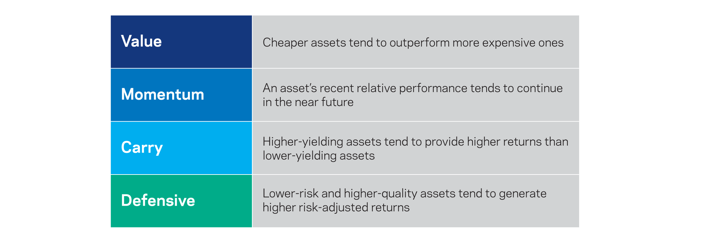

Style investing, often synonymous with algorithmic trading, involves utilizing a set of predefined rules and algorithms to guide investment decisions. This strategic method capitalizes on the dual benefits of systematic strategies and algorithmic execution, ensuring both consistency and efficiency in trading activities. As technology marches forward, the incorporation of algorithms into trading and investment decision-making becomes ever more pivotal, fundamentally transforming the way markets operate. Through the precise application of algorithms, traders can enhance their decision-making processes, minimizing human error and emotional biases.

Algorithmic trading, when combined with style investing, allows for the exploitation of systematic investment opportunities across various asset classes. By establishing a set of rules that govern trade execution, style investing harnesses the power of algorithms to monitor and execute trades based on specific investment styles such as value, growth, or momentum. This approach not only streamlines the trading process but also enables investors to react swiftly and accurately to market changes.



In this article, we aim to explore the depth of style investing and algorithmic trading, elucidating its importance, functionality, and potential benefits within the complexities of today's market environment. As traders become more reliant on technological advancements, the ability to leverage these tools will be instrumental in fortifying their trading strategies. Embracing these techniques offers the potential to boost both performance outcomes and risk management practices, thus ensuring robustness in an increasingly competitive financial landscape.

## Table of Contents

## Understanding Style Investing (Algo Trading)

Style investing, when integrated with algorithmic trading, involves adhering to specific investment styles such as value, growth, or momentum through the use of algorithms. Algorithmic trading, commonly termed algo trading, employs computer algorithms to automate trading decisions, thereby streamlining the investment process. This methodology offers a systematic approach to capturing asset mispricings to optimize returns.

The synergy between style investing and algorithmic trading lies in its ability to leverage technology to enhance decision-making. Algorithms not only expedite trade executions but also remove human error and biases that might otherwise taint investment choices. Automated systems analyze vast quantities of data swiftly, enabling traders to respond to market dynamics with increased agility and informed precision.

Furthermore, the integration of algorithms ensures the consistent execution of style-based strategies. By adhering to predefined investment criteria, these systems reinforce discipline within trading activities. A hybrid approach combines the tactical aspects of style investing with the advanced mechanisms of algorithmic execution, resulting in increased efficiency and adherence to strategic objectives.

In [algorithmic trading](/wiki/algorithmic-trading), the core of style investing revolves around utilizing a set of rules that automatically trigger buy or sell decisions whenever specific conditions are met. For instance, in a value investing strategy, the algorithm might scan for stocks trading below their intrinsic value, determined by financial metrics such as the price-to-earnings ratio. Conversely, in [momentum](/wiki/momentum) strategies, the algorithm could focus on identifying stocks exhibiting upward price trends, predicting their continuance based on historical performance.

The deployment of such strategies often involves [backtesting](/wiki/backtesting), a process where past market data is used to evaluate the performance of algorithms. This serves to refine and validate trading models before they are applied to real trading environments. Consequently, algorithms offer an objective framework that aligns with the investment style's principles, ensuring systematic application across variable market conditions.

In summary, style investing coupled with algorithmic trading provides a robust methodology for traders to enhance their strategies. By utilizing algorithms for automated, bias-free decision-making, traders can optimize their style-based investments for improved efficacy and strategic compliance.

## Types of Style Investing in Algorithmic Trading

Several types of style investing strategies benefit significantly from the integration of algorithmic trading, each uniquely structured to adapt to specific market conditions through advanced technological means:

1. **Trend Following**: This strategy employs algorithms to detect and capitalize on prevailing market trends. By analyzing historical price data, these algorithms are designed to execute trades that align with the identified trend, whether upward or downward, thus allowing for strategic position maintenance. The main purpose is to ride the wave of market momentum, potentially leading to profitable outcomes. Trend-following methods frequently utilize statistical measures such as moving averages, which can be defined mathematically as:
$$
   \text{Moving Average (MA)} = \frac{1}{n} \sum_{i=1}^{n} P_i

$$

   Here, $P_i$ represents the price at each period $i$, and $n$ is the number of periods considered.

2. **Value Investing**: Within this approach, algorithms systematically scan the market for stocks that appear undervalued based on key financial metrics like the price-to-earnings ratio or book value. The goal is to identify potential buy opportunities where the intrinsic value of a stock exceeds its market price. By employing these algorithms, traders can quickly evaluate large datasets to find value stocks that might otherwise be overlooked in manual assessments.

3. **Growth Investing**: This type of investing centers around targeting companies that exhibit strong growth prospects. Algorithms are fine-tuned to analyze metrics such as revenue growth, earnings per share increases, and industry outperformance. The goal is to pinpoint companies that are not only expanding but have the potential for long-term appreciation. Growth investing algorithms may employ predictive models that incorporate various growth-focused indicators to enhance selection accuracy.

4. **Momentum Strategies**: These strategies harness prior price movements to forecast future price directions. Algorithms used here are adept at identifying and seizing short- to medium-term gains arising from price momentum, often quantified through momentum indicators like the Relative Strength Index (RSI) or Moving Average Convergence Divergence (MACD). Python code implementing a basic momentum strategy might resemble:

   ```python
   def compute_momentum(prices, days=10):
       """
       Calculate the momentum of a stock.
       prices: List or array of stock prices.
       days: Time period for calculating momentum.
       """
       if len(prices) < days:
           return None
       return prices[-1] - prices[-days]

   stock_prices = [10, 11, 13, 12, 15, 18, 20, 19, 23, 22]
   momentum = compute_momentum(stock_prices, days=5)
   print(f"Momentum: {momentum}")
   ```

Each style of style investing is tied to particular algorithmic logic, facilitating the ability of traders to modify tactics in response to changing market dynamics. This adaptability ensures that trading remains effective across different market environments, maximizing the opportunity for optimized returns.

## Benefits of Style Investing Using Algorithms

Style investing using algorithms presents numerous benefits that enhance the efficiency and effectiveness of trading strategies. These benefits are central to maximizing returns while minimizing the risks associated with human error and emotional biases.

1. **Speed and Precision**: The primary advantage of algorithmic trading lies in its ability to execute trades with incredible speed and precision. Algorithms can process vast amounts of data in real-time, allowing traders to capitalize on fleeting market opportunities. Unlike manual trading, where decision-making is subject to delay, algorithms can instantly identify and act on market signals. For instance, algorithms can automate the execution of a trade once specific conditions are met, such as a moving average crossover, ensuring timely action that captures optimal buy or sell points.

2. **Objective Decision-Making**: One of the key challenges in traditional investing is the influence of emotions, which can lead to suboptimal decisions. Algorithmic strategies operate based on predefined rules and criteria, effectively eliminating emotional biases from the equation. Traders can program algorithms to adhere strictly to objective parameters, such as price-to-earnings ratios or other financial metrics, ensuring that all trading decisions are made purely on data-driven insights.

3. **Consistency**: Consistency in applying investment strategies is crucial for reliable performance tracking and evaluation. Algorithmic trading ensures the consistent application of style-investing rules, as algorithms operate without fatigue and can maintain their performance independently of external market conditions. This consistent adherence to strategic rules allows traders to accurately assess the effectiveness of their investment approaches over time.

4. **Customizability**: The flexibility of algorithms enables the tailoring of trading strategies to specific style investing approaches, such as value, growth, or momentum investing. Traders can customize algorithms to incorporate unique criteria or adjust to particular market conditions. For example, an algorithm may be modified to account for seasonal market trends or to respond to macroeconomic indicators. This customizability allows for granular control over trading activities and ensures that the strategy remains aligned with the trader’s overall investment goals.

5. **Backtesting**: The ability to backtest is a distinct advantage of algorithmic style investing. Backtesting involves running an algorithmic strategy on historical market data to evaluate its past performance and identify areas for improvement. This process enables traders to validate their strategies before deploying them in live markets, minimizing the risks of unforeseen losses. Python libraries such as `pandas` and `backtrader` can facilitate the backtesting process, allowing for comprehensive analysis and optimization of trading algorithms.

Overall, the integration of algorithms into style investing offers a powerful means of enhancing trading efficiency, precision, and adaptability. By leveraging algorithmic strategies, traders can achieve greater accuracy in executing trades, maintain disciplined adherence to investment criteria, and ultimately improve their chances of achieving desired financial outcomes.

## Challenges and Considerations

Despite its advantages, style investing with algorithmic trading also presents several notable challenges:

1. **Complexity**: Developing and maintaining sophisticated algorithms requires a deep understanding of both financial markets and programming skills. Implementing a successful algorithm involves intricate mathematical models and statistical analysis, often necessitating expertise in quantitative finance and software development. As markets evolve, keeping these algorithms effective demands constant updates and fine-tuning, which can be resource-intensive.

2. **Overfitting Risk**: Overfitting occurs when an algorithm is too finely tuned to historical data, capturing noise instead of underlying patterns. This excessive backtesting can result in models that perform well on past data but fail in real-world trading scenarios. To mitigate this risk, traders must employ robust validation techniques such as cross-validation and maintain a balance between complexity and generalization in their models. Regularly testing the algorithm's performance on out-of-sample data is critical to ensure its efficacy.

3. **Market Dependence**: Algorithmic strategies often require continuous adaptation to changing market environments. Financial markets are dynamic, influenced by macroeconomic factors, geopolitical developments, and investor sentiment. Algorithms that succeed in certain market conditions may underperform or become obsolete as these conditions shift. Therefore, traders must constantly monitor the market and adapt their algorithms to maintain competitiveness and profitability.

4. **Regulatory Compliance**: Adhering to trading regulations is crucial to avoid legal repercussions and penalties. In many jurisdictions, financial markets are heavily regulated, necessitating compliance with rules pertaining to trading transparency, fair practices, and reporting requirements. Algorithmic traders must ensure that their systems comply with these regulations, which may vary across different regions and asset classes. This often involves working closely with legal experts and incorporating compliance checks into the algorithm's design.

Traders who seek to incorporate algorithms into their style investing strategies should be mindful of these factors. By addressing these challenges, they can better position themselves to harness the benefits of algorithmic trading while minimizing associated risks.

## Getting Started with Style Investing in Algo Trading

To effectively begin with style investing in algorithmic trading, it is crucial to follow a structured approach encompassing understanding, platform selection, strategy development, backtesting, and cautious investment initiation.

1. **Educate Yourself**: A comprehensive understanding of financial markets, different investment styles, and algorithmic principles is a fundamental step. Grasp key concepts such as market dynamics, asset pricing, and the technical underpinnings of algorithmic trading. Familiarize yourself with various investment styles like value, growth, and momentum investing, as well as the basics of algorithms, coding, and the programming languages most commonly used in fintech, such as Python. Crucial resources may include financial market courses, online platforms, and educational materials related to algorithmic trading.

2. **Choose a Suitable Platform**: Selecting an appropriate trading platform that supports algorithm development and execution is essential. Look for platforms that offer robust API support, user-friendly interfaces, and integration capabilities with financial data providers. Popular platforms include MetaTrader for Forex trading, Interactive Brokers for diverse asset classes, and QuantConnect for algorithmic strategy backtesting and execution. Ensure the platform aligns with your technical expertise and offers the necessary tools to develop and test your algorithms efficiently.

3. **Develop a Strategy**: Crafting an investment strategy tailored to your preferred style and risk tolerance is a vital component. Start by defining your investment objectives and the style of trading you wish to pursue. For instance, if you are inclined towards value investing, your strategy may focus on identifying undervalued stocks through algorithms that analyze fundamental financial metrics. Develop your trading algorithm using a language like Python, incorporating libraries such as Pandas for data manipulation and NumPy for numerical calculations. An example Python snippet might look like this:

   ```python
   import pandas as pd

   # Load historical stock data
   data = pd.read_csv('stock_data.csv')

   # Define a simple moving average strategy
   data['SMA_20'] = data['Close'].rolling(window=20).mean()
   data['Signal'] = 0
   data['Signal'][20:] = np.where(data['Close'][20:] > data['SMA_20'][20:], 1, -1)

   # Strategy signals
   print(data[['Close', 'SMA_20', 'Signal']].tail())
   ```

4. **Backtest and Refine**: Once a strategy is developed, rigorously backtesting it using historical market data is critical. This process involves assessing the algorithm's historical performance to ensure its viability under market conditions. Adjust and refine the algorithm based on backtesting results to optimize its effectiveness. Metrics such as Sharpe ratio, drawdown, and total returns are often used to evaluate strategy performance. This iterative refinement is crucial to mitigating risks associated with real-world trading.

5. **Start Small**: Initiate with modest investments to minimize potential losses while gaining practical experience. Gradually increase investment size as your confidence grows and your strategy proves successful. This gradual approach helps manage risk while allowing you to adapt to real-time market conditions and the operational nuances of automated trading systems. Monitoring live trading results and making necessary adjustments will further hone your strategy's effectiveness.

By following these steps meticulously, traders can effectively embark on style investing using algorithmic trading, balancing strategic planning with technological execution to enhance their investment outcomes.

## Conclusion

Style investing, often interchanged with algorithmic trading, embodies a harmonious fusion of systematic strategies and cutting-edge execution technology. By leveraging algorithms, traders are empowered to enhance their investment methodologies, achieving higher levels of efficiency and precision. Algorithms facilitate rapid decision-making by processing vast amounts of data, enabling traders to execute transactions that capitalize on minute market movements, which might be overlooked in manual trading scenarios.

While the landscape of style investing with algorithmic trading is not devoid of challenges, the potential benefits and profitability make it a compelling pursuit. Issues such as complexity, overfitting, market dependence, and regulatory considerations require vigilant management and ongoing refinement. The success of style investing hinges on the ability to not only craft robust algorithms but also to continuously adapt them to the ever-evolving market conditions.

As the financial industry continues its trajectory of technological advancement, staying informed about new methods and tools will be essential for traders aiming to effectively harness the advantages of algorithmic trading. Regularly updating knowledge with market trends, compliant practices, and emerging technologies will support traders in optimizing their strategy applications.

By comprehending and integrating these principles, traders can anticipate an enhancement in returns and mitigation of risks in their investment pursuits. This adept combination of systematic rigor and technological sophistication in style investing affords a promising outlook for the future of trading, offering measured and informed paths to profitability.

## References & Further Reading

[1]: ["Algorithmic Trading: Winning Strategies and Their Rationale"](https://www.amazon.com/Algorithmic-Trading-Winning-Strategies-Rationale/dp/1118460146) by Ernest P. Chan

[2]: ["Advances in Financial Machine Learning"](https://www.amazon.com/Advances-Financial-Machine-Learning-Marcos/dp/1119482089) by Marcos Lopez de Prado

[3]: ["Quantitative Trading: How to Build Your Own Algorithmic Trading Business"](https://www.amazon.com/Quantitative-Trading-Build-Algorithmic-Business/dp/1119800064) by Ernest P. Chan

[4]: Biais, B., Foucault, T., & Moinas, S. (2015). ["Equilibrium High-Frequency Trading"](https://papers.ssrn.com/sol3/papers.cfm?abstract_id=2024360) Review of Financial Studies, 28(4), 973–1003.

[5]: ["Financial Modeling and Algorithmic Trading"](https://www.researchgate.net/publication/378287610_Machine_learning_in_financial_markets_A_critical_review_of_algorithmic_trading_and_risk_management) by Walter B. Denny

[6]: ["Evidence-Based Technical Analysis: Applying the Scientific Method and Statistical Inference to Trading Signals"](https://www.amazon.com/Evidence-Based-Technical-Analysis-Scientific-Statistical/dp/0470008741) by David Aronson

[7]: ["Machine Learning for Algorithmic Trading"](https://github.com/stefan-jansen/machine-learning-for-trading) by Stefan Jansen