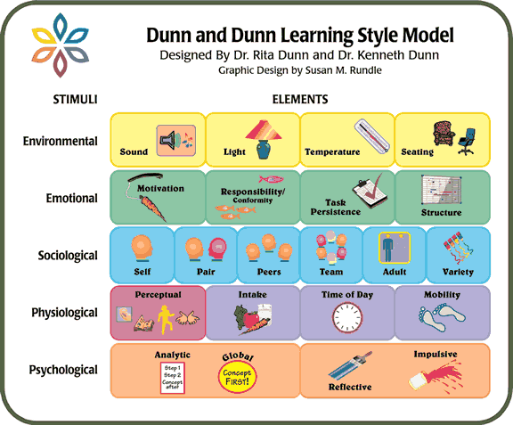

## Table of Contents

## What is style in general terms?

Style is how someone does something. It is the way a person dresses, talks, or even writes. It is like a fingerprint because it is unique to each person. For example, when you see someone wearing colorful clothes and lots of jewelry, you might say they have a bold style. Or if someone always speaks softly and uses big words, you might say they have a sophisticated style.

Style can also be about things other than people. It can be the way a room is decorated or how a book is written. A room with simple furniture and soft colors might have a minimalist style. A book with short sentences and lots of action might have a fast-paced style. Style helps us express who we are and what we like. It makes life more interesting and fun.

## How does style relate to personal expression?

Style is a big part of how we show who we are. It's like a way to tell the world about our thoughts, feelings, and what we like without using words. When we pick out clothes, decorate our rooms, or even choose the music we listen to, we are using style to express ourselves. For example, if someone loves bright colors and fun patterns, their style might show they are happy and full of energy.

Style also helps us feel more comfortable and confident. When we wear clothes that match our personality or live in a space that feels like us, it makes us feel good. It's like wearing your favorite comfy sweater or having your room just the way you want it. This comfort can make us more confident and happy in our daily lives. So, style is not just about looking good; it's about feeling good and showing the world who we really are.

## What are the basic elements that constitute style?

The basic elements that make up style include color, shape, texture, and pattern. Color is important because it can show how we feel. Bright colors might mean we are happy or want to stand out, while dark colors might show we like to be calm or want to blend in. Shape is about the lines and forms we like. Some people like sharp, straight lines, while others prefer soft, curvy shapes. Texture is how things feel, like smooth, rough, or soft. It adds a touch that can make our style more interesting. Pattern is about repeating designs, like stripes or flowers, which can make our style more fun and unique.

Another element of style is the way we mix these things together. How we put colors, shapes, textures, and patterns together can show a lot about our personality. For example, someone might mix lots of bright colors and bold patterns to show they are outgoing and fun. Someone else might choose soft colors and simple shapes to show they like things to be calm and peaceful. The way we choose and combine these elements helps us create a style that is all our own.

## Can you explain the difference between style and fashion?

Style and fashion are two different things, but they are often mixed up. Style is about how someone expresses who they are. It's personal and doesn't change much over time. When you have a style, you choose things that feel right for you, like your favorite clothes, the way you decorate your room, or even how you talk. Style is like a fingerprint because it's unique to each person.

Fashion, on the other hand, is about what's popular at a certain time. It changes a lot and is influenced by what designers and celebrities are doing. Fashion is more about trends that come and go, like wearing certain types of jeans or having a specific haircut. While fashion can be fun to follow, it's not the same as style. Style is about being true to yourself, while fashion is about what's popular right now.

## What are the main classifications of style?

Style can be broken down into different types based on what it shows about a person. There are classic styles, which are timeless and elegant, like wearing simple, well-made clothes that never go out of fashion. There are also trendy styles, which follow the latest fashion and can change from season to season. Casual styles are relaxed and comfortable, often seen in everyday wear like jeans and t-shirts. Formal styles are more serious and are usually worn for special occasions, like suits or fancy dresses.

Another way to classify style is by the feelings or ideas it expresses. For example, bohemian style is free-spirited and artistic, often using lots of colors and patterns. Minimalist style is simple and clean, focusing on basic shapes and colors. Sporty style is active and energetic, often seen in athletic wear. Each of these styles tells a different story about the person wearing them, showing what they value and how they see themselves.

## How do cultural and historical contexts influence style classification?

Cultural and historical contexts play a big role in how we classify style. Different cultures have their own ways of dressing, decorating, and even talking, which can shape what we think of as style. For example, traditional clothes from Japan, like kimonos, show a different style than the colorful saris from India. These styles are tied to the history and customs of each place. When we look at style, we need to think about where it comes from and what it means to the people who use it.

History also changes how we see style over time. What was popular a hundred years ago might look very different from what's popular now. For example, in the 1920s, flapper dresses were a big fashion trend in the West, showing a new kind of freedom and fun. Today, those same styles might be seen as vintage or retro. As time goes on, styles can come back in new ways, mixing old ideas with new ones. So, understanding the history behind a style helps us see why it matters and how it fits into the bigger picture of fashion and personal expression.

## What methods are used to evaluate style?

Evaluating style can be done in many ways, depending on what you want to know. One way is to look at how someone puts together different elements like color, shape, and texture. For example, if someone wears a lot of bright colors and mixes patterns, you might say their style is bold and fun. Another way is to see how well someone's style matches their personality. If someone is very outgoing and their clothes are loud and eye-catching, it shows that their style fits who they are.

Another method is to compare a person's style to what is popular at the time. This can help you see if someone is following trends or if they have their own unique style. For example, if everyone is wearing skinny jeans but someone chooses wide-leg pants, they might be showing a personal style that goes against the current fashion. This can tell you a lot about how someone wants to express themselves.

Sometimes, experts like fashion critics or designers evaluate style by looking at how original it is or how well it fits the occasion. They might judge if someone's style is appropriate for a certain event, like a wedding or a job interview. They can also look at how creative someone is with their choices, seeing if they mix and match in new and interesting ways. All these methods help us understand and appreciate the different ways people use style to show who they are.

## How do experts differentiate between good and bad style?

Experts often say a style is good if it shows who a person is and makes them feel good. Good style fits well with someone's personality and makes them feel confident and happy. It can be simple or fancy, but the most important thing is that it feels right for the person wearing it. For example, if someone loves bright colors and fun patterns, and they wear them in a way that feels true to them, experts might say that's good style. It's not just about following trends; it's about being true to yourself.

On the other hand, experts might say a style is bad if it doesn't fit the person or the situation. Bad style can make someone feel uncomfortable or out of place. It might be trying too hard to follow what's popular without thinking about what feels right for the person. For instance, if someone wears very fancy clothes to a casual picnic and feels awkward, that might be seen as bad style. It's not about the clothes themselves but how they fit with the person and the moment.

## What role does subjectivity play in style evaluation?

Subjectivity is a big part of how we judge style. It means that what one person thinks is good style, another person might not like. Style is all about personal taste, so what looks great to one person might not look good to someone else. For example, someone might love wearing bright colors and think it's the best style, but another person might prefer soft, neutral colors and think bright colors are too much. Because of this, there's no one right way to have good style; it's all about what feels right to you.

Even experts can have different ideas about what makes a style good or bad. They might look at things like how well clothes fit, how colors match, or how a style fits with someone's personality. But even experts can disagree because style is so personal. What one expert thinks is a perfect style, another might think is just okay. So, when it comes to style, it's important to remember that everyone's opinion is different, and what matters most is how you feel about your own style.

## How has the concept of style evolved over time?

The idea of style has changed a lot over time. In the past, style was often about showing your place in society. For example, in old times, kings and queens wore fancy clothes to show they were important. People followed rules about what to wear, like men wearing suits and women wearing dresses. Style was more about what was proper and fitting into what everyone else was doing. But as time went on, people started to think more about showing who they are through their style. This was especially true in the 20th century, when new ideas and movements like the hippies in the 1960s and punk in the 1970s showed that style could be a way to say something about yourself and the world.

Today, style is more about personal expression than ever before. With the internet and social media, people can see all kinds of styles from around the world and mix them in new ways. This means that style is not just about following what's popular; it's about creating something unique that shows your personality. People can wear whatever they want, from vintage clothes to the latest trends, and mix them in ways that feel right to them. So, style has gone from being about fitting in to being about standing out and showing who you are.

## What are some advanced theories on style and its impact on society?

Some advanced theories say that style is more than just what we wear or how we decorate our homes. They think style can change how society works. For example, some theories say that when people start to wear different styles, it can show that big changes are happening in society. Like in the 1960s, when young people started wearing bright colors and different clothes, it showed they wanted to change the world and be free. So, style can be a way for people to show they want things to be different and push for change.

Another theory is that style can bring people together or keep them apart. When a group of people all wear similar styles, it can make them feel like they are part of a team. This can be good because it helps people feel connected. But it can also be bad if it makes people who don't fit in feel left out. Style can also be used to show power. For example, if only rich people can wear certain styles, it can make them seem more important than others. So, style can change how people see each other and how they act in society.

## How can one develop a critical eye for evaluating style in various fields?

Developing a critical eye for evaluating style in different fields means learning to see the small details that make up a style. You can start by looking at things like color, shape, and texture. For example, in fashion, notice how colors are used to make a statement or how shapes can show if a style is classic or modern. In art, look at how the artist uses lines and colors to create a mood. The more you practice looking at these details, the better you'll get at understanding what makes a style unique. It's also helpful to learn about different styles and their histories. Knowing where a style comes from can help you see why it matters and how it fits into the bigger picture.

Another way to develop a critical eye is by comparing styles. Look at how different styles are used in the same field, like how different artists might paint the same scene in very different ways. This can help you see what makes each style special. It's also good to think about how a style makes you feel. Does it make you feel happy, calm, or excited? Your feelings can tell you a lot about a style. Talking to others about style can also help. When you share your thoughts and listen to what others think, you can learn new ways to look at style and understand it better. Over time, these steps will help you develop a sharp eye for evaluating style in any field.

## What is the understanding of classification models?

Classification models play a critical role in [algorithmic trading](/wiki/algorithmic-trading) by facilitating the prediction of future market movements. These models are designed to classify data points into distinct categories based on input features. In trading, classification models typically aim to predict market behaviors, such as whether a stock price will rise or fall.

**Definition and Types of Classification Models in Trading**

Classification models apply supervised learning techniques where the task is to classify inputs into a set of predefined categories. In the context of trading, this often translates to predicting binary outcomes like "buy" or "sell" signals based on historical data patterns. Several types of classification models are prominently used in trading, including Logistic Regression, Support Vector Machines (SVM), and Random Forest models.

**Logistic Regression**

Logistic Regression is a statistical model that is used widely in binary classification problems. It models the probability that a given input point belongs to a particular class. The logistic function, or sigmoid function, is used to map the predicted values to a probability between 0 and 1. The basic formula for Logistic Regression is:

$$

P(y=1|x) = \frac{1}{1 + e^{-(\beta_0 + \beta_1x_1 + \beta_2x_2 + ... + \beta_nx_n)}} 
$$

where $P(y=1|x)$ is the probability of a class label, $x_i$ are the input features, and $\beta_i$ are the coefficients fitted by the model. Logistic Regression is advantageous because of its simplicity, easy implementation, and efficiency with large datasets.

**Support Vector Machines (SVM)**

Support Vector Machines are another popular classification model which works by finding the hyperplane that best divides a dataset into two classes. The SVM model aims to maximize the margin between the classes' nearest points (support vectors), enhancing generalization capabilities. For non-linearly separable data, SVM can employ kernel functions to project data into higher dimensions where it is linearly separable, making it versatile for complex datasets.

**Random Forest**

Random Forest is an ensemble learning method primarily used for classification and regression tasks. It builds multiple decision trees and merges them together to get a more accurate and stable prediction. Each tree in a random forest outputs a class prediction and the class with the most votes becomes the model’s prediction. Random Forests are robust against overfitting, especially when using a large training set, and are highly effective in handling large datasets with numerous input variables.

```python
from sklearn.linear_model import LogisticRegression
from sklearn.svm import SVC
from sklearn.ensemble import RandomForestClassifier

# Example implementations:
# Logistic Regression
logistic_model = LogisticRegression()
logistic_model.fit(X_train, y_train)

# Support Vector Machine
svm_model = SVC(kernel='linear')
svm_model.fit(X_train, y_train)

# Random Forest
random_forest_model = RandomForestClassifier(n_estimators=100)
random_forest_model.fit(X_train, y_train)
```

**Advantages of Classification Models in Financial Markets**

Classification models offer several advantages in financial markets. They enable traders to make predictive analyses based on historical data, providing insights into potential market trends and movements. These models can process vast amounts of data and uncover patterns not easily discernible to human traders. Moreover, they can substantially reduce cognitive biases in decision-making, offer scalability across various financial instruments, and contribute to maintaining a competitive edge in high-frequency trading environments. Overall, classification models are invaluable for developing predictive, data-driven strategies in financial markets.

## References & Further Reading

[1]: Bergstra, J., Bardenet, R., Bengio, Y., & Kégl, B. (2011). ["Algorithms for Hyper-Parameter Optimization."](https://dl.acm.org/doi/10.5555/2986459.2986743) Advances in Neural Information Processing Systems 24.

[2]: ["Advances in Financial Machine Learning"](https://www.amazon.com/Advances-Financial-Machine-Learning-Marcos/dp/1119482089) by Marcos Lopez de Prado

[3]: ["Evidence-Based Technical Analysis: Applying the Scientific Method and Statistical Inference to Trading Signals"](https://www.amazon.com/Evidence-Based-Technical-Analysis-Scientific-Statistical/dp/0470008741) by David Aronson

[4]: ["Machine Learning for Algorithmic Trading"](https://github.com/stefan-jansen/machine-learning-for-trading) by Stefan Jansen

[5]: ["Quantitative Trading: How to Build Your Own Algorithmic Trading Business"](https://www.amazon.com/Quantitative-Trading-Build-Algorithmic-Business/dp/1119800064) by Ernest P. Chan