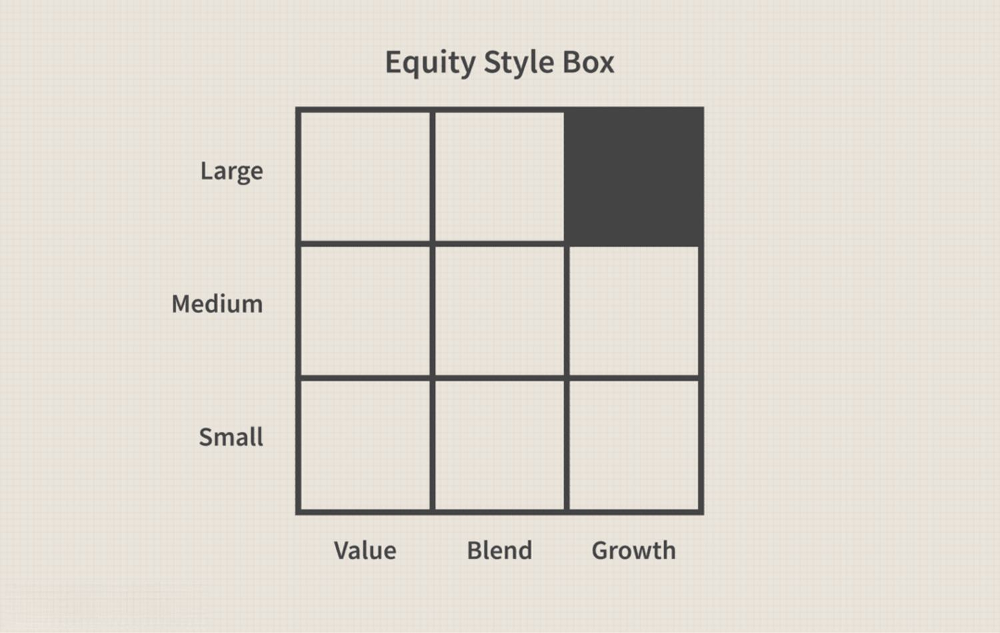

Algorithmic trading refers to the use of computer algorithms to automate trading decisions in financial markets. Traditionally, these algorithms relied on predefined rules and systematic strategies to exploit inefficiencies and trends within the market. As technology has advanced and data availability has proliferated, the integration of machine learning techniques has significantly transformed algorithmic trading. Machine learning provides tools that allow algorithms to adaptively learn patterns from vast datasets, which are essential in sophisticated financial markets where rapid decision-making and adaptability are crucial.

Classification models are a subset of machine learning models extensively used in predicting market trends. These models assign observations into particular categories or groups, enabling traders to make informed decisions based on potential market movements. For instance, classification models can help predict whether a stock's price will rise or fall, based on historical data and selected features. Common models include Logistic Regression, Support Vector Machines (SVM), and Random Forests, each having its unique advantages and applications based on the type of data and the specific requirements of the trading strategy.



Evaluating these models is critically important in algorithmic trading. Model evaluation involves assessing the performance of a classification model by using various metrics to ensure that predictions are not just accurate on past data, but also robust enough to generalize to new, unseen data. This is vital in the context of financial markets, where unseen data is the norm and decision-making under uncertainty can significantly impact financial outcomes. Accurate model evaluation helps in minimizing risks and capturing more reliable trading signals.

The objective of this article is to explore the classification style evaluation in algorithmic trading. By focusing on how classification models can be developed, tested, and assessed for performance in a trading context, this discussion aims to provide insights into best practices for integrating machine learning models into trading algorithms. The article will cover essential aspects such as data preparation, model training, and performance evaluation, crucial for developing effective trading strategies utilizing machine learning advancements.

## Table of Contents

## Understanding Classification Models

Classification models play a critical role in algorithmic trading by facilitating the prediction of future market movements. These models are designed to classify data points into distinct categories based on input features. In trading, classification models typically aim to predict market behaviors, such as whether a stock price will rise or fall.

**Definition and Types of Classification Models in Trading**

Classification models apply supervised learning techniques where the task is to classify inputs into a set of predefined categories. In the context of trading, this often translates to predicting binary outcomes like "buy" or "sell" signals based on historical data patterns. Several types of classification models are prominently used in trading, including Logistic Regression, Support Vector Machines (SVM), and Random Forest models.

**Logistic Regression**

Logistic Regression is a statistical model that is used widely in binary classification problems. It models the probability that a given input point belongs to a particular class. The logistic function, or sigmoid function, is used to map the predicted values to a probability between 0 and 1. The basic formula for Logistic Regression is:

$$

P(y=1|x) = \frac{1}{1 + e^{-(\beta_0 + \beta_1x_1 + \beta_2x_2 + ... + \beta_nx_n)}} 
$$

where $P(y=1|x)$ is the probability of a class label, $x_i$ are the input features, and $\beta_i$ are the coefficients fitted by the model. Logistic Regression is advantageous because of its simplicity, easy implementation, and efficiency with large datasets.

**Support Vector Machines (SVM)**

Support Vector Machines are another popular classification model which works by finding the hyperplane that best divides a dataset into two classes. The SVM model aims to maximize the margin between the classes' nearest points (support vectors), enhancing generalization capabilities. For non-linearly separable data, SVM can employ kernel functions to project data into higher dimensions where it is linearly separable, making it versatile for complex datasets.

**Random Forest**

Random Forest is an ensemble learning method primarily used for classification and regression tasks. It builds multiple decision trees and merges them together to get a more accurate and stable prediction. Each tree in a random forest outputs a class prediction and the class with the most votes becomes the model’s prediction. Random Forests are robust against overfitting, especially when using a large training set, and are highly effective in handling large datasets with numerous input variables.

```python
from sklearn.linear_model import LogisticRegression
from sklearn.svm import SVC
from sklearn.ensemble import RandomForestClassifier

# Example implementations:
# Logistic Regression
logistic_model = LogisticRegression()
logistic_model.fit(X_train, y_train)

# Support Vector Machine
svm_model = SVC(kernel='linear')
svm_model.fit(X_train, y_train)

# Random Forest
random_forest_model = RandomForestClassifier(n_estimators=100)
random_forest_model.fit(X_train, y_train)
```

**Advantages of Classification Models in Financial Markets**

Classification models offer several advantages in financial markets. They enable traders to make predictive analyses based on historical data, providing insights into potential market trends and movements. These models can process vast amounts of data and uncover patterns not easily discernible to human traders. Moreover, they can substantially reduce cognitive biases in decision-making, offer scalability across various financial instruments, and contribute to maintaining a competitive edge in high-frequency trading environments. Overall, classification models are invaluable for developing predictive, data-driven strategies in financial markets.

## Gathering and Preparing Data

High-quality data is a cornerstone of effective [algorithmic trading](/wiki/algorithmic-trading), significantly impacting the performance and reliability of trading models. Poor quality data can lead to inaccurate predictions, increased risks, and potential financial losses. Therefore, ensuring the accuracy, completeness, and cleanliness of data is paramount in the development of robust trading models.

**Data Gathering Techniques**

In stock and financial market analysis, leveraging diverse data sources is crucial. Common techniques for gathering data include:

1. **APIs from Financial Market Platforms**: Platforms such as Bloomberg, Yahoo Finance, and Alpha Vantage provide APIs that offer real-time and historical market data, including prices, volume, and various financial indicators.

2. **Web Scraping**: This technique involves extracting data from websites using automated scripts. For instance, Python libraries like BeautifulSoup and Scrapy can be employed to gather sentiment data from financial news articles or forums.

3. **Subscription-Based Services**: Data vendors like Quandl, Thomson Reuters, and S&P Global provide comprehensive datasets for a fee, ensuring high-quality and well-organized data.

4. **Direct Exchange Feeds**: Traders can subscribe to direct feeds from exchanges, such as NYSE or NASDAQ, obtaining the most granular level of market data for high-frequency trading.

**Data Preprocessing Steps**

Once data is gathered, preprocessing is essential to ensure its suitability for model training. This involves several key steps:

1. **Cleaning**: Handling missing values, duplicate records, and outliers is crucial. Missing values can be addressed through imputation techniques such as using the mean, median, or a specific value determined by domain knowledge.

   ```python
   import pandas as pd

   # Example of handling missing data
   df.fillna(df.mean(), inplace=True)
   ```

2. **Normalization**: Ensuring that data points are within the same scale is vital for models that rely on distance-based metrics. Normalization techniques such as Min-Max Scaling or Z-score Standardization can be leveraged.

   ```python
   from sklearn.preprocessing import MinMaxScaler

   scaler = MinMaxScaler()
   normalized_data = scaler.fit_transform(df)
   ```

3. **Feature Engineering**: Creating new features from raw data can enhance model performance. For instance, calculating moving averages, Bollinger Bands, or Relative Strength Index (RSI) from price data can provide insights into market trends.

4. **Encoding Categorical Variables**: Many algorithms require numerical input. Thus, converting categorical features using techniques like one-hot encoding is necessary.

   ```python
   df = pd.get_dummies(df, columns=['CategoricalColumn'])
   ```

5. **Splitting Data**: It is essential to split the dataset into training, validation, and test sets to evaluate model performance accurately. This prevents overfitting and helps in assessing the generalization of the model.

The integrity and preparation of data underpin the predictive performance of classification models in algorithmic trading. By utilizing effective data gathering and preprocessing techniques, traders can develop models that are not only accurate but also robust in diverse market conditions.

## Developing Classification Models

Developing classification models for algorithmic trading involves a multi-step process that includes feature selection, model training, and parameter optimization to increase accuracy.

### Steps for Feature Selection and Model Training

Feature selection is crucial in developing effective classification models. In algorithmic trading, features may include historical prices, trading volumes, macroeconomic indicators, and technical analysis metrics. The primary goal of feature selection is to identify the most relevant variables that can improve model prediction. Methods such as recursive feature elimination, principal component analysis (PCA), and correlation matrices are commonly used.

Once features are selected, the next step is model training. The dataset is split into training and testing subsets, typically using an 80/20 or 70/30 ratio. This ensures that the model is trained on a majority of the data but retains enough for reliable performance testing.

### Example Implementations Using Popular Algorithms

#### Logistic Regression

Logistic Regression is a binary classification algorithm used to predict the probability of a binary outcome. It is suitable for problems where the response variable is categorical. In Python, a basic implementation using `scikit-learn` is possible as follows:

```python
from sklearn.model_selection import train_test_split
from sklearn.linear_model import LogisticRegression
from sklearn.metrics import accuracy_score

# Assuming X and y are prepared datasets
X_train, X_test, y_train, y_test = train_test_split(X, y, test_size=0.3, random_state=42)
logreg = LogisticRegression()
logreg.fit(X_train, y_train)

# Predict and evaluate
y_pred = logreg.predict(X_test)
accuracy = accuracy_score(y_test, y_pred)
```

#### Random Forest

Random Forest is an ensemble learning method capable of performing both regression and classification. It operates by constructing multiple decision trees during training. Here is an example of Random Forest implementation:

```python
from sklearn.ensemble import RandomForestClassifier

rf_model = RandomForestClassifier(n_estimators=100, random_state=42)
rf_model.fit(X_train, y_train)

# Predict and evaluate
rf_pred = rf_model.predict(X_test)
rf_accuracy = accuracy_score(y_test, rf_pred)
```

### Parameter Optimization Techniques

Parameter optimization, also known as hyperparameter tuning, is a key part of improving model accuracy. Methods such as grid search, random search, and Bayesian optimization are frequently applied.

#### Grid Search Example

Grid search systematically builds and evaluates a model for each combination of algorithm parameters specified in a grid. An example for Random Forest is as follows:

```python
from sklearn.model_selection import GridSearchCV

param_grid = {
    'n_estimators': [50, 100, 150],
    'max_depth': [None, 10, 20, 30],
    'min_samples_split': [2, 5, 10]
}

grid_search = GridSearchCV(estimator=rf_model, param_grid=param_grid, cv=3, n_jobs=-1, verbose=2)
grid_search.fit(X_train, y_train)

# Best parameters and accuracy
best_params = grid_search.best_params_
best_accuracy = grid_search.best_score_
```

Overall, developing robust classification models in algorithmic trading requires a systematic approach to feature selection, accurate training processes, and rigorous parameter optimization. These processes together help in constructing models that not only predict effectively but also possess the necessary agility for the volatile nature of financial markets.

## Evaluating Model Performance

Evaluating the performance of classification models in algorithmic trading is crucial to ensure their effectiveness in real-world applications. Traditional accuracy metrics such as precision, recall, and F1 score are fundamental in this process. Precision, defined as the ratio of correctly predicted positive observations to the total predicted positives, indicates the accuracy of positive predictions. Recall, or sensitivity, is the ratio of correctly predicted positive observations to all actual positives, offering insights into the model's ability to identify positive instances. The F1 score is the harmonic mean of precision and recall, balancing the two metrics, especially when the class distribution is imbalanced.

In mathematical terms, these metrics are expressed as:

- **Precision**: $\text{Precision} = \frac{TP}{TP + FP}$

- **Recall**: $\text{Recall} = \frac{TP}{TP + FN}$

- **F1 Score**: $\text{F1 Score} = 2 \cdot \frac{\text{Precision} \cdot \text{Recall}}{\text{Precision} + \text{Recall}}$

where $TP$, $FP$, and $FN$ stand for true positives, false positives, and false negatives, respectively.

Beyond traditional metrics, [backtesting](/wiki/backtesting) strategies using historical data are imperative. Backtesting is the process of testing a trading strategy using historical data to evaluate how well the model would have performed. It involves simulating trades over a past dataset, generating insights into potential future performance. When conducting backtests, it's crucial to employ a robust methodology to avoid look-ahead bias and overfitting. 

Example Python code for basic backtesting could look like this:

```python
import pandas as pd

def backtest_strategy(strategy, historical_data):
    balance = 0
    position = 0

    for index, data in historical_data.iterrows():
        signal = strategy(data)
        if signal == 'buy' and position == 0:
            position = data['Close']
        elif signal == 'sell' and position != 0:
            balance += data['Close'] - position
            position = 0

    if position != 0:
        balance += historical_data.iloc[-1]['Close'] - position

    return balance

def simple_strategy(data):
    if data['Close'] > data['Open']:
        return 'buy'
    elif data['Close'] < data['Open']:
        return 'sell'
    return 'hold'

# Assuming historical_data is a DataFrame with 'Open' and 'Close' columns
result = backtest_strategy(simple_strategy, historical_data)
print(f"Backtest balance: {result}")
```

Considerations for trading costs and slippage are also vital in model evaluation. Trading costs include brokerage fees and taxes that can erode returns. Slippage refers to the difference between expected transaction prices and actual prices due to market movement. These factors can significantly affect the profitability of a trading strategy and should be incorporated into backtesting and model evaluation.

In conclusion, employing precision, recall, and F1 score provides a quantitative basis for classification model evaluation. Additionally, comprehensive backtesting with due attention to trading costs and slippage is essential to assess the practical viability of a strategy. Accurate model evaluation ensures that the deployed trading strategies are both effective and resilient under realistic market conditions.

## Challenges and Considerations

Algorithmic trading, when combined with [machine learning](/wiki/machine-learning), presents several complexities and challenges that must be addressed to maintain model efficacy and accuracy. Handling common issues such as overfitting, ensuring data quality, addressing market [volatility](/wiki/volatility-trading-strategies), and balancing model complexity with interpretability are critical for the successful deployment of classification models in trading environments.

**1. Overfitting and Data Quality**

Overfitting occurs when a model learns the details and noise in the training data to the extent that it negatively impacts its performance on new data. This challenge is particularly acute in financial markets, where historical patterns may not always predict future ones accurately. Regularization techniques, cross-validation, and pruning are commonly used to prevent overfitting. For example, in a Random Forest model, setting a limit on the maximum depth of trees can control overfitting:

```python
from sklearn.ensemble import RandomForestClassifier

model = RandomForestClassifier(max_depth=5, random_state=42)
```

Ensuring high-quality data is paramount, as the accuracy of predictions directly depends on the reliability of the input data. Financial markets can produce noisy data due to external factors such as corporate announcements or macroeconomic news. Techniques like data cleaning, normalization, and augmentation are essential to improving data quality before feeding it into a classification model.

**2. Volatility and Dynamic Nature of Financial Markets**

Financial markets are inherently volatile, with prices influenced by a myriad of unpredictable factors. This volatility makes it imperative for models to adapt dynamically to changing market conditions. Ensemble methods, which combine multiple models to improve robustness, can be particularly helpful. For instance, combining the strengths of algorithms like Logistic Regression, SVM, and Random Forest can enhance predictive accuracy in fluctuating markets. Integration of real-time data feeds and continuous learning mechanisms is also critical for adapting to market shifts, ensuring models remain relevant and accurate.

**3. Balancing Model Complexity with Interpretability**

As models become more complex in pursuit of higher accuracy, interpretability tends to decrease. For trading applications, where decision-making transparency is critical, striking a balance between complexity and interpretability is crucial. Simpler models like Logistic Regression offer interpretability at the cost of accuracy, while more complex models like deep neural networks provide higher accuracy but lower transparency. 

Financial practitioners often opt for ensemble models or hybrid approaches, which offer a balanced trade-off. Feature importance scoring is another method used, especially in tree-based models, to identify which features contribute most significantly to predictions, enhancing interpretability:

```python
importances = model.feature_importances_
```

In summary, the integration of machine learning in algorithmic trading demands meticulous attention to overfitting prevention, data quality management, responsiveness to market volatility, and the balance between model complexity and interpretability. Addressing these challenges can significantly enhance model reliability and performance in dynamic trading settings.

## Conclusion

Classification models have become an essential component in the field of algorithmic trading, enabling traders to forecast market trends with greater precision. Through sophisticated techniques such as Logistic Regression, Support Vector Machines (SVM), and Random Forests, traders can categorize and predict various market behaviors, leading to more informed trading strategies. The integration of these models into algorithmic trading frameworks not only elevates the potential for profit but also aids in managing risks effectively.

Developing and evaluating these models requires a nuanced approach. Best practices involve meticulous data preparation, including high-quality data collection and preprocessing to ensure the integrity and accuracy of input data. Feature selection plays a vital role in refining models by identifying the most relevant variables that significantly impact prediction outcomes. Effective training of models is achieved through careful tuning of parameters to maximize performance metrics such as precision, recall, and F1 score. Furthermore, backtesting with historical data is crucial to validate the predictive capabilities of these models before deployment in live trading environments.

Looking ahead, machine learning promises to revolutionize algorithmic trading even further. As models grow more advanced and computational power continues to escalate, these tools will handle increasingly complex datasets and unearth deeper insights from market dynamics. The continuous evolution in [deep learning](/wiki/deep-learning) and [reinforcement learning](/wiki/reinforcement-learning) techniques hints at a future where algorithmic trading systems become more autonomous and adaptive to volatile market conditions. Machine learning will likely drive innovations that will refine trading strategies and enhance market efficiencies, paving the way for more profitable and robust trading systems. As such, staying abreast of technological advancements and maintaining a commitment to methodological rigor will be essential for practitioners aiming to leverage the full potential of machine learning in algorithmic trading.

## References & Further Reading

[1]: Bergstra, J., Bardenet, R., Bengio, Y., & Kégl, B. (2011). ["Algorithms for Hyper-Parameter Optimization."](https://dl.acm.org/doi/10.5555/2986459.2986743) Advances in Neural Information Processing Systems 24.

[2]: ["Advances in Financial Machine Learning"](https://www.amazon.com/Advances-Financial-Machine-Learning-Marcos/dp/1119482089) by Marcos Lopez de Prado

[3]: ["Evidence-Based Technical Analysis: Applying the Scientific Method and Statistical Inference to Trading Signals"](https://www.amazon.com/Evidence-Based-Technical-Analysis-Scientific-Statistical/dp/0470008741) by David Aronson

[4]: ["Machine Learning for Algorithmic Trading"](https://github.com/stefan-jansen/machine-learning-for-trading) by Stefan Jansen

[5]: ["Quantitative Trading: How to Build Your Own Algorithmic Trading Business"](https://www.amazon.com/Quantitative-Trading-Build-Algorithmic-Business/dp/1119800064) by Ernest P. Chan