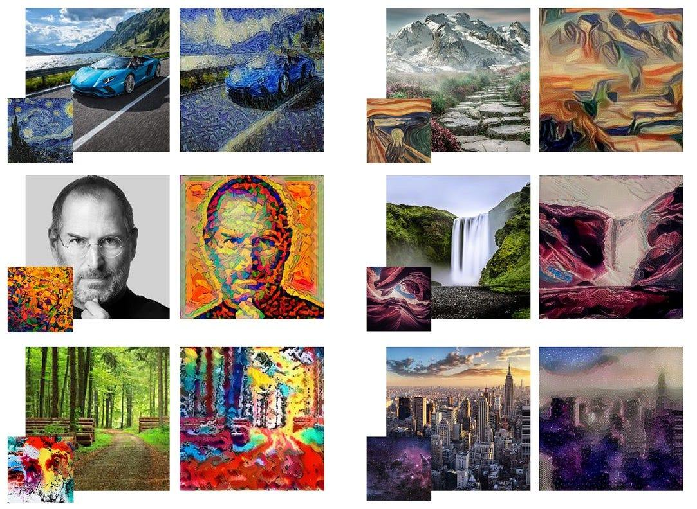

## Table of Contents

## What is style transfer in machine learning?

Style transfer in machine learning is a technique where the style of one image is applied to another image while keeping the content of the original image. Imagine you have a photo of a city skyline and a painting by Van Gogh. Style transfer would let you create a new image that looks like the city skyline was painted in Van Gogh's unique style. This is done using neural networks, which are computer systems designed to recognize patterns. These networks can separate and then combine the content of one image with the style of another.

The process works by using a pre-trained neural network, often one that has learned to recognize many different images. This network can break down images into their content and style components. The content is what the image is about, like the city skyline, while the style is how it's presented, like Van Gogh's brush strokes. By adjusting the weights in the network, the algorithm can blend these components. For example, it might keep 70% of the original content and mix in 30% of the new style. The result is a new image that feels like a creative blend of the two inputs.

## How does a style transfer model work?

A style transfer model works by using a special kind of computer program called a neural network. This network is trained to understand images by looking at lots of pictures. When you want to do style transfer, you give the network two images: one for the content and one for the style. The network then tries to create a new image that keeps the main parts of the content image but makes it look like it was painted or drawn in the style of the other image. It does this by breaking down the images into smaller pieces and figuring out how to mix them together.

The process involves adjusting the image many times to get it just right. The [neural network](/wiki/neural-network) uses something called loss functions to guide this process. There are two main types of loss functions: content loss and style loss. Content loss makes sure the new image keeps the important parts of the original content, while style loss makes sure it looks like the style image. The network keeps tweaking the image until it finds a good balance between these two. This back-and-forth adjustment is what makes the final image look like a creative blend of the two inputs.

## What are the main components of a style transfer model?

A style transfer model uses a special computer program called a neural network. This network is trained on lots of pictures to understand what makes up an image. When you want to do style transfer, you give the network two images: one for the content and one for the style. The network then works to create a new image that keeps the main parts of the content image but makes it look like it was painted or drawn in the style of the other image. It does this by breaking down the images into smaller pieces and figuring out how to mix them together.

The main parts of a style transfer model are the content loss and the style loss. Content loss helps make sure the new image keeps the important parts of the original content. Style loss makes sure the new image looks like it was made in the style of the other image. The network keeps adjusting the image many times, using these two types of loss to guide it. It tries to find a good balance between keeping the content and applying the style until it creates an image that feels like a creative mix of the two inputs.

## What is LapStyle and how does it differ from other style transfer models?

LapStyle is a special kind of style transfer model that focuses on making the edges and details in the new image look really sharp and clear. It uses something called Laplacian pyramids, which are like layers of an image where each layer shows more and more detail. LapStyle breaks down both the content and style images into these layers and then mixes them together layer by layer. This helps the final image keep the important details from the content while still looking like it was painted in the style of the other image.

What makes LapStyle different from other style transfer models is how it pays special attention to the details. Many other models might mix the content and style in a more general way, which can sometimes make the new image look a bit blurry or lose some of the fine details. But LapStyle's use of Laplacian pyramids helps it keep those details sharp. So, if you want a style transfer image that looks really clear and detailed, LapStyle might be a good choice.

## What are the typical applications of style transfer models?

Style transfer models are used in many fun and creative ways. One common use is in art and design, where artists and designers can take a photo and turn it into a piece of art that looks like it was painted by a famous artist like Picasso or Van Gogh. This can be used to make unique pieces of art or to give a new look to old photos. Another use is in the entertainment industry, where these models can help create special effects for movies or video games, making scenes look like they belong in a different time or place.

In addition to art and entertainment, style transfer models are also used in marketing and advertising. Companies can use these models to create eye-catching images for their ads, making their products stand out in a crowded market. For example, a company might use style transfer to make their product look like it's part of a famous painting, which can draw more attention and make the ad more memorable. Overall, style transfer models help people be more creative and can make images more interesting and engaging.

## What are the key challenges faced when training style transfer models?

Training style transfer models can be tricky because they need to balance two different things: keeping the content of the original image and applying the style of another image. This balance is hard to get right. If the model focuses too much on the content, the new image might not look like it has the new style. But if it focuses too much on the style, important details from the content image might get lost. This challenge is called the content-style trade-off, and finding the right mix is a big part of training these models.

Another challenge is that style transfer models need a lot of computer power. They use big neural networks that take a long time to train and need a lot of memory. This can make it hard for people without powerful computers to use these models. Also, the training process can be slow because the model has to adjust the image many times to get it right. This means it can take a long time to create a good style transfer image, which can be frustrating for people who want quick results.

## How can the performance of a style transfer model be evaluated?

The performance of a style transfer model can be evaluated by looking at how well it balances the content and style of the images it creates. One way to do this is by using loss functions. There are two main types of loss functions: content loss and style loss. Content loss measures how much the new image keeps the important parts of the original content image. Style loss measures how much the new image looks like it was made in the style of the style image. The model's performance is good if it can keep the content loss low while also keeping the style loss low, which means it successfully mixes the content and style well.

Another way to evaluate the performance is by looking at the images the model creates. People can look at these images and judge if they look good and if they match what the model was supposed to do. This is called a visual assessment. If the new images look clear and detailed, and if they really seem to have the style of the style image while still showing the main parts of the content image, then the model is doing a good job. Sometimes, people also use special computer programs to compare the new images to the original ones and see how well the model did.

## What are some common techniques used to optimize style transfer models?

One common technique to optimize style transfer models is called "adaptive instance normalization" or AdaIN. This method helps the model mix the content and style of images more smoothly. It works by adjusting the way the model looks at the style image, making it easier to apply that style to the content image. This can make the training process faster and the final images look better. Another technique is using "perceptual loss," which helps the model understand how people see images. By using this kind of loss, the model can create images that look more natural to human eyes, even if they are a mix of different styles and content.

Another optimization technique is "multi-level style transfer." This method breaks down the images into different layers, kind of like looking at them through a magnifying glass at different zoom levels. By working on each layer separately, the model can make sure that both the big picture and the small details are styled correctly. This can help keep the content image clear while still applying the style in a way that looks good. Overall, these techniques help make style transfer models faster and more effective at creating images that look both artistic and true to the original content.

## How does LapStyle handle different levels of image details in style transfer?

LapStyle uses something called Laplacian pyramids to handle different levels of image details in style transfer. Laplacian pyramids are like layers of an image where each layer shows more and more detail. LapStyle breaks down both the content and style images into these layers and then mixes them together layer by layer. This way, it can pay special attention to the small details in the images. By working on each layer separately, LapStyle can make sure that both the big picture and the small details are styled correctly.

This approach helps LapStyle keep the content image clear while still applying the style in a way that looks good. For example, if you want to make a photo of a city skyline look like a Van Gogh painting, LapStyle can keep the buildings and other important parts of the skyline clear while also making the whole image look like it was painted with Van Gogh's unique style. By handling the image details at different levels, LapStyle creates a final image that feels like a creative blend of the two inputs, with sharp and clear details.

## What are the computational requirements for running LapStyle compared to other models?

LapStyle needs a lot of computer power to run because it uses Laplacian pyramids to handle image details at different levels. This means it has to break down the images into many layers and then mix them together, which takes more time and memory than some other style transfer models. For example, models that do not use Laplacian pyramids might just mix the content and style in one go, which can be faster but might not keep the details as sharp.

Compared to other models, LapStyle might take longer to create a new image because it works on each layer of the image separately. This can be a challenge for people who do not have powerful computers. However, the extra time and power LapStyle uses can be worth it if you want a style transfer image that looks really clear and detailed.

## How can style transfer models like LapStyle be integrated into existing machine learning pipelines?

Style transfer models like LapStyle can be integrated into existing [machine learning](/wiki/machine-learning) pipelines by adding them as a step where you want to change the look of images. For example, if you have a pipeline that processes photos, you can add LapStyle after the step where the photos are cleaned up and before they are saved or used in another part of the system. This way, the photos can be turned into art pieces that look like they were painted by famous artists, which can make them more interesting or fit better with the theme of your project. To do this, you just need to make sure your pipeline can handle the extra time and computer power LapStyle needs to create these detailed images.

Integrating LapStyle into a pipeline also means making sure it works well with the other parts of your system. You might need to adjust the settings of LapStyle to match the style and content images you are using, and make sure the output images are saved in the right format for the next steps in your pipeline. If your pipeline is set up to run on a cloud service or a powerful computer, this can help handle the extra work LapStyle requires. By carefully fitting LapStyle into your pipeline, you can create beautiful and detailed images that add a lot of value to your project.

## What are the future research directions for style transfer models, particularly for LapStyle?

Future research for style transfer models, including LapStyle, could focus on making them faster and easier to use. Right now, models like LapStyle need a lot of computer power because they break down images into many layers and mix them together. Researchers might look for new ways to do this that use less time and memory. They could also work on making these models work better on regular computers, not just powerful ones. Another area to explore is how to make the style transfer process automatic, so it can choose the best style for an image without people having to pick it themselves.

Another direction for LapStyle could be improving how it handles different levels of image details. While LapStyle already does a good job with this, researchers might find ways to make it even better at keeping small details clear while still applying the new style. They could also look at how to make LapStyle work with different types of images, like videos or 3D models. This would open up new uses for style transfer, like making movies or video games look like they were made in a certain style. Overall, the goal is to make style transfer models more useful and accessible to more people.

## References & Further Reading

[1]: Gatys, L. A., Ecker, A. S., & Bethge, M. (2016). ["Image Style Transfer Using Convolutional Neural Networks."](https://ieeexplore.ieee.org/document/7780634) IEEE Conference on Computer Vision and Pattern Recognition (CVPR).

[2]: Johnson, J., Alahi, A., & Fei-Fei, L. (2016). ["Perceptual Losses for Real-Time Style Transfer and Super-Resolution."](https://arxiv.org/abs/1603.08155) European Conference on Computer Vision (ECCV).

[3]: Li, Y., Fang, C., Yang, J., Wang, Z., Lu, X., & Yang, M.-H. (2017). ["Universal Style Transfer via Feature Transforms."](https://arxiv.org/abs/1705.08086) Advances in Neural Information Processing Systems (NeurIPS).

[4]: Zhu, L., Gao, C., Wu, J., Han, X., & Fu, Y. (2020). ["LapStyle: A Lapped Style Transfer Network."](https://www.sciencedirect.com/science/article/pii/S138589472501633X) arXiv.

[5]: Jing, Y., Yang, Y., Feng, Z., Ye, J., & Yu, Y. (2019). ["Neural Style Transfer: A Review."](https://ieeexplore.ieee.org/document/8732370) IEEE Transactions on Visualization and Computer Graphics.