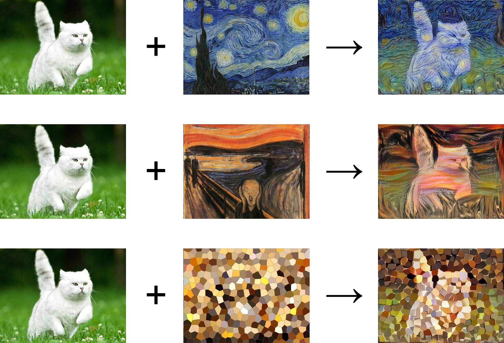

## Table of Contents

## What is style transfer in machine learning?

Style transfer in machine learning is a technique that lets you take the style of one image and apply it to another. Imagine you have a photo of a city skyline and a painting by Van Gogh. With style transfer, you can make the city skyline look like it was painted by Van Gogh. This is done using neural networks, which are a type of artificial intelligence that can learn and recognize patterns in images.

The process involves two main parts: the content of the image and the style of the image. The neural network separates these two aspects. It keeps the content, like the shapes and objects in the city skyline, but changes the style to match Van Gogh's painting. This means the colors, brush strokes, and textures from Van Gogh's work are applied to the city skyline, creating a new image that blends the two. It's like mixing the content of one image with the artistic style of another.

## How do style transfer modules work?

Style transfer modules work by using a type of neural network called a convolutional neural network (CNN). These networks are good at understanding images. They can break down an image into its content and style. The content is what the image shows, like a cat or a tree. The style is how the image looks, like the colors and the way it's painted. The neural network learns to separate these two parts. It then mixes the content of one image with the style of another to create a new image.

To do this, the [neural network](/wiki/neural-network) uses something called loss functions. There are two types of loss functions: content loss and style loss. Content loss measures how much the new image's content matches the original content image. Style loss measures how much the new image's style matches the style image. The neural network tries to minimize both losses. This means it tries to make the new image look as much like the content image as possible, while also making it look as much like the style image as possible. By balancing these two, the network creates a new image that blends the two inputs.

## What are the key components of a style transfer module?

The key components of a style transfer module include a [convolutional neural network](/wiki/convolutional-neural-network) (CNN), content and style images, and loss functions. The CNN is the brain of the operation. It looks at the images and figures out what they show and how they look. The content image is what you want to keep, like a picture of a cat. The style image is what you want to copy, like a painting by Van Gogh. The loss functions help the CNN do its job. They tell the network how well it's doing at keeping the content and copying the style.

The content loss function measures how much the new image looks like the content image. If the new image has a cat in it, the content loss function checks if the cat looks right. The style loss function measures how much the new image looks like the style image. It checks if the new image has the right colors and brush strokes. The CNN uses these loss functions to make the new image. It keeps trying until it finds the best way to mix the content and the style. This way, you get a new image that looks like the cat was painted by Van Gogh.

## What is the difference between a Revision Network and a Drafting Network in style transfer?

In style transfer, a Revision Network and a Drafting Network work together to create the final image. The Drafting Network is like a rough sketch artist. It takes the content image and the style image and makes a first try at mixing them. It's not perfect, but it's a good start. The Drafting Network helps by quickly making an image that has both the content and the style.

The Revision Network is like an editor. It looks at the rough sketch from the Drafting Network and makes it better. It fixes the colors, the shapes, and the details to make the image look more like the style image. The Revision Network keeps working until the image is just right. Together, the Drafting Network and the Revision Network make the style transfer process faster and better.

## How can beginners start experimenting with style transfer?

Beginners can start experimenting with style transfer by using online tools and platforms that make it easy to try without needing to know how to code. Websites like DeepArt and Runway ML allow you to upload your content image and choose a style image. You can then see the results in just a few clicks. These platforms often have a variety of styles to choose from, so you can play around and see what different styles look like on your image.

If you want to dive deeper and learn how to do style transfer yourself, you can use programming languages like Python with libraries such as TensorFlow or PyTorch. These libraries have pre-built models that you can use to start experimenting right away. For example, you can use a simple script to load your content and style images, apply the style transfer, and then save the result. This way, you can tweak the settings and see how the output changes, helping you understand the process better.

## What are some common applications of style transfer modules?

Style transfer modules are used in many fun and creative ways. One common use is in art and design. Artists and designers can use style transfer to create new pieces of art by mixing their photos with the styles of famous painters like Van Gogh or Picasso. This can help them come up with new ideas and make their work stand out. People also use style transfer to make cool pictures for social media or to decorate their homes.

Another use of style transfer is in movies and video games. Filmmakers can use it to change the look of scenes to fit different moods or styles. For example, they might make a scene look like it's from an old black-and-white film or a colorful cartoon. In video games, developers can use style transfer to give different parts of the game a unique look. This can make the game more interesting and fun to play.

## What are the challenges faced when implementing style transfer modules?

One of the biggest challenges when implementing style transfer modules is the computational cost. Style transfer can take a lot of time and power to process, especially if you're working with big images or videos. The neural networks used for style transfer need to do a lot of math to mix the content and style just right. This can make your computer slow down or take a long time to finish the job. To make it faster, you might need special hardware like a powerful graphics card, but not everyone has access to that.

Another challenge is getting the right balance between the content and the style. Sometimes, the style can take over too much, and the content of the original image gets lost. Other times, the style might not show up enough, and the image doesn't look different from the original. Finding the perfect mix is hard and often needs a lot of tweaking. You might have to play around with the settings a lot to get the result you want. This can be frustrating and time-consuming, especially for beginners.

## How do you evaluate the performance of a style transfer module?

Evaluating the performance of a style transfer module involves looking at how well it keeps the content of the original image while applying the style of another image. This is usually done by using loss functions, which measure how close the new image is to the content and style images. Content loss checks if the main elements of the content image, like shapes and objects, are still recognizable in the new image. Style loss looks at how well the new image captures the colors, textures, and patterns of the style image. The goal is to minimize both content and style loss, which means finding a good balance between keeping the original content and applying the new style.

To get a better idea of performance, you can also use visual inspection and user feedback. By looking at the output images, you can see if the style transfer looks good to the eye. Does the new image look like the content image was painted in the style of the style image? User feedback can tell you if other people think the style transfer works well. Sometimes, you might also use special metrics like the Gram matrix to measure how similar the style of the new image is to the style image. The Gram matrix helps compare the patterns and textures in the images. By combining these methods, you can get a full picture of how well your style transfer module is doing.

## What advanced techniques can be used to improve the results of style transfer?

One advanced technique to improve the results of style transfer is using multi-style transfer. Instead of just using one style image, you can mix multiple styles into one image. This can create more interesting and complex results. For example, you might combine the colors of one painting with the brush strokes of another. To do this, you can use a neural network that can handle multiple style inputs. This means the network has to learn how to balance different styles at the same time, which can be tricky but can lead to really cool effects.

Another technique is using attention mechanisms. Attention helps the neural network focus on the important parts of the image when doing the style transfer. For example, it can pay more attention to the main object in the content image and make sure it keeps its shape while applying the style. This can make the final image look better because the content is clearer and the style is applied more accurately. By using attention, you can guide the neural network to do a better job at mixing the content and style, leading to more satisfying results.

## How do Revision Networks and Drafting Networks interact within a style transfer module?

In a style transfer module, the Drafting Network and the Revision Network work together to create the final image. The Drafting Network starts the process by taking the content image and the style image and making a rough sketch. It quickly mixes the content and style to create an initial image that isn't perfect but gives a good starting point. This rough sketch helps speed up the overall process because it gives the Revision Network something to work with right away.

The Revision Network then takes over, acting like an editor that refines the rough sketch from the Drafting Network. It looks at the initial image and makes adjustments to better match the style image while keeping the content clear. The Revision Network might change the colors, tweak the shapes, and refine the details until the final image looks just right. By working together, the Drafting Network and the Revision Network make the style transfer process more efficient and produce higher-quality results.

## What are the latest research trends in style transfer modules?

The latest research in style transfer modules is focusing on making the process faster and more accurate. One big trend is using something called "adaptive instance normalization" to better mix the content and style. This method helps the neural network adjust the style more precisely to fit the content image. Another trend is using "few-shot learning," which means the neural network can learn to do style transfer from just a few examples. This makes it easier to apply new styles without needing a lot of training data. Researchers are also looking into ways to make style transfer work in real-time, so it can be used in videos or live streams.

Another exciting area of research is exploring how to transfer styles across different types of media, like turning a photo into a painting or even a 3D model. This involves using more advanced neural networks that can understand and transform different kinds of data. Researchers are also working on making style transfer more user-friendly, so people can easily customize the results. For example, they might let users choose which parts of the image they want to focus on for the style transfer. These trends show that style transfer is becoming more versatile and accessible, opening up new possibilities for creativity and practical applications.

## How can style transfer modules be integrated into larger machine learning systems?

Style transfer modules can be integrated into larger [machine learning](/wiki/machine-learning) systems to enhance their capabilities. For example, in a system designed for image editing or graphic design, a style transfer module can be used as a tool to quickly apply artistic styles to images. This can be done by connecting the style transfer module to the main system's user interface, allowing users to select content and style images and then see the results in real-time. The module can be trained and fine-tuned within the larger system to ensure it works well with other components, like image recognition or object detection modules, to provide a seamless user experience.

In more complex systems, like those used in video production or gaming, style transfer modules can be part of a pipeline that processes images or video frames. Here, the style transfer module might work alongside other modules that handle tasks like video stabilization or character animation. By integrating the style transfer module into this pipeline, the system can apply different styles to different parts of the video or game, enhancing the visual appeal and creating more immersive experiences. This integration requires careful coordination to ensure that the style transfer process does not slow down the overall system performance, often necessitating the use of efficient algorithms and powerful hardware.