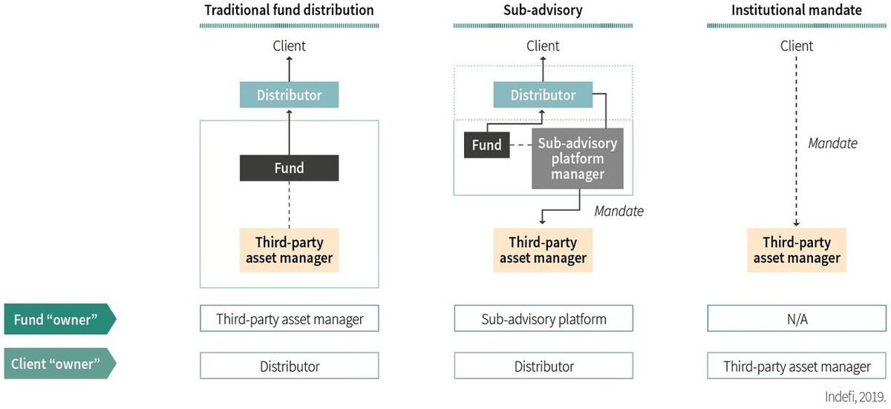

## Table of Contents

## What is a sub-advised fund?

A sub-advised fund is a type of investment fund where the main manager, or primary advisor, hires another company, called a sub-advisor, to handle the day-to-day management of the fund's investments. This setup is common in the mutual fund industry, where the primary advisor might not have the expertise or resources to manage certain types of investments, so they bring in specialists to do that job.

The primary advisor still oversees the overall strategy and performance of the fund, but the sub-advisor makes the specific investment decisions. This can be beneficial for investors because it allows the fund to tap into the expertise of specialized managers, potentially leading to better performance. However, it can also add complexity and potentially higher fees, as both the primary advisor and the sub-advisor need to be compensated for their services.

## How does a sub-advised fund differ from a regular mutual fund?

A sub-advised fund and a regular mutual fund both aim to grow investors' money, but they work a bit differently. In a regular mutual fund, one company manages all the investments. They decide what to buy and sell, and they handle everything from start to finish. This means the fund's performance depends entirely on the skills and decisions of that one company.

In a sub-advised fund, the main company, called the primary advisor, hires another company, known as the sub-advisor, to do the actual investing. The primary advisor still watches over the fund but leaves the daily decisions to the sub-advisor. This can be good because it lets the fund use experts who know a lot about certain types of investments. But it can also mean more fees, since both the primary advisor and the sub-advisor get paid.

## Who typically manages a sub-advised fund?

A sub-advised fund is managed by two main groups: the primary advisor and the sub-advisor. The primary advisor is the main company in charge of the fund. They set the overall goals and keep an eye on how the fund is doing. But they don't make the daily investment decisions. Instead, they hire a sub-advisor to do that part.

The sub-advisor is a different company that the primary advisor trusts to manage the fund's money. They pick which stocks, bonds, or other investments to buy and sell every day. This setup lets the fund use experts who know a lot about certain types of investments. So, while the primary advisor watches over everything, the sub-advisor does the actual investing.

## What are the advantages of investing in a sub-advised fund?

One big advantage of investing in a sub-advised fund is that it lets you use the skills of experts. The main company, called the primary advisor, hires another company, known as the sub-advisor, to handle the day-to-day investing. This means the fund can be managed by people who really know a lot about certain types of investments. If the main company doesn't have experts in a specific area, they can bring in someone who does. This can lead to better choices and possibly better returns for investors.

Another advantage is that sub-advised funds can be more flexible. The primary advisor can change sub-advisors if they think someone else might do a better job. This means the fund can adapt to new market conditions or investment opportunities more easily. It's like having a team of specialists working together to make the best decisions for the fund, which can be a big plus for investors looking for a smart and adaptable way to grow their money.

## What are the potential drawbacks of sub-advised funds?

One potential drawback of sub-advised funds is that they can be more expensive. Since there are two companies involved - the primary advisor and the sub-advisor - both need to be paid. This means that the fees for managing the fund might be higher than for a regular mutual fund where only one company does all the work. Higher fees can eat into the returns that investors get, making it harder to grow their money as much as they might want.

Another issue with sub-advised funds is that they can be more complex. With two companies working together, it can be harder for investors to understand exactly how their money is being managed. If something goes wrong, it might be tricky to figure out who is responsible - the primary advisor or the sub-advisor. This added complexity can make it harder for investors to feel confident about where their money is going and how it's being looked after.

## How are fees structured in sub-advised funds?

In sub-advised funds, the fees are usually split between the primary advisor and the sub-advisor. The primary advisor charges a management fee for overseeing the fund and making sure everything runs smoothly. This fee is usually a percentage of the total assets in the fund. The sub-advisor, who does the day-to-day investing, also gets a fee. This fee can be part of the management fee or an additional charge, depending on how the fund is set up.

These fees can add up, making sub-advised funds more expensive than regular mutual funds. Investors need to look at the fund's prospectus to see exactly what they will be paying. The total cost might include the management fee, the sub-advisor's fee, and other expenses like administrative costs. It's important for investors to understand all these fees because they can affect how much money they make from their investment in the end.

## Can you explain the role of the sub-advisor in a sub-advised fund?

In a sub-advised fund, the sub-advisor is the company that the primary advisor hires to handle the day-to-day investing. Their main job is to pick which stocks, bonds, or other investments to buy and sell. This means they make all the specific decisions about where the fund's money goes every day. The sub-advisor is usually brought in because they have special knowledge or skills in certain types of investments that the primary advisor might not have.

The primary advisor still keeps an eye on everything and makes sure the fund is following its overall goals. But they leave the detailed work to the sub-advisor. This setup can help the fund do better because it uses experts who really know their stuff. However, it also means there are two companies involved, which can make things a bit more complicated and possibly more expensive for investors.

## How does the selection process for a sub-advisor work?

The primary advisor picks a sub-advisor by looking for a company that has special skills or knowledge in the type of investments they need help with. They might look at how well the sub-advisor has done in the past, what they charge for their services, and if they fit well with the fund's goals. The primary advisor wants to make sure the sub-advisor can help the fund do well, so they do a lot of research before making a choice.

Once they find a good sub-advisor, the primary advisor will set up an agreement. This agreement says what the sub-advisor will do and how much they will be paid. The primary advisor keeps an eye on the sub-advisor to make sure they are doing a good job. If the sub-advisor isn't helping the fund grow as expected, the primary advisor might decide to find a different sub-advisor to take over.

## What types of investors are sub-advised funds most suitable for?

Sub-advised funds are most suitable for investors who want to use the skills of experts to manage their money. These investors might not have the time or knowledge to pick their own investments, so they look for funds that can do it for them. A sub-advised fund can be a good choice because it uses a special company, called a sub-advisor, to handle the day-to-day investing. This means the fund can use people who really know a lot about certain types of investments, which can lead to better choices and possibly better returns.

These funds can also be good for investors who are okay with paying a bit more for the chance to get better results. Since sub-advised funds have two companies working together - the primary advisor and the sub-advisor - they can be more expensive. But if the extra cost leads to better performance, some investors might think it's worth it. So, sub-advised funds are best for people who want expert help and are willing to pay for it, hoping it will help their money grow more.

## How do sub-advised funds perform compared to other investment vehicles?

Sub-advised funds can sometimes do better than other investment vehicles because they use experts to handle the day-to-day investing. The primary advisor hires a sub-advisor who knows a lot about certain types of investments. This can lead to smarter choices and possibly better returns for investors. But it's not always a sure thing. The performance of a sub-advised fund depends a lot on how good the sub-advisor is and how well they work with the primary advisor.

On the other hand, sub-advised funds can be more expensive than other types of funds. This is because there are two companies involved, and both need to be paid. Higher fees can eat into the returns that investors get, which might make it harder for the fund to do better than other investment vehicles. So, while sub-advised funds have the potential to perform well, their higher costs and the need for good teamwork between the primary advisor and the sub-advisor can affect how they do compared to other options.

## What regulatory considerations should be noted for sub-advised funds?

Sub-advised funds have to follow rules set by groups like the Securities and Exchange Commission (SEC) in the United States. These rules make sure that the fund is run fairly and that investors are protected. The primary advisor and the sub-advisor both need to follow these rules. For example, they have to be clear about how much they charge and what they do with the money. They also need to tell investors if anything big changes, like if they switch sub-advisors.

Another important rule is that the primary advisor has to keep a close eye on the sub-advisor. They need to make sure the sub-advisor is doing a good job and following the rules. If the sub-advisor isn't doing well or breaks any rules, the primary advisor might have to find a new sub-advisor. This helps make sure that the fund keeps working in the best way for investors.

## How has the use of sub-advised funds evolved in the investment industry?

The use of sub-advised funds has grown a lot over the years in the investment world. At first, they were not very common. But as more investors looked for ways to use experts to manage their money, sub-advised funds became more popular. The main reason is that they let the primary advisor bring in a sub-advisor who knows a lot about certain types of investments. This can help the fund make better choices and possibly do better for investors.

Now, many big investment companies use sub-advised funds. They see it as a way to offer more choices to investors and to use the best experts for different parts of the market. But as sub-advised funds have become more common, people have also started to think more about the costs. Since there are two companies involved, the fees can be higher. This means investors need to think carefully about whether the possible benefits of a sub-advised fund are worth the extra cost.

## What is Understanding Investment Management Financial Services?

Investment management financial services are designed to manage financial assets efficiently to meet the specific goals of individuals and organizations. This involves a comprehensive set of activities aimed at optimizing stock portfolios, customizing investment strategies, and vigilantly monitoring financial markets. These services are not just about managing money; they are about aligning investment decisions with broader financial goals and risk tolerance levels.

Key components of investment management include portfolio optimization, which is the process of selecting the best distribution of a suite of financial instruments to maximize returns for a given level of risk. The concept is often mathematically expressed using the Modern Portfolio Theory (MPT), which aims to construct a portfolio to achieve the best possible return for a given level of risk based on historical data. The mathematical formulation for this optimization problem involves minimizing the portfolio variance:

$$
\text{Minimize} \quad \sigma_p^2 = \mathbf{w}^T \mathbf{\Sigma} \mathbf{w}
$$

subject to the constraints:

$$
\sum_{i=1}^{n} w_i = 1
$$

$$
E(R_p) = \mathbf{w}^T \mathbf{\mu}
$$

where $\mathbf{w}$ represents the vector of weights for the assets in the portfolio, $\mathbf{\Sigma}$ is the covariance matrix of asset returns, $\mathbf{\mu}$ is the vector of expected returns, $E(R_p)$ is the expected return of the portfolio, and $\sigma_p^2$ is the portfolio variance.

Another critical component is the customization of investment strategies, which allows financial services to tailor strategies to individual investor profiles. This could involve selecting different asset classes, defining specific sectors for investment, or adopting unique investment styles such as ethical investing.

The responsibility of monitoring financial markets involves staying informed about economic indicators, market trends, and geopolitical events that could impact asset values. This ongoing analysis helps in making informed choices regarding asset allocation and risk management. 

Investment management services are essential for achieving financial objectives, whether it's growing wealth, saving for retirement, or managing institutional funds. The ability to effectively combine research, strategic asset allocation, and risk management underlines the value these services deliver to investors. As the financial landscape evolves with technological advancements and new financial instruments, the methods and strategies used in investment management continue to advance, ensuring that they remain a pivotal part of the financial ecosystem.

## References & Further Reading

[1]: ["Modern Portfolio Theory and Investment Analysis"](https://www.amazon.com/Modern-Portfolio-Theory-Investment-Analysis/dp/1118469941) by Edwin J. Elton, Martin J. Gruber, Stephen J. Brown, and William N. Goetzmann

[2]: Hasbrouck, J. (2003). ["Intraday Price Formation in U.S. Equity Markets"](https://onlinelibrary.wiley.com/doi/10.1046/j.1540-6261.2003.00609.x). The Journal of Finance.

[3]: Treynor, J.L. (1965). ["How to Rate Management of Investment Funds"](https://onlinelibrary.wiley.com/doi/10.1002/9781119196679.ch10). Harvard Business Review, 43(1), 63-75.

[4]: Aldridge, I. (2010). ["High-Frequency Trading: A Practical Guide to Algorithmic Strategies and Trading Systems"](https://onlinelibrary.wiley.com/doi/pdf/10.1002/9781119203803.fmatter) by Irene Aldridge

[5]: Lo, A.W., & MacKinlay, A.C. (1999). ["A Non-Random Walk Down Wall Street"](https://www.amazon.com/Non-Random-Walk-Down-Wall-Street/dp/0691092567) by Andrew W. Lo and A. Craig MacKinlay