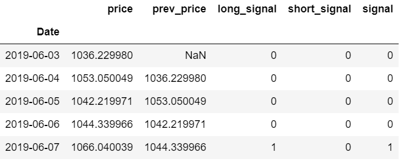

Algorithmic trading represents a significant evolution in modern financial markets, leveraging computational power and complex algorithms to execute trades with precision and speed unattainable by human traders. This technological advancement relies heavily on statistical models and theories to analyze market data, predict trends, and make informed trading decisions.

Among the essential mathematical tools employed in algorithmic trading are martingales, sub-martingales, and super-martingales, derived from probability theory. These concepts help traders and analysts understand and model the random behavior of financial markets. A martingale is a stochastic process where the conditional expectation of future values, given past and present values, is equal to the present value. This property renders martingales useful in assessing fair games and pricing financial derivatives.



Sub-martingales and super-martingales, which account for scenarios where expected values can diverge over time, offer additional layers of analysis. Sub-martingales typically model processes where there is an expected gain over time, while super-martingales represent those with an expected loss or stable decline. These variations are crucial in evaluating the performance and reliability of trading strategies, allowing traders to adjust their approaches based on probabilistic trends.

This article examines the relevance of martingales and the specific roles of sub- and super-martingale tests in optimizing algorithmic trading strategies. By exploring these statistical tools, traders can enhance their ability to react to market changes, manage risk effectively, and improve the robustness of their trading algorithms. Through the integration of these sophisticated concepts, market participants can maintain a competitive edge in the dynamic landscape of algorithmic trading.

## Table of Contents

## What are Martingales?

Martingales play a pivotal role in probability theory and have crucial applications in financial markets. A martingale is a stochastic process that represents a fair game. In mathematical terms, a sequence of random variables $X_1, X_2, X_3, \ldots$ is a martingale with respect to another sequence $Y_1, Y_2, Y_3, \ldots$ if the conditional expectation of the next value in the sequence, given all past values, is equal to the present value. Formally, this can be stated as:

$$
\mathbb{E}[X_{n+1} | X_1, X_2, \ldots, X_n] = X_n
$$

Martingales are key in modeling fair games, where there is no net gain or loss expected over the long term, which is akin to gambling scenarios or stock prices under efficient market hypothesis.

Differentiating between martingales, sub-martingales, and super-martingales is essential for understanding their utility. A sub-martingale is a stochastic process where the conditional expectation of the next term is at least the current term. This is expressed as:

$$
\mathbb{E}[X_{n+1} | X_1, X_2, \ldots, X_n] \geq X_n
$$

Sub-martingales are used in contexts where the process exhibits an upward drift over time, such as in increasing asset prices.

Conversely, a super-martingale is defined when the conditional expectation of the next term in the process does not exceed the current term:

$$
\mathbb{E}[X_{n+1} | X_1, X_2, \ldots, X_n] \leq X_n
$$

Super-martingales are applied when the process is expected to have a downward drift, like in scenarios involving depreciating assets or unfavorable market conditions.

In financial markets, these concepts help in constructing models of asset prices and devising trading strategies. Martingales particularly aid in valuing derivatives and ensuring pricing models abide by the no-[arbitrage](/wiki/arbitrage) principle. Sub-martingales can represent strategies for identifying bullish trends, while super-martingales are used for detecting bearish trends. Understanding these processes enables traders and financial analysts to adaptively respond to market movements, optimize portfolios, and manage risk more effectively.

## Examples of Martingale Processes

Martingale processes are foundational constructs in probability theory and find numerous applications in finance, particularly in the development and evaluation of trading strategies. A martingale is a sequence of random variables that exhibits fairness in probabilistic terms, meaning the expectation of the next value in the sequence, given all prior values, is equal to the present value.

### Real-World Examples

#### Independent Random Variables and Fair Coin Toss Betting

A classic illustration of a martingale involves a fair coin toss betting game. Consider a sequence of coin tosses where heads yield a win of $1 and tails impose a loss of $1. The cumulative winnings at each stage form a martingale because the expected value of the winnings at any stage, given the history of results, remains unchanged. If $X_n$ represents the cumulative winnings after $n$ tosses, then:

$$
E(X_{n+1} \mid X_1, X_2, \ldots, X_n) = X_n
$$

This property underscores the notion that, in a fair game, the participant's expected future capital, adjusted for past outcomes, remains constant.

#### Likelihood Ratios and Prior-Posterior Ratio Martingales

Likelihood ratios are used to update the probability of a hypothesis given new evidence. Consider a sequence of observations $X_1, X_2, \ldots, X_n$ from a statistical model; the likelihood ratio between two hypotheses forms a martingale under certain conditions. Specifically, if $L_n$ is the likelihood ratio at step $n$, then for any two hypotheses $H_0$ and $H_1$:

$$
E(L_{n+1} \mid X_1, X_2, \ldots, X_n) = L_n
$$

Prior-posterior ratio martingales arise when one updates the odds of competing hypotheses with Bayesian likelihoods. Assuming independent identically distributed data, the posterior odds form a martingale sequence, maintaining the property that the expected posterior given the observed data is equal to the prior.

#### General Betting Martingales

In betting scenarios, a general martingale can be constructed by adapting the stake or bet size based on past outcomes. Consider a betting strategy where the stake doubles after each loss and resets after a win, known as the Martingale betting strategy. Although theoretically appealing for recovering losses, it presents practical challenges due to the exponential growth of required stakes and capital limitations, thereby increasing the risk of ruin.

$$
\text{Stake at } n+1 = 2^n \times \text{initial stake},
$$

where $n$ represents the count of consecutive losses.

### Application Scenarios

Betting martingales are utilized by traders who attempt to "double down" on losing bets by increasing their position size with the idea of recouping losses. While this strategy may work under certain conditions, its application in financial markets is nuanced due to factors such as transaction costs, market [volatility](/wiki/volatility-trading-strategies), and leverage constraints.

In financial markets, likelihood ratio martingales assist in sequential hypothesis testing, often applied in [algorithmic trading](/wiki/algorithmic-trading) to adapt strategies in real-time as new information becomes available. By utilizing likelihood ratios, traders can estimate the efficacy of predictive models incrementally and update their strategies accordingly. 

In conclusion, understanding these practical and theoretical aspects of martingale processes is crucial for developing effective trading methods and assessing their inherent risks in algorithmic trading systems.

## Properties of Martingales

Martingales, sub-martingales, and super-martingales possess several fundamental properties integral to probability theory and financial modeling. One key characteristic is the property of conditional expectation. For a martingale $(X_t)$, it holds that:

$$
\mathbb{E}[X_{t+1} | \mathcal{F}_t] = X_t
$$

This implies the expected future value of the process, given current information, is equal to the current value. This property highlights the notion that martingales embody fair games, with no expected gain or loss over time.

Sub-martingales possess a slightly more relaxed condition. For a process $(Y_t)$ to be a sub-martingale, the next value's expectation is at least the current value:

$$
\mathbb{E}[Y_{t+1} | \mathcal{F}_t] \geq Y_t
$$

Conversely, a super-martingale $(Z_t)$ is defined such that:

$$
\mathbb{E}[Z_{t+1} | \mathcal{F}_t] \leq Z_t
$$

These expectations under sub- and super-martingales indicate potential trends or drifts in the process, with sub-martingales tending upwards and super-martingales downwards.

In financial modeling, martingales are crucial as they represent models of efficient markets where prices reflect all available information. This aligns with the Efficient Market Hypothesis, suggesting that it is impossible to consistently achieve excess returns. Sub-martingales, on the other hand, can be thought of as models for appreciating assets, where the expected price is non-decreasing, incorporating risk and time preferences. Super-martingales often model depreciating processes or scenarios where wealth is expected to decrease, possibly due to extraction or emissions.

These properties directly influence financial strategies and pricing models. One practical implication is in pricing derivatives, where martingale processes ensure that the option's price is fair—neither underpriced nor overpriced, assuming no arbitrage. Moreover, these properties help model risk processes, where sub- and super-martingales indicate certain financial guarantees or risk exposures, guiding decision-making and hedging tactics. By knowing these theoretical principles, financial practitioners and algorithmic traders can better gauge and test market-efficient strategies and their assumptions, adapting them to the stochastic nature of real-world markets.

## Martingale Convergence Theorems

Martingale convergence theorems are fundamental to the theory of stochastic processes, especially in the field of financial mathematics. These theorems provide insights into the behavior of martingale sequences, specifically their tendency to converge under certain conditions.

Doob's Martingale Convergence Theorem is a pivotal result in this context. It states that if a martingale is bounded in L^1 (the space of integrable functions), it converges almost surely and in L^1 to a limit. Mathematically, for a martingale $(X_n)$, if there exists a constant $C$ such that 

$$
\sup_{n} \mathbb{E}[|X_n|] \leq C,
$$

then there exists a random variable $X$ such that 

$$
\lim_{n \to \infty} X_n = X \, \text{almost surely and in}\, L^1.
$$

In financial theory, this theorem underpins the concept of the fair game in markets, where the expected value of the gains (or losses) at any point in time remains unchanged despite the uncertainties of individual trades. This convergence property helps in understanding the reliability and stability of trading strategies that are modelled as martingales.

Ville’s Inequality, another significant result pertinent to martingale processes, offers a probabilistic bound that is immensely useful in risk assessment and developing stopping rules. Ville's Inequality states that for a non-negative martingale $(M_n)$ with $M_0 = 1$, and for any $a > 1$,

$$
\mathbb{P}(\sup_{n} M_n \geq a) \leq \frac{1}{a}.
$$

In the context of trading, Ville's Inequality provides a method for assessing the probability of a martingale exceeding a certain bound, which aids in devising stopping times that limit the risk of excessive losses. This has practical applications in constructing algorithms that monitor trading positions, ensuring they can be halted under adverse market conditions before incurring significant losses.

The combined use of Doob's theorem and Ville's Inequality facilitates robust financial modeling by allowing traders to anticipate the long-term behavior of their strategies while controlling risk exposure through quantifiable measures.

## Sub- and Super-Martingale Tests

Sub-martingale and super-martingale tests are statistical tools utilized to evaluate and enhance algorithmic trading strategies by analyzing the nature of stochastic processes that represent asset prices or returns. These tests help traders and analysts determine if a trading strategy can outperform a random-walk model, contributing to more informed decision-making in financial markets.

Sub-martingales are processes where the expected future value, given all prior information, is at least as great as the present value, indicating a non-decreasing trend. Conversely, super-martingales exhibit a non-increasing expected trend. These processes are pivotal in identifying the potential drift in stock prices or financial instruments.

**Wald's Sequential Probability Ratio Test (SPRT):**

Wald's SPRT is a statistical method used to sequentially test hypotheses and assess the expected rate of growth in sub-martingale processes. In finance, SPRT aids in real-time decision-making regarding the continuation or termination of trading strategies by evaluating the likelihood of price changes as new data arrives.

The test compares the likelihood ratio, which is the probability of observing the given dataset under two hypotheses: 
- $H_0$: the process is a martingale (no predictable component)
- $H_1$: the process is a sub-martingale or super-martingale (has a predictable component)

The likelihood ratio $\Lambda_n$ for a sequence $X_1, X_2, \ldots, X_n$ is calculated as:

$$
\Lambda_n = \frac{P(X_1, X_2, \ldots, X_n \mid H_1)}{P(X_1, X_2, \ldots, X_n \mid H_0)}
$$

SPRT involves the continuous comparison of $\Lambda_n$ against two predetermined thresholds: $A$ and $B$ (where $A < B$). If $\Lambda_n > B$, the test favors $H_1$ (a sub-martingale process), and if $\Lambda_n < A$, it favors $H_0$. This test minimizes errors and decision times, which is crucial in fast-paced algorithmic trading environments.

**Empirical Bernstein Martingale Test:**

The Empirical Bernstein martingale test is an advanced method based on Bernstein inequalities, providing adaptive confidence intervals for assessing sub- and super-martingale behavior in trading algorithms. Unlike classical methods, it offers better performance in terms of variance control and is robust in dynamic market conditions.

This test constructs predictive intervals for stock returns by taking into account the empirical variance, which allows for error bounds adapting to observed data volatility. The empirical variance is used to compute a martingale deviation bound determined by:

$$
M_t = \sum_{i=1}^t (X_i - \mathbb{E}[X_i \mid \mathcal{F}_{i-1}])
$$

where $\mathcal{F}_{i-1}$ represents the information available up to time $i-1$. The bounded nature of this martingale aids traders in evaluating the potential profitability and risk level of trading strategies over time.

Both SPRT and the Empirical Bernstein martingale test are integral in detecting and leveraging statistical regularities in financial data, promoting the development of robust and adaptive algorithmic trading strategies. By employing these tests, traders can make more informed decisions, improve the likelihood of achieving sustainable gains, and effectively manage the inherent risks of trading activities.

## Implementing Martingale Strategies in Algo Trading

Algorithmic trading has revolutionized how transactions are conducted in financial markets, leveraging the power of automation, complex algorithms, and real-time data analysis to optimize trading strategies. Among the various strategies employed, martingale methods are notable for their application in both risk management and decision-making processes.

### Incorporating Martingale Strategies

In algorithmic trading, martingale strategies are often used for position sizing, where the idea is to double the stake in losing trades under the assumption that an eventual win will recover all losses and yield a profit. This approach can be coded into trading algorithms to automatically adjust trade sizes based on past performance.

Python Example: A simplified representation of a martingale-based strategy might look like this:

```python
def martingale_strategy(balance, bet, max_trades):
    trades = 0
    while balance > 0 and trades < max_trades:
        # Simulate a trade - In reality, this should be replaced with a real trading function
        win = simulate_trade()
        if win:
            balance += bet
            bet = initial_bet
        else:
            balance -= bet
            bet *= 2
        trades += 1
    return balance
```

In this pseudocode, `simulate_trade()` represents a function that determines if a particular trade wins or loses. The function continues trading until either the balance runs out or the maximum number of trades is reached. Upon a win, the betting amount resets, and on a loss, the bet size doubles.

### Risks and Mitigations

Despite their theoretical appeal, martingale strategies [carry](/wiki/carry-trading) inherent risks, largely due to their assumptions about market behavior. The primary risk is the potential for significant losses if the algorithm encounters a prolonged series of losing trades. This exposure is often referred to as the "risk of ruin," where the required capital to follow the strategy might exceed available funds, particularly in volatile markets.

Risk mitigation strategies could include setting a maximum bet size or loss limit to prevent disproportionate losses. Implementing stop-loss orders can also protect against extreme market movements. Furthermore, diversification into multiple assets or markets can lessen the risk of concentrating capital into one strategy or asset.

Additionally, adaptive algorithms that incorporate market data analysis can refine martingale strategies. These algorithms identify market trends or conditions where a classic martingale approach might prove advantageous or dangerous, allowing them to adjust the fundamental parameters of the strategy, such as the initial bet size or the progression rule.

In conclusion, while martingale strategies have their place in the toolkit of algorithmic trading, careful consideration and sophisticated risk management practices are essential. Balancing the theory with practical safeguards ensures that trading algorithms that utilize martingale concepts can effectively adapt to the often unpredictable nature of financial markets.

## Conclusion

The study of martingales and their application in algorithmic trading has provided valuable insights into the development of robust trading strategies. Martingales, with their nuanced concepts like sub-martingales and super-martingales, establish a foundation that is critical for understanding and modeling financial systems. By examining the properties and examples of martingale processes, traders and analysts can identify statistical tools that help in assessing the randomness and predicting potential trends in market behavior.

Understanding Doob's Martingale Convergence Theorem and Ville's Inequality broadens the scope of applying martingale properties in real-world trading scenarios, particularly by offering frameworks for anticipating outcomes and managing risk effectively. These mathematical bases help in constructing models where the expected value remains constant or follows a predictable path over time, providing a theoretical backbone for various trading algorithms.

The application of sub-martingale and super-martingale tests, including advanced methods like the Wald Sequential Probability Ratio Test and Empirical Bernstein martingale test, adds a critical layer of assessment in evaluating the efficacy of trading strategies. It empowers algorithmic traders to adapt strategies responsively, optimizing for dynamic market conditions while minimizing exposure to unforeseen risks.

The exploration of martingale strategies suggests that algorithmic trading benefits significantly from an understanding of these mathematical tools. It underscores the importance of continuous learning and adaptation to the ever-evolving market dynamics. As financial markets grow more complex, the deployment of advanced statistical techniques and rigorous testing remains paramount. By harnessing these tools, traders can make informed decisions, improving not only their algorithmic performance but also their resilience against market volatility. This iterative process of knowledge acquisition and application is vital for sustaining edge and competitiveness in financial trading.

## References & Further Reading

[1]: Shiryaev, A. N. (1995). Probability (2nd ed.). Springer-Verlag. This book provides a comprehensive foundation in probability theory, including martingale theory, which is essential for financial modeling.

[2]: Föllmer, H., & Schied, A. (2016). Stochastic Finance: An Introduction in Discrete Time (4th ed.). Walter de Gruyter. This text explores stochastic processes and the application of martingales in finance.

[3]: Doob, J. L. (1953). Stochastic Processes. John Wiley & Sons. This classic book includes foundational work on martingales and convergence theorems, crucial for understanding their application in quantitative finance.

[4]: Del Moral, P. (2000). "Measure-valued processes and interacting particle systems. Applications in social dynamic and finance." *Specialized Lectures*, C.I.M.E. Summer School on Stochastic Partial Differential Equations and Applications - IV. This lecture outlines the application of probability theories in financial processes.

[5]: Wald, A. (1945). "Sequential Tests of Statistical Hypotheses." *The Annals of Mathematical Statistics*, 16(2), 117-186. Wald's work on sequential testing, like the Sequential Probability Ratio Test, is crucial for real-time algorithmic trading decision frameworks.

[6]: Karatzas, I., & Shreve, S. E. (1991). Brownian Motion and Stochastic Calculus (2nd ed.). Springer-Verlag. This book provides aspects of continuous time martingales, relevant for advanced financial market modeling.