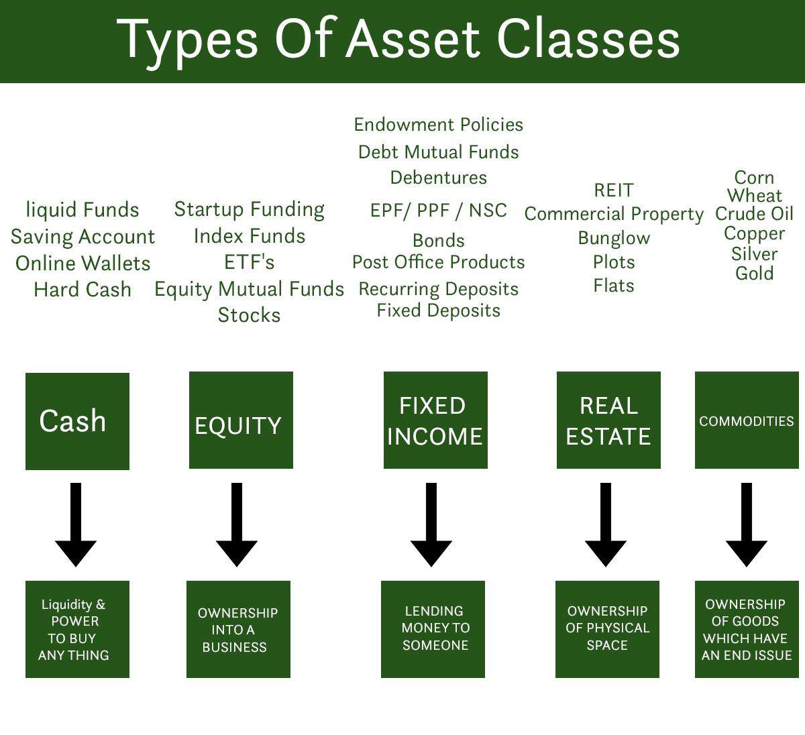

## Table of Contents

## What is a sub-asset class?

A sub-asset class is a smaller category within a larger asset class. Asset classes are broad groups of investments like stocks, bonds, and real estate. Sub-asset classes help investors to be more specific about where they put their money. For example, within the stock asset class, there are sub-asset classes like technology stocks, healthcare stocks, and energy stocks.

Understanding sub-asset classes can help investors make better choices. By looking at sub-asset classes, investors can see which parts of an asset class are doing well or not so well. This can help them decide where to invest their money to get the best return. For example, if technology stocks are doing better than energy stocks, an investor might choose to put more money into technology stocks.

## How does a sub-asset class differ from an asset class?

An asset class is a big group of investments that are similar in some ways. For example, stocks, bonds, and real estate are all different asset classes. They are big categories that help people understand the different types of investments they can make. When someone talks about an asset class, they are talking about a broad group of things that people can invest in.

A sub-asset class is a smaller group within an asset class. It helps break down the big category into smaller, more specific parts. For example, within the stock asset class, you can have sub-asset classes like technology stocks or healthcare stocks. These sub-asset classes let investors focus on specific areas within the bigger asset class. This can help them make better choices about where to put their money based on how well different parts of the asset class are doing.

## Can you provide examples of common sub-asset classes?

In the stock asset class, there are many sub-asset classes. Some common ones are technology stocks, healthcare stocks, and energy stocks. Technology stocks include companies that make things like computers and software. Healthcare stocks are companies that make medicines or run hospitals. Energy stocks are companies that find and sell oil, gas, or other energy sources.

In the bond asset class, sub-asset classes can be things like government bonds and corporate bonds. Government bonds are loans that people give to the government, and the government pays them back with interest. Corporate bonds are loans to companies, and the companies pay back the money with interest. These sub-asset classes help investors choose the type of bond that fits their needs.

Real estate is another asset class with sub-asset classes like residential real estate and commercial real estate. Residential real estate includes houses and apartments where people live. Commercial real estate includes buildings used for businesses, like offices and shopping centers. By looking at these sub-asset classes, investors can decide which type of real estate to invest in based on what is doing well in the market.

## Why is it important to understand sub-asset classes when investing?

Understanding sub-asset classes is important for investors because it helps them make smarter choices about where to put their money. When you know the different sub-asset classes within a big group like stocks or bonds, you can see which parts are doing well and which are not. For example, if you know that technology stocks are growing faster than energy stocks, you might decide to invest more in technology. This can help you get better returns on your investment because you're focusing on the parts of the market that are doing well.

It also helps you spread out your risk. By investing in different sub-asset classes, you're not putting all your money in one place. If one sub-asset class does badly, you still have money in other areas that might be doing better. For example, if you have money in both healthcare stocks and real estate, and healthcare stocks go down, your real estate investments might still be doing well. This way, you're not relying on just one type of investment to make money, which can make your overall investment safer.

## How do sub-asset classes impact portfolio diversification?

Sub-asset classes help with portfolio diversification by letting you spread your money across different types of investments within a big group. For example, if you only invest in stocks, you can still diversify by putting money into different sub-asset classes like technology stocks, healthcare stocks, and energy stocks. This way, if one type of stock goes down, the others might still be doing well, which can help protect your money.

Diversifying across sub-asset classes can also help you find the best places to invest your money. By looking at how different sub-asset classes are doing, you can see which ones are growing and which ones are not. For example, if you see that real estate is doing better than bonds, you might decide to put more money into real estate. This can help you make more money because you're focusing on the parts of the market that are doing well.

## What are the risk and return characteristics of different sub-asset classes?

Different sub-asset classes have different levels of risk and return. For example, within the stock asset class, technology stocks can be riskier but also have the potential for higher returns. This is because technology companies can grow very fast, but they can also fail if their products don't do well. On the other hand, utility stocks, which are companies that provide services like electricity and water, are usually less risky but also have lower returns. They are more stable because people always need these services, but they don't grow as fast as technology companies.

In the bond asset class, government bonds are usually seen as less risky than corporate bonds. This is because governments are less likely to go bankrupt than companies. So, government bonds often have lower returns because they are safer. Corporate bonds can offer higher returns, but they are riskier because the company might not be able to pay back the money. Within real estate, residential properties might be less risky than commercial properties because people always need places to live, but commercial properties can offer higher returns if they are in a good location and have good tenants.

Understanding these risk and return characteristics can help investors make better choices. By knowing which sub-asset classes are riskier and which ones offer higher returns, investors can decide how much risk they want to take and where to put their money to meet their goals. For example, someone who wants to be safe might put more money into government bonds and utility stocks, while someone who is okay with more risk might invest more in technology stocks and commercial real estate.

## How can investors identify and evaluate sub-asset classes?

Investors can identify sub-asset classes by looking at the different types of investments within a big group like stocks, bonds, or real estate. For example, within stocks, they can see sub-asset classes like technology stocks, healthcare stocks, and energy stocks. They can find this information by reading financial news, using investment websites, or talking to a financial advisor. By understanding these sub-asset classes, investors can see which parts of the market are doing well and which are not.

To evaluate sub-asset classes, investors need to look at how risky they are and how much money they can make. They can do this by looking at past performance, reading reports, and using tools like stock charts and financial ratios. For example, if they are looking at technology stocks, they might check how these stocks have done over the last few years and see if the companies are making more money. By comparing different sub-asset classes, investors can decide which ones fit their goals and how much risk they are willing to take.

## What role do sub-asset classes play in asset allocation strategies?

Sub-asset classes help investors decide how to spread their money across different types of investments. When making an asset allocation strategy, investors look at the big groups like stocks, bonds, and real estate. But they also look at the smaller groups within these big categories, like technology stocks or government bonds. By understanding these sub-asset classes, investors can choose which ones to put more money into based on how well they are doing and how much risk they want to take.

For example, if an investor wants to be safe, they might put more money into government bonds and utility stocks. These sub-asset classes are usually less risky. But if they want to take more risk for the chance of higher returns, they might invest more in technology stocks or commercial real estate. By looking at sub-asset classes, investors can make a plan that fits their goals and helps them spread out their risk.

## How have sub-asset classes evolved over time?

Sub-asset classes have changed a lot over time. In the past, people mostly thought about big groups like stocks, bonds, and real estate. But as the world got more complicated, new types of investments came along. For example, technology stocks became a big deal when computers and the internet started to grow. Now, there are even more specific sub-asset classes like social media stocks or electric vehicle stocks. These changes happened because new industries and technologies came up, and investors wanted to put their money into these new areas.

The way people think about sub-asset classes has also changed. Before, investors might have just looked at the big groups and not paid much attention to the smaller parts. But now, they know that looking at sub-asset classes can help them make better choices. They can see which parts of the market are doing well and which are not. This helps them decide where to put their money to get the best return. As the world keeps changing, new sub-asset classes will keep coming up, and investors will need to keep learning about them to make smart choices.

## What are some emerging sub-asset classes in the current market?

In today's market, some new sub-asset classes are becoming popular. One of these is renewable energy stocks. These are companies that make things like solar panels or wind turbines. People are putting more money into these stocks because they want to invest in clean energy and help the environment. Another new sub-asset class is [cryptocurrency](/wiki/cryptocurrency). This includes things like Bitcoin and Ethereum. Cryptocurrencies are different because they are not controlled by banks or governments, and they can be very risky but also offer big returns.

Another emerging sub-asset class is [ESG](/wiki/esg-investing) (Environmental, Social, and Governance) investing. This means investing in companies that are good for the planet, treat their workers well, and run their business in a fair way. More and more people want to put their money into companies that do good things. Also, there are new types of real estate sub-asset classes like co-living spaces and short-term rentals. These are places where people can live together or rent a home for a short time. These sub-asset classes are growing because more people are looking for different ways to live and invest.

## How do global economic factors influence sub-asset class performance?

Global economic factors can have a big impact on how well sub-asset classes do. For example, if the world economy is doing well, people might feel more confident and spend more money. This can help sub-asset classes like consumer goods stocks and real estate do better. But if the economy is not doing well, like during a recession, people might spend less money. This can make these sub-asset classes do worse. Also, things like interest rates can affect sub-asset classes. If interest rates go up, it can make borrowing money more expensive, which can hurt sub-asset classes like real estate and stocks that need a lot of money to grow.

Another way global economic factors can influence sub-asset classes is through changes in different countries. For example, if a big country like China has a strong economy, it can help sub-asset classes like technology stocks and commodities do well because China uses a lot of these things. But if there are problems in a big country, like political issues or natural disasters, it can make sub-asset classes that depend on that country do worse. Investors need to keep an eye on what's happening around the world to understand how these factors can affect their investments.

## What advanced analytical tools can be used to assess sub-asset class performance?

Advanced analytical tools help investors understand how sub-asset classes are doing. One tool is called quantitative analysis. This means using numbers and math to look at things like past performance, risk, and how much money an investment might make. Investors can use special computer programs to do this. These programs can look at a lot of data quickly and find patterns that might be hard to see otherwise. This helps investors make better choices about where to put their money.

Another tool is called technical analysis. This is when investors look at charts and graphs to see how prices are moving. They can use things like moving averages and trend lines to guess where prices might go next. This can help them decide when to buy or sell investments in different sub-asset classes. Also, there are tools like risk management software that help investors see how much risk they are taking. These tools can show them how different sub-asset classes might do in different situations, like if the economy gets worse. By using these tools, investors can make smarter decisions and manage their money better.

## References & Further Reading

[1]: Bergstra, J., Bardenet, R., Bengio, Y., & Kégl, B. (2011). ["Algorithms for Hyper-Parameter Optimization."](https://dl.acm.org/doi/10.5555/2986459.2986743) Advances in Neural Information Processing Systems 24.

[2]: ["Advances in Financial Machine Learning"](https://www.amazon.com/Advances-Financial-Machine-Learning-Marcos/dp/1119482089) by Marcos Lopez de Prado

[3]: ["Evidence-Based Technical Analysis: Applying the Scientific Method and Statistical Inference to Trading Signals"](https://www.amazon.com/Evidence-Based-Technical-Analysis-Scientific-Statistical/dp/0470008741) by David Aronson

[4]: ["Machine Learning for Algorithmic Trading"](https://github.com/stefan-jansen/machine-learning-for-trading) by Stefan Jansen

[5]: ["Quantitative Trading: How to Build Your Own Algorithmic Trading Business"](https://www.amazon.com/Quantitative-Trading-Build-Algorithmic-Business/dp/1119800064) by Ernest P. Chan