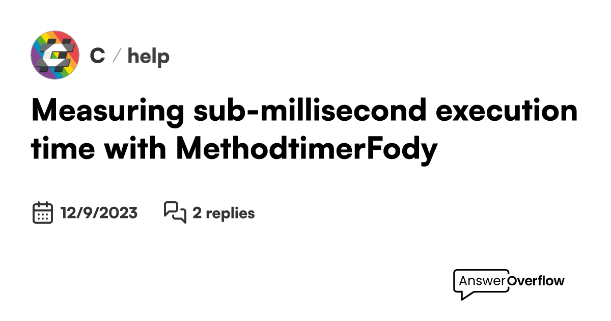

In the world of finance, speed is more than just an advantage; it's a necessity. This necessity is no more apparent than in high-frequency trading (HFT), a sub-millisecond trading execution strategy. High-frequency trading is an automated trading platform that conducts numerous trades in mere milliseconds, leveraging advanced algorithms and high-speed networks. It is characterized by a high volume of orders and trade executions within extremely short time frames. The primary aim is to profit from minute price discrepancies that exist for very brief periods before they are neutralized by market forces.

Sub-millisecond execution capabilities are critical in algorithmic trading, allowing traders to exploit micro-market opportunities faster than their competitors. This involves executing trades in less than a thousandth of a second, a feat achieved through a combination of complex algorithms, state-of-the-art computing technology, and ultra-fast network connections. The very essence of HFT relies on the ability to swiftly and efficiently process vast amounts of market data and execute trades almost instantaneously.



The purpose of this piece is to provide comprehensive insights into sub-millisecond trading execution and how it shapes modern financial markets. As financial markets evolve, so do the strategies and technologies employed in high-frequency trading. The competitive nature of this domain demands significant investment in technological infrastructure, as even a microsecond of delay can lead to substantial differences in trade outcomes and profitability.

Join us as we explore the core strategies, technological prerequisites, challenges, and future of sub-millisecond trading execution in the world of algorithmic trading. Understanding these elements is crucial for any trader or institution aiming to succeed in the fast-paced environment of modern financial markets. By grasping the intricacies of sub-millisecond execution, one can better appreciate the cutting-edge advancements that continue to redefine how trading is conducted on a global scale.

## Table of Contents

## Understanding Sub-Millisecond Trading Execution

High-frequency trading (HFT) is a mechanism where numerous trades are conducted within extremely short time frames, often in less time than it takes to blink. Sub-millisecond execution specifically refers to the ability to carry out these trades in under one-thousandth of a second. This capability is pivotal for leveraging fleeting market opportunities which can arise and disappear almost instantaneously.

The achievement of such rapid execution speeds hinges on several technological components. Complex algorithms play a crucial role, enabling the system to make decisions based on real-time data at remarkable speeds. These algorithms analyze extensive market data to identify and exploit anomalies and inefficiencies faster than competitors.

Furthermore, ultra-fast network connections are essential. High-frequency trading firms invest in state-of-the-art network infrastructures to minimize latency, which is the delay before a transfer of data begins following an instruction. By reducing latency, firms can ensure that their trades reach the exchange as quickly as possible, thereby gaining a competitive edge.

A significant aspect of minimizing latency involves co-location services, where trading firms place their servers in close proximity to exchange servers. The reduced physical distance between servers translates into faster data transmission, crucial for sub-millisecond trading.

At its essence, sub-millisecond trading seeks to capitalize on minimal price discrepancies and market inefficiencies. Real-time reaction to these subtle price shifts can yield significant profits, especially when magnified across the high [volume](/wiki/volume-trading-strategy) of trades characteristic of [HFT](/wiki/high-frequency-trading-strategies).

In summary, understanding sub-millisecond trading execution provides insight into the operation of contemporary trading platforms. It highlights the reliance on cutting-edge technology and infrastructure to perform at the highest levels of efficiency and speed, essential for success in today's financial markets.

## Key Technologies Enabling Sub-Millisecond Execution

High-frequency trading (HFT) depends on several sophisticated technologies to achieve sub-millisecond execution, a critical capability for taking advantage of micro-market fluctuations. Below are key technologies instrumental in facilitating such rapid trading:

**Cutting-edge Algorithms**: Algorithms at the core of sub-millisecond trading are designed to process large volumes of real-time market data and execute trades within fractions of a second. These algorithms use advanced statistical techniques and machine learning to make quick decisions. A typical algorithm might include optimized decision trees or neural networks to assess trade opportunities almost instantaneously. For example, a simplified algorithm in Python might look like:

```python
def trade_decision(price_data):
    if price_data.current < price_data.moving_average:
        execute_buy_order()
    elif price_data.current > price_data.moving_average:
        execute_sell_order()

def main():
    while market_is_open():
        price_data = get_real_time_data()
        trade_decision(price_data)
```

**Ultra-low Latency Network Infrastructures**: Network latency, the time it takes for data to travel from one point to another, is a critical concern in HFT. Companies invest heavily in infrastructures that ensure minimal data transmission times. Techniques such as using fiber optic cables and optimization of routing paths help achieve this goal. Reducing latency by even a microsecond can provide a significant competitive advantage.

**Co-location Services**: By placing trading systems physically close to exchange servers, firms can reduce the time taken for data transactions. Co-location reduces the latency caused by the physical distance that data packets must travel, ensuring that HFT systems receive and act on market data faster than those located further away.

**Real-time Market Data Feeds**: Access to continuous real-time data feeds is essential for informed trading decisions. Exchanges offer data feeds that provide instantaneous market information, such as price changes and trade volumes. Traders subscribe to these feeds to ensure their algorithms can react to the most current market conditions. This requires robust data processing capabilities to manage and interpret the flood of incoming data efficiently.

**Advanced Order Management Systems (OMS)**: OMS are crucial for handling the complexity of thousands of trades and order modifications occurring in milliseconds. Such systems are designed to support rapid order routing, execution, and post-trade processing. They must efficiently manage large volumes of trades while ensuring compliance with trading regulations and strategies.

Together, these technologies form the backbone of sub-millisecond trading execution, enabling firms to react to market movements with unparalleled speed and precision. As these technologies continue to advance, the capability for even faster and more efficient trading strategies will emerge, reshaping modern financial markets further.

## Challenges in Sub-Millisecond Trading

Sub-millisecond trading presents numerous challenges that participants must manage to stay competitive and profitable. A primary concern is latency. In high-frequency trading, latency refers to the delay between initiating a trade and its execution; even millisecond or sub-millisecond delays can lead to significant differences in trading outcomes. To put it into perspective, a delay as short as one millisecond could potentially lead to a missed opportunity or a pricing disadvantage that could affect profitability. Professional traders strive to minimize this latency using sophisticated technologies and infrastructures.

The cost of maintaining state-of-the-art technology infrastructure is another significant challenge. In a domain where competitive advantage relies heavily on speed and data processing capabilities, continuous investments in fast hardware, optimized software, and low-latency network connections are imperative. This creates a financial barrier to entry, limiting participation to well-funded institutions capable of sustaining these investments over time.

Regulatory challenges also pose a considerable issue. As trading speeds increase, ensuring regulatory compliance becomes more complex. Adhering to financial regulations, which were often designed in eras with slower trading environments, requires firms to integrate compliance checks without sacrificing execution speed, adding another layer of complexity to the system.

Risk management in sub-millisecond trading adds further complexity. The rapid pace at which trades are executed necessitates advanced risk management strategies to preemptively mitigate potential losses. The traditional mechanisms of risk assessment and management may no longer suffice, requiring the development of real-time analytical tools capable of responding instantly to market conditions and trade executions.

Finally, there is an ongoing technological arms race among firms involved in high-frequency trading. To maintain their competitive edge, firms must continuously invest in the latest and fastest technologies. This arms race is not limited to hardware but extends to algorithms, networking capabilities, and even emerging technologies like quantum computing. The rapid pace of technological advancement requires firms to continually adapt, innovate, and optimize their trading strategies and infrastructures.

In conclusion, the field of sub-millisecond trading is fraught with challenges that require substantial resources, sophisticated strategies, and continuous innovation to navigate effectively.

## The Future of Algorithmic Trading and Sub-Millisecond Execution

The future of [algorithmic trading](/wiki/algorithmic-trading) and sub-millisecond execution is poised for significant transformation as advanced technologies continue to evolve. A major frontier in this domain is the integration of quantum computing, which holds the potential to accelerate processing speeds exponentially. Quantum algorithms could enable traders to solve complex optimization problems and [factor](/wiki/factor-investing) large numbers at unprecedented speeds, thereby significantly reducing the time required for market analysis and trade execution.

AI-powered algorithms are also set to enhance high-frequency trading capabilities. Machine learning models can analyze vast datasets to predict market movements and execute trades with improved accuracy. By leveraging AI, trading platforms can adapt to market changes rapidly, leading to more profitable trading strategies.

The advancement of network infrastructures, particularly with the rollout of 5G technology, promises to enhance data transmission speeds. 5G networks offer lower latency and higher throughput, which are critical for sub-millisecond trading. These improvements will facilitate quicker communication between trading systems and exchanges, enabling traders to capitalize on fleeting market opportunities.

Edge computing represents another transformative development in algorithmic trading. By processing data closer to the source, edge computing reduces the time it takes for data to travel between the trading system and central servers. This localized data processing cuts down on latency, thus optimizing execution times and allowing traders to maintain a competitive edge.

Blockchain technology may introduce novel methods for settling trades, although current discussions suggest latency remains a challenge. Distributed ledger systems offer greater transparency and security, but the speed of blockchain transactions must improve to meet the demands of high-frequency trading. Future advancements in this field could streamline settlement processes and increase trading efficiency.

Continuous innovation ensures that the landscape of sub-millisecond trading execution remains dynamic. As technology progresses, new opportunities will arise for traders and institutions that can adapt to the changing environment. The ability to incorporate cutting-edge technologies will be crucial for maintaining competitiveness in financial markets.

## Conclusion

High-frequency trading (HFT) with sub-millisecond execution stands at the forefront of financial market innovation, representing a sophisticated intersection of technology and finance. This arena requires substantial investments in cutting-edge technology and infrastructure to maintain a competitive edge. Firms participating in HFT benefit from the potential for significant profit margins; however, these profits come with considerable challenges. The need for continuous investment in high-speed networks, co-location services, and algorithmic development makes this domain primarily accessible to institutions with substantial resources.

As technological advancements persist, algorithmic trading is expected to undergo further transformation. The integration of emerging technologies such as quantum computing, [artificial intelligence](/wiki/ai-artificial-intelligence) (AI), and improvements in network infrastructure promise to redefine execution speeds and market strategies. These innovations may provide new opportunities for firms that can navigate the complexities introduced by both technology and regulation.

For traders and institutions, mastering sub-millisecond execution capabilities is increasingly crucial. As financial markets evolve, a deep understanding and strategic investment in these technologies will likely determine success. Adaptability to rapid technological changes and compliance with regulatory frameworks will be key factors influencing competitive positioning in future financial landscapes.

## References & Further Reading

[1]: Aldridge, I. (2013). ["High-Frequency Trading: A Practical Guide to Algorithmic Strategies and Trading Systems."](https://www.ahmetbeyefendi.com/wp-content/uploads/2020/07/High-Frequency-Trading-Irene-Aldridge.pdf) Wiley.

[2]: Narang, R. K. (2009). ["Inside the Black Box: The Simple Truth About Quantitative Trading."](https://onlinelibrary.wiley.com/doi/book/10.1002/9781118267738) Wiley.

[3]: Patterson, S. (2013). ["Dark Pools: The Rise of the Machine Traders and the Rigging of the U.S. Stock Market."](https://www.amazon.com/Dark-Pools-Machine-Traders-Rigging/dp/0307887189) Crown Business.

[4]: Lewis, M. (2014). ["Flash Boys: A Wall Street Revolt."](https://www.amazon.com/Flash-Boys-Wall-Street-Revolt/dp/0393351599) W. W. Norton & Company.

[5]: Gomber, P., Arndt, B., Lutat, M., & Uhle, T. (2011). ["High-Frequency Trading."](https://papers.ssrn.com/sol3/papers.cfm?abstract_id=1858626) Journal of Trading, Vol. 6, No. 4.

[6]: Cartea, Á., Jaimungal, S., & Penalva, J. (2015). ["Algorithmic and High-Frequency Trading."](https://assets.cambridge.org/97811070/91146/frontmatter/9781107091146_frontmatter.pdf) Cambridge University Press.

[7]: Hasbrouck, J., & Saar, G. (2013). ["Low-Latency Trading."](https://www.sciencedirect.com/science/article/abs/pii/S1386418113000165) The Review of Financial Studies, 26(9), 2379-2438.