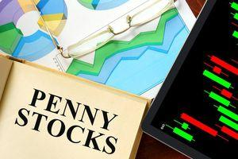

Financial markets are vital components of the global economy, facilitating the exchange of financial instruments and enabling capital allocation across various sectors. They encompass a range of venues, including stock exchanges, bond markets, and derivatives markets, where participants buy and sell securities. The significance of financial markets lies in their ability to channel funds from savers to borrowers, support economic growth, and provide liquidity and price discovery mechanisms. Participants in these markets include individual investors, financial institutions, corporations, and governments, each playing a crucial role in the economy's overall health and stability.

Trading regulations are fundamental in ensuring the orderly functioning of financial markets. These regulations are designed to protect investors, maintain fair and efficient markets, and mitigate systemic risks. Key regulatory bodies such as the U.S. Securities and Exchange Commission (SEC), the Financial Industry Regulatory Authority (FINRA), and the European Securities and Markets Authority (ESMA) establish and enforce rules that govern market activities. Their overarching purpose is to uphold market integrity by preventing fraudulent activities, promoting transparency, and ensuring a level playing field for all market participants.

Sub-penny trading, although a technical aspect of trading, holds significant implications for market structure and efficiency. Traditionally, stocks were traded in increments of one penny. However, sub-penny trading, which involves pricing securities in increments smaller than a penny, introduces significant changes to market dynamics. This practice can improve liquidity and execution quality but also raises concerns about market complexity and fairness.

Algorithmic trading, characterized by the use of computer algorithms to automate trading decisions, has profoundly influenced modern financial markets. Leveraging sophisticated mathematical models and high-speed data processing, algorithmic trading allows for rapid execution and high-frequency trading strategies. These capabilities have increased market efficiency and liquidity but have also introduced new challenges, such as heightened volatility and the potential for market manipulation.

The purpose of this article is to provide a comprehensive understanding of how trading regulations, sub-penny trading, and algorithmic trading intersect. This exploration is crucial for market participants, regulators, and policymakers who must navigate a landscape marked by rapid technological innovation and evolving market practices. By examining the interplay between these elements, we aim to shed light on the current state of financial markets and anticipate future regulatory and technological developments.

## Table of Contents

## Understanding Financial Markets Trading Regulations

Trading regulations are essential frameworks designed to ensure the integrity, fairness, and efficiency of financial markets. These regulations serve multiple purposes, including protecting investors, reducing systemic risk, and promoting transparency and confidence in the markets. By setting rules and standards for market participants, trading regulations aim to prevent fraudulent activities, market manipulation, and other practices that could harm the stability of financial systems.

Several major regulatory bodies oversee trading regulations across different regions. In the United States, the Securities and Exchange Commission (SEC) and the Financial Industry Regulatory Authority (FINRA) play pivotal roles. The SEC is a government agency responsible for enforcing federal securities laws, while FINRA is a self-regulatory organization that oversees brokerage firms and their registered representatives. In Europe, the European Securities and Markets Authority (ESMA) serves as a supervisory authority tasked with enhancing investor protection and promoting stable and orderly financial markets.

The role of trading regulations in maintaining market integrity cannot be overstated. These regulations ensure that markets operate smoothly and efficiently, which is crucial for maintaining investor trust. For example, by requiring transparency in financial transactions and mandating regular disclosures from publicly traded companies, regulations help prevent information asymmetry and allow investors to make informed decisions.

Several key trading regulations impact traders and investors. For instance, the Market Abuse Regulation (MAR) in Europe aims to preserve market integrity by prohibiting insider trading and market manipulation. In the United States, the Dodd-Frank Wall Street Reform and Consumer Protection Act introduced significant changes following the 2008 financial crisis, aiming to increase transparency and reduce excessive risk-taking in the financial sector.

Recent changes and trends in trading regulations reflect the evolving nature of financial markets and technology. The growth of digital assets like cryptocurrencies has prompted regulatory bodies to adapt existing frameworks or develop new ones to address unique challenges posed by these innovations. Additionally, as algorithmic and high-frequency trading become increasingly prevalent, regulators are exploring ways to mitigate associated risks while fostering innovation and market efficiency.

In conclusion, trading regulations are fundamental to ensuring the integrity and stability of financial markets. By understanding these regulations and their implications, market participants can navigate the complex landscape effectively, thus contributing to a fair and efficient trading environment. External references useful for further reading include the official websites of the SEC, FINRA, and ESMA, which provide comprehensive resources and updates on regulatory practices and frameworks.

## Exploring Sub-Penny Trading

Sub-penny trading refers to the practice of trading securities with price increments smaller than one cent. This technique allows traders, especially those using advanced algorithms, to exploit marginal price differences beyond the standard one-cent intervals permitted on major stock exchanges like the New York Stock Exchange (NYSE) and NASDAQ.

### History and Development

Sub-penny trading has gradually emerged with the evolution of electronic trading platforms and the increasing sophistication of trading algorithms. Prior to the adoption of decimalization in 2001, U.S. stock prices were quoted in fractions. Decimalization marked the initial step towards more precise pricing, reducing minimum increments from fractions of a dollar to one-cent. This change aimed to increase market transparency and efficiency. However, advancements in technology soon revealed opportunities for traders to profit from even smaller price movements, thereby initiating sub-penny pricing.

### Current Regulations

The U.S. Securities and Exchange Commission (SEC) has imposed specific regulations regarding sub-penny trading. Under Rule 612 of Regulation NMS (National Market System), the SEC prohibits most stocks from being quoted in increments less than one cent. However, exceptions exist for stocks priced below $1.00 and certain non-displayed orders that afford sub-penny increments. These regulations aim to maintain market integrity by ensuring fairness in order execution and preventing potential manipulative practices associated with sub-penny pricing.

### Impacts and Controversies

Sub-penny trading is controversial due to its significant impact on market dynamics. Proponents argue that it boosts market efficiency by allowing more accurate reflection of supply and demand, potentially narrowing bid-ask spreads. Critics, however, contend that sub-penny trading can disadvantage retail investors and lead to a fragmented market structure. The practice also raises concerns about fairness, as it often enables high-frequency traders to "front-run" other market participants by executing trades at sub-penny prices before slower traders can react.

### Examples and Market Effects

Sub-penny trading is particularly prevalent in high-frequency trading ([HFT](/wiki/high-frequency-trading-strategies)) environments, where algorithms can place and cancel orders in milliseconds to capture small profits repetitively. For example, if a stock is trading at $10.00, a high-frequency trader operating within legal frameworks might execute trades at $10.0001 or $9.9999, gaining advantages from price movements that are imperceptible to most traders. This ability can result in increased [volume](/wiki/volume-trading-strategy) and [liquidity](/wiki/liquidity-risk-premium) but may also cause traditional long-term strategies to appear less effective, as the price discovery process can become skewed by transient and ultra-small increments.

Overall, sub-penny trading represents a complex facet of modern financial markets, where technological advances challenge traditional regulatory approaches. Its ongoing evolution underscores the need for adaptive regulatory measures that balance innovation with market fairness.

## Algorithmic Trading and Its Impact

Algorithmic trading, commonly known as algo trading, involves the use of computer algorithms to automate trading decisions in financial markets. This approach leverages mathematical models and complex algorithms to execute trades at speeds and frequencies that are impossible for human traders. The significant increase in computational power and data availability has driven the popularity of [algorithmic trading](/wiki/algorithmic-trading), making it a mainstay for modern traders and institutional investors.

Algorithmic trading works by employing a set of instructions or "algorithms" to automatically place trades. These algorithms are built to analyze historical data and current market conditions to identify trading opportunities. Key concepts include the use of statistical models, quantitative analysis, and [machine learning](/wiki/machine-learning) to predict market movements and optimize trading strategies. Technologies such as high-speed data feeds, low-latency network connectivity, and sophisticated order management systems are vital to the efficient execution of these algorithms.

The benefits of algorithmic trading are manifold. It facilitates faster trade execution, aids in the detection of [arbitrage](/wiki/arbitrage) opportunities, and ensures consistency by minimizing human errors. By processing vast amounts of data across multiple markets simultaneously, algorithmic trading can contribute to increased market liquidity and tighter bid-ask spreads. This, in turn, leads to more efficient markets that are better able to reflect true asset values.

However, the proliferation of algorithmic trading presents challenges and risks, particularly in the context of high-frequency trading (HFT). HFT involves the execution of a large number of orders at extremely high speeds, often microseconds apart. While HFT can enhance liquidity, it has been criticized for potentially increasing market [volatility](/wiki/volatility-trading-strategies) and enabling unfair market practices. Technical glitches or erroneous algorithmic strategies can lead to "flash crashes," where asset prices plummet rapidly before recovering, causing significant disruptions.

Regulations specific to algorithmic trading have evolved to address these concerns. Regulatory bodies have introduced measures to ensure stability, transparency, and fairness in markets dominated by algorithmic activity. For instance, the Securities and Exchange Commission (SEC) and other global regulators require firms engaging in algorithmic trading to implement risk controls and monitoring systems to prevent market abuse. Moreover, there are rules around maintaining a fair and orderly market, mandating algorithms to adhere to certain standards of conduct and reporting.

The interplay between algorithmic trading and regulation is complex, as regulatory frameworks must continually adapt to technological advancements and novel trading strategies. As algorithmic trading continues to evolve, ongoing adjustments to regulations aim to balance the benefits of technological innovation with the need to protect market participants and ensure a stable financial ecosystem.

## Intersection of Trading Regulations, Sub-Penny, and Algorithmic Trading

Financial markets have undergone significant transformations with the advent of sub-penny and algorithmic trading, requiring adaptive regulatory measures to maintain market integrity and efficiency. This section explores how trading regulations intersect with these innovative practices, examining their impacts, challenges, and developments. 

### How Regulations Affect Algorithmic and Sub-Penny Trading

Regulations have been pivotal in shaping how algorithmic and sub-penny trading operate within financial markets. The United States Securities and Exchange Commission (SEC), under Regulation National Market System (Reg NMS), governs sub-penny trading, prohibiting most stocks priced above $1.00 from being quoted in increments smaller than a penny. This regulation aims to prevent market manipulation and ensure fairness by maintaining a standardized trading increment, thus impacting strategies employed by high-frequency trading firms.

Algorithmic trading, particularly high-frequency trading (HFT), is subject to regulations designed to mitigate systemic risks and ensure market stability. Regulations such as the European Union's Markets in Financial Instruments Directive II (MiFID II) enforce transparency and risk management requirements for algorithmic trading firms. These include mechanisms like circuit breakers and pre-trade risk controls to prevent erratic market movements.

### The Impact of Technology and Innovation on Regulatory Practices

Technological advancements have outpaced traditional regulatory frameworks, compelling regulators to innovate continuously. The dynamic nature of algorithmic trading, characterized by minimal human intervention and high-speed transactions, presents challenges in terms of surveillance and enforcement. Regulators are increasingly utilizing technology, such as machine learning algorithms, to monitor trading activities in real-time and identify suspicious patterns indicative of manipulation or misconduct.

For example, the adoption of Artificial Intelligence (AI) tools by regulatory bodies enables the analysis of vast datasets to detect anomalies, assess systemic risk, and enforce compliance more efficiently. This symbiotic relationship between technology and regulation enhances the ability to maintain market order while facilitating innovation.

### Balancing Market Efficiency with Fairness and Transparency

A central challenge in regulating sub-penny and algorithmic trading is finding the balance between market efficiency and ensuring equitable access for all participants. While algorithmic and sub-penny trading contribute to liquidity and narrower spreads, they also risk creating an uneven playing field where sophisticated participants leverage advanced technologies to gain unfair advantages.

Regulators strive to strike a balance by implementing rules that promote transparency and limit predatory practices. For instance, transparency requirements compel trading firms to disclose their strategies and the nature of their algorithmic operations, thus fostering a fairer competitive environment. Additionally, regulations like the consolidated audit trail (CAT) in the U.S. enhance market transparency by tracking all orders and trades across various exchanges.

### Case Studies or Examples Illustrating the Intersection

A notable example illustrating this intersection is the "Flash Crash" of May 6, 2010, during which U.S. markets experienced a rapid and severe decline. The event highlighted the vulnerabilities associated with high-frequency trading and prompted swift regulatory responses, such as the implementation of circuit breakers and tighter scrutiny of algorithmic trading strategies.

Another instance is the SEC's enforcement actions against firms exploiting the sub-penny pricing gaps, leading to penalties and changes in trading practices that ensure compliance with existing regulations.

### Potential Future Developments in This Space

Looking ahead, the continuous evolution of trading technologies will necessitate adaptive regulatory approaches. The integration of AI and machine learning in trading could lead to more sophisticated strategies, challenging regulators to enhance their tech-driven surveillance capabilities. Innovations may also lead to new trading regulations aimed at curbing risks associated with these advanced technologies, fostering a secure and equitable marketplace.

The rise of blockchain technology and decentralized finance (DeFi) represents another frontier in this space, potentially reshaping trading regulations to accommodate decentralized trading platforms while safeguarding against fraud and market abuse.

In conclusion, the intersection of trading regulations with sub-penny and algorithmic trading embodies a dynamic interplay of innovation and oversight. Regulators must remain vigilant and adaptive, leveraging emerging technologies to ensure markets are both efficient and fair for all participants.

## Challenges and Criticisms

Regulators face significant challenges in managing the rapidly evolving landscape of algorithmic trading, where speed, complexity, and technology are continuously advancing. The primary challenge is staying abreast of technological advancements that can outpace regulatory frameworks, potentially creating gaps that traders might exploit to gain unfair advantages. Regulators must balance facilitating innovation while maintaining market integrity, transparency, and fairness.

One key criticism of current regulations is their struggle to keep up with the pace of technological change. Many regulations were established in an era before high-frequency trading (HFT) and complex algorithms became prevalent, leaving them potentially outdated. This can lead to regulatory lag where emerging trading strategies are unaccounted for, underscoring the need for adaptive regulatory measures that can evolve with technology.

Market manipulation and the creation of unfair advantages are persistent concerns in the context of algorithmic trading. Algorithms can be used to execute manipulative strategies such as spoofing, where traders place large orders they do not intend to fulfill to create misleading market signals. Identifying and preventing such practices requires sophisticated monitoring and detection capabilities, which can be resource-intensive for regulatory bodies.

The ethical implications of algorithmic trading also spark debate. Critics argue that algorithms, particularly those involved in HFT, can create a disparity between technologically advanced institutional traders and individual or less technologically equipped investors. This technological arms race could lead to market environments skewed in favor of those with more resources to invest in sophisticated trading systems.

Experts hold conflicting perspectives on how to best address these challenges. Some advocate for stricter regulations and more robust oversight mechanisms to prevent market manipulation and ensure fairness. Others suggest that innovation should be encouraged to improve market efficiency, warning that over-regulation may stifle technological progress and the potential benefits it brings to market liquidity and price discovery.

In conclusion, navigating the challenges and criticisms of algorithmic trading requires a dynamic approach that embraces both regulatory oversight and technological innovation. Regulators, traders, and other stakeholders must collaborate to ensure that financial markets remain fair, transparent, and capable of adapting to future advancements.

## Future Outlook

The future of financial market trading regulations is poised for significant evolution, driven by technological advancements and changing market dynamics. Regulatory frameworks are expected to become more adaptive and sophisticated to address emerging challenges and opportunities.

**Expected Trends in Financial Market Trading Regulations:**

With the rise of innovative trading practices such as high-frequency and algorithmic trading, regulatory bodies are likely to enforce stricter oversight mechanisms. Enhanced transparency and the prevention of market manipulation will be at the forefront of regulatory reforms. Regulators are expected to leverage advanced data analytics and machine learning to monitor trading activities in real-time, improving their ability to detect and mitigate fraudulent behaviors.

**The Potential Evolution of Sub-Penny Trading Regulations:**

Sub-penny trading, where trades occur at price increments smaller than one cent, has been a controversial topic. While it facilitates tighter spreads and more efficient price discovery, it also raises concerns about fairness and market complexity. Future regulations may aim to strike a balance by setting thresholds or implementing new rules that address these concerns without stifling market efficiency. For instance, regulators could introduce measures that limit sub-penny quoting only to specific market players or scenarios where significant advantages are justified.

**Innovations in Algorithmic Trading and Their Regulatory Challenges:**

As algorithmic trading continues to evolve, incorporating sophisticated strategies and diverse data sources, regulatory challenges also intensify. This innovation necessitates the development of robust governance frameworks to ensure algorithms do not unintentionally disrupt market stability. Regulators might require firms to test their algorithms in controlled environments, mandating that trading programs adhere to specific ethical and operational standards. The focus will be on ensuring these systems are transparent, explainable, and fair.

**The Role of AI and Machine Learning in Shaping the Future of Trading:**

Artificial intelligence and machine learning are expected to play transformative roles in trading markets. Their ability to process vast amounts of data at unprecedented speeds offers significant potential for improving market analysis, prediction, and decision-making processes. However, they introduce new regulatory challenges, such as algorithmic bias and accountability in decision-making processes. Future regulations may demand higher levels of documentation and interpretability in AI-driven trading systems to mitigate these risks while fostering innovation.

**Conclusion: Preparing for a Rapidly Changing Trading Landscape**

As financial markets continue to become more complex, stakeholders must be prepared to navigate challenges associated with new technologies and evolving regulations. Continuous learning and adaptation will be critical for traders, companies, and regulatory bodies. Building a collaborative ecosystem will be essential, where regulators, market participants, and technologists work together to create transparent, fair, and efficient markets. Stakeholders should remain engaged with regulatory changes and innovation initiatives to support the development of a robust trading environment for the future.

## Conclusion

In conclusion, the exploration of trading regulations, sub-penny trading, and algorithmic trading underscores their intertwined significance in financial markets. Understanding trading regulations remains paramount, as they serve to ensure market integrity, fairness, and transparency. These regulations, crafted by bodies like the SEC, FINRA, and ESMA, are essential for maintaining the order and trust necessary for market participants.

Financial markets continue to evolve rapidly, driven by technological advancements and innovative trading practices. Navigating this increasingly dynamic environment requires both awareness and adaptability. As trading practices become more sophisticated, the ability to anticipate and react to regulatory changes is crucial for traders and investors alike.

Continuous learning and adaptation are vital components for success. The financial landscape is ever-changing, and staying informed about new regulations, trading technologies, and market trends is necessary to maintain competitiveness. Stakeholders must actively engage with regulatory bodies and participate in dialogues surrounding emerging practices and innovations. This collaboration not only fosters a robust market ecosystem but also ensures that regulations keep pace with the changing landscape, protecting investors and promoting market efficiency.

In light of these rapid changes, market participants and regulators are urged to work together, embracing innovation while safeguarding the market's fairness and integrity. As we advance, the conscientious application of trading regulations will play a central role in shaping a sustainable and equitable future for financial markets.

## References & Further Reading

[1]: Securities and Exchange Commission (SEC). [Official Website](https://www.sec.gov/)

[2]: Financial Industry Regulatory Authority (FINRA). [Official Website](https://www.finra.org/)

[3]: European Securities and Markets Authority (ESMA). [Official Website](https://www.esma.europa.eu/)

[4]: SEC. "Rule 612 of Regulation NMS." [Details on Official SEC Website](https://www.sec.gov/newsroom/press-releases/2022-224)

[5]: Lopez de Prado, Marcos. ["Advances in Financial Machine Learning"](https://www.amazon.com/Advances-Financial-Machine-Learning-Marcos/dp/1119482089) Wiley.

[6]: Chan, Ernest P. ["Quantitative Trading: How to Build Your Own Algorithmic Trading Business"](https://github.com/ftvision/quant_trading_echan_book) Wiley.

[7]: Jansen, Stefan. ["Machine Learning for Algorithmic Trading"](https://github.com/stefan-jansen/machine-learning-for-trading) Packt Publishing.

[8]: Aronson, David. ["Evidence-Based Technical Analysis: Applying the Scientific Method and Statistical Inference to Trading Signals"](https://www.amazon.com/Evidence-Based-Technical-Analysis-Scientific-Statistical/dp/0470008741) Wiley.

[9]: Markets in Financial Instruments Directive II (MiFID II). [European Commission Website](https://finance.ec.europa.eu/regulation-and-supervision/financial-services-legislation/implementing-and-delegated-acts/markets-financial-instruments-directive-ii_en)

[10]: Goldstein, Michael A. "Circuit breakers, trading halts, and price limits." [Oxford Research Encyclopedia of Economics and Finance](https://dokumen.tips/documents/circuit-breakers-trading-collars-and-volatility-6-collectively-nyse-rule.html)