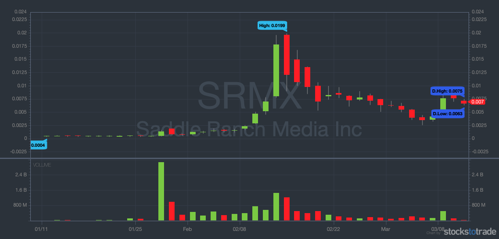

## Table of Contents

## What is sub-penny trading?

Sub-penny trading is when stocks are bought and sold at prices smaller than one cent. This happens a lot with very cheap stocks, often called penny stocks. These stocks are usually from small companies and can be risky to invest in because their prices can change a lot very quickly.

This kind of trading can be a problem because it can make it easier for people to cheat or manipulate the stock market. For example, someone might use sub-penny trading to make a stock's price go up or down on purpose. Because of these risks, the rules about sub-penny trading are strict, and it's watched closely by people who make sure the stock market is fair.

## How does sub-penny trading work?

Sub-penny trading is when people buy and sell stocks at prices that are less than one cent. This happens a lot with penny stocks, which are stocks that cost very little money. These stocks come from small companies and can be risky because their prices can change a lot very fast. When someone wants to buy or sell these stocks, they might do it at a price like $0.001 or $0.005 instead of a whole cent.

This kind of trading can cause problems because it can be easier for people to cheat or trick others in the stock market. For example, someone might use sub-penny trading to make a stock's price go up or down on purpose, which is not fair. Because of these risks, there are strict rules about sub-penny trading, and it's watched closely by people who make sure the stock market is fair and honest.

## What are the benefits of sub-penny trading for investors?

Sub-penny trading can be good for investors because it lets them buy and sell very cheap stocks at even smaller prices. This means they can own more shares of a company without spending a lot of money. For example, if a stock costs $0.01, with sub-penny trading, they might be able to buy it at $0.005. This can be a big help for people who want to invest but don't have much money to start with.

However, sub-penny trading can also be risky. The prices of these stocks can change a lot very quickly, which means investors might lose money fast. But for those who are willing to take the risk, sub-penny trading can offer a chance to make big profits if the stock price goes up. It's important for investors to do their homework and understand the risks before they start trading at these tiny prices.

## What are the risks associated with sub-penny trading?

Sub-penny trading can be very risky because the prices of these stocks can change a lot very quickly. This means that if you buy a stock at a very low price, like $0.005, it might go down to $0.001 in a short time, and you could lose a lot of money. These stocks are often from small companies that might not be doing well, so their prices can be very unstable.

Another big risk is that sub-penny trading can be used by people who want to cheat or trick others in the stock market. They might use these tiny price changes to make a stock's price go up or down on purpose, which is not fair. This kind of cheating can make it hard for honest investors to make good choices and can lead to big losses.

Because of these risks, it's important for investors to be very careful with sub-penny trading. They should do a lot of research and understand that they might lose money. It's also a good idea to only invest money that you can afford to lose, and to keep an eye on the stock market rules that are meant to stop cheating.

## How is sub-penny trading regulated in the United States?

In the United States, sub-penny trading is watched closely by the Securities and Exchange Commission (SEC). The SEC makes rules to stop people from cheating in the stock market. One big rule is that sub-penny trading is not allowed for stocks that cost more than $1. This helps keep the market fair and stops people from using tiny price changes to trick others.

The Financial Industry Regulatory Authority (FINRA) also helps regulate sub-penny trading. FINRA makes sure that stock brokers follow the rules and don't let their customers trade at prices smaller than one cent for stocks over $1. They check to make sure no one is cheating and that the market stays honest. If someone breaks these rules, they can get in big trouble.

## What are the key regulations that affect sub-penny trading?

In the United States, the main rule about sub-penny trading comes from the Securities and Exchange Commission (SEC). The SEC says that you can't trade stocks at prices smaller than one cent if the stock costs more than $1. This rule helps keep the stock market fair and stops people from using tiny price changes to trick others. The SEC watches the market closely to make sure everyone follows this rule.

The Financial Industry Regulatory Authority (FINRA) also helps with these rules. FINRA makes sure that stock brokers don't let their customers trade at prices smaller than one cent for stocks over $1. They check to make sure no one is cheating and that the market stays honest. If someone breaks these rules, they can get in big trouble, like fines or being banned from trading.

## How do different stock exchanges handle sub-penny trading?

Different stock exchanges in the United States have to follow the rules set by the SEC and FINRA about sub-penny trading. This means that if a stock costs more than $1, you can't trade it at prices smaller than one cent on any of these exchanges. The exchanges make sure their systems don't allow these kinds of trades to happen. They also watch for any cheating or tricks that people might try to use with sub-penny trading.

Some exchanges might have extra rules or ways to check for problems with sub-penny trading. For example, they might use special computer programs to watch the market and make sure no one is breaking the rules. If someone tries to trade at a sub-penny price for a stock over $1, the exchange's systems will stop the trade from happening. This helps keep the market fair and safe for everyone who wants to invest.

## What impact does sub-penny trading have on market liquidity?

Sub-penny trading can make the market more liquid for very cheap stocks. Liquidity means how easy it is to buy or sell a stock without changing its price too much. When people can trade at prices smaller than one cent, it can help more people buy and sell these stocks. This can be good for small investors who don't have a lot of money to spend. They can get in and out of the market more easily because they can trade at tiny prices.

However, sub-penny trading can also cause problems with market liquidity. Because the prices can change so quickly and by such small amounts, it can make the market more unstable. This can scare away some investors who don't want to take the risk. If too many people are scared away, it can actually make it harder to buy and sell these stocks. So, while sub-penny trading can help with liquidity in some ways, it can also make the market less liquid if it leads to more instability and fewer people wanting to trade.

## How does sub-penny trading affect the accuracy of stock prices?

Sub-penny trading can make stock prices less accurate. When people can buy and sell stocks at prices smaller than one cent, it can lead to a lot of tiny price changes. These small changes can happen very quickly and might not show what the stock is really worth. If someone is trying to cheat, they might use these tiny price changes to make the stock's price go up or down on purpose. This can make it hard for other investors to know if the price they see is a true reflection of the stock's value.

On the other hand, sub-penny trading can also help make stock prices more accurate for very cheap stocks. When more people can trade at these small prices, it can bring more buyers and sellers together. This can help the stock's price find its true value more easily because there are more people trading. But, this only works if there is no cheating happening. If people are honest, sub-penny trading can help the market find the right price for a stock.

## What are the technological requirements for engaging in sub-penny trading?

To do sub-penny trading, you need special technology that can handle very small price changes. This means you need a computer system that can show and trade stocks at prices like $0.001 or $0.005. The trading platform you use must be able to update prices very quickly and accurately. This is important because sub-penny trading happens fast, and any delay can make you miss out on good trades or lose money.

Also, you need a good internet connection to make sure your trades go through without problems. The stock market systems that allow sub-penny trading are set up to stop trades that break the rules, so your technology needs to work well with these systems. If your computer or internet is slow, you might not be able to trade at these tiny prices, and you could miss out on chances to buy or sell stocks.

## How have regulations on sub-penny trading evolved over time?

Over time, the rules about sub-penny trading have changed to make the stock market more fair and safe. In the early days, there were not many rules about trading at prices smaller than one cent. This led to problems because some people used sub-penny trading to cheat and trick others. To stop this, the Securities and Exchange Commission (SEC) started making new rules. One big rule they made was that you can't trade stocks at prices smaller than one cent if the stock costs more than $1. This rule came into place to stop cheating and make the market more honest.

The Financial Industry Regulatory Authority (FINRA) also got involved to help make sure everyone follows these rules. They work with the stock exchanges to make sure their systems don't allow sub-penny trading for stocks over $1. If someone breaks these rules, they can get in big trouble, like fines or being banned from trading. Over the years, these rules have gotten stricter to keep up with new ways people might try to cheat. The goal is always to make the stock market a fair place for everyone to invest.

## What are the future trends and potential changes in sub-penny trading regulations?

In the future, rules about sub-penny trading might get even stricter to stop cheating and make the stock market more fair. The SEC and FINRA might use new technology to watch the market more closely and catch people who try to trick others. They might also make new rules to stop sub-penny trading for more types of stocks, not just the ones that cost more than $1. This would help make sure that stock prices are more accurate and that everyone can trust the market.

Another trend could be that more stock exchanges start using special computer programs to check for problems with sub-penny trading. These programs can help stop trades that break the rules before they happen. As more people use technology to trade stocks, the rules might change to keep up with new ways of trading. The goal will always be to make the market safe and fair for everyone who wants to invest.

## References & Further Reading

[1]: Securities and Exchange Commission (SEC). [Official Website](https://www.sec.gov/)

[2]: Financial Industry Regulatory Authority (FINRA). [Official Website](https://www.finra.org/)

[3]: European Securities and Markets Authority (ESMA). [Official Website](https://www.esma.europa.eu/)

[4]: SEC. "Rule 612 of Regulation NMS." [Details on Official SEC Website](https://www.sec.gov/newsroom/press-releases/2022-224)

[5]: Lopez de Prado, Marcos. ["Advances in Financial Machine Learning"](https://www.amazon.com/Advances-Financial-Machine-Learning-Marcos/dp/1119482089) Wiley.

[6]: Chan, Ernest P. ["Quantitative Trading: How to Build Your Own Algorithmic Trading Business"](https://github.com/ftvision/quant_trading_echan_book) Wiley.

[7]: Jansen, Stefan. ["Machine Learning for Algorithmic Trading"](https://github.com/stefan-jansen/machine-learning-for-trading) Packt Publishing.

[8]: Aronson, David. ["Evidence-Based Technical Analysis: Applying the Scientific Method and Statistical Inference to Trading Signals"](https://www.amazon.com/Evidence-Based-Technical-Analysis-Scientific-Statistical/dp/0470008741) Wiley.

[9]: Markets in Financial Instruments Directive II (MiFID II). [European Commission Website](https://finance.ec.europa.eu/regulation-and-supervision/financial-services-legislation/implementing-and-delegated-acts/markets-financial-instruments-directive-ii_en)

[10]: Goldstein, Michael A. "Circuit breakers, trading halts, and price limits." [Oxford Research Encyclopedia of Economics and Finance](https://dokumen.tips/documents/circuit-breakers-trading-collars-and-volatility-6-collectively-nyse-rule.html)