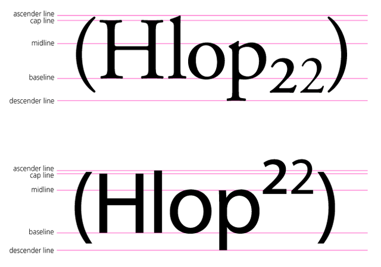

## Table of Contents

## What is a subindex?

A subindex is a smaller part of a larger index. Think of an index like a big list that helps you find things quickly. A subindex is like a smaller list inside that big list, focusing on a specific topic or section. For example, in a book about animals, the main index might list all the animals. A subindex could then list just the birds, making it easier to find information about birds without looking through the whole index.

Subindexes are useful because they help organize information better. They make it easier to find what you need quickly, especially in big books or databases. For example, in a library catalog, the main index might list all the books. A subindex could list only the books about history, helping you find history books faster. This way, subindexes save time and make big collections of information easier to use.

## How does a subindex differ from an index?

An index is like a big list that helps you find things quickly in a book or a database. It shows you where to find different topics or items. For example, in a book about animals, the index would list all the animals and the page numbers where you can read about them.

A subindex is a smaller list inside the main index. It focuses on just one part of the main index. Using the animal book example again, the subindex might list only the birds, making it easier to find information about birds without looking through the whole index. So, while an index covers everything, a subindex helps you find specific information faster by narrowing down the list.

## What are the common uses of subindexes?

Subindexes are often used in [books](/wiki/algo-trading-books) to help readers find information more easily. For example, in a big book about history, the main index might list all the events and people. A subindex could then list just the events from World War II, making it quicker for someone interested in that topic to find what they need without searching through the whole index.

In databases and libraries, subindexes are also very helpful. They can organize large amounts of information into smaller, more manageable parts. For instance, a library catalog might have a main index of all the books. A subindex could list only the books about science, helping someone looking for science books to find them faster. This way, subindexes make it easier to navigate through big collections of information.

## Can you provide examples of subindexes in financial markets?

In financial markets, a subindex is like a smaller part of a bigger index. For example, the S&P 500 is a big index that shows how 500 big companies in the U.S. are doing. Within the S&P 500, there are subindexes like the S&P 500 Information Technology Index. This subindex only tracks the tech companies in the S&P 500, making it easier for investors to see how tech companies are doing without looking at all 500 companies.

Another example is the Dow Jones Industrial Average, which is a big index that tracks 30 large companies. The Dow Jones Transportation Average is a subindex that focuses only on transportation companies within the Dow Jones. This helps investors who are interested in transportation to quickly see how those specific companies are performing, without having to go through the whole Dow Jones Industrial Average.

## How are subindexes calculated?

Subindexes are calculated in a similar way to the main indexes, but they focus on a smaller group of items. For example, if you have a big index like the S&P 500 that tracks 500 companies, a subindex like the S&P 500 Information Technology Index only tracks the tech companies in that group. To calculate the subindex, you add up the values of the tech companies and then use a formula to turn that into a number that shows how well those tech companies are doing.

The exact formula can be different depending on the index. Some use a simple average of the prices of the companies, while others might use a more complex method that takes into account the size of each company. For example, if the subindex is based on market capitalization, it will give more weight to bigger companies. This means their performance will affect the subindex more than smaller companies. By focusing on a smaller group, subindexes make it easier to see how specific parts of the market are doing.

## What are the benefits of using subindexes in data analysis?

Subindexes help make big sets of data easier to understand. When you have a lot of information, it can be hard to find what you need. A subindex breaks down the big data into smaller parts, so you can look at one specific area without getting overwhelmed. For example, if you are studying a country's economy, the main index might show everything about the economy. But a subindex can focus on just the housing market, making it easier to see how housing is doing without looking at all the other data.

Using subindexes also helps you spot trends and patterns more quickly. When you can zoom in on a smaller part of the data, it's easier to see changes over time or differences between groups. This can be really useful for making decisions. For instance, if you are an investor, looking at a subindex of tech stocks can help you see how the tech industry is doing, which might affect your investment choices. By breaking down the data into smaller, more focused parts, subindexes make it easier to understand and use the information you have.

## How do subindexes help in portfolio diversification?

Subindexes help in portfolio diversification by letting investors focus on specific parts of the market. When you invest, you want to spread your money across different types of investments to lower your risk. A subindex, like one that tracks only tech companies or energy companies, helps you see how those specific parts of the market are doing. This way, you can decide how much to invest in each area without having to look at the whole market.

For example, if you want to diversify your portfolio by adding some tech stocks, you can look at a tech subindex to see how tech companies are performing. If the subindex shows that tech stocks are doing well, you might decide to invest more in that area. By using subindexes, you can make smarter choices about where to put your money, helping you build a more balanced and diversified portfolio.

## What are the limitations or challenges of using subindexes?

Using subindexes can be tricky because they only show a small part of the whole picture. If you focus too much on a subindex, you might miss out on what's happening in the rest of the market. For example, if you only look at a tech subindex, you might not see if other industries like healthcare or energy are doing better or worse. This can lead to making investment choices based on incomplete information, which can be risky.

Another challenge is that subindexes can be affected by just a few big companies. If a subindex is based on market capitalization, the performance of the biggest companies in that subindex can have a big impact on the whole subindex. This means that if one or two big companies do really well or really badly, it can make the subindex look better or worse than it really is. This can make it hard to get a true picture of how that part of the market is doing.

## How can subindexes be used to track specific market segments?

Subindexes help you keep an eye on specific parts of the market. For example, if you want to know how tech companies are doing, you can look at a tech subindex. This subindex only includes tech companies, so it shows you how that part of the market is performing without mixing in other industries. This makes it easier to see trends and changes in the tech sector, which can be useful if you're thinking about investing in tech stocks.

Using subindexes can also help you understand how different parts of the market are doing compared to each other. For instance, if you want to compare the performance of the energy sector to the healthcare sector, you can look at their respective subindexes. This way, you can see if energy stocks are doing better or worse than healthcare stocks. By focusing on these smaller groups, subindexes give you a clearer picture of specific market segments, helping you make more informed decisions.

## What role do subindexes play in economic indicators?

Subindexes help break down big economic indicators into smaller, easier-to-understand parts. For example, the Consumer Price Index (CPI) measures the overall change in prices for a bunch of goods and services. But if you want to know how food prices are changing, you can look at the food subindex of the CPI. This subindex only looks at food prices, so it gives you a clear picture of how that specific part of the economy is doing.

Using subindexes can also help you see trends in different parts of the economy. For instance, the Producer Price Index (PPI) tracks the prices that producers get for their goods. Within the PPI, there might be a subindex for energy prices. By looking at this energy subindex, you can see how energy prices are changing without getting mixed up with other prices. This way, subindexes make it easier to understand and analyze the economy by focusing on specific areas.

## How can one create a custom subindex?

Creating a custom subindex is like making a smaller list from a bigger list. First, you need to decide what you want your subindex to focus on. For example, if you want to track how tech companies are doing, you would pick out all the tech companies from a bigger index like the S&P 500. Then, you need to decide how you want to measure their performance. You might use their stock prices, or you might look at how much they are worth in the market. Once you have your list of companies and your way of measuring, you can start calculating your subindex.

To calculate your custom subindex, you add up the values of the companies you chose. If you're using stock prices, you might just add them all together and then divide by the number of companies to get an average. If you're using market value, you might give more weight to bigger companies. This means their performance will affect your subindex more than smaller companies. Once you have your calculation, you can keep updating it as the companies' values change. This way, your custom subindex will show you how your chosen group of companies is doing over time.

## What advanced statistical methods are used to refine subindex accuracy?

To make subindexes more accurate, people often use advanced statistical methods like regression analysis. This method helps figure out how different factors affect the subindex. For example, if you're making a subindex for tech companies, regression analysis can show how things like interest rates or consumer spending might change the subindex. By understanding these relationships, you can make your subindex more precise and useful.

Another method is called time series analysis. This looks at how the subindex changes over time. It can help spot patterns and trends that might not be obvious at first. For instance, time series analysis can show if the subindex goes up and down with the seasons or if it's affected by big events like elections. By using this method, you can make your subindex more reliable and better at predicting future changes.

## References & Further Reading

[1]: ["Advances in Financial Machine Learning"](https://www.amazon.com/Advances-Financial-Machine-Learning-Marcos/dp/1119482089) by Marcos Lopez de Prado

[2]: ["Evidence-Based Technical Analysis: Applying the Scientific Method and Statistical Inference to Trading Signals"](https://www.amazon.com/Evidence-Based-Technical-Analysis-Scientific-Statistical/dp/0470008741) by David Aronson

[3]: ["Machine Learning for Algorithmic Trading"](https://github.com/stefan-jansen/machine-learning-for-trading) by Stefan Jansen

[4]: ["Quantitative Trading: How to Build Your Own Algorithmic Trading Business"](https://www.amazon.com/Quantitative-Trading-Build-Algorithmic-Business/dp/1119800064) by Ernest P. Chan