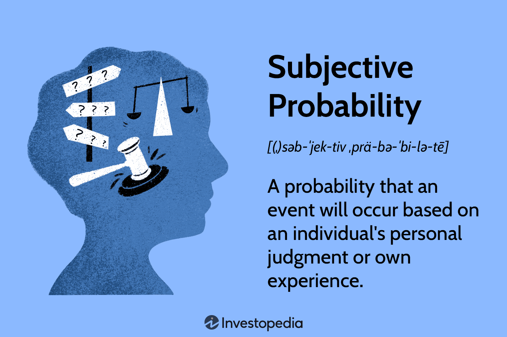

## Table of Contents

## What is subjective probability?

Subjective probability is a way of measuring how likely something is to happen based on a person's own beliefs or opinions. It's different from other types of probability because it doesn't rely on hard data or experiments. Instead, it depends on what an individual thinks or feels about the chances of an event occurring. For example, if you think it's very likely to rain tomorrow because the sky looks cloudy, that's your subjective probability.

This kind of probability is useful in situations where there isn't enough data to make a clear prediction. It's often used in fields like finance, where people have to make decisions based on their own judgments about future events. While subjective probability can be helpful, it's important to remember that it's based on personal views, so different people might have different probabilities for the same event.

## How does subjective probability differ from objective probability?

Subjective probability and objective probability are two different ways to think about how likely something is to happen. Subjective probability is based on what a person thinks or feels about the chances of an event. It's personal and can change from one person to another. For example, if you think it's going to rain because the sky looks dark, that's your subjective probability. It's useful when there's not enough data to make a clear prediction, like in finance or personal decisions.

On the other hand, objective probability is based on hard facts and data. It's the same for everyone because it comes from things like experiments, historical data, or statistics. For example, if weather data shows it rains 30% of the time in June, that's an objective probability. It doesn't change based on what someone thinks or feels. Objective probability is used in science, gambling, and other areas where data can help predict outcomes more accurately.

In summary, the main difference is that subjective probability depends on personal beliefs, while objective probability relies on factual data. Both types of probability have their uses, but they approach the question of likelihood in very different ways.

## What are the key elements that influence subjective probability?

Subjective probability is shaped by a person's own thoughts and feelings about how likely something is to happen. One big influence is personal experience. If you've seen something happen a lot, you might think it's more likely to happen again. For example, if you've seen it rain a lot in the summer, you might think it's more likely to rain next summer. Another influence is what other people say or think. If your friends or experts believe something is likely, you might start to think the same way. This is called social influence.

Another key element is how much information you have. If you don't know much about something, your guess about how likely it is might be different from someone who knows a lot. For example, if you don't know much about stock markets, your guess about a stock going up might be very different from a financial expert's guess. Emotions also play a big role. If you're scared of something, you might think it's more likely to happen. For instance, if you're scared of flying, you might think a plane crash is more likely than it really is. All these things together shape your subjective probability.

## Can you provide a simple example of subjective probability in everyday life?

Imagine you're trying to decide if you should bring an umbrella to a picnic. You look out the window and see that the sky is a bit cloudy. Based on what you see and how you feel about the weather, you think there's a 60% chance it might rain. This is your subjective probability. It's your own guess about the chances of rain, based on what you see and what you think.

Your friend, who is also looking at the same sky, might think differently. They might remember that it hasn't rained on a cloudy day like this in a long time. So, they might think there's only a 20% chance of rain. This shows how subjective probability can be different for different people, even when they're looking at the same thing. It's all about what each person thinks and feels.

## How is subjective probability used in decision-making?

Subjective probability is used in decision-making when people don't have enough hard data to make a clear choice. Imagine you're thinking about starting a new business. You might not have all the numbers and facts, but you can use your own thoughts and feelings to guess how likely it is to succeed. Your guess, or subjective probability, helps you decide if it's worth the risk. If you think there's a good chance of success, you might go for it. If you think the chances are low, you might decide to wait or try something else.

This kind of probability is also helpful in everyday life. For example, if you're deciding whether to buy a used car, you might not have all the information about how reliable it is. But you can use what you know and what you feel to guess the chances of it breaking down soon. If you think there's a high chance it will break down, you might look for another car. If you think the chances are low, you might go ahead and buy it. Subjective probability helps you make decisions when you have to rely on your own judgment.

## What are the common methods for assessing subjective probabilities?

One common way to assess subjective probabilities is by using a method called the direct method. This is when you ask people to give a number that shows how likely they think something is to happen. For example, you might ask someone, "On a scale from 0 to 100, how likely do you think it is that it will rain tomorrow?" Their answer is their subjective probability. This method is simple and easy to use, but it depends a lot on how well people can guess and express their thoughts.

Another way is through the indirect method, which involves looking at how people make choices to figure out their subjective probabilities. For example, if someone is willing to bet a lot of money on a football team winning, it might mean they think the team has a high chance of winning. By studying these choices, you can guess what people's subjective probabilities are. This method can be more accurate because it's based on what people do, not just what they say, but it can also be harder to use and understand.

Both methods have their uses and can help us understand how people think about the chances of things happening. The direct method is straightforward and easy to apply, while the indirect method can give deeper insights into people's real beliefs. Depending on the situation, one method might be better than the other.

## How can biases affect subjective probability assessments?

Biases can really change how we think about the chances of something happening. One common bias is called the availability bias. This happens when we think something is more likely just because we can remember it easily. For example, if you hear a lot about plane crashes on the news, you might think flying is more dangerous than it really is. Another bias is the confirmation bias, where we look for information that agrees with what we already think. If you believe a certain stock will go up, you might only pay attention to news that supports that belief, making you think it's more likely to happen than it really is.

These biases can make our guesses about probabilities less accurate. When we let our emotions or memories guide our thinking, we might not see the full picture. For example, if you're scared of dogs because you were bitten once, you might think it's very likely that any dog will bite you, even though most dogs are friendly. This can lead to poor decisions, like avoiding dogs altogether when it's not necessary. Understanding these biases can help us make better guesses about how likely something is to happen, but it's hard because these biases are often hidden in our minds.

## What role does subjective probability play in Bayesian statistics?

Subjective probability is really important in Bayesian statistics. Bayesian statistics is a way of thinking about probability that updates our guesses as we learn new things. In this kind of statistics, we start with what we believe before we see any new information, and that's called the prior probability. Subjective probability comes into play here because the prior probability is based on what we think or feel before we see any data. For example, if you think it's likely to rain because the sky looks dark, that's your subjective prior probability.

As we get new information, we use it to update our guesses. This is called the posterior probability. Subjective probability helps us decide how much to change our minds based on new information. For example, if it starts to drizzle, you might think it's even more likely to rain now. Your subjective belief about the rain changes with the new information. Bayesian statistics uses these subjective probabilities to help make better predictions and decisions, blending what we think with what we know.

## How do experts in a field use subjective probability in their predictions?

Experts in a field use subjective probability to make predictions when they don't have all the data they need. For example, a doctor might not have all the test results yet but needs to decide on a treatment. The doctor can use their experience and what they know about similar cases to guess how likely different outcomes are. This helps them make the best decision they can with the information they have. Even though it's a guess, it's based on a lot of knowledge and experience, so it's often a good prediction.

In another example, a financial analyst might use subjective probability to predict how the stock market will do. They might not have all the numbers and facts, but they can use what they know about the economy and past trends to make a guess. If they think there's a good chance the market will go up, they might tell their clients to invest more. This kind of prediction is helpful because it lets experts make decisions even when they don't have all the information. But it's important to remember that these predictions can be wrong because they're based on personal beliefs and not just hard data.

## Can you explain the use of subjective probability in financial forecasting?

In financial forecasting, experts often use subjective probability when they don't have all the numbers and facts they need. Imagine you're trying to guess if a stock will go up or down. You might not have all the data, but you can use what you know about the company and the economy to make a guess. If you think there's a good chance the stock will go up, that's your subjective probability. It's like making a bet based on what you think and feel, not just on what you know for sure. Financial analysts use this kind of guessing all the time to help their clients make decisions about where to put their money.

This way of thinking is really helpful because it lets experts make predictions even when they don't have all the information. For example, if a new company is starting up and there's no history to look at, an analyst might use what they know about similar companies and the market to guess how well it will do. But it's important to remember that these guesses can be wrong because they're based on personal beliefs and not just hard data. So, while subjective probability is a useful tool in financial forecasting, it's always a good idea to use it along with other kinds of information to make the best decisions possible.

## What are some advanced techniques for calibrating subjective probability estimates?

One advanced technique for calibrating subjective probability estimates is called the Brier Score. This method helps people see how good their guesses are by comparing them to what actually happens. For example, if you guess there's a 70% chance it will rain and it does rain, your guess was pretty good. But if it doesn't rain, your guess was off. By using the Brier Score over time, you can see if you're usually right or wrong and adjust your guesses to be more accurate. This technique is helpful because it gives you feedback on your guesses, so you can learn and get better at making predictions.

Another technique is called probability matching. This involves looking at a lot of different guesses and seeing how they match up with what actually happens. For example, if you and your friends all guess the chance of rain, you can see whose guesses are usually closest to what happens. Over time, you can adjust your guesses to be more like the ones that are usually right. This method helps you learn from others and improve your own guesses. Both the Brier Score and probability matching are ways to make your subjective probability estimates more accurate by learning from past guesses and outcomes.

## How has the concept of subjective probability evolved in the field of decision theory?

The idea of subjective probability has changed a lot in decision theory over time. At first, people thought probability was all about numbers and facts. They used things like dice rolls or coin flips to understand chances. But then, people like Bruno de Finetti and Frank Ramsey started to think differently. They said that probability could also be about what we believe or feel. This was a big change because it meant we could use our own guesses to make decisions, even when we didn't have all the facts. This new way of thinking helped start the field of Bayesian decision theory, which uses our beliefs to update our guesses as we learn new things.

As time went on, more people started to see the value in using subjective probability in decision theory. They realized that in real life, we often have to make choices without all the information we need. So, using what we think and feel can help us make better decisions. For example, doctors might use their experience to guess how likely a treatment will work, or investors might use their knowledge to predict how the stock market will do. These guesses aren't perfect, but they can be really helpful. Today, subjective probability is a big part of decision theory because it helps us make choices in the messy, unpredictable world we live in.

## What is the role of Probability Theory in Algorithmic Trading?

Algorithmic trading, or algo trading, fundamentally relies on probability theory to enable systematic and efficient decision-making. Traders and algorithms utilize statistical models rooted in probability to assess and predict market behavior. This approach allows for trading strategies that are free from emotional biases, focusing solely on quantitative and empirical data.

The construction of these trading models typically begins with historical data. By analyzing vast amounts of this data, algorithms estimate the likelihood of future market trends and movements. This analysis often involves identifying patterns, trends, and anomalies within the historical data, which can be accomplished through techniques such as time series analysis or [machine learning](/wiki/machine-learning) algorithms. For instance, predictive models might use a combination of historical prices, trading volumes, and other market indicators to forecast future prices.

A fundamental component of probability-based models in algorithmic trading is the use of probability distributions. Distributions such as Gaussian (normal) distributions or others more specific to financial data, such as log-normal or exponential distributions, are used to model and predict the behavior of market variables. These distributions help determine the probability of various market scenarios, which in turn influences trading decisions. For example, by fitting historical return data to a normal distribution, a trader can assess the probability of returns falling within a certain range.

In advancing this, statistical analysis plays a crucial role. Trading algorithms often employ techniques like linear regression, which helps in establishing relationships between variables, or more complex approaches like multivariate analysis. By using these methods, algorithms can quantify relationships and dependencies, enabling them to make predictions about market movements. Consider a simple linear regression model:

$$
y = \beta_0 + \beta_1 x + \epsilon
$$

where $y$ is the dependent variable (e.g., asset return), $x$ is the independent variable (e.g., market index return), $\beta_0$ and $\beta_1$ are coefficients, and $\epsilon$ is the error term.

A more advanced technique like the Monte Carlo simulation may also be applied, where random sampling and statistical modeling are used to understand the impact of risk and uncertainty in prediction and forecasting models. The simulation accounts for the randomness in market behavior and provides a probabilistic distribution of possible outcomes, assisting in making risk-adjusted trading decisions.

Moreover, algorithmic systems built on probability theory enhance trading efficiency by removing emotional decision-making. Human emotions often lead to irrational decisions that can negatively affect trading outcomes. On the contrary, algorithms consistently execute trades based on predefined probabilistic models and risk parameters, ensuring disciplined adherence to strategy.

In conclusion, by leveraging probability theory, algo trading systems are strengthened with a foundation of statistically sound predictions and assessments. This systematic approach enables more reliable and effective trading decisions that can adapt to a myriad of market conditions.

## References & Further Reading

[1]: Bergstra, J., Bardenet, R., Bengio, Y., & Kégl, B. (2011). ["Algorithms for Hyper-Parameter Optimization."](https://dl.acm.org/doi/10.5555/2986459.2986743) Advances in Neural Information Processing Systems 24.

[2]: ["Advances in Financial Machine Learning"](https://www.amazon.com/Advances-Financial-Machine-Learning-Marcos/dp/1119482089) by Marcos Lopez de Prado

[3]: ["Evidence-Based Technical Analysis: Applying the Scientific Method and Statistical Inference to Trading Signals"](https://www.amazon.com/Evidence-Based-Technical-Analysis-Scientific-Statistical/dp/0470008741) by David Aronson

[4]: ["Machine Learning for Algorithmic Trading"](https://github.com/stefan-jansen/machine-learning-for-trading) by Stefan Jansen

[5]: ["Quantitative Trading: How to Build Your Own Algorithmic Trading Business"](https://www.amazon.com/Quantitative-Trading-Build-Algorithmic-Business/dp/1119800064) by Ernest P. Chan

[6]: Taleb, N. N. (2010). ["The Black Swan: The Impact of the Highly Improbable."](https://en.wikipedia.org/wiki/The_Black_Swan:_The_Impact_of_the_Highly_Improbable) Random House Trade Paperbacks.

[7]: Hull, J. C. (2015). ["Options, Futures, and Other Derivatives"](https://www.semanticscholar.org/paper/Options%2C-Futures%2C-and-Other-Derivatives-Hull/89bdee500c8623864fc9eb7a471546aa713acc44) (9th ed.). Pearson.