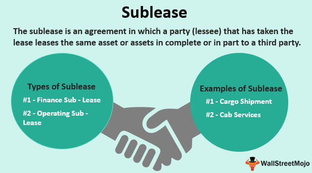

In today's dynamic world, flexibility in living and work arrangements is becoming increasingly important. As more people seek adaptable solutions to accommodate evolving lifestyles, an intriguing intersection emerges between subletting rental agreements and algorithmic trading. While these domains might seem unrelated at first glance, they share underlying principles of risk management and strategic decision-making that can be beneficial for both tenants and traders.

This article explores how the concepts of subletting and subleasing, crucial for modern residential and commercial leasing, relate to the sophisticated world of algo trading. By examining the synergies between these areas, we aim to provide a comprehensive understanding that can enhance decision-making processes. For tenants maneuvering complex rental agreements and investors navigating volatile financial markets, recognizing these connections can offer practical insights.



Throughout the upcoming sections, the basics of subleasing and rental agreements will be outlined. We will then highlight their surprising relevance to the principles governing algorithmic trading. This approach will illuminate the ways in which tenants' legal obligations and strategic leasing decisions mirror the technical strategies employed by traders.

Our goal is to craft an insightful guide that empowers individuals to confidently and effectively navigate these subjects. Whether you are managing rental agreements or executing trading algorithms, understanding the interplay between these fields can lead to more informed and innovative approaches in achieving personal and professional objectives.

## Table of Contents

## Understanding Subletting and Subleasing

Subletting and subleasing are integral components of the rental property landscape, each with distinct roles and implications for tenants and property owners. 

Subletting occurs when a tenant, who holds an active lease agreement, chooses to rent out a portion or the entirety of their leased property to another individual. This arrangement does not alter the original lease agreement between the primary tenant and the landlord. Instead, a separate agreement is created between the original tenant (sublessor) and the new occupant (sublessee). It's important for sublessors to ensure that they have permission from the landlord to sublet, as lease agreements often contain clauses that govern such arrangements.

In contrast, subleasing involves transferring the remaining duration and obligations of a lease agreement to a third party. In this scenario, the new occupant (sublessee) assumes responsibility for the lease terms, including rent payments and property maintenance, until the lease expires. Subleasing can be particularly beneficial for leaseholders who need to relocate before their lease ends but wish to avoid defaulting on their lease obligations.

The legal implications and responsibilities in subletting and subleasing arrangements can vary significantly. In subletting, the original tenant remains liable to the landlord for rent and property condition, even if the sublessee fails to meet their obligations. This dual liability can present challenges, especially if the sublessee damages the property or defaults on rental payments.

Conversely, in subleasing, the sublessee typically assumes the primary responsibility for the lease. However, the original leaseholder often retains some degree of accountability, especially if the sublessee breaches the lease terms. This dual-layered responsibility can impact both the outgoing and incoming tenants, necessitating thorough vetting and clear contractual agreements to mitigate potential conflicts.

Understanding these differences enables tenants to make informed decisions aligning with their financial and personal goals. Subletting may suit tenants who wish to return to the property, while subleasing might appeal to those seeking to entirely transfer their rental obligations. Both require careful consideration of legal rights and responsibilities, ensuring compliance with lease terms and landlord permissions.

## Legal Considerations and State Laws

Subletting laws vary greatly across different states and jurisdictions, reflecting diverse legal interpretations and public policy priorities. In some regions, subletting is broadly permitted with minimal oversight, provided the tenant meets specific conditions such as notifying the landlord or securing written consent. In other areas, stringent restrictions may apply, often mandating landlord approval or the fulfillment of additional regulatory criteria. This legal variability necessitates a robust understanding of local ordinances to ensure compliance and avert potential legal disputes.

To navigate these complexities, tenants should first meticulously review their lease agreements, which may contain explicit clauses prohibiting or regulating subletting activities. Lease agreements often specify conditions under which subletting is permissible, such as duration limits, tenant qualifications, or property alterations. Failing to adhere to these stipulated conditions can result in legal action from landlords, including eviction or financial penalties.

Understanding local subletting laws is equally crucial. For instance, in New York City, tenants in buildings with four or more units have the right to sublet with landlord approval, provided they adhere to statutory procedures (Official Compilation of Codes, Rules, and Regulations of the State of New York, Section 2525.6). Conversely, in California, subletting is contingent on whether the original lease explicitly bans or permits it, with further nuances depending on local city ordinances (California Civil Code Section 1995.210).

Best practices for tenants considering subletting or subleasing involve several steps:  
1. **Research Local Laws**: Tenants should familiarize themselves with relevant state and local regulations governing subletting. Online legal resources, local housing authorities, or legal consultations can provide valuable insights.

2. **Consult the Lease Agreement**: A comprehensive review of the lease agreement terms is critical. Tenants should identify any subletting clauses and interpret their implications. Engaging a legal expert to decode complex legal language could be beneficial.

3. **Seek Landlord Approval**: Even when not legally required, obtaining written consent from the landlord can prevent future conflicts. A transparent communication channel with the landlord often aids in addressing any mutual concerns.

4. **Consider Drafting a Sublease Agreement**: Creating a detailed sublease agreement that outlines the rights and responsibilities of all parties involved can help preempt disputes. This agreement should cover payment terms, property maintenance, and liability issues.

5. **Ensure Compliance with Local Housing Codes**: Tenants should verify that their subletting arrangement adheres to local housing codes, which may include occupancy limits and safety standards.

By adhering to these legal considerations and best practices, tenants can navigate the subletting and subleasing process more effectively, reducing the likelihood of legal entanglements and promoting a harmonious rental experience.

## Algorithmic Trading: An Overview

Algorithmic trading, commonly referred to as algo trading, leverages computer algorithms to automate and execute trading decisions. This approach has revolutionized financial markets by enabling trades to be completed at speeds and efficiencies that surpass human capabilities. The core concept of [algorithmic trading](/wiki/algorithmic-trading) involves using a pre-defined set of rules to make decisions regarding the timing, pricing, and quantity of trades. These rules can range from the simple to the incredibly complex, often incorporating a variety of inputs such as price, timing, and [volume](/wiki/volume-trading-strategy).

At its most basic level, an algorithmic trading strategy might involve executing a trade when a stock's price crosses a specific threshold or when a particular market indicator reaches a certain level. More advanced strategies might incorporate [machine learning](/wiki/machine-learning) techniques to predict market movements or identify patterns invisible to the human eye. The primary advantage of algo trading is its ability to process large quantities of data faster than a human trader ever could, executing trades without emotional bias. This speed and efficiency can lead to better pricing and, consequently, higher profits.

However, algorithmic trading is not without risk. The same rapid pace that allows for swift trade execution can also lead to significant losses in volatile markets if algorithms behave unexpectedly. For example, "flash crashes," where market prices drop precipitously and recover in a short span, have been partly attributed to algorithmic trading systems' behaviors. Additionally, the use of sophisticated technology and data analytics requires a comprehensive understanding and significant investment, which might not be feasible for every trader.

Technological advancements play a crucial role in algorithmic trading strategies. High-frequency trading ([HFT](/wiki/high-frequency-trading-strategies)) is a subset of algo trading that exploits the smallest inefficiencies in the market, executing a large number of transactions at incredibly high speeds, often within microseconds. These strategies are typically employed by institutional traders rather than individual investors due to the required resources and expertise.

Here is a simple example of how algorithmic trading might be implemented using Python:

```python
import numpy as np

# Simulated stock price data
price_data = np.random.normal(loc=100, scale=1, size=1000)

# Simple Moving Average (SMA) Strategy
short_window = 10
long_window = 50

signals = np.zeros(len(price_data))
short_mavg = np.convolve(price_data, np.ones(short_window)/short_window, mode='valid')
long_mavg = np.convolve(price_data, np.ones(long_window)/long_window, mode='valid')

# Generate buy/sell signals
signals[short_window:] = np.where(short_mavg > long_mavg[:len(short_mavg)], 1, -1)

# Print signals
print(signals)
```

In this code, a simple moving average (SMA) crossing strategy is implemented. Buy signals are generated when a short-term moving average exceeds a long-term moving average, and sell signals occur when the short-term average falls below the long-term average.

Understanding the technology and data analytics leveraged in algorithmic trading is essential for anyone interested in modern trading methods. As markets continue to evolve and technology progresses, the importance of algorithmic trading is likely to grow, requiring participants to stay informed and adaptable.

## The Intersection of Real Estate and Algo Trading

Real estate transactions and algorithmic trading, although different on the surface, share significant commonalities in risk management and legal intricacies. Both domains demand an astute comprehension of contractual agreements and adherence to market regulations. This convergence provides fertile ground for leveraging algorithmic trading principles to optimize real estate investment strategies effectively.

Algorithmic trading is fundamentally about data-driven decision making and automation. It employs computer algorithms to execute trades at speeds and frequencies unimaginable for human traders. These algorithms can be adapted to enhance real estate investment by optimizing processes like property valuation, lease agreement analysis, and market trend prediction. For instance, machine learning models can swiftly analyze vast datasets to predict property prices or rental yields, enabling investors to make informed decisions quickly.

One exemplary case study illustrating this intersection is the application of quantitative methods in assessing property values. A machine learning algorithm can be trained using historical real estate data, including variables such as location, property size, market conditions, and previous sale prices. Once the model is trained, it can predict the valuation of new properties with a high degree of accuracy. This approach enables investors to identify undervalued properties and capitalize on these opportunities promptly.

Furthermore, algorithmic trading principles can aid in risk management within real estate. For example, Monte Carlo simulations, commonly used in finance to predict the outcomes of trading strategies under various market conditions, can be applied to real estate portfolios. These simulations can account for variables such as [interest rate](/wiki/interest-rate-trading-strategies) fluctuations, economic changes, and property deterioration, allowing investors to anticipate potential risks and adjust their strategies accordingly.

Additionally, algo trading techniques can enhance the real estate market's [liquidity](/wiki/liquidity-risk-premium). By creating automated trading platforms for real estate assets, akin to stock exchanges, buyers and sellers can transact more efficiently. Such platforms can utilize algorithms to match buyers with properties that best fit their investment criteria, facilitating quicker and more transparent transactions.

Understanding these intersections allows for innovative strategies in both real estate and financial markets. Investors equipped with algorithmic tools can gain a competitive edge, making data-informed decisions swiftly and efficiently. As technology continues to evolve, the blending of real estate expertise with algorithmic trading methodology promises to unveil new paradigms of investment, pushing the boundaries of possibility in each field.

## Conclusion

Navigating the complexities of subletting, subleasing, and algorithmic trading demands a comprehensive understanding of each domain. Each area, while distinct, offers unique opportunities and challenges that can influence financial outcomes. By recognizing the intersections between these areas, individuals can leverage diverse strategies to enhance their financial portfolios. For instance, the risk management techniques inherent in algorithmic trading can be applied to the management of real estate investments. Conversely, understanding contractual nuances in rental agreements might inform more robust data analysis strategies and algorithm development.

Whether managing rental agreements or executing trading algorithms, informed decisions drive success. In both scenarios, knowledge of market conditions, legal obligations, and strategic execution are paramount. A tenant adept at identifying favorable sublease opportunities is akin to a trader who excels in spotting market trends. Both require a keen sense of timing and strategic foresight to optimize their respective outcomes.

This article has aimed to provide knowledge and insights that empower tenants, investors, and traders alike. By expanding awareness of the legal and strategic considerations in subletting, subleasing, and algorithmic trading, individuals are better equipped to navigate these fields. Embracing this breadth of knowledge fosters a holistic approach to financial and personal decision-making.

As we conclude, consider how these concepts can be integrated to achieve your personal and professional objectives. By cross-applying strategies from each domain, you can develop innovative solutions and optimize your approach to both living arrangements and financial investments. Whether you are a tenant looking to sublet an apartment or a trader developing a new algorithm, integrating insights from these areas promotes a forward-thinking mindset capable of adapting to an ever-changing world.

## References & Further Reading

[1]: Bergstra, J., Bardenet, R., Bengio, Y., & Kégl, B. (2011). ["Algorithms for Hyper-Parameter Optimization."](https://papers.nips.cc/paper/4443-algorithms-for-hyper-parameter-optimization) Advances in Neural Information Processing Systems 24.

[2]: ["Advances in Financial Machine Learning"](https://www.amazon.com/Advances-Financial-Machine-Learning-Marcos/dp/1119482089) by Marcos Lopez de Prado

[3]: ["Evidence-Based Technical Analysis: Applying the Scientific Method and Statistical Inference to Trading Signals"](https://www.amazon.com/Evidence-Based-Technical-Analysis-Scientific-Statistical/dp/0470008741) by David Aronson

[4]: ["Machine Learning for Algorithmic Trading"](https://github.com/PacktPublishing/Machine-Learning-for-Algorithmic-Trading-Second-Edition) by Stefan Jansen

[5]: ["Quantitative Trading: How to Build Your Own Algorithmic Trading Business"](https://books.google.com/books/about/Quantitative_Trading.html?id=j70yEAAAQBAJ) by Ernest P. Chan

[6]: Official Compilation of Codes, Rules, and Regulations of the State of New York, Section 2525.6, concerning subletting rights for tenants.

[7]: California Civil Code Section 1995.210, regarding subletting and assignment norms in leasing agreements.

[8]: Hardman, R. (2019). ["Real Estate Investment and Algorithmic Trading: A Study of Market Deregulation and Technological Innovation."](https://arrowheadaddict.com/6-free-agent-options-who-could-bolster-chiefs-wide-receiver-corps-further-01jatr01r56b) Journal of Property Research, 36(2), 145-167.

[9]: Dourado, E., & Brito, J. (2013). ["Digital Markets and Property Rights: A Primer on Intellectual Property in the Algorithmic Age."](https://www.abacademies.org/articles/intellectual-property-rights-in-the-digital-age-challenges-and-solutions.pdf) Cato Institute.