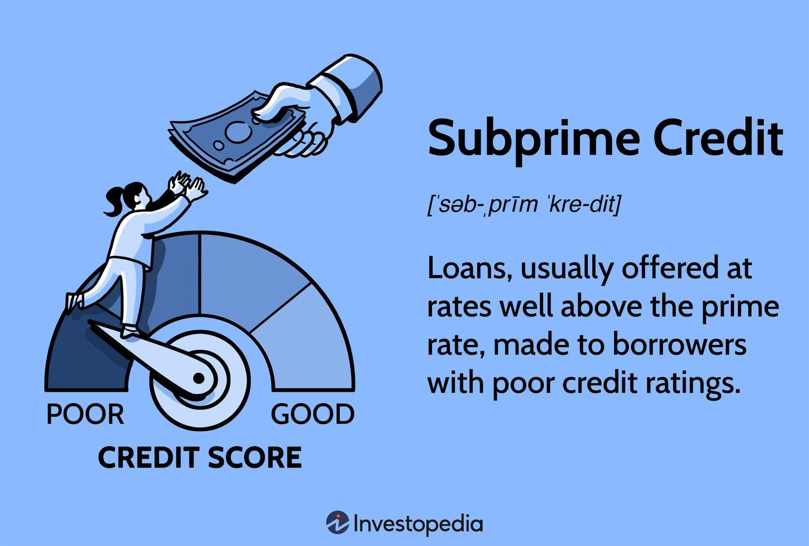

## Table of Contents

## What is subprime credit?

Subprime credit refers to loans or credit given to people who have lower credit scores or a higher risk of not paying back the money they borrow. These people might have missed payments on loans before, or they might not have much credit history. Because they are seen as riskier to lend to, the interest rates on subprime loans are usually higher than on regular loans.

Banks and other lenders make subprime loans to earn more money from the higher interest rates. However, these loans can be risky for both the lender and the borrower. If borrowers can't pay back the loan, they might lose their property or damage their credit even more. The 2008 financial crisis was partly caused by problems with subprime mortgages, showing how risky these loans can be.

## How does subprime credit differ from prime credit?

Subprime credit and prime credit are two different types of loans given to people based on their credit scores. Prime credit is given to people who have good credit scores, meaning they have a history of paying back their loans on time. These people are seen as less risky by lenders, so they get lower interest rates on their loans. It's like getting a good deal because you've shown you can be trusted to pay back the money.

On the other hand, subprime credit is given to people who have lower credit scores or a history of not paying back loans on time. These people are seen as riskier by lenders, so they have to pay higher interest rates on their loans. It's like having to pay more because you've shown you might not be as reliable in paying back the money. The higher interest rates help the lender make more money to cover the risk, but it can make it harder for the borrower to pay back the loan.

## Who are the typical borrowers of subprime credit?

Typical borrowers of subprime credit are people who have lower credit scores. This can happen if they have missed payments on loans before, or if they don't have much of a credit history. These people might have had financial troubles in the past, like losing a job or having a lot of medical bills. Because of these issues, banks see them as riskier to lend money to.

These borrowers often need loans for things like buying a car or a house, but because of their credit scores, they can't get regular loans with low interest rates. Instead, they have to take subprime loans, which have higher interest rates. This means they end up paying more money over time, which can make it even harder for them to get out of financial trouble.

## What are the common types of subprime credit products?

Subprime credit products include things like subprime mortgages, subprime auto loans, and subprime credit cards. A subprime mortgage is a home loan for people with low credit scores. These loans usually have higher interest rates than regular mortgages. Subprime auto loans are car loans for people who might have missed payments before. These loans also have higher interest rates because the lender sees the borrower as riskier.

Subprime credit cards are another common type. These cards are for people who might not get a regular credit card because of their credit history. They often come with high fees and interest rates. The idea is to help people build or repair their credit, but the high costs can make it hard for them to pay off what they owe.

These products are important for people who need to borrow money but can't get regular loans. However, they come with risks. The high interest rates can make it hard for borrowers to keep up with payments, which can lead to more financial trouble. It's important for people to understand these risks before they take out a subprime loan.

## What are the interest rates and fees associated with subprime credit?

Subprime credit comes with higher interest rates than regular loans. This is because lenders see people with lower credit scores as riskier to lend to. For example, a subprime mortgage might have an interest rate of 10% or more, while a regular mortgage might be around 3% to 5%. Subprime auto loans can have interest rates of 15% or even higher, compared to 3% to 7% for regular auto loans. These high rates mean that borrowers end up paying a lot more over time.

Besides high interest rates, subprime credit products often come with extra fees. For example, subprime credit cards might have annual fees, late payment fees, and over-the-limit fees. These fees can add up quickly, making it even harder for borrowers to pay off what they owe. It's important for people to understand all the costs before they take out a subprime loan, so they can make sure they can handle the payments.

## How does the approval process for subprime credit work?

When someone applies for subprime credit, the lender looks at their credit score and credit history. If the score is low, it means the person might have missed payments before or doesn't have much credit history. The lender sees this as a risk, so they might still approve the loan but with higher interest rates to make up for that risk. The lender might also ask for more information, like proof of income or employment, to make sure the person can pay back the loan.

The approval process can be quicker for subprime credit because lenders are more willing to take on the risk if they can charge higher rates. But it's not automatic. The lender will still check if the person can afford the payments, even with the higher rates. If the lender thinks the person can't handle the payments, they might not approve the loan, or they might offer a smaller amount or different terms. It's important for people to understand that while subprime credit can be easier to get, it comes with higher costs and risks.

## What are the risks involved in subprime lending for both lenders and borrowers?

For lenders, the main risk in subprime lending is that borrowers might not pay back the loan. This is called defaulting. If a lot of people default, the lender can lose a lot of money. This is what happened during the 2008 financial crisis, when many people couldn't pay back their subprime mortgages. Lenders also have to deal with the costs of trying to get their money back, like legal fees and the time it takes to repossess a car or foreclose on a house.

For borrowers, the risks are also big. The high interest rates on subprime loans mean they have to pay back a lot more money over time. If they can't keep up with the payments, they might lose their car or home. Their credit score can also get worse, making it even harder to get loans in the future. Plus, the extra fees on things like subprime credit cards can add up quickly, making it hard to pay off what they owe.

## How do subprime credit markets impact the broader economy?

Subprime credit markets can have a big effect on the whole economy. When a lot of people take out subprime loans and can't pay them back, it can cause problems for banks and other lenders. They might lose a lot of money, which can make them less willing to lend money to anyone. This can slow down the economy because people and businesses need loans to buy things and grow. The 2008 financial crisis is a good example of this. It started with a lot of people defaulting on their subprime mortgages, which led to big problems for banks and the whole economy.

On the other hand, subprime credit markets can also help the economy in some ways. They give people who might not get regular loans a chance to borrow money. This can help them buy homes or cars, which can be good for the economy. But it's a tricky balance. If too many people take out subprime loans and can't pay them back, it can cause big problems. So, it's important for lenders and borrowers to be careful and understand the risks involved.

## What regulatory measures are in place to oversee subprime lending?

After the 2008 financial crisis, governments and financial regulators made new rules to keep an eye on subprime lending. In the United States, the Dodd-Frank Wall Street Reform and Consumer Protection Act was passed to make sure banks and lenders were more careful. This law set up the Consumer Financial Protection Bureau (CFPB), which looks at how lenders treat borrowers, especially those with subprime loans. The CFPB makes sure lenders are clear about the costs and risks of subprime loans, so people know what they're getting into.

These rules also make lenders check if people can really afford the loans they're getting. This is called the "ability-to-repay" rule. It's meant to stop lenders from giving out loans that people can't pay back, which can lead to big problems for everyone. Other countries have their own rules too, but the main idea is the same: to make subprime lending safer for both lenders and borrowers, and to keep the economy stable.

## How have historical events, like the 2008 financial crisis, influenced subprime credit practices?

The 2008 financial crisis had a big impact on how subprime credit works. Before the crisis, banks were giving out a lot of subprime mortgages to people who couldn't really afford them. They did this because they could sell these loans to other investors, so they didn't care as much if the loans were risky. But when a lot of people couldn't pay back their loans, it caused a huge problem. Banks lost a lot of money, and it made the whole economy crash. This showed everyone that subprime lending needed to be more careful.

After the crisis, new rules were made to make subprime lending safer. The Dodd-Frank Act in the U.S. was one of these rules. It made banks check if people could really afford the loans they were getting. It also set up the Consumer Financial Protection Bureau to watch over lenders and make sure they were treating people fairly. These changes were meant to stop another big crisis from happening. Now, lenders have to be more careful about who they give subprime loans to, and they have to be clear about the costs and risks.

## What are the current trends and innovations in the subprime credit industry?

In the subprime credit industry, one big trend is using technology to make lending easier and faster. Companies are using things like online applications and automatic checks to see if someone can pay back a loan. This is called fintech, and it's making it easier for people with lower credit scores to get loans. But it also means lenders have to be careful because they're using a lot of data to make decisions.

Another trend is focusing on helping people improve their credit scores. Some companies are making special programs to teach people how to manage money better. They might offer lower interest rates if someone takes a class or uses a budgeting app. This is good because it can help people get out of the subprime category and get better loans in the future. But it's important that these programs are fair and really help people, not just make money for the companies.

## How can borrowers improve their credit scores to move from subprime to prime credit status?

To move from subprime to prime credit status, borrowers need to work on improving their credit scores. One of the best ways to do this is by paying bills on time. This shows lenders that you can be trusted to pay back what you owe. Another important thing is to keep credit card balances low. If you use a lot of your available credit, it can make lenders think you're having trouble managing money. It's also a good idea to check your credit report for mistakes and fix any errors you find. This can help your score go up if there are things on your report that shouldn't be there.

Another way to improve your credit score is by not applying for too many new loans or credit cards at once. Each time you apply, it can lower your score a little bit. It's better to take your time and only apply for what you really need. If you already have loans, try to pay them off as quickly as you can. This shows lenders that you're responsible and can handle your money well. Over time, these steps can help you move from subprime to prime credit, which means you'll get better interest rates and have more options for borrowing money.

## References & Further Reading

[1]: Ashcraft, A. B., & Schuermann, T. (2008). ["Understanding the Securitization of Subprime Mortgage Credit."](https://papers.ssrn.com/sol3/papers.cfm?abstract_id=1071189) Foundations and Trends in Finance, 2(3), 191-309.

[2]: Vives, X. (2017). ["The Impact of Fintech on Banking."](https://european-economy.eu/2017-2/the-impact-of-fintech-on-banking/) European Economy: Banks, Regulation, and the Real Sector, 2, 97-105.

[3]: De Prado, M. L. (2018). ["Advances in Financial Machine Learning."](https://www.amazon.com/Advances-Financial-Machine-Learning-Marcos/dp/1119482089) Wiley.

[4]: Hull, J. (2017). ["Options, Futures, and Other Derivatives."](https://elibrary.pearson.de/book/99.150005/9781292212920) Pearson.

[5]: Chan, E. P. (2009). ["Quantitative Trading: How to Build Your Own Algorithmic Trading Business."](https://github.com/ftvision/quant_trading_echan_book) Wiley.

[6]: Financial Stability Board. (2011). ["Potential Financial Stability Issues Arising from Recent Trends in Exchange-Traded Funds (ETFs)."](https://www.fsb.org/uploads/r_110412b.pdf) 

[7]: Basel Committee on Banking Supervision. (2010). ["Basel III: A Global Regulatory Framework for More Resilient Banks and Banking Systems."](https://www.bis.org/publ/bcbs189_dec2010.htm) Bank for International Settlements.

[8]: Aronson, D. R. (2007). ["Evidence-Based Technical Analysis: Applying the Scientific Method and Statistical Inference to Trading Signals."](https://www.amazon.com/Evidence-Based-Technical-Analysis-Scientific-Statistical/dp/0470008741) Wiley.