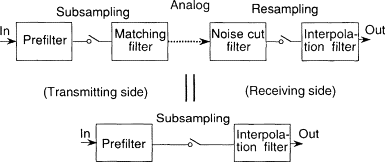

## Table of Contents

## What is subsampling in the context of machine learning?

Subsampling in machine learning is a technique used to reduce the size of a dataset by selecting a smaller, representative subset of the data. This is often done to make the training process more manageable, especially when dealing with very large datasets. By using subsampling, machine learning models can be trained more quickly and with fewer computational resources, which can be particularly useful in situations where time and resources are limited.

There are different methods of subsampling, but one common approach is random subsampling, where data points are selected randomly from the original dataset. This method helps to maintain the overall characteristics of the data, ensuring that the subset is still representative of the whole. For example, if you have a dataset with equal numbers of two classes, random subsampling would aim to keep this balance in the smaller subset. Subsampling can also help in reducing overfitting, as it forces the model to generalize better by working with less data.

## Why is subsampling used in machine learning algorithms?

Subsampling is used in machine learning algorithms because it helps to make the training process faster and easier. When you have a huge amount of data, it can take a lot of time and computer power to train a model on all of it. By taking a smaller part of the data, called a subsample, you can train the model much quicker. This is really helpful when you don't have a lot of time or when your computer isn't very powerful. It's like trying to read a whole library of books versus just reading a few selected books that still give you a good idea of what's in the library.

Another reason subsampling is used is to help prevent a problem called overfitting. Overfitting happens when a model learns too much about the specific data it's trained on and doesn't work well with new data. By using a smaller subset of data, the model has to learn more general patterns, which can make it better at working with new data. This way, the model becomes more useful in real situations where it needs to handle data it hasn't seen before. Subsampling helps to strike a balance between using enough data to learn well and not so much that the model becomes too specialized.

## How does subsampling help in dealing with imbalanced datasets?

Subsampling can be a useful tool when dealing with imbalanced datasets, where one class has a lot more examples than another. In such cases, if you train a model on the whole dataset, it might focus too much on the majority class and ignore the minority class. To fix this, you can use subsampling to reduce the number of examples from the majority class so that it's more balanced with the minority class. This helps the model pay more attention to the minority class and learn to classify it better.

For example, if you have a dataset where 90% of the examples are from Class A and only 10% are from Class B, you can use subsampling to take a smaller, equal number of examples from both classes. This way, the model sees an equal number of examples from each class during training, which can lead to better performance on the minority class. By making the dataset more balanced, subsampling helps the model to learn more fairly and accurately across all classes.

## What are the different methods of subsampling in machine learning?

In machine learning, there are a few main ways to do subsampling. One common method is called random subsampling. This is where you pick data points from your original dataset at random. The idea is to make sure that the smaller set of data still looks a lot like the bigger set. For example, if your original data has 50% of one type of data and 50% of another type, random subsampling will try to keep that balance in the smaller set. This helps the machine learning model learn from a representative sample of the data, which can make the model more accurate and faster to train.

Another method is called stratified subsampling. This is a bit like random subsampling, but it pays more attention to keeping the balance of different groups in the data. If you have different categories in your data, stratified subsampling makes sure that each category is represented in the same proportions in the smaller set as in the original set. For example, if you have data about different ages, and your original data has 30% young people, 40% middle-aged people, and 30% old people, stratified subsampling will keep those same percentages in the smaller set. This is really helpful when you want to make sure your model works well for all groups in the data.

A third method is systematic subsampling. This method involves selecting every k-th item from an ordered list of the dataset. For example, if you have a list of 1000 data points and you want a subsample of 100, you could choose every 10th item (1000/100 = 10). This can be a simple and effective way to get a subsample, but it assumes that the data is randomly ordered to begin with. If the data has some pattern or order, systematic subsampling might not give you a good representative sample. Each of these methods has its own strengths and can be chosen based on what you need for your specific machine learning task.

## Can you explain the difference between random subsampling and stratified subsampling?

Random subsampling is a way of choosing a smaller group of data from a bigger set by picking items at random. The goal is to make sure that the smaller set still looks a lot like the bigger set. For example, if your original data has 50% of one type of data and 50% of another type, random subsampling will try to keep that balance in the smaller set. This method is easy to do and works well when the data is mixed up and there's no specific order to it. However, if the data has patterns or certain groups are more important, random subsampling might not always give you the best results.

Stratified subsampling is a bit different because it pays more attention to keeping the balance of different groups in the data. It makes sure that each category in your data is represented in the same proportions in the smaller set as in the original set. For example, if your original data has 30% young people, 40% middle-aged people, and 30% old people, stratified subsampling will keep those same percentages in the smaller set. This is really helpful when you want to make sure your model works well for all groups in the data. It's especially useful when dealing with imbalanced datasets where some groups are much smaller than others.

## How does subsampling affect the bias and variance of a model?

Subsampling can affect the bias and variance of a model in different ways. When you use subsampling, you are working with a smaller part of your data. This can increase the variance of your model because the model might be more sensitive to the specific data points in the smaller set. If you use different subsamples, you might get different results each time, which means the model's predictions can vary more. However, if the subsampling is done carefully, like using stratified subsampling to keep the data balanced, it can help reduce bias by making sure the model sees all important parts of the data.

On the other hand, subsampling can also affect bias. If you are not careful, subsampling might leave out important data points, which can make the model biased towards the data it sees. For example, if you are dealing with an imbalanced dataset and you don't use a method like stratified subsampling, you might end up with a model that performs poorly on the underrepresented classes. By using subsampling to balance the dataset, you can reduce bias and help the model learn more fairly across all classes. So, the key is to use subsampling wisely to manage both bias and variance effectively.

## What are the potential drawbacks of using subsampling in machine learning?

Subsampling can make your machine learning model work faster because it uses less data. But it can also make the model's results less reliable. When you use a smaller part of the data, the model might not see all the important patterns in the whole dataset. This can make the model's predictions different each time you use a new subsample. This is called higher variance. If you're not careful, subsampling might also leave out important data, which can make the model biased towards the data it sees. So, while subsampling can save time and resources, it can also make your model less accurate and fair.

Another problem with subsampling is that it might not work well with all types of data. If your data has a lot of different groups, like different ages or types of customers, and you don't use a method like stratified subsampling, you might end up with a smaller set that doesn't represent all these groups well. This can make your model perform badly for some groups. Also, if your data has a natural order or pattern, like time series data, random subsampling might mess up this order and give you a bad sample. So, you need to think about what kind of data you have and choose the right subsampling method to avoid these problems.

## How can subsampling be implemented in popular machine learning libraries like scikit-learn?

In scikit-learn, you can use subsampling to make your machine learning models work faster and better. One way to do this is by using the `train_test_split` function with a `train_size` or `test_size` parameter. For example, if you have a dataset and you want to use only 20% of it for training, you can set `train_size=0.2`. This will give you a smaller training set and a larger test set. Another way is to use the `RandomUnderSampler` from the `imbalanced-learn` library, which is often used with scikit-learn. This tool helps you balance your dataset by reducing the number of examples from the majority class.

Here's an example of how you can use `train_test_split` to subsample your data in scikit-learn:

```python
from sklearn.model_selection import train_test_split

# Assume X is your features and y is your target
X_train, X_test, y_train, y_test = train_test_split(X, y, train_size=0.2, random_state=42)
```

If you want to balance an imbalanced dataset, you can use `RandomUnderSampler` like this:

```python
from imblearn.under_sampling import RandomUnderSampler
from sklearn.datasets import make_classification

# Create an imbalanced dataset
X, y = make_classification(n_samples=1000, n_classes=2, weights=[0.9, 0.1], random_state=42)

# Use RandomUnderSampler to balance the dataset
rus = RandomUnderSampler(random_state=42)
X_resampled, y_resampled = rus.fit_resample(X, y)
```

By using these methods, you can make your machine learning models work faster and help them learn more fairly from your data.

## What are some advanced techniques for subsampling in deep learning?

In deep learning, one advanced technique for subsampling is called mini-batch gradient descent. Instead of using the whole dataset to update the model's parameters, mini-batch gradient descent uses smaller groups of data called mini-batches. This helps the model learn faster and can make it easier to fit the data into memory. For example, if you have a big dataset, you can split it into smaller parts and train the model on these parts one at a time. This way, the model can learn from different parts of the data without needing to look at everything all at once.

Another advanced technique is called adaptive subsampling. This method changes the way it picks data based on how important each data point is for the model's learning. For example, if some data points are harder for the model to learn from, adaptive subsampling might pick those points more often. This can help the model focus on the parts of the data that it needs to learn better. By using adaptive subsampling, you can make sure your deep learning model gets the most out of the data it's trained on.

A third technique is called importance sampling, which is often used in reinforcement learning. Importance sampling picks data points based on how much they can help the model improve. If a data point can teach the model something new or important, it's more likely to be chosen. This can be especially helpful when you're working with data that has a lot of different kinds of examples. By focusing on the most important data, importance sampling can help your model learn more effectively and efficiently.

## How does subsampling interact with other techniques like cross-validation?

Subsampling and cross-validation are both used to make machine learning models better, but they work in different ways. Subsampling means picking a smaller part of your data to train your model. This can make the model learn faster and help it focus on important parts of the data. Cross-validation, on the other hand, is a way to check how well your model works by splitting your data into different parts and testing the model on each part. When you use subsampling with cross-validation, you first pick a smaller part of your data and then split that smaller part into different groups for cross-validation. This can help you see how well your model works on different parts of the smaller data set.

Using subsampling with cross-validation can be tricky because if you pick the wrong part of the data, your model might not learn all the important patterns. But if you do it right, it can save time and still give you a good idea of how well your model works. For example, if you use stratified subsampling to keep the balance of different groups in your data, and then use cross-validation on that smaller set, you can make sure your model learns fairly and performs well on all parts of the data. This way, you can get the benefits of both techniques: faster training from subsampling and a good check on model performance from cross-validation.

## Can you provide a case study where subsampling significantly improved model performance?

In a case study from a healthcare research project, subsampling was used to improve the performance of a model predicting patient readmissions. The original dataset contained over a million patient records, which made training the model slow and resource-intensive. The researchers decided to use random subsampling to reduce the dataset size to 10% of its original size. This significantly sped up the training process, allowing them to experiment with different model architectures more quickly. After subsampling, they used cross-validation to ensure the model's performance was consistent across different subsets of the data. The result was a model that not only trained faster but also achieved a higher accuracy in predicting patient readmissions compared to the model trained on the full dataset.

The success of subsampling in this case can be attributed to the careful selection of the subsample. The researchers used stratified subsampling to maintain the balance of different patient demographics and medical conditions in the smaller dataset. This ensured that the model learned from a representative sample of the population, reducing bias and improving its ability to generalize to new data. By focusing on a smaller, well-chosen subset of the data, the model was able to capture the essential patterns needed for accurate predictions without being overwhelmed by noise or irrelevant information in the larger dataset. This case study highlights how subsampling, when applied thoughtfully, can lead to significant improvements in model performance and efficiency.

## What are the latest research trends in subsampling techniques for machine learning?

Recent research trends in subsampling techniques for machine learning focus on improving the efficiency and accuracy of models by using smarter ways to pick smaller parts of data. One trend is the development of adaptive subsampling methods, which change how they pick data based on what the model needs to learn. For example, if a model is having trouble learning from certain data points, adaptive subsampling might choose those points more often. This can help the model learn faster and better. Another trend is using subsampling to handle big data problems, where researchers are looking at ways to subsample large datasets in real-time, so models can keep learning as new data comes in.

Another important trend is the use of subsampling in deep learning, particularly with techniques like mini-batch gradient descent. Researchers are working on optimizing the size and selection of mini-batches to improve training speed and model performance. They are also exploring how to combine subsampling with other techniques like data augmentation to make models more robust. For instance, by carefully choosing which data points to include in each mini-batch, researchers can ensure the model sees a good mix of examples, which can help it learn more effectively. These trends show that subsampling is becoming a key tool in making machine learning models more efficient and accurate.