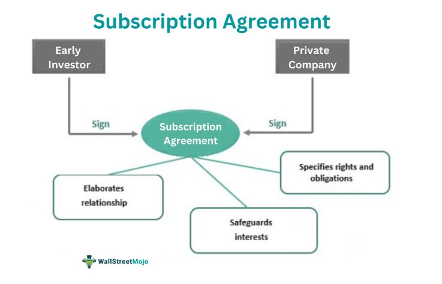

## Table of Contents

## What is a subscription agreement?

A subscription agreement is a contract between a company and an investor. It outlines the terms and conditions under which the investor agrees to buy shares or securities from the company. This agreement is commonly used by startups and private companies to raise capital from investors.

The agreement includes important details like the number of shares being sold, the price per share, and any rights or obligations the investor has. It also often includes information about the company's business, the risks involved, and any other legal requirements. By signing the subscription agreement, the investor agrees to the terms and commits to investing the agreed-upon amount.

## What are the basic components of a subscription agreement?

A subscription agreement has several important parts. The first part is about the investor and the company. It says who is buying the shares and who is selling them. It also talks about how many shares the investor will buy and how much they will pay for each share. This part makes sure everyone knows exactly what they are getting and how much it costs.

The second part of the subscription agreement covers the rules and rights. It explains what the investor can and cannot do with the shares. For example, there might be rules about when the investor can sell the shares or if they need to tell the company first. This part also talks about any special rights the investor gets, like voting on company decisions. It helps keep things fair and clear for both the investor and the company.

The last part often includes important information about the company and the risks involved. It tells the investor about the business, what it does, and what could go wrong. This part is there to make sure the investor knows everything they need to before they decide to invest. It's like a warning label that helps the investor make a smart choice.

## Why are subscription agreements important for businesses?

Subscription agreements are important for businesses because they help raise money. When a company needs money to grow or start new projects, it can sell shares to investors. The subscription agreement makes sure everyone knows the rules about buying and selling these shares. It tells the investor how many shares they can buy and how much they need to pay. This helps the company get the money it needs in a clear and organized way.

These agreements also protect both the company and the investor. They set clear rules about what the investor can do with the shares, like when they can sell them or if they need to tell the company first. This helps prevent problems later on. The agreement also tells the investor about the company and any risks involved. This way, the investor can make a smart choice about whether to invest. By having everything written down, both the company and the investor feel safer and more confident.

## How do subscription agreements differ from other types of contracts?

Subscription agreements are special contracts used by companies to raise money from investors. They are different from other contracts because they focus on selling shares or securities. In a subscription agreement, the main thing is that an investor agrees to buy a certain number of shares at a set price. This is different from other contracts, like service agreements, where one company agrees to do work for another, or lease agreements, where someone rents property. The subscription agreement is all about investing money in a company in exchange for ownership.

Another way subscription agreements differ is that they include specific details about the investment. They tell the investor about the company's business, the risks involved, and any special rights the investor gets, like voting on company decisions. This is different from other contracts that might focus on things like delivery dates, payment terms, or maintenance responsibilities. Subscription agreements also often have rules about when and how the investor can sell their shares, which you usually don't see in other types of contracts. This makes them unique and important for both the company and the investor.

## What are the key legal regulations that govern subscription agreements?

Subscription agreements are governed by a mix of federal and state laws. At the federal level, the Securities Act of 1933 is a big one. It makes sure companies tell the truth about their securities and don't lie to investors. The Securities Exchange Act of 1934 also matters because it deals with how securities are traded after they're sold. These laws help keep the investment world fair and safe for everyone.

State laws, called Blue Sky Laws, also play a role. They work alongside federal laws to protect investors from fraud. Each state has its own rules, so companies need to follow them when selling shares. These laws make sure that subscription agreements are clear and honest, so investors know what they're getting into. Together, federal and state laws make sure subscription agreements are done right and protect both the company and the investor.

## How can a business ensure compliance with subscription agreement regulations?

A business can make sure it follows the rules for subscription agreements by first understanding the laws that apply. This means learning about the Securities Act of 1933 and the Securities Exchange Act of 1934, which are big federal laws. These laws say that companies have to tell the truth about their securities and how they're sold. Businesses also need to know about state Blue Sky Laws, which protect investors from fraud. By understanding these laws, a business can make sure its subscription agreements are clear and honest.

To stay compliant, a business should also work with a lawyer who knows about securities law. This lawyer can help make sure the subscription agreement follows all the rules. The lawyer can check the agreement to make sure it has all the right information, like details about the company and the risks involved. They can also help the business file the right papers with the government. By working with a lawyer and understanding the laws, a business can keep its subscription agreements legal and protect itself and its investors.

## What are the common pitfalls to avoid when drafting a subscription agreement?

When drafting a subscription agreement, one common pitfall to avoid is not being clear and detailed enough. The agreement needs to say exactly how many shares the investor is buying and how much they are paying. If this information is not clear, it can lead to confusion and disagreements later on. The agreement should also explain any rules about selling the shares, like if the investor needs to tell the company first. If these rules are not clear, it can cause problems and even legal issues.

Another pitfall is not including all the important information about the company and the risks involved. The agreement should tell the investor about the business and what could go wrong. If this information is missing or not explained well, the investor might not understand what they are getting into. This can lead to the investor feeling misled and possibly taking legal action. To avoid these problems, the agreement should be as clear and complete as possible, with all the necessary details and warnings.

## How do international laws affect subscription agreements?

When a company wants to sell shares to investors from different countries, international laws can make things more complicated. Each country has its own rules about selling securities, and these rules can be very different. For example, some countries might have strict rules about who can invest and how much they can invest. A company needs to know these rules and follow them to make sure its subscription agreement is legal everywhere it wants to sell shares. If the company doesn't follow these rules, it could get in trouble and face fines or legal problems.

To deal with international laws, a company often needs to work with lawyers who know about the laws in different countries. These lawyers can help make sure the subscription agreement follows all the right rules. They can also help the company file the right papers with the governments of the countries where it wants to sell shares. By understanding and following international laws, a company can make sure its subscription agreement is legal and protect itself and its investors from different countries.

## What are the best practices for managing and updating subscription agreements?

Keeping subscription agreements up to date is important for a business. One good way to do this is to review the agreements regularly. This means looking at them every year or whenever there are big changes in the company or the law. By doing this, the business can make sure the agreements still follow all the rules and are fair to everyone. If something needs to be changed, the business should talk to its investors and explain why the change is needed. This helps keep trust and makes sure everyone understands the new terms.

Another good practice is to keep good records of all the subscription agreements. This means saving copies of the agreements and any changes made to them. It's also important to keep track of who the investors are and how many shares they own. By keeping good records, the business can easily find information when it needs to and make sure it follows the rules. Working with a lawyer can also help. A lawyer can check the agreements and make sure they are still legal and up to date. This way, the business can avoid problems and keep its investors happy.

## How can technology be used to streamline the management of subscription agreements?

Technology can help make managing subscription agreements easier by using special software. This software can keep all the agreements in one place, so it's easy to find them when you need to. It can also remind the business when it's time to review the agreements or if there are any changes in the law. This way, the business can make sure the agreements are always up to date without having to remember everything on their own. The software can also help with keeping track of who the investors are and how many shares they own, making it simpler to manage all the information.

Another way technology helps is by making it easier to talk to investors. The business can use online tools to send updates and changes to the agreements to the investors quickly. This helps keep everyone informed and can make the process of updating agreements smoother. Using electronic signatures can also speed things up, so investors can sign the agreements without having to print and mail them. By using technology, a business can save time and make sure everything is done correctly and on time.

## What are the advanced clauses that can be included in a subscription agreement for added protection?

A subscription agreement can include advanced clauses to give more protection to both the company and the investors. One important clause is the "Right of First Refusal." This means that if an investor wants to sell their shares, they have to offer them to the company first. This gives the company a chance to buy the shares back before anyone else can. Another useful clause is the "Drag-Along Right." This lets the majority shareholders force the minority shareholders to join in if they want to sell the whole company. It helps make sure everyone can benefit from a big sale.

Another clause that can be added is the "Tag-Along Right." This protects minority shareholders by letting them join in if the majority shareholders are selling their shares. It makes sure the minority shareholders can get the same good deal. A "Non-Compete Clause" can also be included to stop investors from starting or working for a competing business. This helps protect the company's secrets and business plans. By adding these clauses, a subscription agreement can offer more safety and fairness for everyone involved.

## How do recent legal precedents impact the drafting and enforcement of subscription agreements?

Recent legal cases have shown that it's very important for subscription agreements to be clear and honest. Courts have ruled that if a company doesn't tell investors everything they need to know about the business and the risks, the investors might be able to take legal action. For example, if a company hides important information or makes false promises, the agreement could be seen as misleading. This means that when drafting a subscription agreement, companies need to be careful to include all the important details and make sure everything is true. By doing this, they can avoid legal problems and keep their investors happy.

Another way recent legal precedents have affected subscription agreements is by making the rules about selling shares stricter. Courts have decided that if the agreement has unclear rules about when and how investors can sell their shares, it can lead to disagreements and legal fights. For example, if the agreement doesn't say clearly if investors need to tell the company before they sell their shares, it can cause confusion. Because of this, companies need to make sure their subscription agreements have clear rules about selling shares. This helps prevent problems and makes sure everyone knows what they can and can't do with their shares.

## References & Further Reading

[1]: Black, V. (1995). ["Evaluating the Regulators: Rule 506 of Regulation D"](https://lawcast.com/2019/10/01/a-drill-down-on-rule-506-of-regulation-d/). California Law Review, 83(6).

[2]: Greifeld, E., & Barton, D. (2019). ["How Rule 506(b) and 506(c) Differ in Securities Offerings"](https://www.securitieslawyer101.com/2019/rule-506b-offerings/) Securities Lawyer 101.

[3]: Lopez de Prado, M. (2018). ["Advances in Financial Machine Learning"](https://www.amazon.com/Advances-Financial-Machine-Learning-Marcos/dp/1119482089). Wiley.

[4]: Chan, E. P. (2009). ["Quantitative Trading: How to Build Your Own Algorithmic Trading Business"](https://github.com/ftvision/quant_trading_echan_book). Wiley.

[5]: Jansen, S. (2020). ["Machine Learning for Algorithmic Trading"](https://github.com/stefan-jansen/machine-learning-for-trading). Packt Publishing.

[6]: Aronson, D. (2006). ["Evidence-Based Technical Analysis: Applying the Scientific Method and Statistical Inference to Trading Signals"](https://www.amazon.com/Evidence-Based-Technical-Analysis-Scientific-Statistical/dp/0470008741). Wiley.

[7]: Securities and Exchange Commission. (2021). ["Regulation D Offerings"](https://www.ecfr.gov/current/title-17/chapter-II/part-230/subject-group-ECFR6e651a4c86c0174/) SEC.gov.