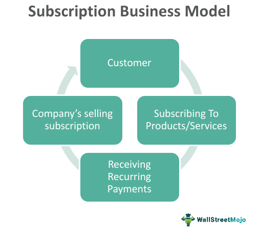

In recent years, the subscription business model has gained significant traction across various industries, including algorithmic trading. This business approach involves selling services or products on a recurring basis, thereby establishing a steady stream of revenue. By focusing on customer retention, subscription models help businesses maintain a continuous engagement with their clients while offering ongoing access to their products or services. This trend is particularly evident in algorithmic trading, where the demand for up-to-date technology and analytics tools is crucial.

Algorithmic trading, often referred to as algo trading, employs automated and pre-programmed trading instructions designed to execute financial transactions rapidly and efficiently. This method relies heavily on advanced algorithms to process vast amounts of market data and make informed trading decisions with minimal delay. The primary advantage of algorithmic trading is its ability to execute trades at high speeds, which is a critical factor in global financial markets where opportunities can open and close in fractions of a second.

The integration of subscription models into algorithmic trading has profoundly impacted the way businesses offer these sophisticated trading solutions. Instead of making a one-time purchase, traders can subscribe to platforms that provide continuous access to cutting-edge tools, real-time analytics, and data feeds. This setup not only offers businesses a predictable revenue stream but also ensures that traders can leverage the latest advancements and strategies without the burden of high upfront costs.

Subscription-based services contribute to the accessibility and sustainability of algorithmic trading tools, making them available to a wider audience. By lowering the barriers to entry, this model supports both professional traders and retail investors in accessing advanced trading strategies. The ongoing access to updated technologies and insights plays a crucial role in enhancing trading success and keeping users engaged over the long term.

This article will explore how these subscription models have become integral to businesses offering algorithmic trading solutions. It will also cover various examples of algorithmic trading strategies, illustrating how subscription-based services are revolutionizing this space through innovative practices and offerings.

## Table of Contents

## Understanding Subscription Business Models

Subscription business models function by offering products or services on a recurring schedule, generating continual revenue streams. This contrasts with traditional sales approaches that prioritize one-time purchases. Instead, subscription arrangements provide ongoing access for customers, typically through monthly or yearly payments. Such a model serves to enhance customer lifetime value and stabilize revenue, proving effective across various sectors, including media, software, and financial trading platforms.

In a subscription setup, revenue predictability is increased, allowing businesses to forecast financial performance more accurately and manage resources efficiently. This model fosters long-term relationships with customers, encouraging loyalty and reducing churn through consistent engagement and service offerings. For example, businesses leveraging subscription models often place an emphasis on value-added services, regular updates, and personalized customer experiences to retain subscribers and maximize the perceived value of their offerings.

The shift towards subscriptions reflects broader trends in the economy, highlighting a shift from ownership to access-based consumption. This paradigm shift is evident in the rise of subscription services across diverse sectors, where consumers prioritize the flexibility and convenience of accessing services and products over outright ownership. This approach aligns with changing consumer preferences, which increasingly value experiences and accessibility over permanent acquisition and possession.

In the context of the financial trading industry, subscription models facilitate continuous access to cutting-edge technologies and market intelligence, allowing traders to remain competitive. This evolution in selling methodologies underscores the adaptability of businesses to meet changing consumer dynamics, leveraging recurring revenue for sustainable growth and innovation in product and service provision.

## Algorithmic Trading: An Overview

Algorithmic trading employs complex algorithms to automate and optimize trading strategies, allowing for rapid and precise execution of trades. These algorithms are designed to follow pre-programmed instructions, analyzing vast amounts of market data to execute trades efficiently and quickly. By doing so, they significantly reduce the influence of human emotions, such as fear and greed, that often lead to suboptimal investment decisions.

One of the primary advantages of [algorithmic trading](/wiki/algorithmic-trading) is its speed. Algorithms can process information and execute trades in fractions of a second, far surpassing the capabilities of a human trader. This rapid response to market changes enables traders to capitalize on fleeting opportunities that might otherwise be missed in manual trading scenarios.

Efficiency is another critical benefit. Algorithmic strategies can manage and monitor several trading accounts simultaneously, providing a level of efficiency and consistency that manual trading cannot achieve. This capability is crucial, particularly in markets that are open 24/7, such as [forex](/wiki/forex-system) markets, where staying constantly alert is impractical for human traders.

Furthermore, algorithmic trading enables scalability. Traders can implement strategies across a diverse range of assets and markets without the need for additional manpower, thus allowing a single trader or a small team to handle large-scale operations. This scalability is made possible through various algorithmic strategies tailored to specific market conditions and investment goals.

For instance, some algorithms are designed for trend-following, identifying sustained movements in market prices and executing trades to gain from these trends. Others, like [arbitrage](/wiki/arbitrage) algorithms, exploit price discrepancies of the same or related assets in different markets to make profits. Mean reversion strategies, on the other hand, operate on the assumption that asset prices will revert to their historical averages over time, allowing traders to predict and profit from price fluctuations.

In essence, algorithmic trading provides a sophisticated framework for optimizing trading strategies, balancing the elements of speed, efficiency, and scalability. By employing machine-driven precision, it revolutionizes traditional trading approaches, enabling a more systematic exploration of market opportunities and risks.

## Subscription Models in Algorithmic Trading

The integration of subscription models within algorithmic trading platforms offers traders ongoing access to advanced tools and analytics. This innovative approach allows businesses to establish a renewable revenue stream and ensures that traders have consistent access to the latest resources, including algorithms, analytics platforms, and essential data feeds.

Companies utilizing this model, such as Composer and Tickeron, have developed subscription-based services that maintain the delivery of cutting-edge technology and strategies to their users. Composer, for instance, provides a no-code solution enabling users to construct complex trading strategies through a drag-and-drop interface. This accessibility opens up opportunities for individuals without programming skills to engage actively in algorithmic trading. Similarly, Tickeron offers AI-driven insights that help traders make informed decisions by predicting market movements through [machine learning](/wiki/machine-learning) algorithms and pattern recognition technology.

The appeal of subscription-based models in algorithmic trading lies in the continuous evolution of algorithms and technology. Subscribers benefit from regular updates and improvements without needing to commit significant capital to one-time purchases. This enhances the user's experience by providing a constant flow of information and updated trading methodologies, which can adapt to changing market conditions.

For providers, these models create a more stable revenue flow, reducing the unpredictability of one-time sales. Subscription services allow for long-term customer retention and the potential for increasing customer lifetime value through tiered subscription offerings that provide various levels of service based on the trader's expertise and needs.

In summary, subscription models have become increasingly significant in algorithmic trading, offering traders the ability to implement sophisticated strategies with cutting-edge resources. This approach not only broadens the accessibility of algorithmic trading tools but also ensures the financial sustainability and growth of service providers in a competitive market environment.

## Examples of Algorithmic Trading Strategies

Momentum Trading is a strategic approach that harnesses continuous price trends to inform buy and sell decisions. This strategy examines the velocity and magnitude of price movements, utilizing indicators such as the Relative Strength Index (RSI) and Moving Average Convergence Divergence (MACD). The elementary principle is that an asset demonstrating strong price movements will likely continue in the same direction. A simple [momentum](/wiki/momentum) trading strategy might involve buying an asset when its short-term moving average surpasses its long-term moving average, indicating a potential upward trend.

Trend Following strategies are similar to momentum trading but focus explicitly on long-term price patterns rather than short-term fluctuations. By employing algorithms to detect persistent price directions, traders can capitalize on these extended trends. Technical indicators like moving averages and exponential moving averages (EMA) are frequently used to smooth out price data and depict clearer trend signals. A common rule in this strategy is the "golden cross," where a short-term moving average crosses above a long-term moving average, suggesting a bullish market.

Arbitrage trading strategies exploit price inefficiencies. This technique involves identifying price discrepancies of identical or similar financial instruments across different markets to secure a risk-free profit. For example, in pairs trading, a trader might simultaneously purchase and sell correlated stocks if their price divergence widens beyond historical norms, anticipating a convergence to the mean. A script running an arbitrage strategy would typically include rapid data analysis and execution capabilities to capitalize on these fleeting opportunities.

Mean Reversion centers on the idea that asset prices fluctuate around an average or mean value. Traders using this strategy predict that any deviation from this mean – either upwards or downwards – will eventually correct itself, and prices will revert back to the average. Bollinger Bands are a prevalent tool in mean reversion strategies, indicating overbought or oversold conditions based on standard deviations from the moving average. A typical approach involves buying an asset when its price approaches the lower band and selling when it nears the upper band, expecting a return to the mean. 

These trading strategies leverage advanced mathematical models and statistical analysis to execute trades with minimal human intervention, optimizing the potential for profit while controlling risk.

## Implementing Algorithmic Strategies Without Coding

Thanks to modern technology, creating and implementing algorithmic trading strategies has become accessible even to individuals without programming skills. A notable development is the rise of platforms like Composer, which offer intuitive drag-and-drop interfaces. These platforms significantly lower the technical barrier, allowing users to deploy sophisticated trading strategies with relative ease.

Composer and similar no-code platforms have democratized the field of algorithmic trading by enabling broader participation among retail investors and small-scale traders. These platforms often provide pre-built templates and customizable components, allowing users to construct complex algorithms without writing any code. For instance, users can select from a variety of trading indicators, set specific conditions, and automate trade executions based on predefined criteria.

The accessibility of no-code platforms not only expands participation but also enhances the diversity of trading strategies that can be developed. This democratization fosters innovation, as a wider range of market participants can experiment with different approaches, learn from real-time market feedback, and refine their strategies over time.

Moreover, these platforms often come with built-in [backtesting](/wiki/backtesting) tools, allowing users to simulate their strategies against historical data. This feature is indispensable for assessing the potential effectiveness of a strategy before deploying real capital. By reducing the reliance on coding skills and providing robust testing capabilities, no-code platforms have fundamentally transformed the landscape of algorithmic trading, making it more inclusive and dynamic.

## Conclusion

The subscription model has significantly transformed the landscape of algorithmic trading by enhancing the accessibility and affordability of advanced trading tools. By adopting this model, algorithmic trading platforms offer traders continuous access to sophisticated technology, enabling them to stay competitive in rapidly evolving financial markets. This accessibility not only lowers the entry barrier for individual and smaller institutional traders, but also democratizes access to high-level trading strategies and data analytics that were previously limited to large financial institutions.

Furthermore, the subscription approach stimulates ongoing innovation within the industry. As providers compete to retain and expand their subscriber base, they are motivated to continuously innovate and improve their offerings. This dynamic ensures that traders are equipped with the latest advancements in technology and market insights, which are crucial for making informed trading decisions in a world where market conditions can shift suddenly.

As the subscription model continues to mature, it is poised to redefine the future of trading strategies and reshape the relationship between platform providers and their users. Providers are encouraged to focus on customer satisfaction and engagement, fostering a more customer-centric approach. This evolving model also supports a more predictable and consistent revenue stream for providers, allowing for sustained investment in research and development. Ultimately, the subscription model represents a significant shift towards more personalized and responsive financial trading platforms, heralding a new era of trading where adaptability and innovation are at the forefront.

## References & Further Reading

[1]: Bergstra, J., Bardenet, R., Bengio, Y., & Kégl, B. (2011). ["Algorithms for Hyper-Parameter Optimization."](https://papers.nips.cc/paper/4443-algorithms-for-hyper-parameter-optimization) Advances in Neural Information Processing Systems 24.

[2]: ["Advances in Financial Machine Learning"](https://www.amazon.com/Advances-Financial-Machine-Learning-Marcos/dp/1119482089) by Marcos Lopez de Prado

[3]: ["Evidence-Based Technical Analysis: Applying the Scientific Method and Statistical Inference to Trading Signals"](https://www.amazon.com/Evidence-Based-Technical-Analysis-Scientific-Statistical/dp/0470008741) by David Aronson

[4]: ["Machine Learning for Algorithmic Trading"](https://github.com/stefan-jansen/machine-learning-for-trading) by Stefan Jansen

[5]: ["Quantitative Trading: How to Build Your Own Algorithmic Trading Business"](https://www.amazon.com/Quantitative-Trading-Build-Algorithmic-Business/dp/1119800064) by Ernest P. Chan