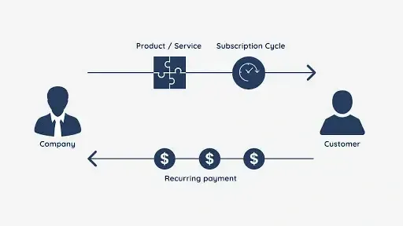

## Table of Contents

## What is a subscription business model?

A subscription business model is when a company charges customers a regular fee, usually every month or year, to use their product or service. This model is popular with services like streaming movies, music, or even getting regular deliveries of things like food or clothes. Instead of buying something one time, customers pay a smaller amount regularly to keep using the service.

This model helps companies make money more steadily because they know how much money they will get each month from their subscribers. It also helps them build a closer relationship with their customers, who keep coming back. For customers, it can be easier to budget because they know what they will be paying regularly, and they often get a better deal than if they bought the product or service each time they wanted to use it.

## What are the key components of a subscription business model?

The first key part of a subscription business model is the recurring payment. This means customers pay a regular fee, like every month or year, to keep using the service or product. This helps the company know how much money it will get regularly, which makes planning easier. For customers, it can be easier to manage their money because they know what they will pay and when.

Another important part is the value proposition. This is what the company offers that makes people want to keep paying for it. It could be something like getting new movies or music every month, or getting regular deliveries of food or clothes. The company needs to make sure that what they offer is good enough that people think it's worth paying for over and over.

The last key component is customer retention. This means keeping customers happy so they don't stop their subscription. Companies do this by making their service easy to use, giving good customer service, and sometimes offering special deals or new features. Keeping customers is important because it costs less to keep a customer than to find a new one, and happy customers might tell their friends about the service, which can bring in more subscribers.

## How does a subscription business model differ from traditional business models?

A subscription business model is different from traditional business models because it focuses on getting a regular payment from customers instead of selling things one time. In a traditional model, a company might sell a product like a TV or a service like a haircut, and once the customer pays, the transaction is done. But with a subscription, the customer pays a smaller amount regularly, like every month or year, to keep using the product or service. This means the company gets money more steadily and can plan better for the future.

Another big difference is how the company thinks about its relationship with customers. In a traditional model, the focus might be on selling as many products as possible. But in a subscription model, the company wants to keep customers happy so they keep paying every month. This means the company might spend more time on things like customer service and making the product or service better over time. It's more about building a long-term relationship with the customer than just making a one-time sale.

## What are the benefits of using a subscription business model for a company?

Using a subscription business model can help a company make money more steadily. Instead of waiting for customers to buy things one time, the company gets a regular payment from each subscriber. This makes it easier for the company to plan and know how much money they will have coming in each month. It also means the company can focus on keeping their customers happy so they keep paying, rather than always trying to find new customers.

Another benefit is that a subscription model can help a company build a closer relationship with its customers. Because customers are paying regularly, the company can keep in touch with them more often, maybe by sending them updates or special offers. This can make customers feel more connected to the company and more likely to keep their subscription. Plus, happy customers might tell their friends about the service, which can bring in more subscribers without the company having to spend a lot on advertising.

## What are the potential challenges and drawbacks of a subscription business model?

One challenge of a subscription business model is keeping customers happy so they don't cancel their subscription. If customers don't think the service is worth the regular payment, they might stop subscribing. This means the company has to keep making the service better and listen to what customers want. It can be hard to keep everyone happy all the time, and if too many people cancel, the company might lose money.

Another drawback is that it can be hard to get new subscribers. People might not want to sign up for another regular payment, especially if they already have a lot of subscriptions. The company has to work hard to show people that their service is worth it. Plus, if the company wants to grow, they need to keep finding new customers, which can be expensive and take a lot of effort.

Lastly, managing a subscription business can be more complicated than a traditional business. The company has to handle things like billing, keeping track of who is subscribed, and dealing with people who want to cancel. This can take a lot of time and money. If the company doesn't do these things well, it can lead to unhappy customers and problems with the business.

## Can you provide examples of successful companies using a subscription business model?

Netflix is a great example of a company that uses a subscription business model. They let people watch movies and TV shows for a monthly fee. This means people can watch as much as they want without buying each movie or show separately. Netflix keeps adding new shows and movies to keep people interested and happy so they don't cancel their subscription. This has helped Netflix grow a lot and become very popular all over the world.

Another example is Spotify. They offer music streaming for a monthly fee. People can listen to any song they want without having to buy each one. Spotify also makes special playlists and lets people find new music easily. This keeps people coming back and paying every month. Like Netflix, Spotify has grown a lot because of their subscription model and now has millions of users around the world.

Amazon Prime is also a successful subscription service. For a yearly fee, people get free fast shipping on a lot of things they buy from Amazon, plus they can watch movies and TV shows, and get other special deals. This makes people want to keep their subscription because they get a lot of value from it. Amazon Prime has helped Amazon keep customers happy and coming back, which has been a big part of their success.

## How can a company effectively market a subscription service?

To market a subscription service well, a company needs to show people why their service is worth paying for every month or year. They can do this by talking about the benefits, like getting new movies or music, or getting regular deliveries of things like food or clothes. The company should use ads, social media, and their website to tell people about these benefits. They can also offer a free trial so people can try the service before they have to pay. This helps people see the value and might make them want to keep the subscription after the trial is over.

Another important thing is to keep customers happy so they tell their friends about the service. Happy customers can be the best way to get new subscribers. The company can do things like sending special offers or new features to keep people interested. They should also make sure their customer service is good so people feel taken care of. By focusing on making their subscribers happy, the company can get more people to sign up without spending a lot on advertising.

## What are the best practices for managing customer retention in a subscription business?

One of the best ways to keep customers in a subscription business is by giving them a great experience. This means making the service easy to use and always working to make it better. If customers feel like they are getting good value for their money, they are more likely to keep their subscription. Companies should listen to what customers say and use that feedback to improve the service. They can also send special offers or new features to keep people interested and happy. Good customer service is also important. If customers have a problem, they should be able to get help quickly and easily. This makes them feel taken care of and more likely to stay with the service.

Another important thing is to keep in touch with customers regularly. This can be through emails, social media, or even special events. By staying connected, companies can remind customers about the value of the service and make them feel part of a community. It's also a good idea to offer different plans or options so customers can choose what works best for them. This flexibility can help keep people subscribed because they feel like the service fits their needs. Overall, the key to keeping customers is to make sure they always feel valued and that the service is worth the regular payment.

## How do you calculate the lifetime value of a subscriber in a subscription model?

To calculate the lifetime value of a subscriber in a subscription model, you start by figuring out how much money you get from each subscriber every month or year. Then, you need to know how long the average subscriber stays with your service. You multiply the monthly or yearly payment by the average number of months or years a subscriber stays. This gives you the total amount of money you expect to get from one subscriber over their time with you. But you also have to think about the costs of keeping that subscriber, like customer service and marketing. So, you subtract these costs from the total money you get to find the lifetime value.

It's also important to think about other things that can change the lifetime value. For example, if you can get subscribers to spend more money by buying extra things or upgrading their plan, that adds to their value. Also, if you can keep subscribers for longer by making your service better or giving them special deals, that increases their lifetime value too. So, the lifetime value isn't just a simple number; it's something that can change based on how well you take care of your subscribers and how much they use your service.

## What role does data analytics play in optimizing a subscription business model?

Data analytics is really important for making a subscription business better. It helps companies understand what their customers like and don't like. By looking at data, companies can see which parts of their service are popular and which ones need to be improved. They can also find out why people might be cancelling their subscriptions and fix those problems. This way, they can keep more customers happy and make them want to stay subscribed longer.

Using data analytics also helps companies make smart decisions about what to offer next. They can see trends and figure out what new features or products might be popular. This can help them keep their service fresh and interesting, so people keep paying every month or year. Plus, data can show which customers might be thinking about leaving, so the company can reach out to them with special offers or improvements to keep them around. Overall, data analytics helps subscription businesses work better and keep more customers happy.

## How can a subscription business model be adapted for different industries?

A subscription business model can be used in many different industries by changing it to fit what people in that industry want. For example, in the entertainment industry, companies like Netflix and Spotify offer movies, TV shows, and music for a monthly fee. This works well because people like having a lot of choices and not having to buy each thing separately. In the food industry, companies like HelloFresh and Blue Apron send regular deliveries of meal kits, which is great for people who want to cook at home but don't have time to shop for ingredients. By understanding what people in each industry need, a subscription model can be made to fit those needs.

In the software industry, companies like Adobe and Microsoft offer their programs for a monthly or yearly fee instead of selling them one time. This is good for customers because they always get the newest version of the software without having to pay for upgrades. In the fashion industry, companies like Stitch Fix send regular boxes of clothes, which is perfect for people who want to try new styles without going to the store. By looking at what people in different industries want and need, a subscription model can be changed to work well in any industry. This helps companies make money more steadily and keep their customers happy.

## What are the future trends and innovations expected in the subscription business model?

In the future, subscription business models are expected to become even more personalized. Companies will use data and technology to understand what each customer likes and wants. This means they can offer special deals and new features that are just right for each person. For example, a music service might make playlists based on what you listen to, or a food delivery service might send meals that fit your diet. This personalization can make customers feel more valued and keep them subscribed longer.

Another trend is the growth of bundled subscriptions. Instead of paying for many different services separately, people might choose one big subscription that includes several things they like. For example, a company might offer a package that includes streaming movies, music, and even a magazine subscription all in one. This can be easier for customers to manage and might be cheaper than paying for each service on its own. As more companies start offering these bundles, it could change how people think about subscriptions and make them even more popular.

## References & Further Reading

[1]: Bergstra, J., Bardenet, R., Bengio, Y., & Kégl, B. (2011). ["Algorithms for Hyper-Parameter Optimization."](https://papers.nips.cc/paper/4443-algorithms-for-hyper-parameter-optimization) Advances in Neural Information Processing Systems 24.

[2]: ["Advances in Financial Machine Learning"](https://www.amazon.com/Advances-Financial-Machine-Learning-Marcos/dp/1119482089) by Marcos Lopez de Prado

[3]: ["Evidence-Based Technical Analysis: Applying the Scientific Method and Statistical Inference to Trading Signals"](https://www.amazon.com/Evidence-Based-Technical-Analysis-Scientific-Statistical/dp/0470008741) by David Aronson

[4]: ["Machine Learning for Algorithmic Trading"](https://github.com/stefan-jansen/machine-learning-for-trading) by Stefan Jansen

[5]: ["Quantitative Trading: How to Build Your Own Algorithmic Trading Business"](https://www.amazon.com/Quantitative-Trading-Build-Algorithmic-Business/dp/1119800064) by Ernest P. Chan