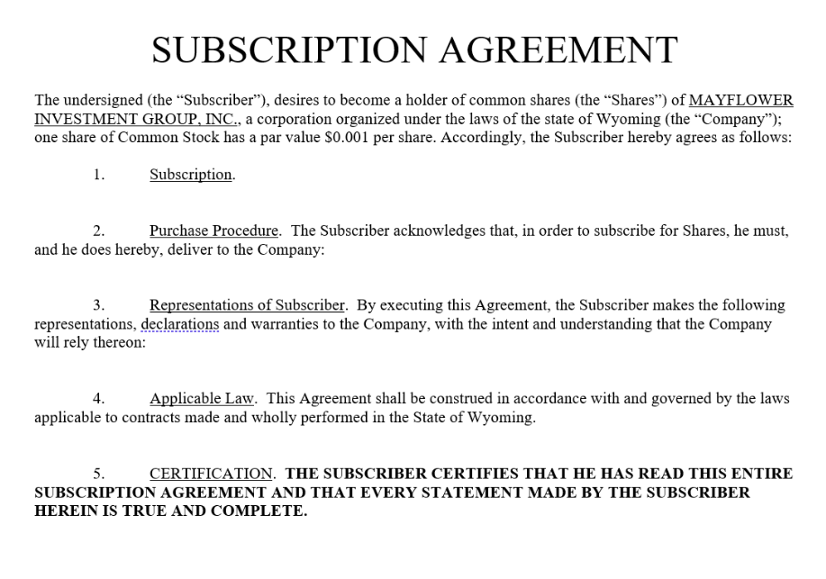

In recent years, subscription services have gained traction across a myriad of industries, offering consumers the flexibility and access to premium products and services without the necessity for large upfront investments. This shift is evident in sectors such as entertainment, software, and notably, finance, where these services have transformed the way individuals approach investing and trading. Particularly in the financial sector, subscription-based models combined with algorithmic trading have emerged as effective solutions for investors keen on optimizing their trading strategies.

Algorithmic trading involves the use of computer programs to execute trades based on pre-established criteria and algorithms. This automation facilitates efficient trade execution while minimizing potential human induced errors, thus appealing to both institutional investors and individual traders pursuing precision and speed in trade execution. Subscription services capitalize on this by offering a variety of packages that grant users access to advanced trading tools, real-time data, and bespoke algorithmic solutions tailored to different levels of trading needs and expertise.



By subscribing to these services, traders can enhance their trading experience without the burden of hefty infrastructure investments or the need for extensive in-house technical expertise. The evolution of these services provides users with the leverage to remain agile in rapidly changing markets, a significant advantage for staying competitive. Moreover, they encapsulate features such as personalized insights and risk management tools, vital components that empower traders to make more informed decisions.

This article will explore how subscription services operate within algorithmic trading and answer frequently asked questions about their efficacy and operational mechanics. Understanding the functionality and offering of these services can be pivotal for investors looking to enhance their trading capabilities, ensuring they are well-equipped to navigate the complexities of modern financial markets.

## Table of Contents

## What is Algorithmic Trading?

Algorithmic trading, often referred to as algo trading, is a method of executing orders using automated and pre-programmed trading instructions to account for variables such as time, price, and volume. These computer programs rely on complex mathematical formulas and algorithms to make trading decisions, which enhances the efficiency of trade execution. 

The automation of trade execution through algorithmic trading allows for a swift response to market changes, helping to minimize human error that can arise from manual trading. The speed of execution provided by algo trading is valuable in high-frequency trading ([HFT](/wiki/high-frequency-trading-strategies)), where even microseconds can make a significant difference in profitability. 

Algo trading is predominantly employed by large financial institutions such as hedge funds and institutional investors. These entities benefit from the ability to process and analyze extensive datasets and execute a large [volume](/wiki/volume-trading-strategy) of trades rapidly. For example, an algorithm might be programmed to execute a trade when a stock reaches a certain price level, or to manage risk by diversifying a portfolio according to complex rules derived from [machine learning](/wiki/machine-learning) models.

The significance of [algorithmic trading](/wiki/algorithmic-trading) lies in its capability to leverage massive computational power to analyze market data in real time. By harnessing technologies such as [artificial intelligence](/wiki/ai-artificial-intelligence) and machine learning, algo trading systems can identify patterns and trends that are imperceptible to human traders. This rational and data-driven approach enables investors to devise and adapt strategies that enhance their market engagement, optimize execution, and ultimately drive better trading outcomes.

## How Subscription Services Enhance Algo Trading

Subscription services have revolutionized the landscape of algorithmic trading by providing traders with comprehensive access to advanced tools, data feeds, and algorithms designed to enhance trading strategies. These services are structured to cater to varying levels of trading expertise and needs, offering different subscription tiers to accommodate both novice and professional traders. This tiered approach allows subscribers to choose packages that best fit their trading requirements, ensuring access to appropriate resources and tools for their level of knowledge and experience.

One of the key advantages of subscription services in algorithmic trading is the provision of real-time market data. This data is crucial for executing informed trades and developing robust trading strategies. Real-time data feeds include information such as price movements, trading volumes, and market trends, which help traders respond swiftly to market conditions. Moreover, many subscription services integrate advanced analytics and insights, enabling traders to interpret complex datasets and make data-driven decisions.

In addition to data feeds, subscription services often offer algorithmic customization options. These options allow traders to tailor algorithms to their specific trading objectives, risk tolerance, and market preferences. By customizing algorithms, traders can optimize their strategies to better predict market movements and execute trades more efficiently. Customization capabilities might include setting parameters for entry and [exit](/wiki/exit-strategy) points, risk management rules, and conditions for automated trading execution.

Furthermore, subscription services frequently incorporate educational resources and personalized support, which are invaluable for enhancing trading proficiency. Users can access tutorials, webinars, and articles that provide insights into market dynamics and algorithmic trading best practices. Personalized support, often available through dedicated account managers or customer service teams, aids traders in troubleshooting issues and optimizing their use of the platform's features.

Overall, by offering a combination of real-time data, algorithmic tools, customization capabilities, and educational resources, subscription services significantly enhance the effectiveness and efficiency of algorithmic trading. These services ensure that traders are equipped with the necessary tools and support to remain agile and competitive in fast-paced financial markets.

## Components of Subscription Services in Algo Trading

Subscription services in algorithmic trading are comprised of several essential components that collectively augment traders' ability to execute automated strategies efficiently. These components include trading platforms, data feeds, technical indicators, and risk management tools. Each element plays a distinct role in enhancing the functionality and effectiveness of trading algorithms.

### Trading Platforms
Trading platforms serve as the foundational interface for executing and managing trading strategies. They provide the necessary infrastructure for integrating trading algorithms and facilitate direct access to various financial markets. Modern trading platforms are equipped with features such as [backtesting](/wiki/backtesting) environments, which allow traders to simulate their strategies using historical data before live deployment. Additionally, many platforms support programming languages like Python, enabling traders to customize and optimize their algorithms.

### Data Feeds
Real-time and historical data feeds are crucial for informed decision-making in algorithmic trading. Subscription services offer access to comprehensive data sources that include market prices, volume, news, and economic indicators. High-quality data feeds enable algorithms to make timely and accurate predictions, which is essential for strategies that rely on short-term market movements.

### Technical Indicators and Analytical Tools
Technical indicators are mathematical calculations based on historical price, volume, or open interest information that traders use to forecast future price movements. Subscription services often provide a wide range of pre-built technical indicators, such as moving averages, RSI (Relative Strength Index), and MACD (Moving Average Convergence Divergence). Additionally, they offer sophisticated analytical tools that help traders analyze market trends and [volatility](/wiki/volatility-trading-strategies), enhancing the precision of their algorithmic strategies.

### Risk Management Tools
Effective risk management is a cornerstone of successful trading. Subscription services integrate risk management tools that allow traders to set parameters such as stop-loss limits, position sizing, and portfolio diversification strategies. These tools help in mitigating potential losses and managing the exposure of trading strategies to unfavorable market conditions.

### Machine Learning and Artificial Intelligence
The integration of machine learning (ML) and artificial intelligence (AI) within subscription services empowers traders with advanced predictive analytics and automated decision-making capabilities. By leveraging machine learning models, traders can identify patterns and correlations in complex datasets that might be overlooked by traditional analysis methods. AI-driven algorithms can adapt to changing market conditions, improve over time through iterative learning, and offer more nuanced trading recommendations.

Here is an example of how a simple moving average (SMA) can be implemented in Python as a technical indicator:

```python
def simple_moving_average(prices, window_size):
    sma_values = []
    for i in range(len(prices) - window_size + 1):
        window = prices[i:i+window_size]
        sma = sum(window) / window_size
        sma_values.append(sma)
    return sma_values

# Example usage:
prices = [10, 11, 12, 13, 14, 15, 16, 17, 18]
window_size = 3
sma = simple_moving_average(prices, window_size)
print(sma)
```

### Personalized Support and Educational Resources
To maximize trading potential, subscription services often include personalized customer support and educational resources. These resources consist of tutorials, webinars, and articles that aim to enhance traders' understanding of algorithmic trading concepts and the effective use of provided tools. Personalized support services offer tailored advice and assistance, helping traders troubleshoot issues and refine their strategies.

Collectively, these components of subscription services in algorithmic trading provide a robust framework that supports traders in deploying sophisticated trading algorithms, managing risks, and optimizing their trading performance.

## Benefits of Subscription Services for Traders

Subscription services in algorithmic trading offer numerous advantages for traders seeking to optimize their trading operations. One of the primary benefits of these services is their inherent flexibility. Traders have the option to select and customize their subscription packages based on their specific trading requirements and financial constraints. This flexibility allows users to easily opt-in or opt-out of services, ensuring that they only pay for the tools and resources that align with their current needs.

Another significant advantage of subscription services is their ability to grant traders access to sophisticated trading systems. Developing such advanced systems independently can be prohibitively expensive and time-consuming. Subscription services eliminate the need for substantial upfront investments in infrastructure and technology, enabling traders to leverage professional-grade systems at a fraction of the cost. These systems often include cutting-edge algorithmic solutions that are otherwise inaccessible to individual traders without significant resources.

In the highly dynamic landscape of financial markets, staying competitive requires quick adaptation to new information and strategies. Subscription services equip traders with the tools necessary to maintain an edge in fast-moving markets. Through timely updates and modifications to algorithmic trading strategies, these services help traders respond to market changes with agility. By continuously refining and optimizing strategies, traders can capitalize on emerging opportunities while mitigating risks associated with outdated or inefficient trading protocols.

In summary, the benefits of subscription services for traders encompass flexibility, cost-effectiveness, and competitive advantage. By providing access to sophisticated trading systems and enabling swift strategy modifications, subscription services play a pivotal role in enhancing traders' capabilities in algorithmic trading.

## Frequently Asked Questions (FAQ)

What is a subscription service in algo trading?

A subscription service in algorithmic trading provides traders with access to a comprehensive suite of tools, data, and algorithms that support automated trading processes. These services often include features such as advanced trading platforms, real-time market data, customizable algorithms, and analytics. The subscription model facilitates a cost-effective way for traders to leverage sophisticated trading technologies without the need for significant upfront investment in infrastructure.

Can I cancel my subscription at any time?

Most subscription services for algorithmic trading offer flexible cancellation policies, allowing users to cancel their subscriptions at any time. However, specific terms and conditions can vary between providers. It is essential for traders to review the cancellation policies carefully, as some services may require a notice period or impose cancellation fees, especially if there is a contract term involved.

Does payment auto-renew, and can it be turned off?

Typically, subscription services in algo trading operate on an auto-renewal basis, meaning that the subscription payment is automatically deducted at the end of each billing cycle. This allows for uninterrupted access to the trading tools and data. However, users generally have the option to turn off the auto-renewal feature through their account settings. Ensuring this feature is managed correctly is crucial to avoid unintentional charges.

What support options are available within subscription services?

Support options within algo trading subscription services vary but commonly include customer service via email, chat, or phone. Many services also provide educational resources such as webinars, tutorials, and user guides to help traders maximize their use of the platform. Additionally, some premium services offer personalized support, including one-on-one consultations with trading experts and access to exclusive forums where users can share insights and strategies.

How do subscription services handle data privacy and security?

Data privacy and security are critical considerations for subscription services in algorithmic trading. Providers typically implement robust security measures, including encryption protocols, secure socket layer (SSL) technology, and firewalls to protect user data and trading information. Furthermore, they often comply with international data protection regulations, such as GDPR in Europe or CCPA in California, ensuring that users' personal and financial information is safeguarded. Traders are encouraged to review the privacy policies of their chosen service to understand how data is handled and what measures are in place to protect their information.

## Conclusion

Subscription services offer a valuable solution for traders seeking to leverage algorithmic trading capabilities without the significant capital requirement of building their own infrastructure. By subscribing to these services, traders gain access to advanced trading platforms and sophisticated algorithms that enhance their trading strategies. These services provide users with real-time market data and analytics, which are crucial for staying competitive in dynamic markets.

Moreover, subscription services grant access to professional-grade tools and insights that might otherwise be inaccessible to individual traders due to high costs or technical complexity. Such tools enable traders to execute strategies with precision and to adapt quickly to market changes. As algorithmic trading continues to increase in popularity, understanding and utilizing subscription services can significantly enhance a trader's ability to make informed decisions, optimize trading performance, and maintain agility in rapidly evolving financial environments.

Overall, the combination of affordability, flexibility, and access to high-quality resources makes subscription services an essential component for modern traders aiming to harness the power of algorithmic trading effectively. Their growing relevance underscores the importance for traders to familiarize themselves with the functionalities and advantages these services offer.

## References & Further Reading

[1]: Bergstra, J., Bardenet, R., Bengio, Y., & Kégl, B. (2011). ["Algorithms for Hyper-Parameter Optimization."](https://papers.nips.cc/paper/4443-algorithms-for-hyper-parameter-optimization) Advances in Neural Information Processing Systems 24.

[2]: ["Advances in Financial Machine Learning"](https://github.com/FIONA-Youkyung/Financial_Engineering/blob/master/Advances_in_Financial_Machine_Learning_Marcos_Lopez_de_Prado.pdf) by Marcos Lopez de Prado

[3]: ["Evidence-Based Technical Analysis: Applying the Scientific Method and Statistical Inference to Trading Signals"](https://www.amazon.com/Evidence-Based-Technical-Analysis-Scientific-Statistical/dp/0470008741) by David Aronson

[4]: ["Machine Learning for Algorithmic Trading"](https://github.com/stefan-jansen/machine-learning-for-trading) by Stefan Jansen

[5]: ["Quantitative Trading: How to Build Your Own Algorithmic Trading Business"](https://www.amazon.com/Quantitative-Trading-Build-Algorithmic-Business/dp/1119800064) by Ernest P. Chan