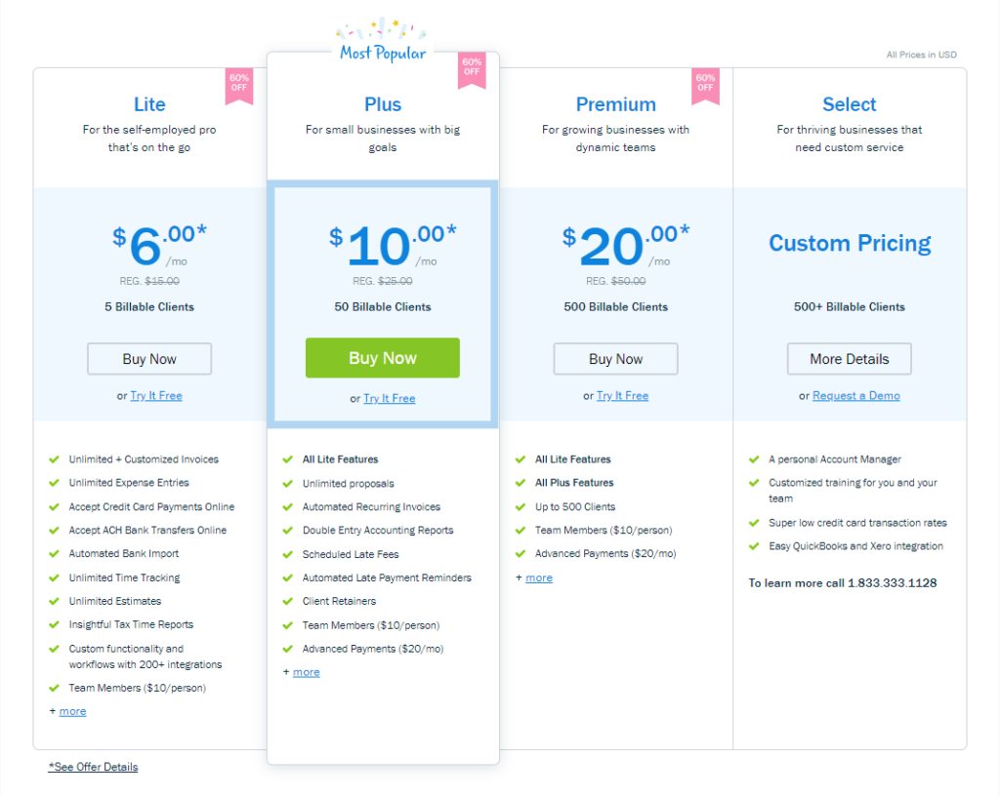

## Table of Contents

## What is subscription pricing?

Subscription pricing is a way businesses charge customers a regular fee, usually every month or year, for using their products or services. Instead of paying one big amount at once, customers pay smaller amounts over time. This model is popular with services like streaming platforms, software, and magazines. It helps companies have a steady income and makes it easier for customers to afford the service.

For customers, subscription pricing can be good because it spreads out the cost and often includes regular updates or new content. For example, with a streaming service, you get access to new movies and shows as they are added. However, it can also lead to more spending if you subscribe to many services. It's important for customers to keep track of their subscriptions and cancel any they no longer need.

For businesses, subscription pricing can help them predict their income better and build a loyal customer base. It encourages companies to keep improving their products to keep subscribers happy. But it also means they need to keep providing value, or customers might cancel their subscriptions. This model has become very common and is used by many different types of businesses today.

## How does subscription pricing work?

Subscription pricing means customers pay a regular fee, like every month or year, to use a product or service. Instead of buying something all at once, you pay a little bit over time. This is common with things like Netflix, where you pay monthly to watch movies and shows, or with software like Microsoft Office, where you get updates and new features as part of your subscription.

For businesses, this model helps them know how much money they will make each month because they can see how many subscribers they have. It also makes customers more likely to keep using the service because it's easier to pay a small amount regularly than a big amount all at once. But businesses need to keep their service good, or people might stop subscribing. For customers, it's nice because you can spread out the cost and often get new stuff as part of your subscription. But you need to watch how many subscriptions you have, or you might end up spending more than you planned.

## What are the benefits of subscription pricing for businesses?

Subscription pricing helps businesses by giving them a steady flow of money. When people subscribe, businesses can predict how much money they will make each month. This makes it easier to plan for the future and manage finances. It's like having a regular paycheck, which can make a business feel more stable and secure.

Another benefit is that subscription pricing can build a loyal customer base. When customers pay regularly, they are more likely to keep using the service and less likely to switch to a competitor. This gives businesses a chance to keep improving their product or service to keep subscribers happy. Over time, this can lead to a strong relationship with customers, who might even recommend the service to others.

Lastly, subscription pricing can help businesses grow. With a steady income, they can invest more in making their product better or in marketing to attract new subscribers. This model also makes it easier to offer different levels of service, so businesses can appeal to a wider range of customers. By keeping subscribers happy and adding new ones, businesses can slowly but surely increase their earnings.

## What are the advantages of subscription pricing for consumers?

Subscription pricing can be really good for consumers because it makes things more affordable. Instead of paying a big amount all at once, you pay a smaller amount every month or year. This can make it easier to fit into your budget. For example, if you want to use a software program, paying a few dollars each month might be easier than spending hundreds of dollars at once. Plus, many subscriptions come with regular updates or new content, so you keep getting value for your money.

Another advantage is that subscriptions can be easy to manage. You can usually sign up or cancel online without much hassle. This means you can try out different services to see what you like without being stuck with something you don't want. It also lets you spread out your spending across different services, so you can enjoy more things without spending too much at once. Just remember to keep an eye on your subscriptions so you don't end up paying for things you no longer use.

## What are the different types of subscription pricing models?

There are a few different types of subscription pricing models that businesses use. One common type is the flat-rate subscription, where customers pay the same amount every month or year for access to a service or product. This is what you see with services like Netflix or Spotify, where you pay one price and get to use everything they offer. Another type is the tiered subscription, where businesses offer different levels of service at different prices. For example, a software company might have a basic plan with fewer features and a premium plan with more features, so customers can choose what fits their needs and budget.

Another model is the usage-based subscription, where the price changes based on how much you use the service. This is common with things like cloud storage or utilities, where you might pay more if you use more data or electricity. Some businesses also use a freemium model, where they offer a basic version of their service for free and charge for more advanced features. This can be a good way to attract new users and then encourage them to upgrade to a paid plan. Each of these models has its own advantages and can be used to meet different needs of both the business and the customer.

## How can a business implement a subscription pricing strategy?

To implement a subscription pricing strategy, a business first needs to understand what their customers want and how much they are willing to pay. They can do this by talking to customers, doing surveys, or looking at what similar businesses are charging. Once they have this information, the business can decide on the right price and what kind of subscription model to use. They might choose a flat-rate model where everyone pays the same, a tiered model with different levels of service, or a usage-based model where the price changes depending on how much the customer uses the service. The business also needs to set up a system to handle subscriptions, like a website or app where customers can sign up and manage their subscriptions easily.

After setting up the pricing and subscription system, the business needs to let people know about it. They can do this through advertising, social media, or by telling their current customers about the new subscription option. It's important to make sure the subscription is easy to understand and that customers see the value in it. The business should also keep an eye on how the subscription is doing and be ready to make changes if needed. This could mean adjusting the price, adding new features, or even changing the subscription model if it's not working well. By listening to feedback and keeping the subscription valuable, the business can build a loyal customer base and have a steady income.

## What are the common challenges faced when using subscription pricing?

One of the main challenges businesses face with subscription pricing is keeping subscribers happy. If customers don't see the value in the subscription, they might cancel it. This means the business needs to keep improving their product or service and make sure customers know about these improvements. Another challenge is managing the subscription system. This includes making it easy for customers to sign up, change, or cancel their subscriptions. If the system is hard to use, customers might get frustrated and leave.

Another common challenge is dealing with competition. Other businesses might offer similar subscriptions at lower prices or with better features, which can make it hard to keep subscribers. Businesses need to find ways to stand out and show why their subscription is the best choice. Lastly, predicting income can be tricky. Even though subscriptions can give a steady flow of money, if a lot of people cancel at once, it can hurt the business's finances. This means the business needs to keep a close eye on their numbers and be ready to adjust their strategy if needed.

## How does subscription pricing affect customer retention and lifetime value?

Subscription pricing can help businesses keep customers longer because it makes it easier for them to keep using the service. When people pay a small amount every month or year, they are more likely to stick with it than if they had to pay a big amount all at once. This regular payment also means customers get used to the service and might feel like it's part of their routine. If the business keeps the service good and adds new things, customers will see the value and want to keep their subscription. This can lead to a strong, loyal customer base that stays with the business for a long time.

The lifetime value of a customer can also go up with subscription pricing. Lifetime value is how much money a customer will spend with a business over time. With subscriptions, customers pay regularly, so over time, this can add up to a lot more than if they just bought something once. Plus, if customers are happy with the service, they might tell their friends about it, which can bring in new subscribers. This not only increases the lifetime value of the original customer but also helps the business grow by attracting more people. So, subscription pricing can be a smart way for businesses to make more money from each customer over time.

## What metrics should be monitored to evaluate the success of a subscription pricing model?

To see if a subscription pricing model is working well, businesses need to keep an eye on a few important numbers. One key number is the churn rate, which shows how many subscribers are leaving each month. A low churn rate means people are happy with the service and want to keep using it. Another important number is the customer acquisition cost, which is how much it costs to get a new subscriber. If this number is too high, the business might not be making enough money from each subscriber to cover the cost of getting them. The monthly recurring revenue is also crucial because it shows how much money the business is making from subscriptions each month. If this number is going up, it's a good sign that the subscription model is successful.

Another set of numbers to watch is the average revenue per user and the lifetime value of a customer. The average revenue per user tells how much money each subscriber brings in, which can help the business decide if they need to change their pricing. The lifetime value of a customer shows how much money a subscriber will spend over time, which is important for understanding the long-term success of the subscription model. By keeping track of these numbers, a business can see if their subscription pricing is working and make changes if needed to keep subscribers happy and the business growing.

## How can subscription pricing be optimized for different market segments?

To optimize subscription pricing for different market segments, businesses need to understand what each group of customers wants and how much they can pay. For example, some people might want a basic plan with just the main features, while others might be willing to pay more for extra things like more storage or special support. By offering different levels of service at different prices, businesses can appeal to a wider range of customers. They can also use data to see how people in different areas or age groups use the service and adjust the pricing to fit those needs. This way, everyone feels like they are getting a good deal.

Another way to optimize subscription pricing is by trying out different prices and seeing how customers react. Businesses can offer special deals or discounts to certain groups to see if more people sign up. They can also change the price a little bit and see if it makes a difference in how many people stay subscribed. By keeping an eye on the numbers and listening to what customers say, businesses can find the best price for each market segment. This helps them make more money and keep more customers happy.

## What role does technology play in managing and scaling subscription pricing?

Technology is really important for businesses that use subscription pricing. It helps them keep track of all their subscribers and make sure everyone gets billed correctly. With special software, businesses can easily see who is subscribed, how much they are paying, and when their subscription is due to renew. This makes it easier to manage everything and make sure no one gets left out. Technology also helps with things like sending reminders to customers when it's time to renew or letting them change their plan online without any hassle. This makes the whole process smoother for both the business and the customer.

Technology also helps businesses grow their subscription model. With the right tools, they can reach more people and handle more subscribers without getting overwhelmed. For example, they can use data to see how people are using the service and make changes to keep them happy. They can also use technology to try out different prices or offers and see what works best. This way, they can keep improving and attracting more customers. Plus, technology makes it easier to offer the service in different places or on different devices, so more people can use it and enjoy it.

## How do regulatory and ethical considerations impact subscription pricing strategies?

Regulatory and ethical considerations can have a big impact on how businesses set up their subscription pricing. Rules from the government can tell businesses what they can and can't do with subscriptions. For example, there might be laws about how easy it should be for people to cancel their subscription or how clearly the business has to show the price. If a business doesn't follow these rules, they could get in trouble. They also need to think about what's fair and right. If people feel like the business is tricking them or making it hard to cancel, they might get upset and leave. So, businesses need to be honest and clear about their pricing to keep their customers happy and stay out of trouble.

Ethical considerations are also important because they help businesses build trust with their customers. If a business is seen as doing the right thing, like making it easy to cancel or not raising prices without warning, people are more likely to stay subscribed. On the other hand, if people think the business is being sneaky or unfair, they might tell others to avoid it. This can hurt the business's reputation and make it harder to keep and attract subscribers. So, it's important for businesses to think about what's fair and right when they set up their subscription pricing, not just what will make them the most money.

## What are the considerations for choosing a subscription model?

When selecting a subscription model for algorithmic trading platforms, it is crucial to consider several factors to ensure an optimal fit for your trading activities and financial goals. Here are key considerations to guide this decision:

**Evaluate the Cost-Benefit Ratio**: Begin by assessing the pricing structure of the subscription relative to the features it offers. A thorough cost-benefit analysis involves comparing the monthly or annual subscription fees against the platform's capabilities, such as access to algorithmic strategies, data analytics tools, and customer support. Implementing basic financial metrics like the Return on Investment (ROI) can be beneficial. The formula for ROI is:

$$
\text{ROI} = \frac{\text{Net Profit}}{\text{Cost of Investment}} \times 100
$$

This metric can help determine whether the subscription enhances your trading efficacy and balances costs with potential gains.

**Consider Your Trading Volume and Style**: The subscription model should align with your trading volume and style. Active traders with high-frequency strategies may benefit more from comprehensive packages that provide advanced tools and data insights, supporting rapid decision-making and execution. Conversely, traders focusing on longer-term investments might prioritize subscriptions with robust analytical features over high-speed execution tools.

**Examine Support and Resources**: Adequate support and educational resources are vital, particularly for less experienced traders. Ensure that the subscription model includes access to technical support, user tutorials, webinars, and community forums. These resources facilitate learning and provide assistance, enabling you to fully leverage the platform's offerings.

**Future Needs**: Contemplating your future trading needs is essential for selecting a scalable subscription model. As your trading strategies evolve, the subscription should accommodate increased volumes or complexity. Opt for subscription models that offer flexibility to upgrade or customize your plan without undue financial burdens or restrictions.

By analyzing these considerations, traders can make informed decisions that align subscription models with their trading objectives, ensuring effective use of algorithmic trading platforms.

## References & Further Reading

[1]: Bergstra, J., Bardenet, R., Bengio, Y., & Kégl, B. (2011). ["Algorithms for Hyper-Parameter Optimization."](https://dl.acm.org/doi/10.5555/2986459.2986743) Advances in Neural Information Processing Systems 24.

[2]: ["Advances in Financial Machine Learning"](https://www.amazon.com/Advances-Financial-Machine-Learning-Marcos/dp/1119482089) by Marcos Lopez de Prado

[3]: ["Evidence-Based Technical Analysis: Applying the Scientific Method and Statistical Inference to Trading Signals"](https://www.amazon.com/Evidence-Based-Technical-Analysis-Scientific-Statistical/dp/0470008741) by David Aronson

[4]: ["Machine Learning for Algorithmic Trading"](https://github.com/stefan-jansen/machine-learning-for-trading) by Stefan Jansen

[5]: ["Quantitative Trading: How to Build Your Own Algorithmic Trading Business"](https://www.amazon.com/Quantitative-Trading-Build-Algorithmic-Business/dp/1119800064) by Ernest P. Chan