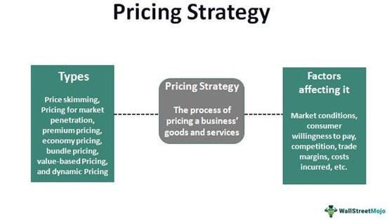

Algorithmic trading, commonly referred to as algo trading, has fundamentally transformed the landscape of financial markets. By enabling trades to be executed at unprecedented speeds and volumes, algo trading surpasses human capabilities, facilitating more efficient and sophisticated market interactions. This technological advancement leverages complex algorithms and high-frequency trading systems, allowing traders to capitalize on market opportunities almost instantaneously.

With the progression of algo trading comes the evolution of subscription pricing models for trading platforms. These models have been developed to offer traders a range of flexible and tailored plans, ensuring accessibility and usability for diverse trading needs. Subscription pricing models present a departure from traditional one-time purchase systems, focusing instead on recurrent payment structures that can provide users with continuous access to updated tools, customer support, and additional advanced features.

This article examines how subscription pricing functions within algorithmic trading. We will explore the diversity of pricing models available and how they affect the trading landscape by analyzing several key algo trading subscription plans. This examination will include discussions on their features and how these plans effectively cater to the varying requirements of traders. By illuminating these aspects, we aim to provide a comprehensive understanding of how subscription models support both novice and experienced traders in achieving their financial objectives efficiently.

## Table of Contents

## Understanding Subscription Pricing in Algo Trading

Subscription pricing in algorithmic trading refers to the model where users are charged on a recurring basis for access to trading platforms, tools, and services. This approach stands in contrast to traditional one-time purchase models by offering continuous access to platform updates, customer support, and a range of additional features that evolve over time.

### Continuous Access and Updates

Unlike one-time purchases, the subscription model ensures that traders have ongoing access to the latest tools and advancements. This can include software updates, which are crucial for maintaining the competitiveness and efficiency of trading algorithms in rapidly evolving financial markets. Subscribers benefit from improvements made to the platform, whether they are enhancements in execution speed, new strategy features, or risk management tools.

### Support and Additional Features

A key advantage of subscription-based models is the inclusion of customer support and additional resources. Subscribers often have access to technical support teams, educational materials, and community forums. These resources are essential for both novice and seasoned traders who seek to optimize their trading strategies and troubleshoot any technical issues that may arise.

### Diverse Subscription Options

Subscription plans in algo trading can vary widely, catering to the diverse needs of traders. These options typically include:

- **Monthly Subscriptions**: These plans offer flexibility, allowing traders to engage with platforms on a short-term basis. Monthly subscriptions are ideal for traders who need temporary or seasonal access to trading tools.

- **Annual Subscriptions**: Offering a cost-effective solution for those committed to long-term engagement with a platform, annual plans often come at a discounted rate compared to monthly billing.

- **Lifetime Subscriptions**: A less common option, lifetime subscriptions provide indefinite access for a one-time higher fee. While costly upfront, they can be economical for long-term users who plan to engage with the platform over many years.

Through these varying plans, traders have the ability to select a subscription option that aligns with their financial capabilities and trading objectives. Each model presents unique advantages, allowing for adaptability and scalability in accordance with individual growth and market conditions.

## Different Pricing Models for Algorithmic Trading Subscriptions

Algorithmic trading platforms offer various pricing models that cater to the diverse needs of traders and different trading strategies. These models provide flexibility and accessibility, allowing traders to select plans that best match their trading volumes, budgetary constraints, and strategic requirements. The most common pricing models in [algorithmic trading](/wiki/algorithmic-trading) subscriptions are Tiered Pricing, Pay-as-You-Go, and Freemium Models.

**Tiered Pricing**

Tiered pricing structures present different levels of service access and functionalities, where basic tiers offer essential features at a lower cost, and advanced tiers provide more sophisticated tools and support at premium prices. This model allows traders to upgrade as their needs grow or their trading strategies become more complex. For instance, a beginner trader might start with a basic tier that offers essential trading algorithms, while a professional trader might opt for a higher tier that includes advanced analytics, comprehensive risk management tools, and dedicated customer support.

**Pay-as-You-Go**

The Pay-as-You-Go model reflects a usage-based pricing strategy. Traders are charged based on the number of resources utilized or transactions executed, providing flexibility and cost-efficiency, especially for those with variable trading activities. This model benefits traders who do not engage frequently in trading, as they avoid paying for unused service capacity. It is akin to cloud computing pricing where costs increase with higher consumption, but savings are significant during periods of inactivity.

**Freemium Models**

Freemium models offer a combination of free access to basic features with the option to purchase additional premium functionalities. This model is particularly attractive to new traders as it allows them to use basic trading features without financial commitment, while simultaneously offering them the potential to scale upwards should they require more advanced tools. This strategy helps platforms build a wide user base and convert non-paying users to premium subscribers as their trading requirements expand.

Each of these pricing models caters to different trading strategies and budgetary requirements. Traders must consider their specific needs, including their frequency of trading, the complexity of their strategies, and their budget, to select the most appropriate subscription model. This ensures they have the necessary tools to optimize trading success while maintaining cost efficiency.

## Benefits of Subscription Models in Algo Trading Platforms

Subscription models have become an indispensable aspect of algorithmic trading platforms, offering a variety of significant benefits to traders. Here, we highlight some of the key advantages associated with this pricing approach:

**Ongoing Support and Updates**: A major benefit of subscribing to an algo trading platform is the continuous customer support and regular software updates provided. Subscribers often receive dedicated support services that can be crucial for troubleshooting and optimizing trading strategies. Regular updates ensure that the trading tools remain efficient and secure, incorporating the latest technological advancements and security measures.

**Lower Initial Costs**: Subscription models minimize the need for substantial upfront investments. Unlike traditional software purchasing methods that require a lump-sum payment, subscriptions break down costs into manageable, recurring fees. This lowers the entry barrier for individual traders and smaller firms, making algorithmic trading accessible to a wider audience.

**Flexibility**: A subscription-based approach grants traders the flexibility to scale their usage and costs in accordance with their evolving needs. Traders can start with a basic plan and upgrade to more advanced tiers as their requirements grow, or downgrade during periods of reduced trading activity. This scalability is particularly beneficial in managing cash flow and aligning expenses with trading activity.

**Adapting to Market Changes**: Markets are dynamic, and having the latest tools and features at one's disposal is essential for maintaining a competitive edge. Subscription plans often include regular updates that integrate new strategies and functionalities. This continuous adaptation ensures that traders are equipped to respond to changing market conditions swiftly and effectively.

In essence, the subscription pricing model not only democratizes access to sophisticated trading technologies but also fosters adaptability and ongoing resource availability, empowering traders to enhance their performance in a rapidly changing financial environment.

## Case Study: AlgoBulls Subscription Plans

AlgoBulls provides a range of subscription plans that cater to both novice and experienced traders, aiming to meet a diverse array of trading needs through their Odyssey and Phoenix plans. Each plan offers distinct features and scalability options to accommodate varying levels of trading expertise and objectives.

**Odyssey Plan**

The Odyssey Plan is structured to accommodate users at varying levels of trading proficiency, beginning with a starter tier and progressing to customizable options. This plan is designed to offer traders access to different execution levels and strategy customization tools, facilitating a tailored trading experience. Users can select from a range of execution levels that best suit their trading requirements. Moreover, the Odyssey Plan includes support services to aid traders in optimizing their trading strategies. This focus on customization ensures that traders have the flexibility to adjust their strategies as their trading skills develop and market conditions evolve.

**Phoenix Plan**

The Phoenix Plan is oriented towards traders seeking advanced capabilities in strategy management, [backtesting](/wiki/backtesting), and live trading execution. It offers a range of features that progress from basic to more sophisticated levels, tailored to enhance the trader's ability to manage and execute strategies effectively. Key features of the Phoenix Plan include comprehensive backtesting tools that allow traders to simulate and analyze their trading strategies under various market scenarios before committing capital in live trades. Additionally, the plan supports live trading functionalities that can execute trades based on pre-set strategies and conditions, enabling traders to systematically approach their trading activities.

**Customization and Scalability**

Both the Odyssey and Phoenix plans are designed with an emphasis on customization and scalability, reflecting AlgoBulls' commitment to providing users with flexible and adaptable trading solutions. Traders can modify their subscriptions to align with their evolving trading goals and market dynamics. This adaptability is particularly beneficial in allowing traders to scale their operations up or down, depending on their trading [volume](/wiki/volume-trading-strategy) and strategy complexity.

Overall, the AlgoBulls subscription plans exemplify a flexible and user-centered approach, empowering traders to harness algorithmic trading tools in a manner that aligns with their specific trading styles and growth trajectories.

## Considerations for Choosing a Subscription Model

When selecting a subscription model for algorithmic trading platforms, it is crucial to consider several factors to ensure an optimal fit for your trading activities and financial goals. Here are key considerations to guide this decision:

**Evaluate the Cost-Benefit Ratio**: Begin by assessing the pricing structure of the subscription relative to the features it offers. A thorough cost-benefit analysis involves comparing the monthly or annual subscription fees against the platform's capabilities, such as access to algorithmic strategies, data analytics tools, and customer support. Implementing basic financial metrics like the Return on Investment (ROI) can be beneficial. The formula for ROI is:

$$
\text{ROI} = \frac{\text{Net Profit}}{\text{Cost of Investment}} \times 100
$$

This metric can help determine whether the subscription enhances your trading efficacy and balances costs with potential gains.

**Consider Your Trading Volume and Style**: The subscription model should align with your trading volume and style. Active traders with high-frequency strategies may benefit more from comprehensive packages that provide advanced tools and data insights, supporting rapid decision-making and execution. Conversely, traders focusing on longer-term investments might prioritize subscriptions with robust analytical features over high-speed execution tools.

**Examine Support and Resources**: Adequate support and educational resources are vital, particularly for less experienced traders. Ensure that the subscription model includes access to technical support, user tutorials, webinars, and community forums. These resources facilitate learning and provide assistance, enabling you to fully leverage the platform's offerings.

**Future Needs**: Contemplating your future trading needs is essential for selecting a scalable subscription model. As your trading strategies evolve, the subscription should accommodate increased volumes or complexity. Opt for subscription models that offer flexibility to upgrade or customize your plan without undue financial burdens or restrictions.

By analyzing these considerations, traders can make informed decisions that align subscription models with their trading objectives, ensuring effective use of algorithmic trading platforms.

## Conclusion

Subscription pricing models in algorithmic trading have significantly transformed how traders access and utilize financial market tools and strategies. These models provide flexibility by allowing traders to select plans that align with their trading styles and objectives. For instance, a tiered pricing model can offer different levels of access and features, catering to both beginner and advanced traders. This approach is particularly advantageous because it enables traders to tailor their platform use according to their evolving needs and market conditions.

Platforms like AlgoBulls illustrate how diverse subscription tiers can satisfy the varying needs of traders across experience levels. Whether a trader is a novice needing basic tools and guidance or a professional requiring advanced strategy development and execution options, there are subscription plans that meet these demands. This diversity ensures that traders are equipped with the necessary resources to enhance their trading activities efficiently.

By offering ongoing access to updates and support, subscription models ensure that traders stay equipped with the latest advancements and improvements in trading technology. This not only facilitates immediate benefits but also positions traders advantageously as market conditions and technologies evolve.

Ultimately, these subscription models empower traders by minimizing initial investment barriers and providing the opportunity for scalable growth. As traders progress in their trading careers, they can adjust their subscriptions to accommodate increased trading volumes and complexity, ensuring sustained trading success and efficiency.

## References & Further Reading

[1]: Bergstra, J., Bardenet, R., Bengio, Y., & Kégl, B. (2011). ["Algorithms for Hyper-Parameter Optimization."](https://dl.acm.org/doi/10.5555/2986459.2986743) Advances in Neural Information Processing Systems 24.

[2]: ["Advances in Financial Machine Learning"](https://www.amazon.com/Advances-Financial-Machine-Learning-Marcos/dp/1119482089) by Marcos Lopez de Prado

[3]: ["Evidence-Based Technical Analysis: Applying the Scientific Method and Statistical Inference to Trading Signals"](https://www.amazon.com/Evidence-Based-Technical-Analysis-Scientific-Statistical/dp/0470008741) by David Aronson

[4]: ["Machine Learning for Algorithmic Trading"](https://github.com/stefan-jansen/machine-learning-for-trading) by Stefan Jansen

[5]: ["Quantitative Trading: How to Build Your Own Algorithmic Trading Business"](https://www.amazon.com/Quantitative-Trading-Build-Algorithmic-Business/dp/1119800064) by Ernest P. Chan