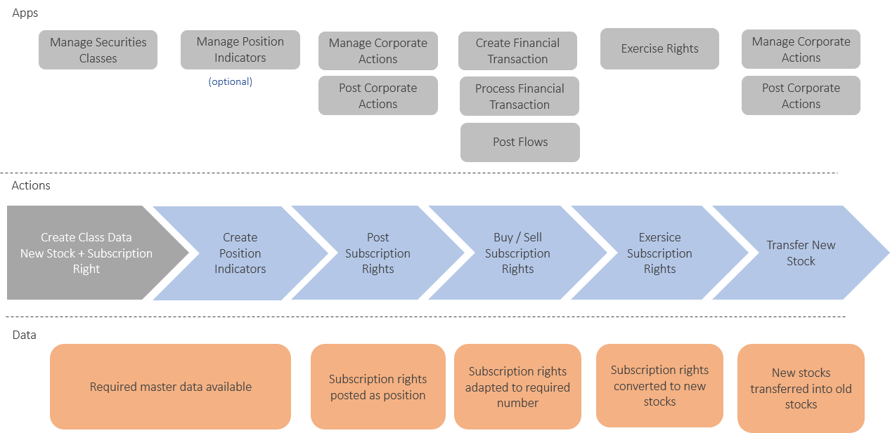

## Table of Contents

## What is a subscription right?

A subscription right is a right given to existing shareholders of a company to buy more shares before they are offered to the public. This is often done when a company wants to raise more money by issuing new shares. The idea is to give current shareholders the first chance to keep their ownership percentage in the company the same, by buying these new shares.

These rights are usually given out in proportion to the number of shares a shareholder already owns. For example, if you own 100 shares and the company issues one new share for every two shares owned, you would get the right to buy 50 new shares. This process helps maintain fairness among shareholders and can be seen as a benefit of owning shares in the company.

## How does a subscription right work?

A subscription right is like a special ticket that lets you buy more shares in a company before anyone else can. If you already own shares in a company and it decides to sell more shares, you get the first chance to buy them. This is important because it helps you keep the same percentage of ownership in the company. For example, if you own 10 shares and the company issues 10 more, you can buy those new shares to keep your ownership at the same level.

The company decides how many new shares to issue and how many rights each shareholder gets. Usually, the rights are given based on how many shares you already own. If the company says you can buy one new share for every two shares you own, and you have 100 shares, you get the right to buy 50 new shares. You don't have to use your subscription rights if you don't want to, but it's a good opportunity to increase your stake in the company without competing with the general public.

## Who typically receives subscription rights?

Subscription rights are usually given to people who already own shares in a company. If a company decides to sell more shares, it first offers them to its current shareholders. This is done to make sure that these shareholders can keep their same percentage of ownership in the company.

The way it works is simple. If you own shares in a company and it wants to issue more shares, you get the first chance to buy them. The company tells you how many new shares you can buy based on how many shares you already own. For example, if you have 100 shares and the company says you can buy one new share for every two shares you own, you can buy 50 new shares. This helps you maintain your ownership level without having to compete with new investors.

## What is the purpose of subscription rights in a company?

The main purpose of subscription rights in a company is to give current shareholders a fair chance to keep their ownership percentage the same when the company issues new shares. When a company wants to raise more money by selling more shares, it might dilute the ownership of existing shareholders. By offering subscription rights, the company allows these shareholders to buy the new shares first, before they are offered to the public. This helps prevent their ownership from being diluted and keeps things fair among shareholders.

Subscription rights also encourage people to invest in the company because they know they will have the first opportunity to buy more shares if the company grows and issues more stock. This can make shareholders feel more secure about their investment and more connected to the company's future. Overall, subscription rights are a way for a company to show that it values its current shareholders and wants to treat them fairly as the company grows.

## How can one exercise a subscription right?

To exercise a subscription right, a shareholder needs to follow the instructions provided by the company. Usually, the company will send out a notice explaining how many new shares you can buy and by when you need to make your decision. You might get a subscription form that you need to fill out and send back, or you might be able to do everything online through the company's website or a designated platform. You'll also need to pay for the new shares, which you can usually do by transferring money to the company's account or through another method they specify.

It's important to act quickly because there's usually a deadline for exercising your subscription rights. If you miss the deadline, you might lose the chance to buy the new shares at the offered price. Once you've sent in your form and payment, the company will process your request and issue the new shares to you. These new shares will then be added to your existing shares, helping you maintain your ownership percentage in the company.

## What are the benefits of exercising a subscription right?

Exercising a subscription right lets you buy more shares in a company before anyone else can. This is good because it helps you keep the same percentage of ownership in the company. If you don't buy the new shares, your ownership could go down because more shares are being sold. By using your subscription right, you can stop this from happening and keep your say in the company the same.

Another benefit is that you might get the new shares at a lower price than what they will be sold for later. This can be a good deal for you. Also, it shows that the company cares about its current shareholders and wants to give them a fair chance to grow their investment. This can make you feel more confident about your investment in the company.

## What are the potential risks associated with subscription rights?

Exercising a subscription right means you need to spend more money to buy new shares. If you don't have enough money, you might not be able to use your right. Also, if the company's value goes down after you buy the new shares, you could lose money. This is a risk because you're putting more money into the company hoping it will do well.

Another risk is that you might not want to buy more shares, but if you don't, your ownership in the company could go down. This happens because other people might buy the new shares, making your part of the company smaller. It's a tricky choice because you need to think about whether you want to spend more money to keep your ownership the same or let it get smaller.

## How do subscription rights affect the value of existing shares?

When a company gives out subscription rights, it can change the value of the shares people already own. If the company is doing well and people think the new shares will be worth more later, the value of the existing shares might go up. This is because people might want to buy the existing shares to get the subscription rights and buy more shares at a good price. But if the company is not doing well, the value of the existing shares might go down because people might not want to buy the new shares.

Subscription rights can also make the value of existing shares go down right away. When a company says it will sell more shares, it can make the shares already out there seem less valuable. This is because more shares mean each share is worth a smaller part of the company. But if people use their subscription rights to buy the new shares, it can help keep the value of their existing shares from going down too much.

## Can subscription rights be traded or sold?

Yes, subscription rights can often be traded or sold. If you have subscription rights and don't want to use them to buy more shares, you can sell them to someone else who might want to. This can happen on a stock market or through a private deal. When you sell your subscription rights, you get money instead of using them to buy more shares in the company.

The ability to trade or sell subscription rights gives you more choices. If you think the new shares won't be worth much, you can sell the rights and still get something out of them. But remember, the value of the rights can change quickly based on how people feel about the company's future. So, it's important to think carefully before you decide to sell them.

## What is the difference between a subscription right and a warrant?

A subscription right and a warrant are both ways for a company to let people buy more shares, but they work a bit differently. A subscription right is given to people who already own shares in the company. If the company wants to sell more shares, it gives these rights to its current shareholders first. This helps them keep the same percentage of ownership in the company. Subscription rights usually come with a short time limit, and you can only use them to buy the new shares the company is offering at that time.

A warrant, on the other hand, is like a long-term option to buy shares. It can be given to anyone, not just current shareholders. Warrants usually last for a longer time than subscription rights, sometimes even years. They also let you buy shares at a set price, which might be different from the current market price. Unlike subscription rights, you can often trade or sell warrants on the stock market. So, while both subscription rights and warrants give you a chance to buy more shares, they have different rules and are used for different reasons.

## How are subscription rights regulated in different countries?

Subscription rights are regulated differently in various countries, but the general idea is to protect shareholders and make sure the process is fair. In the United States, for example, the Securities and Exchange Commission (SEC) oversees how companies handle subscription rights. Companies need to follow certain rules, like giving shareholders enough time to decide if they want to use their rights and making sure all shareholders get treated the same way. In Europe, countries like Germany and France have their own rules, but they often follow the European Union's guidelines. These rules make sure that companies tell shareholders about the new shares and give them a fair chance to buy them.

In other parts of the world, like Asia, regulations can vary a lot from one country to another. In Japan, for example, the Financial Services Agency sets the rules for subscription rights, making sure companies follow strict guidelines on how they offer these rights to shareholders. In contrast, some countries might have fewer rules, which can make things more complicated for shareholders trying to understand their rights. No matter where you are, the main goal of these regulations is to make sure that shareholders are treated fairly and have a clear understanding of how they can use their subscription rights.

## What strategic considerations should a company take into account when issuing subscription rights?

When a company decides to issue subscription rights, it needs to think about a few important things. One big thing is how it will affect the shareholders. The company wants to make sure that giving out subscription rights is seen as a good thing by the people who already own shares. This can help keep shareholders happy and loyal to the company. The company also needs to think about how much money it wants to raise. By offering subscription rights, the company can get more money from its current shareholders before it tries to sell shares to new investors. This can be a smart way to raise money without diluting the ownership of existing shareholders too much.

Another thing to consider is the timing of issuing subscription rights. The company needs to pick a time when the market is good and people are likely to want to buy more shares. If the company is doing well and its shares are going up in value, shareholders might be more excited about using their subscription rights. The company also has to think about how to communicate with its shareholders. It needs to explain clearly what the subscription rights are and how to use them. Good communication can make the process go smoothly and help shareholders feel confident in their investment.

## What is Equity Financing?

Equity financing is a fundamental method employed by companies to raise capital by selling shares. This approach is distinguished from debt financing, as it allows businesses to acquire funds without accumulating debt obligations. For many companies, particularly those seeking to maintain [liquidity](/wiki/liquidity-risk-premium) and minimize financial risk, equity financing presents a strategic opportunity [1]. By issuing shares, companies can bolster their balance sheets, providing them with the necessary resources to pursue growth opportunities, whether through expansion, research and development, or other capital projects.

There are several advantages to equity financing. Firstly, it improves a company's cash flow since there are no obligatory interest payments associated with debt. This can be crucial for new companies or those in industries with fluctuating income. Furthermore, equity financing can enhance a company's ability to absorb losses, as shareholders' funds constitute a buffer against financial setbacks. This, in turn, can increase a firm's attractiveness to potential investors and partners, facilitating further growth and investment [2].

However, equity financing is not without its challenges. One of the primary drawbacks is the dilution of ownership. When a company issues new shares, its existing shareholders experience a reduction in their ownership percentage. This can lead to a loss of control, especially if a significant number of shares are sold to external investors who may push for changes in the company's strategic direction [3]. Moreover, issuing equity is often more time-consuming and costly than securing debt financing due to the regulatory requirements and need for underwriters.

The impact of equity financing on shareholder value is another critical aspect to consider. While it provides the company with necessary capital, thereby potentially increasing the company's value by financing profitable projects, it also dilutes earnings per share (EPS). The EPS is calculated as:

$$
\text{EPS} = \frac{\text{Net Income}}{\text{Total Shares Outstanding}}
$$

A higher number of shares can lead to lower EPS unless the capital raised leads to a proportionately greater increase in net income. Thus, investors need to evaluate whether the anticipated growth from the new capital will outweigh the dilution effect on their shares [4].

Equity financing is a multifaceted strategy that companies must manage carefully to balance short-term financial needs with long-term growth objectives. Understanding the trade-offs between raising new equity and the potential impacts on shareholder value is crucial for a company's financial health and investor relations.

**References**:

1. Berk, J., & DeMarzo, P. (2016). Corporate Finance. Pearson.
2. Brealey, R. A., Myers, S. C., & Allen, F. (2019). Principles of Corporate Finance. McGraw-Hill.
3. Damodaran, A. (2012). Investment Valuation: Tools and Techniques for Determining the Value of Any Asset. John Wiley & Sons.
4. Ross, S. A., Westerfield, R. W., & Jaffe, J. (2016). Corporate Finance. McGraw-Hill Education.

## References & Further Reading

#