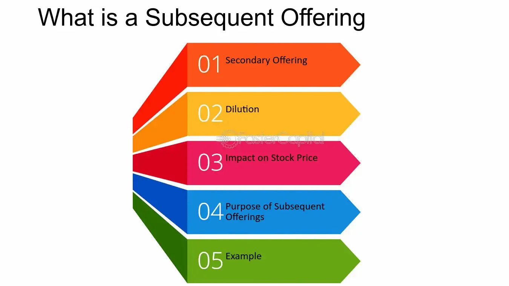

## Table of Contents

## What is a subsequent offering?

A subsequent offering is when a company that is already public sells more of its stock to people. This happens after the company has already had its first big sale of stock, which is called an initial public offering (IPO). Companies do subsequent offerings to get more money. They can use this money to grow their business, pay off debts, or for other important things.

When a company decides to do a subsequent offering, it tells everyone about it. They say how many new shares they are selling and at what price. People who want to buy these new shares can do so. Sometimes, the price of the stock might go down a bit because there are more shares available. But if the company uses the money well, it can help the stock price go up in the long run.

## How does a subsequent offering differ from an initial public offering (IPO)?

An initial public offering (IPO) is when a company first sells its stock to the public. Before an IPO, the company is private, which means its stock is not available for everyone to buy. When a company does an IPO, it's like opening its doors to the public for the first time. This is a big step because it allows the company to raise a lot of money from many different investors. The money from an IPO can be used to grow the business, pay off debts, or for other important needs.

A subsequent offering happens after a company has already done an IPO. This means the company is already public, and its stock is available for people to buy and sell. In a subsequent offering, the company decides to sell more of its stock to the public. This is done to raise more money, which can be used for things like expanding the business or paying off debts. Unlike an IPO, a subsequent offering doesn't change the company's status from private to public; it's just another way for the company to get more funds from investors.

## What are the main types of subsequent offerings?

There are two main types of subsequent offerings: a follow-on public offering (FPO) and a rights offering. A follow-on public offering is when a company sells more shares to the public after it has already done an IPO. This is done to raise more money. The company decides how many new shares to sell and at what price. Investors can then buy these new shares. An FPO can be done to help the company grow or to pay off debts.

A rights offering is different. In a rights offering, the company gives its current shareholders the right to buy more shares before they are offered to the public. This means that if you already own shares in the company, you get the first chance to buy more shares at a special price. This can be a way for the company to raise money while also giving something back to its current investors. It helps keep the ownership more in the hands of people who already own the company's stock.

## Why might a company decide to conduct a subsequent offering?

A company might decide to conduct a subsequent offering because it needs more money. After a company goes public with an IPO, it might find new opportunities to grow or have debts that need to be paid off. By selling more shares to the public, the company can raise the funds it needs to take advantage of these opportunities or to improve its financial health. This extra money can be used for things like building new factories, expanding into new markets, or investing in research and development.

Another reason a company might choose to do a subsequent offering is to increase its visibility and liquidity in the stock market. When more shares are available, it can make the stock easier to buy and sell, which can attract more investors. This can help the company's stock price stay stable and potentially grow over time. Additionally, if the company uses the money wisely, it can show investors that it is a good investment, which can boost confidence and the company's overall value.

## What are the potential benefits of a subsequent offering for a company?

A subsequent offering can help a company get more money. This extra money can be used for many important things. The company might want to grow bigger by building new stores or factories, or they might want to start selling their products in new countries. They could also use the money to pay off debts, which would make the company's finances stronger. By having more money, the company can take advantage of new opportunities and keep improving.

Another benefit of a subsequent offering is that it can make the company's stock more popular and easier to buy and sell. When the company sells more shares, more people can own part of the company. This can attract more investors, which can help keep the stock price stable and even help it grow. If the company uses the money from the offering well, it can show investors that it is a good place to put their money, which can make the company more valuable overall.

## What are the potential risks or drawbacks of a subsequent offering?

One risk of a subsequent offering is that it might make the company's stock price go down. When a company sells more shares, there are more shares available for people to buy. This can make each share worth less, which can lower the stock price. If the stock price goes down a lot, it can make investors unhappy and they might sell their shares. This can hurt the company's reputation and make it harder to raise money in the future.

Another drawback is that a subsequent offering can change who owns the company. When new shares are sold, the people who already own shares might end up owning a smaller part of the company. This can make the current shareholders unhappy because their control over the company might be less. If the new investors have different ideas about how the company should be run, it can lead to disagreements and conflicts within the company.

## How is the pricing determined for shares in a subsequent offering?

When a company decides to do a subsequent offering, it needs to figure out the price for the new shares. The company usually works with investment banks to help set this price. They look at the current stock price and think about how much money the company needs to raise. They also consider what investors might be willing to pay. The goal is to set a price that is attractive enough for people to buy the new shares but also high enough to raise the money the company needs.

Sometimes, the price for the new shares might be a bit lower than the current stock price. This is done to make the offering more appealing to investors. If the price is too high, people might not want to buy the new shares. But if it's set just right, it can help the company raise the money it needs without causing too much of a drop in the stock price. The company and the investment banks have to balance these factors carefully to make the subsequent offering successful.

## What role do investment banks play in a subsequent offering?

Investment banks help a lot when a company wants to do a subsequent offering. They work with the company to figure out how many new shares to sell and at what price. They look at the current stock price and think about how much money the company needs. They also try to guess what investors might be willing to pay. This helps make sure the price is good enough for people to want to buy the new shares but not so low that it hurts the company's stock price too much.

Once the price is set, the investment banks help sell the new shares. They talk to investors and tell them about the offering. They might even buy some of the shares themselves to help make sure the offering goes well. This can make investors feel more confident about buying the shares. The investment banks get paid for their help, usually with a fee based on how much money the company raises from the offering.

## Can you explain the process of executing a subsequent offering?

When a company decides to do a subsequent offering, it starts by working with investment banks. The company tells the banks how much money it wants to raise. Together, they figure out how many new shares to sell and at what price. They look at the current stock price and think about what investors might be willing to pay. The goal is to set a price that is good enough for people to want to buy the new shares but not so low that it hurts the stock price too much.

Once the price is set, the investment banks help sell the new shares. They talk to investors and tell them about the offering. The banks might even buy some of the shares themselves to help make sure the offering goes well. This can make investors feel more confident about buying the shares. When the offering is over, the company gets the money from the sold shares, and the investment banks get paid a fee based on how much money was raised.

## What are some notable examples of successful subsequent offerings?

One good example of a successful subsequent offering is when Tesla did one in 2020. Tesla wanted to raise more money to grow its business. They sold new shares to the public and raised about $5 billion. The money helped Tesla build new factories and make more cars. Even though the stock price went down a bit right after the offering, it went back up later because Tesla used the money well.

Another example is when Amazon did a subsequent offering in 1999. Amazon was growing fast and needed more money to keep up. They sold new shares and raised around $672 million. This money helped Amazon expand its business and improve its services. The offering was successful because it helped Amazon keep growing and becoming a bigger company.

## How do subsequent offerings impact existing shareholders?

When a company does a subsequent offering, it can affect the people who already own shares in the company. If the company sells more shares, there are more shares out there. This means that each share might be worth a little less, which can make the stock price go down. If the stock price goes down a lot, it can make existing shareholders unhappy because their shares are now worth less money. They might feel like they own a smaller piece of the company, which can be frustrating.

On the other hand, if the company uses the money from the subsequent offering well, it can be good for existing shareholders in the long run. The company might use the money to grow bigger, pay off debts, or invest in new projects. If these things help the company do better, the stock price might go up over time. So, even though the stock price might drop right after the offering, it can go back up if the company makes smart choices with the new money.

## What regulatory considerations must be taken into account when planning a subsequent offering?

When a company plans a subsequent offering, it has to follow rules set by the government. In the United States, the main rule-maker is the Securities and Exchange Commission (SEC). The company has to tell the SEC about the offering by filing a document called a registration statement. This document has a lot of information about the company and the new shares it wants to sell. The SEC checks this information to make sure it's true and that the company is being honest with investors. The company also has to give investors a prospectus, which is like a guide that explains the offering and the risks of buying the new shares.

Another important thing to think about is the timing of the offering. The company has to wait for the SEC to say it's okay to go ahead with the offering. This can take some time, so the company needs to plan carefully. Also, the company has to be careful about what it says to the public about the offering. It can't make promises or say things that aren't true. If the company breaks these rules, it could get in trouble with the SEC and have to pay fines or face other penalties.

## What are the types of subsequent offerings?

In the context of subsequent offerings, there are two principal classifications: dilutive and non-dilutive offerings. Understanding these types helps investors and market participants grasp the implications each has on a company's financial stability and shareholder value.

### Dilutive Offerings

Dilutive offerings involve the issuance of new shares, which increases the overall number of shares available in the market. This type of offering can be utilized by a company to raise additional funds for various purposes such as expansion projects, research and development, or to improve operating cash flow. However, the introduction of new shares tends to dilute existing shareholders' equity, as the value of each share might decrease due to the increased share count. 

Mathematically, the dilution can be expressed as a reduction in earnings per share (EPS) post-offering. If $N_{0}$ is the number of shares before the offering and $N_{1}$ is the number of additional shares issued, the new total number of shares becomes $N_{0} + N_{1}$. Assuming constant net income, the diluted EPS is calculated as:

$$

\text{Diluted EPS} = \frac{\text{Net Income}}{N_{0} + N_{1}} 
$$

This formula illustrates the potential decrease in EPS, highlighting the dilution effect.

### Non-Dilutive Offerings

Non-dilutive offerings differ in that they do not increase the number of shares outstanding. Instead, these offerings typically involve the sale of shares already held by existing shareholders or entities. No new shares are created; the ownership structure merely shifts among shareholders.

Non-dilutive offerings are often undertaken by large shareholders or insiders looking to liquidate part of their holdings. This type of offering maintains the existing capital structure of the company, having no direct dilutive effect on current shareholders' stakes or EPS. While the overall number of shares does not change, substantial insider selling might signal underlying business concerns, which could affect market perception and stock prices.

### Strategic Implications

Each type of offering serves distinct strategic purposes. Dilutive offerings allow companies to raise capital without incurring debt, thus providing resources for growth or operational stability. However, investors must consider the potential dilution effects, which could impact financial ratios and shareholder value.

Conversely, non-dilutive offerings maintain the existing capital structure but can alter market dynamics through significant share redistributions. These offerings are significant for investors who monitor insider selling patterns as indicators of corporate health or strategic decisions.

Overall, recognizing the differences between dilutive and non-dilutive offerings empowers investors to make informed decisions based on how these offerings align with their investment goals and risk tolerance.

## What are the special considerations for investors?

Investors should carefully evaluate whether a subsequent offering is dilutive or non-dilutive as it holds significant implications for the value of their investments. Dilutive offerings involve the issuance of new shares, which increases the total share count and can dilute the value of existing shares. It's essential for investors to scrutinize the offering price and the company's overall valuation. A company that issues new shares at a price below the market price could significantly dilute shareholders' equity value, as the formula for calculating the new equity value post-dilution is:

$$
\text{New Equity Value} = \left(\frac{\text{Old Equity Value} + \text{New Capital Raised}}{\text{Total Shares Post-Issue}}\right)
$$

When subsequent offerings involve existing shareholders selling their shares (non-dilutive offerings), investors should investigate the reasons behind these transactions. If key insiders or significant shareholders are offloading a substantial number of shares, it might indicate concerns about the company's future prospects or a personal need for liquidity, which might affect market perception.

Timing and intent behind a subsequent offering are crucial. Offerings used to fund growth initiatives or strengthen the balance sheet may be perceived positively, while those aimed at covering operational deficits might raise red flags. Understanding the purpose allows investors to gauge the company's strategic direction and potential impacts on market dynamics. A well-timed offering aligning with favorable market conditions could signal robust financial planning, whereas poorly timed offerings might suggest financial strain or mismanagement.

Investors should actively monitor these variables to make informed decisions, ensuring that their investment aligns with their financial expectations and risk tolerance.

## References & Further Reading

[1]: ["Algorithmic and High-Frequency Trading"](https://www.amazon.com/Algorithmic-High-Frequency-Trading-Mathematics-Finance/dp/1107091144) by Álvaro Cartea, Sebastian Jaimungal, and José Penalva

[2]: Chan, Ernest P. ["Quantitative Trading: How to Build Your Own Algorithmic Trading Business."](https://github.com/ftvision/quant_trading_echan_book) Wiley Trading Series.

[3]: ["Advances in Financial Machine Learning"](https://www.amazon.com/Advances-Financial-Machine-Learning-Marcos/dp/1119482089) by Marcos Lopez de Prado

[4]: Dalio, Ray. ["Principles: Life and Work."](https://www.amazon.com/Principles-Life-Work-Ray-Dalio/dp/1501124021) Simon & Schuster.

[5]: Fabozzi, Frank J., Focardi, Sergio M., & Kolm, Petter N. ["Quantitative Equity Investing: Techniques and Strategies."](https://www.amazon.com/Quantitative-Equity-Investing-Techniques-Strategies/dp/0470262478) Wiley Finance Series.

[6]: ["The Intelligent Investor: The Definitive Book on Value Investing."](https://www.amazon.com/Intelligent-Investor-3rd-Ed/dp/0063356724) by Benjamin Graham