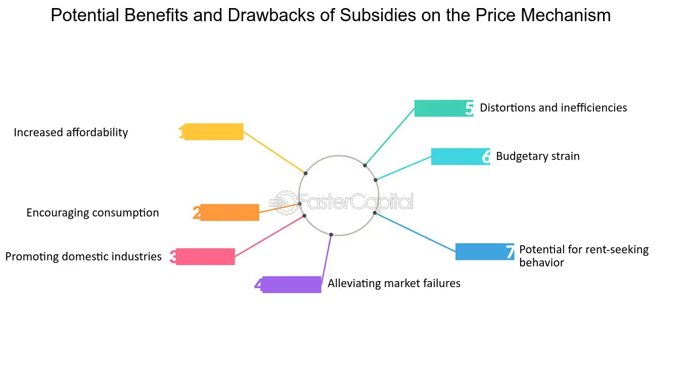

## Table of Contents

## What are subsidies and how do they work?

Subsidies are financial help that governments give to businesses or people to make things cheaper or to help them do something. They can be given in many ways, like giving money directly, lowering taxes, or making the price of something less. Governments use subsidies to help important parts of the economy, like farming, energy, or transport, or to help people who need it, like low-income families.

When a government gives a subsidy, it usually wants to make a product or service cheaper for people to use. For example, if the government wants more people to use public transport, it might give money to the bus or train companies so they can charge less for tickets. This makes it easier for people to afford to travel. Subsidies can also help businesses by giving them money to start up or keep going, especially if they are doing something good for the community, like making renewable energy.

## What are the different types of subsidies?

There are several types of subsidies that governments use to help people and businesses. One type is direct financial help, where the government gives money directly to people or companies. This can be seen in things like welfare payments to low-income families or grants to businesses starting up in new industries. Another type is tax breaks, where the government lets businesses or people pay less in taxes. This can make it easier for them to keep more of their money and spend it on other things.

Another common type of subsidy is price support, where the government helps to keep the price of a product or service low. This can be done by giving money to producers so they can sell their goods at a lower price, or by buying up extra products to keep the market stable. For example, in farming, the government might buy extra crops to make sure farmers can still make money even if there's too much of one type of food. Lastly, there are also subsidies for things like research and development, where the government gives money to help new ideas and technologies grow. This can help make new products or ways of doing things that can be good for everyone.

## Who typically provides subsidies?

Subsidies are usually provided by governments. This can be the national government of a country, or sometimes smaller governments like those of states or cities. Governments use their money, which comes from taxes, to give subsidies to people or businesses. They do this to help make things cheaper or to support important parts of the economy.

Sometimes, international groups like the World Bank or the United Nations can also give subsidies. These groups work with many countries and can help provide money to support big projects or help countries that need it. But most of the time, it's the government of a country that decides to give subsidies and how to use them.

## What are the primary goals of implementing subsidies?

The main goal of subsidies is to help make things cheaper for people. When the government gives money to businesses or people, it can lower the cost of things like food, energy, or transport. This makes it easier for everyone, especially those who don't have a lot of money, to afford what they need. For example, if the government helps farmers, it can make food cheaper for everyone to buy.

Another goal of subsidies is to help important parts of the economy grow. Governments might give money to businesses that are doing something good for the community, like making clean energy or creating new jobs. This can help the economy get stronger and create more opportunities for people. Subsidies can also be used to support new ideas and technologies, helping them grow and become useful for everyone.

## How do subsidies affect market prices and consumer behavior?

Subsidies can make things cheaper for people to buy. When the government gives money to businesses, those businesses can lower their prices. For example, if the government helps farmers, the price of food might go down. This means people can buy more food with the same amount of money. When things are cheaper, more people want to buy them. So, subsidies can make people buy more of something because it costs less.

Subsidies can also change what people choose to buy. If the government makes public transport cheaper, more people might choose to take the bus or train instead of driving their own car. This can help the environment because fewer cars on the road means less pollution. But, subsidies can also make it hard for other businesses that don't get help from the government. If one business gets money to lower its prices, other businesses might have a hard time competing. This can make the market less fair for everyone.

## What are some common examples of subsidies in various sectors?

In the farming sector, governments often give money to farmers to help them grow food. This can make food cheaper for everyone to buy. For example, the government might pay farmers if they grow certain crops, like wheat or corn. This helps farmers make money even if the price of their crops goes down. Another example is when the government buys extra food to keep the market stable. This way, farmers don't lose money if there is too much food.

In the energy sector, subsidies are used to make energy cheaper or to support new types of energy. For example, governments might give money to companies that make solar panels or wind turbines. This helps these companies grow and makes clean energy cheaper for people to use. Also, governments might help people pay their energy bills if they can't afford them. This makes sure everyone can have heat and light in their homes.

In the transport sector, subsidies can make public transport cheaper. Governments might give money to bus or train companies so they can charge less for tickets. This makes it easier for people to get around without driving their own cars. It can also help the environment by reducing pollution. Another example is when governments help people buy electric cars by giving them money or tax breaks. This makes electric cars cheaper and encourages more people to use them.

## What are the economic benefits of subsidies for businesses and consumers?

Subsidies can help businesses by giving them money to start up or keep going. This can be really important for new businesses or those trying to do something good for the community, like making clean energy. When businesses get subsidies, they can lower their prices or spend more on growing their business. This can help them make more money and create new jobs. For example, if a government gives money to a company making solar panels, that company can sell the panels for less, which helps them sell more and hire more people.

For consumers, subsidies make things cheaper. When the government helps businesses lower their prices, people can buy more with the same amount of money. This is really helpful for things like food, energy, and transport. For example, if the government helps farmers, the price of food might go down, so people can buy more food. Also, when public transport gets cheaper because of subsidies, more people can use it instead of driving, which can save them money and help the environment. Overall, subsidies can make life easier for people by making important things more affordable.

## How do subsidies impact international trade and competition?

Subsidies can affect international trade by making it harder for other countries to compete. When a government gives money to its own businesses, those businesses can sell their products for less. This makes it tough for businesses in other countries to sell their products in the same market. For example, if a country gives money to its farmers, those farmers can sell their crops cheaper than farmers from other countries. This can make it hard for those other farmers to sell their crops in the same market, which can hurt their businesses and their country's economy.

Subsidies can also lead to trade disagreements between countries. If one country thinks another country is using subsidies unfairly, it might complain to groups like the World Trade Organization. These groups can decide if the subsidies are fair or not. If they decide the subsidies are unfair, they might tell the country to stop giving them. This can cause tension between countries and affect how they trade with each other. In the end, subsidies can change how countries compete and trade with each other, sometimes making it harder for everyone to work together.

## What are the potential drawbacks and unintended consequences of subsidies?

Subsidies can cause problems even though they are meant to help. One big issue is that they can make the market unfair. When the government gives money to some businesses but not others, the businesses that get the money can sell their products for less. This makes it hard for other businesses to compete, especially if they are from other countries. This can lead to trade fights and make it harder for everyone to work together. Also, subsidies can make businesses rely too much on government help. If the government stops giving money, these businesses might not be able to keep going on their own.

Another problem with subsidies is that they can cost a lot of money. The government uses tax money to pay for subsidies, which means less money for other important things like schools or hospitals. Sometimes, subsidies can also be used in ways that don't help as much as they should. For example, if the government gives money to farmers to grow more food, but there is already enough food, it can lead to waste. Also, subsidies can sometimes make people use more of something than they need to. If energy is cheap because of subsidies, people might use more energy than they should, which can hurt the environment.

## How can subsidies lead to market distortions and inefficiencies?

Subsidies can mess up the market by making things seem cheaper than they really are. When the government gives money to businesses, those businesses can lower their prices. This makes it hard for other businesses that don't get help to compete. For example, if a government helps its farmers sell food cheaper, farmers from other countries might not be able to sell their food in the same market. This can lead to unfair competition and make it hard for everyone to play by the same rules.

Also, subsidies can make businesses depend too much on government money. If businesses get used to getting help, they might not try to be efficient on their own. They might keep doing things the same way instead of finding better ways to work. This can slow down progress and make the whole economy less efficient. Plus, if the government stops giving subsidies, these businesses might not be able to survive without the extra money, which can lead to big problems.

## What measures can be taken to mitigate the negative effects of subsidies?

To lessen the bad effects of subsidies, governments can set clear rules about who gets help and why. They can make sure subsidies go to businesses or people who really need them, like new businesses or low-income families. Governments can also check how well subsidies are working by looking at if they are helping the economy grow or if they are just making things unfair. By doing this, they can stop giving money to businesses that don't need it anymore and start helping others who do.

Another way to make subsidies better is to use them for a short time only. This can stop businesses from relying too much on government help. Governments can also work with other countries to make sure everyone follows fair trade rules. This can stop big fights over subsidies and help everyone trade in a way that is good for all. By being careful about how subsidies are used, governments can make sure they help without causing too many problems.

## How do different economic theories evaluate the effectiveness of subsidies?

Different economic theories have different views on how well subsidies work. In classical economics, people often think subsidies mess up the market. They believe that when the government gives money to businesses, it makes things seem cheaper than they really are. This can make it hard for other businesses to compete fairly. Classical economists worry that subsidies can make businesses rely too much on government help instead of trying to be efficient on their own. They think the market should work without government help to be fair and efficient.

On the other hand, Keynesian economics sees subsidies as a helpful tool. Keynesians believe that sometimes the economy needs a boost, and subsidies can help with that. For example, if the government gives money to businesses during a tough time, it can help keep people working and spending money. This can make the whole economy stronger. Keynesians think that using subsidies smartly can help fix problems in the economy and make life better for everyone. They believe the government should step in when needed to help things run smoothly.

## References & Further Reading

1. **Books:**
   - **"Economics of the Public Sector" by Joseph E. Stiglitz:** This comprehensive book investigates into the role of government in the economy, providing insights into various economic policies, including subsidies, and their impact on markets.
   - **"Algorithmic Trading: Winning Strategies and Their Rationale" by Ernie Chan:** This book explores the mechanics and strategies of algorithmic trading, offering a detailed look at the technological advancements and market effects involved.

2. **Academic Papers:**
   - **"The Impact of Government Subsidies on Economic Growth: A Review" by John L. King et al.:** This paper reviews empirical studies on the role of subsidies in economic growth, examining the balance between positive externalities and market distortions.
   - **"Algorithmic Trading and Its Impact on the Financial Markets: A Literature Review" by Sarah J. Roberts:** Offering a critical analysis of algorithmic trading, this paper looks into both the efficiencies introduced and the potential risks, such as market volatility and flash crashes.

3. **Journal Articles:**
   - **"Subsidies and Economic Policy: Efficiency versus Equity" in the Journal of Economic Perspectives:** This article examines the trade-offs involved in government subsidies, analyzing their role in achieving economic efficiency versus promoting equity.
   - **"Technological Advances in Algorithmic Trading" in the Journal of Finance and Economics:** Focused on the technological factors driving algorithmic trading, this article explores their effects on trading efficiency, market liquidity, and accessibility.

4. **Online Resources:**
   - **Investopedia’s Guide to Algorithmic Trading:** An accessible resource for understanding the basics of algorithmic trading, including key concepts, strategies, and tools used in the field.

5. **Government and Institutional Reports:**
   - **OECD Reports on Subsidies:** The Organization for Economic Co-operation and Development provides detailed reports and analysis on the implementation and effects of subsidies in various member countries’ economic policies.

6. **Websites and Blogs:**
   - **CME Group’s Educational Resources on Algorithmic Trading:** Offers various learning materials and articles discussing algorithmic trading frameworks, benefits, and challenges.

These resources provide an extensive foundation for understanding the complex interplay between governmental economic policies, such as subsidies, and the rapidly evolving field of algorithmic trading.

