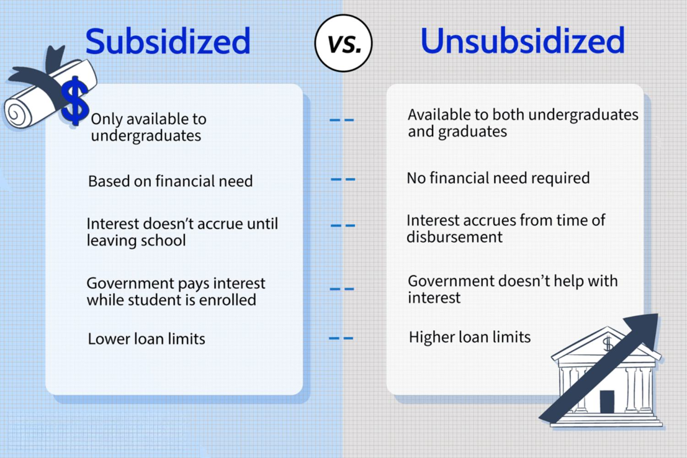

Government support through economic policies, such as subsidies, and the rise of algorithmic trading, are pivotal forces shaping the modern economic landscape. These mechanisms play interconnected roles that not only drive growth but also bring about challenges requiring careful consideration. This article explores these roles and their potential implications.

Subsidies are a form of government intervention designed to promote economic stability and growth by reducing costs for individuals and businesses. They typically aim to support critical industries, enhance innovation, or protect jobs, and can take many forms, including tax breaks, grants, and direct financial transfers. By providing such support, governments endeavor to create favorable conditions for economic development, which can lead to more resilient markets and enhanced global competitiveness.



Algorithmic trading, on the other hand, represents a technological transformation within financial markets. It involves the use of sophisticated algorithms to automate trading decisions and processes. This approach increases market efficiency, enhances liquidity, and lowers the barriers to entry for investors. Algorithmic trading's rapid evolution has been propelled by advancements in computing power and data analytics, allowing for more strategic and informed trading decisions.

The interplay between government subsidies and algorithmic trading is particularly significant. Subsidies can influence trading strategies by altering market fundamentals, such as supply and demand dynamics. In subsidized sectors, algorithmic trading might respond to these changes, driving investment flows and potentially reshaping financial landscapes. For instance, in industries where renewable energy technologies are heavily subsidized, algorithmic trading could enhance investment activities, further promoting sectoral growth.

However, this convergence also presents challenges. The impact of subsidies on market mechanisms and the ethical concerns surrounding algorithmic trading demand nuanced regulatory frameworks. The risks associated with market distortions due to subsidies and the potential for market volatility induced by algorithmic trading, such as flash crashes, underscore the need for careful policy design.

In summary, government support through subsidies and the adoption of algorithmic trading are central to modern economic development. Understanding their roles and interactions is crucial for identifying opportunities and addressing the challenges they present. As these economic mechanisms continue to evolve, policymakers and industry stakeholders must collaborate to ensure they contribute positively to global economic policy and industrial strategy.

## Table of Contents

## Understanding Government Support and Economic Policy

Government subsidies are financial contributions provided by the government to support industries, organizations, or individuals. These contributions aim to promote economic and social policy goals, such as stimulating economic growth, enhancing competitiveness, and ensuring the viability of critical sectors. Subsidies can be direct, in the form of monetary transfers, or indirect, through benefits like tax breaks, reduced interest loans, or government-backed insurance.

Subsidies play a crucial role in economic policy by stabilizing critical industries that might otherwise struggle to survive in a competitive market. This is particularly relevant for sectors that are essential for national security, public welfare, or economic stability, such as agriculture, defense, and renewable energy. By providing financial assistance, subsidies help mitigate market failures, reduce [volatility](/wiki/volatility-trading-strategies), and ensure a reliable supply of essential goods and services.

Subsidies can take various forms, each with distinct advantages. Direct monetary subsidies involve government payments to firms or individuals to lower production costs or enhance income. For example, agricultural subsidies help farmers manage the operational costs, leading to stable food prices and availability. Indirect subsidies, such as tax incentives, allow businesses to retain more profits by reducing their tax obligations. These can encourage investment in specific areas, like research and development, which promotes innovation and long-term economic growth.

Another form is [interest rate](/wiki/interest-rate-trading-strategies) subsidies, where the government either offers loans at reduced interest rates or subsidizes the interest payments on commercial loans. This form of subsidy is particularly effective in promoting capital-intensive industries or large infrastructure projects, which require significant upfront investment. Additionally, government-backed loan guarantees can encourage banks to lend to smaller businesses or risky sectors by reducing the perceived risk of default.

In summary, subsidies are an integral component of economic policy with the capacity to stabilize vital industries, encourage innovation, and achieve broader socio-economic objectives. They are implemented in diverse forms, ranging from direct financial assistance to indirect support via tax incentives or favorable financial arrangements.

## Economic Impact of Subsidies

Government subsidies serve as pivotal instruments in economic policy, particularly in enhancing economic growth by decreasing production costs and stabilizing market prices. By providing financial assistance or tax incentives to businesses, subsidies effectively lower production expenses, which can lead to increased output and lower consumer prices. This stimulates economic activity by making goods and services more accessible and affordable, ultimately fostering a favorable environment for economic expansion.

Subsidies have a dual impact on both supply and demand. On the supply side, they enable producers to lower production costs, elevating their competitiveness and market presence. This often results in increased production and a wider variety of goods and services available in the market. For example, in the agriculture sector, subsidies can lead to an increase in crop yields by allowing farmers to invest in better seeds, technology, and fertilizers. On the demand side, as production costs decrease, these savings can be transferred to consumers in the form of lower prices. Consequently, consumer purchasing power is enhanced, resulting in higher consumption and demand stability.

The positive externalities of subsidies are particularly noticeable in nascent industries, where initial costs and barriers to entry might otherwise stifle innovation and growth. In emerging sectors such as renewable energy or technology, subsidies not only mitigate financial risks but also serve as catalysts for investment and technological advancement. For instance, subsidies in the renewable energy sector can lead to technological breakthroughs and cost reductions in solar and wind energy production, ultimately contributing to environmental sustainability and energy security.

It's essential to recognize that the economic impact of subsidies can vary significantly across different industries and economic conditions. Careful design and implementation of subsidies are crucial to maximize their positive effects while minimizing potential adverse outcomes such as market distortions or over-reliance on government support. By strategically employing subsidies, governments can stimulate economic growth, foster innovation, and contribute to the stability and resilience of both established and emerging markets.

 to Algorithmic Trading

Algorithmic trading, often referred to as algo trading, involves the use of computer algorithms to manage the execution of trading orders in financial markets. These algorithms are designed to make decisions about the timing, price, and quantity of trades with limited human intervention. By leveraging mathematical models and complex algorithms, this trading approach aims to optimize trading processes and capitalize on [arbitrage](/wiki/arbitrage) opportunities, thereby enhancing financial market operations.

Algorithmic trading significantly boosts trading efficiency by executing large volumes of trades swiftly and with high accuracy. It reduces the likelihood of human error that can occur during manual trading, enabling more precise and timely transactions. This increase in efficiency often translates to cost savings and improved execution quality for traders and investors. Additionally, [algorithmic trading](/wiki/algorithmic-trading) contributes to [liquidity](/wiki/liquidity-risk-premium) enhancement in financial markets. By providing continuous market participation, it facilitates smoother transaction flows and tighter bid-ask spreads, which make it easier for participants to buy and sell securities without causing substantial price movements.

Market accessibility has also greatly improved with algorithmic trading, as it allows a diverse range of market participants, from institutional investors to individual traders, to engage with the market. The democratization of trading tools and strategies has opened up the market, enabling a broader set of players to implement complex trading strategies once only accessible to large financial institutions.

The widespread adoption of algorithmic trading is largely attributed to technological advancements. Improvements in computational power, data analytics, and connectivity have transformed the trading landscape. High-frequency trading systems, which rely on advanced algorithms, execute trades in fractions of a second, capitalizing on minor price fluctuations that are imperceptible to human traders. Machine learning and [artificial intelligence](/wiki/ai-artificial-intelligence) are also playing increasingly pivotal roles in algorithmic trading, with algorithms gradually evolving to adapt to changing market conditions and learn from historical data.

Python, a versatile programming language popular among algorithmic traders, facilitates the development of trading strategies. With libraries such as NumPy for numerical computations and pandas for data manipulation, Python provides powerful tools for financial modeling and [backtesting](/wiki/backtesting). For example, a simple moving average crossover strategy can be implemented as follows:

```python
import pandas as pd

# Assume 'data' is a pandas DataFrame containing historical price data with a 'Close' column
data['SMA_50'] = data['Close'].rolling(window=50).mean()
data['SMA_200'] = data['Close'].rolling(window=200).mean()

# Generating buy/sell signals
data['Signal'] = 0 
data['Signal'][data['SMA_50'] > data['SMA_200']] = 1  # Buy signal
data['Signal'][data['SMA_50'] < data['SMA_200']] = -1 # Sell signal
```

In conclusion, algorithmic trading is reshaping financial markets by enhancing efficiency, liquidity, and accessibility. Technological advancements continue to drive its evolution, making it an indispensable component of modern trading.

## The Convergence of Subsidies and Algorithmic Trading

Government subsidies, an integral tool in economic policy, have long been used to stabilize critical sectors and encourage growth. When combined with algorithmic trading, these subsidies can significantly influence trading strategies and drive economic change. Algorithmic trading utilizes advanced mathematical models and high-speed computing to execute trades, creating new dynamics in financial markets, especially when interacting with industries benefiting from subsidies.

Government subsidies can alter the landscape of investment strategies within algorithmic trading by modifying market signals that traders rely on. For instance, subsidies can reduce production costs or stabilize prices in certain industries, making them more appealing for algorithmic models focused on identifying profitable trades. Subsidies can increase demand in these sectors, which algorithmic trading systems can detect and act upon, amplifying investment flows toward these targeted areas. This can enhance market liquidity and provide higher profits for traders proficient in detecting and exploiting such fiscal interventions.

The convergence of algorithmic trading and government subsidies can lead to increased investment flow in subsidized sectors. For example, subsidy policies that aim to bolster renewable energy investments can make these sectors more attractive to algorithmic traders. The increased predictability and reduced volatility in subsidized industries allow algorithms to optimize trading strategies, resulting in enhanced market efficiency and potentially greater capital allocation toward these sectors.

These elements together—subsidies and algorithmic trading—could significantly reshape both financial and industrial landscapes. By guiding investments through market incentives provided by subsidies, algorithmic trading could lead to a reallocation of resources that supports vital industry growth, such as technology and sustainable energy. This could foster innovation, increase global competitiveness, and potentially result in more sustainable economic growth.

However, this integration also necessitates careful monitoring to mitigate risks such as market distortion and unfair advantages. As algorithmic trading evolves, its synergy with government subsidies might require reevaluating regulatory policies to balance the benefits of rapid technological advancement with equitable and stable market practices.

## Challenges and Critiques

Government subsidies and algorithmic trading are both powerful economic tools, but they also face significant criticisms and pose challenges that need careful consideration. 

### Criticisms of Government Subsidies

One of the primary criticisms of government subsidies is their potential to distort markets. When a government subsidizes a particular industry, it can lead to an overproduction of goods or services in that sector. This can create imbalances in the market, as subsidized firms may produce more than is efficient under normal market conditions. The presence of subsidies can also lead to inefficiencies, as they may encourage firms to rely on government support rather than improving operational efficiency or innovation. Moreover, subsidies can create barriers to entry for non-subsidized companies, reducing competition and potentially leading to monopolistic behavior.

From an economic perspective, subsidies can sometimes yield suboptimal resource allocation. Resources might be diverted away from potentially more innovative or efficient sectors towards those that are subsidized simply because they receive financial support, regardless of their overall productivity or contribution to economic growth.

### Risks of Algorithmic Trading

Algorithmic trading, while enhancing trading efficiency and liquidity, also introduces significant risks. One major concern is market volatility. Algorithms can react instantaneously to market movements, which can exacerbate price swings and lead to increased volatility. This rapid response can result in scenarios where prices move quickly away from their true value, potentially destabilizing markets.

Sublime among these risks are "flash crashes," where markets plunge rapidly due to the automated and rapid nature of trading algorithms. For example, the flash crash of May 6, 2010, saw the Dow Jones Industrial Average plunge nearly 1,000 points within minutes only to recover a large portion of the loss shortly after. Such events highlight the potential for algorithms to trigger sudden and extreme volatility that human traders may struggle to react to in time.

### Ethical Implications of Subsidies in Trading

The combination of subsidies and algorithmic trading raises ethical questions, chiefly related to fairness and market manipulation. Algorithms crafted by entities that also benefit from government subsidies can lead to an uneven playing field, where subsidized firms with sophisticated trading algorithms can out-compete non-subsidized ones. This can lead to a concentration of market power, reducing overall market diversity and competitiveness.

Market manipulation is another ethical concern. The integration of subsidies can entice firms to create algorithms that exploit market inefficiencies or regulatory gaps, potentially leading to manipulative practices. Furthermore, the opacity of some algorithms makes it difficult to identify and police these manipulative activities, complicating efforts to maintain fair and transparent markets.

In conclusion, while both government subsidies and algorithmic trading offer clear benefits to economic policy and market operation, they also introduce considerable challenges and ethical dilemmas. Addressing these issues requires careful regulatory oversight and a commitment to ensuring that economic tools are used to promote efficiency and equity, rather than creating distortions or opportunities for misconduct.

## Conclusion

Integrating government subsidies with algorithmic trading offers a nuanced array of benefits and challenges within modern economic frameworks. The primary advantage lies in the potent combination of subsidies’ ability to stabilize and stimulate critical industries and algorithmic trading's capacity to enhance market efficiency and liquidity. Subsidies can lower production costs and foster innovation, while algorithmic trading can attract increased investment flows into subsidized sectors, facilitating smoother transitions and adoption of new technologies. By doing so, subsidies ensure a steady supply and demand balance, which algorithms can exploit to maximize liquidity, ensuring market stability.

However, these benefits must be carefully weighed against the challenges that arise. Market distortions can occur if subsidy allocations are mismanaged, leading to inefficiencies and potentially reinforcing oligopolistic structures. Algorithmic trading, despite improving efficiency, poses risks such as market volatility and flash crashes. The rapid execution and complex strategies employed by algorithms can exacerbate market instability if unregulated.

Therefore, balanced regulatory frameworks are essential to mitigate these risks and maximize benefits. An effective regulatory approach should ensure transparency and accountability in subsidy allocations while monitoring algorithmic trading activities to prevent market manipulation and ensure fairness. This effort requires coordinated global economic policies, as the interplay between subsidies and algorithmic trading spans international markets.

The future implications for economic policy and industrial strategy are profound. As technology continues to evolve, integrating these economic mechanisms can lead to more resilient financial systems and sustainable industrial growth. Policymakers will need to adapt to rapidly changing landscapes, ensuring regulations evolve in tandem with technological advancements. By fostering an environment where subsidies and algorithmic trading co-exist harmoniously, it is possible to stimulate innovation, drive economic growth, and maintain robust market systems that benefit society at large.

## References & Further Reading

1. **Books:**
   - **"Economics of the Public Sector" by Joseph E. Stiglitz:** This comprehensive book investigates into the role of government in the economy, providing insights into various economic policies, including subsidies, and their impact on markets.
   - **"Algorithmic Trading: Winning Strategies and Their Rationale" by Ernie Chan:** This book explores the mechanics and strategies of algorithmic trading, offering a detailed look at the technological advancements and market effects involved.

2. **Academic Papers:**
   - **"The Impact of Government Subsidies on Economic Growth: A Review" by John L. King et al.:** This paper reviews empirical studies on the role of subsidies in economic growth, examining the balance between positive externalities and market distortions.
   - **"Algorithmic Trading and Its Impact on the Financial Markets: A Literature Review" by Sarah J. Roberts:** Offering a critical analysis of algorithmic trading, this paper looks into both the efficiencies introduced and the potential risks, such as market volatility and flash crashes.

3. **Journal Articles:**
   - **"Subsidies and Economic Policy: Efficiency versus Equity" in the Journal of Economic Perspectives:** This article examines the trade-offs involved in government subsidies, analyzing their role in achieving economic efficiency versus promoting equity.
   - **"Technological Advances in Algorithmic Trading" in the Journal of Finance and Economics:** Focused on the technological factors driving algorithmic trading, this article explores their effects on trading efficiency, market liquidity, and accessibility.

4. **Online Resources:**
   - **Investopedia’s Guide to Algorithmic Trading:** An accessible resource for understanding the basics of algorithmic trading, including key concepts, strategies, and tools used in the field.

5. **Government and Institutional Reports:**
   - **OECD Reports on Subsidies:** The Organization for Economic Co-operation and Development provides detailed reports and analysis on the implementation and effects of subsidies in various member countries’ economic policies.

6. **Websites and Blogs:**
   - **CME Group’s Educational Resources on Algorithmic Trading:** Offers various learning materials and articles discussing algorithmic trading frameworks, benefits, and challenges.

These resources provide an extensive foundation for understanding the complex interplay between governmental economic policies, such as subsidies, and the rapidly evolving field of algorithmic trading.