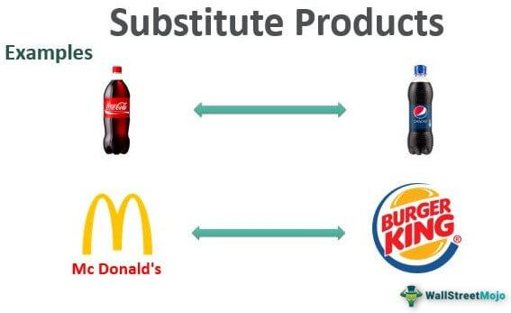

Algorithmic trading, often referred to as algo trading, is a process that employs computer programs to execute trades based on a pre-defined set of instructions. This approach capitalizes on the speed and precision of computers to surpass manual trading capabilities, both in efficiency and potential profitability. By automating the trading process, algorithmic trading minimizes the subjective elements often associated with human trading, such as emotion and psychological biases.

In recent years, technological advancements and innovative trading platforms have significantly expanded the reach of algorithmic trading. What was once predominantly a domain for institutional traders is now accessible to individual investors as well. This democratization has been driven by improved computational power, the proliferation of data analytics tools, and user-friendly interfaces that make complex strategies easier to implement and manage.



As we explore the landscape of algorithmic trading, it becomes crucial to consider the alternative solutions and substitutes that provide investors with diverse options. These alternatives can include various trading platforms and strategies that cater to different investment goals and technical competencies. By leveraging these alternative solutions, investors can tailor their approach to better align with their specific needs, thus enhancing their potential for successful trading outcomes.

## Table of Contents

## Understanding Algorithmic Trading

Algorithmic trading employs predefined trading strategies implemented via computer algorithms to automate the execution of trades. These strategies are crafted to follow specific parameters based on historical analyses and statistical models, enabling traders to optimize their trading processes. The essentials of algorithmic trading revolve around several key factors, including price, timing, volume, and broader market trends.

The primary appeal of algorithmic trading lies in its ability to execute transactions with exceptional speed and accuracy. By deploying algorithms, traders can perform transactions at a pace unattainable for humans, capitalizing on even minute price discrepancies and market movements. This automation reduces the latency typically associated with manual trading, allowing market participants to react almost instantaneously to market changes.

An important advantage of algorithmic trading is its capacity to eliminate emotions and psychological biases from trading decisions. Investors are often prone to making irrational decisions based on fear, greed, or other emotions, which can lead to suboptimal trading outcomes. By adhering strictly to a set of predefined rules, algorithmic trading helps enforce discipline in trading, thereby improving decision-making processes. This systematic approach provides consistency and mitigates the risk of emotional interference, aligning the trading practice strictly with strategic objectives.

Mathematically, [algorithmic trading](/wiki/algorithmic-trading) strategies can be represented as a set of functions that take inputs such as past and current market data and generate trading signals. These signals are then converted into actionable orders, such as buy or sell, depending on the logic embedded within the algorithm. A simple example in Python might look like the following pseudo-code:

```python
def trading_strategy(historical_price_data, current_price):
    # Define simple moving average parameters
    short_term_window = 5
    long_term_window = 20

    # Calculate short-term and long-term moving averages
    short_term_avg = historical_price_data[-short_term_window:].mean()
    long_term_avg = historical_price_data[-long_term_window:].mean()

    # Generate trading signals
    if short_term_avg > long_term_avg and current_price > short_term_avg:
        return "Buy"
    elif short_term_avg < long_term_avg and current_price < short_term_avg:
        return "Sell"
    else:
        return "Hold"

# Example usage
historical_prices = [100, 102, 101, 105, 107, 110, 108, 107, 109, 111]
current_market_price = 112

signal = trading_strategy(historical_prices, current_market_price)
print(f"Trading signal: {signal}")
```
The example above illustrates a simple moving average crossover strategy where buy and sell decisions are made on the basis of the short-term and long-term moving averages. Although this is a basic illustrative strategy, in practice, algorithmic trading can encompass more complex strategies that take into account various market indicators and data feeds for enhanced decision-making.

## Key Features of Algorithmic Trading Software

Algorithmic trading software is equipped with several key features that enhance the efficiency and effectiveness of trading activities. These features are crucial for both developing and executing trading strategies with precision and speed. 

**Backtesting** is a fundamental feature that allows traders to test their strategies against historical data. This process involves simulating trades using past market data to determine how a strategy would have performed historically. The primary objective of backtesting is to validate the viability of a trading strategy before real capital is invested. By identifying potential flaws or weaknesses in a strategy under historical conditions, traders can optimize their approaches accordingly. A successful backtesting process can enhance confidence in the strategy’s future performance.

**Execution Speed** is another critical feature that distinguishes algorithmic trading from manual trading. Automated trading systems are designed to execute trades promptly based on predefined parameters. This rapid execution is instrumental in capitalizing on short-lived trading opportunities that manual intervention might miss. Given that financial markets can be highly volatile, the ability to quickly execute a trade can be the difference between profit and loss.

**Programming Language Support** is essential for creating custom strategies tailored to specific trading goals. Many algorithmic trading platforms support popular programming languages such as Python and C++. Python, in particular, is favored due to its simplicity and the availability of extensive libraries and packages for data analysis and machine learning. Here's a simple Python example of a trading strategy that compares two moving averages:

```python
# Import necessary libraries
import pandas as pd

# Generate a simple moving average crossover strategy
def moving_average_strategy(data, short_window, long_window):
    # Calculate short and long moving averages
    data['Short_MA'] = data['Price'].rolling(window=short_window, min_periods=1).mean()
    data['Long_MA'] = data['Price'].rolling(window=long_window, min_periods=1).mean()

    # Generate trading signals
    data['Signal'] = 0
    data.loc[data['Short_MA'] > data['Long_MA'], 'Signal'] = 1
    data.loc[data['Short_MA'] < data['Long_MA'], 'Signal'] = -1

    return data

# Example usage with dummy data
historical_data = pd.DataFrame({'Price': [100, 102, 101, 104, 107, 106, 108]})
strategy_data = moving_average_strategy(historical_data, short_window=2, long_window=3)
print(strategy_data)
```

**Integration** capabilities ensure the software can communicate effectively with various brokers and trading platforms. Seamless integration is vital for automated systems to access market data, submit trades, and manage portfolios without manual intervention. This connectivity allows for real-time data exchange and ensures that trades are executed as soon as the conditions set by the algorithms are met.

Overall, these features enable traders to develop sophisticated strategies, reduce emotional bias, and improve operational efficiency in trading activities. By leveraging advanced computing power and algorithmic precision, traders can potentially achieve more consistent and profitable outcomes.

## Top Algorithmic Trading Software and Platforms

TradeStation is widely recognized for its reliability and comprehensive educational resources, making it an ideal platform for novice traders venturing into algorithmic trading. The platform provides an extensive library of webinars, tutorials, and forums, enabling users to understand trading strategies and platform functionality. Furthermore, TradeStation's versatile suite of analytical tools allows traders to implement and test various trading strategies efficiently.

[Interactive Brokers](/wiki/interactive-brokers-api) is another prominent platform known for its flexible API, which caters to tech-savvy users who prefer custom strategy development. The platform supports a wide range of programming languages, including Python, Java, and C++, allowing traders to build sophisticated algorithms tailored to their specific needs. The API flexibility facilitates extensive integration capabilities, enabling users to connect with numerous data providers and trading resources. 

TrendSpider distinguishes itself by focusing on advanced technical analysis and integration with Federal Reserve Economic Data. It offers unique features such as automated technical pattern recognition and dynamic price alerts. Additionally, TrendSpider's automated trendline, fib retracement, and multi-timeframe analysis help traders make informed decisions based on real-time data and historical market trends.

Coinrule stands out in the [cryptocurrency](/wiki/cryptocurrency) trading sector by simplifying the trading process with rule-based bots. This platform empowers users to automate their trading strategies without requiring extensive coding knowledge. By providing a user-friendly interface and pre-set trading templates, Coinrule ensures that both beginner and experienced traders can efficiently manage their cryptocurrency portfolios. It supports numerous exchanges, enhancing its versatility and appeal to crypto enthusiasts seeking automated solutions.

In summary, these platforms offer distinct features catering to different aspects of algorithmic trading, from educational resources and technical analysis tools to flexible integration and user-friendly automation in various asset classes.

## Substitute Platforms for Algorithmic Trading

Alternative trading platforms offer unique features designed to cater to diverse investor needs, often serving as substitutes or supplementary options to traditional algorithmic trading software. These platforms are particularly advantageous for new traders or those seeking a more approachable entry into automated trading.

eToro’s CopyTrader feature exemplifies the innovative tools available on these platforms. It allows investors, particularly beginners, to replicate trades executed by experienced traders. This feature not only provides a practical learning mechanism but also mitigates the risks associated with developing independently managed trading strategies. By observing the decisions of seasoned traders, new investors can understand market dynamics and strategy implementations in real-time without engaging directly in complex algorithm development or analysis.

On the other hand, Mindful Trader offers a different approach by providing pre-built algorithmic trading strategies that users can leverage without needing in-depth technical knowledge. This platform focuses on simplicity and usability, making algorithmic trading accessible to those who may not have the coding prowess traditionally associated with developing and deploying such strategies. By offering ready-made strategies, Mindful Trader reduces the learning curve and technical barriers, enabling users to focus on strategic decision-making rather than programming or [backtesting](/wiki/backtesting) complexities.

These substitute platforms reflect a trend towards democratizing access to sophisticated trading methodologies. By lowering the technological and financial barriers, they allow a broader spectrum of traders to benefit from algorithmic trading's potential, consequently fostering a more inclusive financial ecosystem.

## Benefits of Using Substitute Platforms

Substitute platforms in algorithmic trading present a versatile approach that accommodates various trading strategies and levels of expertise, making them an attractive option for many investors. 

The primary benefit of using these platforms is the flexibility they offer. Traders can select a platform that aligns with their specific strategies and experience, avoiding a one-size-fits-all approach. Whether a trader is focused on stocks, [forex](/wiki/forex-system), or cryptocurrencies, substitute platforms cater to diversified preferences and trading styles.

Each substitute platform often provides unique features that cater to particular needs. For example, some platforms offer real-time market data and analytics tools that are crucial for making informed trading decisions. Others might emphasize educational resources, offering tutorials and community support to enhance user understanding and proficiency, especially for those new to algorithmic trading.

Moreover, these platforms democratize access to algorithmic trading by lowering the technical barriers typically associated with developing and implementing algorithms. Investors with varying levels of technical expertise can engage in algorithmic trading without needing to master complex programming languages or systems. Many substitute platforms offer user-friendly interfaces and pre-built strategies, allowing users to execute trades effectively without deep technical knowledge.

An essential [factor](/wiki/factor-investing) contributing to the accessibility of substitute platforms is their pricing models. Many offer tiered pricing structures, providing options that range from basic access for beginners to more advanced features for experienced traders. This adaptability ensures that users pay only for the features they use, making algorithmic trading more financially attainable.

In summary, substitute platforms enhance the flexibility, accessibility, and inclusivity of algorithmic trading across different investor profiles. They enable the exploration of diverse trading strategies while providing the necessary resources and support for users to develop their skills and achieve their trading objectives.

## Challenges of Substitutes in Algorithmic Trading

Substitute platforms for algorithmic trading present certain challenges that can affect their efficiency and efficacy, drawing attention to the need for careful consideration when choosing a trading solution. A prominent challenge is the varying level of precision and access to data offered by these platforms. Unlike established algorithmic trading environments that typically boast extensive data repositories and robust analytical tools, substitute platforms may lack comprehensive datasets or timely data access, potentially affecting the quality of trading decisions.

Technological challenges also play a significant role. The need to grasp complex systems is often a barrier for traders without a technical background. Algorithmic trading requires understanding not only the market but also the algorithms and software that drive these systems. This requisite knowledge can be daunting for new traders, especially when substitute platforms depend on novel technologies or unconventional system architectures which might diverge from standard practices.

Furthermore, the cost associated with these platforms can be significantly variable. Premium features, which may include advanced analytical tools, real-time data feeds, or sophisticated algorithmic strategies, often come at additional costs. This variation can make it difficult for traders to budget effectively for their trading activities. For example, while some platforms might offer a subscription model, others might incur costs based on transaction [volume](/wiki/volume-trading-strategy) or the complexity of the trading strategies employed.

In conclusion, while substitute platforms offer an avenue for exploring algorithmic trading, the challenges they present necessitate thorough evaluation by potential users. Understanding these factors can help traders make informed decisions, balancing the costs and capabilities to align with their trading objectives and technical proficiency.

## Conclusion: Choosing the Right Trading Solution

When selecting a trading platform, aligning the choice with individual trading goals and technical ability is paramount. A successful platform consideration hinges on understanding one's strategy, risk tolerance, and the sophistication required from the trading software. As the landscape of algorithmic trading rapidly evolves, it becomes increasingly important for traders to engage in continuous learning. This involves not only understanding new technologies and market dynamics but also acquiring the ability to adapt to changing conditions and integrate new strategies as they emerge.

Substitutes and alternative platforms offer varied features and advantages that allow traders to experiment and determine what aligns best with their needs. For instance, platforms like TradeStation and Interactive Brokers cater to different user profiles, offering a plethora of tools and features such as educational resources and flexible APIs that are crucial for independent strategy development and testing. On the contrary, platforms like eToro’s CopyTrader provide an opportunity for those less inclined towards technical strategy building to still engage effectively in algorithmic trading by leveraging the expertise of seasoned traders.

In conclusion, the right trading solution is not universally fixed but rather fluid, capable of accommodating different expertise levels and trading methodologies. Traders are encouraged to be proactive about their learning and remain adaptable to capture opportunities and mitigate risks efficiently. Empowering oneself with a broad understanding of the available platforms, coupled with a strategic approach to selecting the most fitting solution, can significantly enhance one’s journey in algorithmic trading.

## FAQs on Algorithmic Trading

What is the best algorithm for trading?

The "best" algorithm for trading can depend significantly on the trading goals, market conditions, and individual preferences of a trader. Popular strategies include [arbitrage](/wiki/arbitrage), where traders take advantage of price discrepancies in different markets; [trend following](/wiki/trend-following), which tries to capitalize on price [momentum](/wiki/momentum); and mean reversion, which assumes that prices will return to their average over time. Each algorithm's effectiveness can vary based on the strategy's implementation, market conditions, and asset class being traded. 

Can algorithmic trading be profitable?

Algorithmic trading can be profitable when implemented correctly. The advantages include speed, precision, and the ability to process large amounts of data, which can lead to better decision-making and more optimal trade execution. However, profitability is not guaranteed. Successful algorithmic trading requires robust strategies, effective risk management, and continuous adaptation to changing market conditions. Past performance does not necessarily indicate future results, and market anomalies or black swan events can affect strategy outcomes.

Is algorithmic trading accessible to individuals?

Yes, algorithmic trading has become increasingly accessible to individuals, primarily due to advancements in technology and the availability of algorithmic trading platforms and APIs. Many brokers and platforms offer tools and educational resources for individuals to create and test algorithmic trading strategies. Languages such as Python are widely used for developing these algorithms, thanks to their extensive libraries and ease of use. However, individuals should be aware of the risks and invest time in learning about algorithmic trading before engaging in it actively.

How can beginners start with algorithmic trading?

Beginners interested in algorithmic trading should start by acquiring foundational knowledge in both trading and programming. Here are some steps to get started:

1. **Education**: Learn the basics of trading, including market structures and different types of financial instruments. Online courses, books, and tutorials on algorithmic trading are beneficial.

2. **Programming Skills**: Gain proficiency in programming languages like Python, widely used in algorithmic trading due to its powerful libraries such as Pandas for data manipulation and backtesting, NumPy for numerical computation, and APIs for market data access.

   ```python
   import pandas as pd
   import numpy as np

   # Example of a simple moving average crossover strategy
   def sma_crossover_strategy(prices, short_window, long_window):
       signals = pd.DataFrame(index=prices.index)
       signals['short_mavg'] = prices['close'].rolling(window=short_window, min_periods=1).mean()
       signals['long_mavg'] = prices['close'].rolling(window=long_window, min_periods=1).mean()

       signals['signal'] = 0.0
       signals['signal'][short_window:] = np.where(signals['short_mavg'][short_window:] > signals['long_mavg'][short_window:], 1.0, 0.0)   
       signals['positions'] = signals['signal'].diff()
       return signals
   ```

3. **Backtesting**: Practice implementing and testing trading strategies using historical market data to validate their potential effectiveness.

4. **Paper Trading**: Use demo accounts or paper trading platforms to simulate trading with virtual money, effectively testing strategies in real-time without risking actual capital.

5. **Utilize Platforms**: Explore different algorithmic trading platforms such as MetaTrader, QuantConnect, or TradingView, which offer tools for developing and testing strategies without extensive initial investment.

By progressively building skills and knowledge, beginners can develop effective tools and strategies tailored to their trading objectives.

## References & Further Reading

[1]: Bergstra, J., Bardenet, R., Bengio, Y., & Kégl, B. (2011). ["Algorithms for Hyper-Parameter Optimization."](https://papers.nips.cc/paper/4443-algorithms-for-hyper-parameter-optimization) Advances in Neural Information Processing Systems 24.

[2]: ["Advances in Financial Machine Learning"](https://www.amazon.com/Advances-Financial-Machine-Learning-Marcos/dp/1119482089) by Marcos Lopez de Prado

[3]: ["Evidence-Based Technical Analysis: Applying the Scientific Method and Statistical Inference to Trading Signals"](https://www.amazon.com/Evidence-Based-Technical-Analysis-Scientific-Statistical/dp/0470008741) by David Aronson

[4]: ["Machine Learning for Algorithmic Trading"](https://github.com/PacktPublishing/Machine-Learning-for-Algorithmic-Trading-Second-Edition) by Stefan Jansen

[5]: ["Quantitative Trading: How to Build Your Own Algorithmic Trading Business"](https://books.google.com/books/about/Quantitative_Trading.html?id=j70yEAAAQBAJ) by Ernest P. Chan