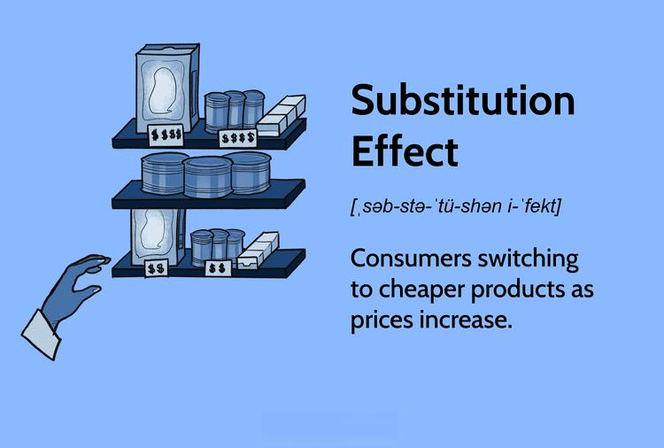

The interplay between consumer behavior and economic theory provides a comprehensive understanding of market dynamics and decision-making processes. At its core, consumer behavior is driven by the decisions individuals and groups make regarding the acquisition, consumption, and disposal of goods and services. These decisions are heavily influenced by economic theories that seek to explain how and why consumers prioritize certain goods over others, particularly when there are changes in relative prices or their income levels. One of the fundamental concepts in this discourse is the substitution effect, which describes how consumers respond to changes in the price of a good relative to other goods. When the price of a good rises, consumers tend to substitute that good with a cheaper alternative, aiming to maintain their level of satisfaction or utility without increasing their spending.

The substitution effect is crucial in understanding consumer choice and sheds light on broader economic decision-making. For example, if the price of coffee rises relative to tea, a consumer might purchase less coffee and more tea, assuming that tea provides a similar level of satisfaction. This behavior is not only pivotal for individual consumers but also has significant implications for businesses and policymakers, as it affects demand curves and market equilibrium.



Simultaneously, advancements in technology have introduced new dynamics into the economic landscape, particularly through the development of algorithmic trading. Algorithmic trading involves the use of computer programs to execute trades based on pre-set criteria. These algorithms can analyze vast amounts of market data at incredible speeds, often utilizing economic theories, such as the substitution effect, to inform trading decisions. For instance, if an algorithm detects a rise in the price of a particular asset, it may automatically execute trades to substitute this asset with a more cost-effective alternative, thereby maximizing returns or minimizing risks based on pre-defined strategic objectives.

Algorithmic trading epitomizes the integration of economic behavior into technological frameworks, demonstrating how traditional theories continue to be relevant in modern financial markets. As a result, understanding the substitution effect and its role in consumer behavior not only informs economic theory but also enhances the efficacy of automated trading systems designed to respond to rapidly changing market conditions. This intersection of consumer behavior, economic theory, and technology underscores the evolving nature of markets and the continuous need to adapt strategies to achieve desired outcomes.

## Table of Contents

## Understanding the Substitution Effect

The substitution effect is a fundamental concept in consumer behavior, forming a crucial part of microeconomic theory. It describes the change in consumption patterns due to a change in the relative prices of goods, while keeping the consumer's level of utility constant. Essentially, when the price of a good increases, consumers are inclined to purchase less of that good and more of a relatively cheaper substitute, assuming all other factors remain constant.

### Examples of the Substitution Effect

To illustrate, consider two goods: coffee and tea. If the price of coffee increases while the price of tea stays the same, consumers may start buying more tea instead of coffee. This shift occurs because tea becomes relatively cheaper compared to coffee, prompting consumers to substitute tea for coffee to maintain their satisfaction levels without incurring extra cost. 

Another example can be seen in public transportation versus personal vehicle use. If public transport fares decrease, individuals who previously used their cars might switch to public transportation to save on fuel and parking expenses. This is a direct application of the substitution effect, where a shift in relative prices drives a change in consumer behavior. 

### Differentiation from the Income Effect

The substitution effect is distinct from the income effect, though both occur simultaneously when prices change. The income effect reflects changes in the consumer's purchasing power. For instance, using the coffee and tea example, if the price of coffee increases, consumers have less real income or purchasing power. This might lead them to reduce their overall consumption of coffee, even without substituting it with tea. 

To mathematically distinguish these effects, consider the Slutsky decomposition of the price effect, which states:

$$
\text{Total Price Effect} = \text{Substitution Effect} + \text{Income Effect}
$$

Both the substitution and income effects can be analyzed through the budget constraint and indifference curve framework, which helps to separate their impacts visually and quantitatively.

In summary, the substitution effect pertains to changes in consumption patterns as goods become relatively cheaper or more expensive, holding utility constant. It plays a vital role in understanding consumer decision-making, especially when analyzing how consumers adapt to price changes amongst various goods.

## Economic Theory Behind Consumer Decisions

Economic theory plays a crucial role in understanding consumer decision-making, providing insights into how individuals and households allocate their limited resources among various goods and services. Central to this understanding is the concept of utility maximization, which suggests that consumers choose combinations of goods and services that maximize their satisfaction or utility within their budget constraints.

Utility maximization is grounded in the assumption that consumers are rational actors who seek to derive the greatest possible satisfaction from their purchases. This behavior can be represented mathematically by the utility function U(x, y,..., n), where x, y,..., n represent different goods or services. A fundamental aspect of this theory is the consumer's budget constraint, which dictates the feasible combinations of goods that can be purchased. This constraint can be expressed as:

$$
p_x \cdot x + p_y \cdot y + ... + p_n \cdot n \leq I
$$

where $p_x, p_y,..., p_n$ are the prices of goods and $I$ is the income of the consumer. The objective of utility maximization is then to maximize the utility function U subject to this budget constraint.

Consumers adjust their consumption in response to price changes, a behavior explained by the income and substitution effects. When the price of a good changes, the substitution effect occurs as consumers reallocate their purchases toward relatively cheaper goods, reflecting their attempt to maintain the same level of utility. For instance, if the price of good x decreases, holding income and other prices constant, the consumer will substitute good x for other relatively more expensive goods. This principle is mathematically modeled through the consumer's demand curve, which captures the relationship between the price of a good and the quantity demanded.

Accompanying the substitution effect is the income effect, which reflects changes in the consumer's purchasing power as a result of the price change. A price decrease effectively increases the consumer's real income, potentially leading to higher consumption of the good if it is a normal good, or reduced consumption if it is an inferior good.

These dynamics can be illustrated with a simple Python example of a utility maximization problem using a Cobb-Douglas utility function:

```python
from scipy.optimize import minimize

# Define the utility function
def utility(x):
    return -(x[0]**0.5 * x[1]**0.5)

# Budget constraint function
def constraint(x):
    return budget - (p_x * x[0] + p_y * x[1])

# Prices and budget
p_x = 10
p_y = 20
budget = 100

# Initial guess
x0 = [1, 1]

# Constraints and bounds
con = {'type': 'ineq', 'fun': constraint}
bounds = [(0, None), (0, None)]

# Optimization
solution = minimize(utility, x0, constraints=[con], bounds=bounds)

print("Optimal consumption bundle:", solution.x)
```

This code snippet demonstrates how consumers adjust their consumption bundle to maximize utility while adhering to budget constraints. It calculates the optimal quantities of two goods (x and y) for given prices and budget, using a negative utility function to conform to the minimization approach of the `scipy.optimize.minimize` method.

Understanding these economic principles equips economists and analysts with the tools needed to predict consumer behavior in response to changes in market conditions, aiding businesses in setting optimal pricing strategies and governments in policy formulation.

## Algorithmic Trading: An Economic Perspective

Algorithmic trading refers to the method of executing trades using pre-programmed algorithms and automated platforms. These algorithms, defined by a set of rules and instructions, enable the rapid execution of trading orders, minimizing human intervention and error. The history of [algorithmic trading](/wiki/algorithmic-trading) dates back to the early 1970s, with the introduction of electronic trading systems in financial markets. Over the decades, technological advancements have significantly evolved algorithmic trading, allowing it to become a dominant force in modern financial markets.

The application of economic theories, particularly the substitution effect, in algorithmic trading highlights the amalgamation of economic principles with trading technologies. The substitution effect is an economic concept that describes how consumers adjust their consumption patterns when relative prices change, substituting more expensive items with cheaper alternatives. This principle can be applied to trading strategies, where algorithms dynamically adjust asset portfolios in response to price fluctuations. For instance, an algorithm can be programmed to detect when a particular asset becomes overvalued compared to others, and accordingly, shift investments to undervalued assets.

Technological advancements have augmented the effectiveness of algorithmic trading by providing sophisticated tools for data analysis and real-time market monitoring. These developments have facilitated the seamless integration of economic principles into trading algorithms. The symbiosis between technology and economic theories manifests in several ways. For example, [machine learning](/wiki/machine-learning) techniques allow algorithms to adapt to changing market conditions by identifying patterns consistent with economic behaviors like the substitution effect. Furthermore, advancements in computational power enable the processing of vast amounts of market data, enhancing the precision and efficiency of economic models used in trading strategies.

In summary, algorithmic trading represents a significant development in financial markets, rooted in both economic theory and technological innovation. By harnessing the principles of economics and leveraging cutting-edge technology, algorithmic trading provides a dynamic framework for understanding and navigating the complexities of modern markets.

## Applying the Substitution Effect in Trading Strategies

Incorporating the substitution effect into trading algorithms involves leveraging insights from economic theory to inform trading decisions. The substitution effect describes how consumers shift their consumption from relatively more expensive goods to less expensive ones when prices change. This concept can be translated into trading strategies by identifying analogous patterns in market behaviors, such as shifts in investor preferences among financial assets in response to changes in relative prices or returns.

A key technique for integrating the substitution effect into trading algorithms is the analysis of past market data to detect substitution-like patterns. Traders and analysts can utilize statistical and machine learning methods to examine historical price and [volume](/wiki/volume-trading-strategy) data, identifying correlations that suggest asset substitution by market participants. For example, an increase in the price of gold might lead to a substitution towards other precious metals like silver or platinum, which could be detected by analyzing relative price changes and trading volumes.

Python can be used effectively for such analysis. Libraries like Pandas and NumPy facilitate the handling and manipulation of large datasets, while regression models from the StatsModels or scikit-learn libraries help identify significant substitution patterns. The code snippet below outlines how a simple regression analysis might be conducted to detect substitution effects between two assets, Asset A and Asset B:

```python
import pandas as pd
import statsmodels.api as sm

# Load market data
data = pd.read_csv('market_data.csv')  # Assume CSV contains date, price_A, volume_A, price_B, volume_B
data['price_change_A'] = data['price_A'].pct_change()
data['price_change_B'] = data['price_B'].pct_change()

# Prepare the independent and dependent variables
X = data[['price_change_A']]
y = data['price_change_B']

# Add a constant to the independent variables (for the intercept)
X = sm.add_constant(X)

# Fit a linear regression model
model = sm.OLS(y, X).fit()
print(model.summary())
```

The benefits of aligning trading strategies with economic behavior trends, such as substitution effects, are manifold. By considering consumer and investor behavior, traders can anticipate market movements more accurately. This approach can lead to enhanced predictive power in trading algorithms and improved portfolio management by dynamically adjusting asset allocations based on detected substitution patterns. Moreover, incorporating these behaviors into algorithmic strategies allows for more responsive and adaptive trading systems that better align with real-world market dynamics.

Integrating the substitution effect into trading algorithms is not without its challenges. Market participants' behaviors can be influenced by numerous factors beyond price changes, such as macroeconomic developments, technological innovations, and regulatory changes. However, the adaptive application of economic theories like the substitution effect provides a valuable framework for developing sophisticated trading strategies that resonate with underlying market trends.

## Substitution Effect and Market Equilibrium

The substitution effect plays a pivotal role in shaping market dynamics by influencing consumer decisions, subsequently altering demand patterns. This effect describes how consumers adjust their consumption in response to changes in the relative prices of goods. When the price of a good rises, consumers tend to purchase less of that good and substitute it with a cheaper alternative, thereby impacting market demand.

Firms must closely monitor these shifts in consumer behavior to maintain competitive advantage and economic viability. One primary strategy adopted by firms is dynamic pricing, where prices are adjusted based on real-time analysis of market conditions and consumer preferences. Firms may lower the price of complementary goods or offer promotions on substitutes to retain consumer interest and drive sales. This strategic pricing adaptation helps stabilize demand and maintain market equilibrium, which is the state where the quantity of goods supplied equals the quantity demanded at a particular price level.

Real-world examples of the substitution effect influencing market dynamics can be observed across various industries. For instance, in the energy sector, a surge in oil prices often leads consumers to switch to more cost-effective alternatives like natural gas or renewable energy sources. This shift not only affects the demand for oil but also encourages firms within the oil industry to explore price adjustments or alternative product offerings. Similarly, in the tech industry, the rise in smartphone prices might prompt consumers to opt for budget-friendly models or previous generation devices, impacting the pricing strategies of smartphone manufacturers.

This phenomenon also extends to broader economic scenarios, such as during inflation periods where generic brands gain popularity as substitutions for higher-priced branded goods. Companies respond by introducing competitive pricing or expanding their generic product lines to capture a larger market share. These real-world adaptations underscore the importance of understanding the substitution effect's impact on market equilibrium and highlight how firms strategically respond to consumer behavior shifts to sustain their market position. Through this lens, the substitution effect emerges as a crucial determinant of pricing strategies and market stability, reflecting its enduring significance in economic theory.

## Challenges and Considerations

Applying economic theory within algorithmic trading presents notable challenges, largely due to the inherent complexity and variability of financial markets and human behavior. Economic models, while valuable, often rely on simplifying assumptions that may not hold true in dynamic market environments. These models typically assume rational behavior among consumers and traders, yet real-world scenarios frequently deviate from these assumptions.

One primary limitation is that traditional economic theories, such as those predicting changes in supply and demand, do not always account for the psychological and qualitative factors influencing consumer behavior. Factors such as branding, perception of value, and non-monetary incentives can significantly sway decisions, making it difficult to apply a purely quantitative approach.

Algorithmic trading faces additional challenges due to the unpredictability of consumer behavior. Consumer decisions often reflect a complex interplay of personal preferences, external influences, and contextual factors that resist easy quantification. Predictive models must therefore grapple with a high level of uncertainty and noise, which can lead to suboptimal trading decisions if not managed correctly.

Furthermore, these predictive algorithms require ongoing research and adaptation. Markets are continuously influenced by technological innovations, regulatory changes, and shifts in consumer trends, necessitating constant refinement of economic models and trading algorithms. Machine learning and [artificial intelligence](/wiki/ai-artificial-intelligence) can be employed to enhance adaptability by learning from past market data and adjusting strategies in response to new patterns. However, developing models that can generalize beyond historical data and predict future trends poses a significant challenge.

For instance, let's consider a simplified Python function using machine learning to predict price changes based on substitute product pricing:
```python
import numpy as np
from sklearn.linear_model import LinearRegression

# Sample data for product A's price and substitute product B's price
price_A = np.array([100, 120, 140, 160, 180])  # prices of product A
price_B = np.array([80, 100, 110, 130, 150])  # prices of substitute B

# Consumer demand for product A at each price point
demand_A = np.array([200, 180, 160, 140, 120])  # Demand for product A

# Reshape data for model
X = np.column_stack((price_A, price_B))
y = demand_A

# Initialize and fit linear regression model
model = LinearRegression().fit(X, y)

# Predict demand for new price points
new_price_A = np.array([[170, 140]])  # New price for A and its substitute B
predicted_demand_A = model.predict(new_price_A)

predicted_demand_A
```
In this example, a simple linear regression model predicts consumer demand for a product based on its own price and that of a substitute. However, actual market conditions may exhibit more complex dependencies that this model fails to capture. 

Therefore, algorithmic trading relying strictly on economic theories must remain flexible, incorporating interdisciplinary insights and enabling systems to account for emerging trends and behaviors that traditional models might overlook. Continuous research is vital to evolve economic theories, integrating new data and methodologies to better align with the ever-changing market realities.

## Conclusion

Consumer behavior and economic theories intersect significantly in trading, offering vital insights into market dynamics and decision-making processes. Algorithmic trading, leveraging principles such as the substitution effect, integrates these insights to optimize trading strategies. By understanding how consumers adjust their purchasing habits in response to price changes, algorithmic models can mimic these patterns to predict market movements.

Future research in this field should focus on refining algorithms to better accommodate complex consumer behavior patterns and market conditions. This includes developing more sophisticated machine learning models that can adapt to evolving economic factors and consumer preferences. Moreover, the rapid technological advancements demand continuous exploration of how traditional economic theories, such as utility maximization, can be adapted and integrated into these automated systems to enhance predictive accuracy.

Adaptability is paramount when applying economic theories to market conditions, which are subject to constant fluctuation due to various external influences. The marketplace is dynamic, and economic models must be flexible enough to incorporate new data and adjust predictions accordingly. This involves not only improving algorithms but also ensuring that trading strategies remain resilient and responsive to unforeseen economic shifts. By maintaining a balance between theoretical rigor and practical adaptability, algorithmic trading can continue to leverage the profound insights offered by the intersection of economic theories and consumer behavior.

## References & Further Reading

[1]: Slutsky, E. (1915). "Sulla teoria del bilancio del consumatore." *Giornale degli Economisti e Rivista di Statistica*. 

[2]: Samuelson, P. A. (1948). *Foundations of Economic Analysis*. Harvard University Press.

[3]: Varian, H. R. (1992). *Microeconomic Analysis*. W.W. Norton & Company.

[4]: Malkiel, B. G. (1999). *A Random Walk Down Wall Street: Including a Life-Cycle Guide to Personal Investing*. W.W. Norton & Company.

[5]: Tsay, R. S. (2010). *Analysis of Financial Time Series*. Wiley Series in Probability and Statistics.

[6]: Chande, T. (1997). *Beyond Technical Analysis: How to Develop and Implement a Winning Trading System*. John Wiley & Sons.

[7]: Tsang, E. P. K. (1993). *Foundations of Constraint Satisfaction*. Academic Press.

[8]: Fama, E. F., & French, K. R. (1992). "The Cross-Section of Expected Stock Returns." *The Journal of Finance*.

[9]: Black, F., & Scholes, M. (1973). "The Pricing of Options and Corporate Liabilities." *Journal of Political Economy*.

[10]: Markowitz, H. M. (1952). "Portfolio Selection." *The Journal of Finance*.