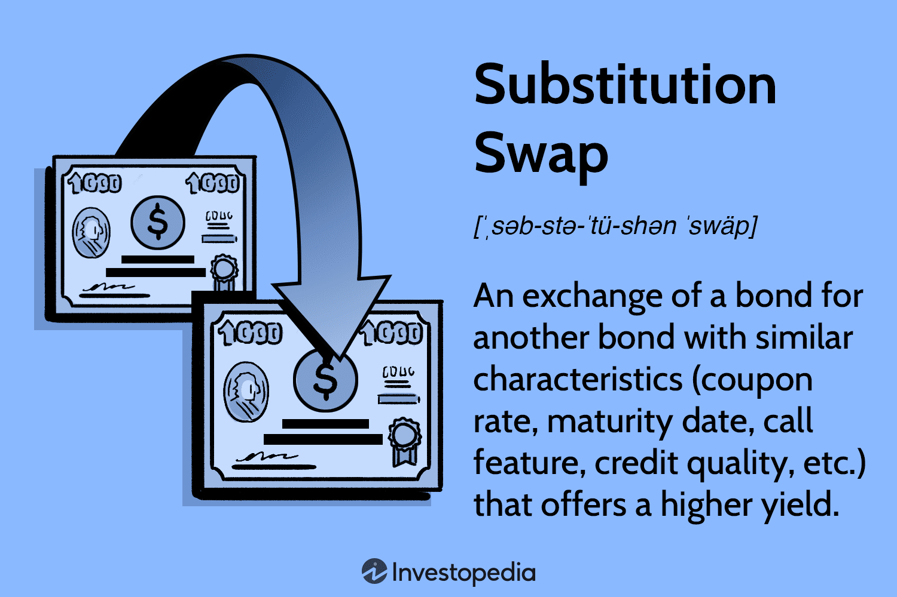

## Table of Contents

## What is a substitution swap in finance?

A substitution swap in finance is when someone trades one bond for another bond that is very similar. The main reason to do this is to get a better price or a better deal. For example, if someone owns a bond that is not doing well, they might swap it for a different bond from the same company that has a better interest rate or is cheaper.

This kind of swap can help people manage their money better. It can also help them take advantage of changes in the market. But it's important to be careful because even small differences between the bonds can affect how good the swap is. So, people need to look closely at the details before deciding to make a substitution swap.

## How does a substitution swap work?

A substitution swap happens when someone exchanges one bond for another bond that is very similar. The goal is usually to get a better deal or a better price. For example, if someone has a bond that isn't doing well, they might trade it for another bond from the same company that has a better interest rate or is cheaper. The key is that the bonds should be alike in many ways, like the company that issued them or the time until they mature.

Doing a substitution swap can help people manage their money better. It lets them take advantage of changes in the market. But it's important to be careful because even small differences between the bonds can make a big difference. So, before making a swap, people need to look closely at things like the interest rates, the prices, and any other details that might affect how good the swap is.

## What are the common reasons for executing a substitution swap?

People do substitution swaps for a few main reasons. One big reason is to get a better price. If someone has a bond that isn't doing well or is worth less than they thought, they might swap it for a similar bond that is cheaper or has a better price. Another reason is to get a better [interest rate](/wiki/interest-rate-trading-strategies). If a similar bond from the same company offers a higher interest rate, swapping can help them earn more money over time.

Another reason for a substitution swap is to manage risk. Sometimes, the bond someone owns might become riskier because of changes in the market or the company's situation. By swapping it for a similar but less risky bond, they can feel safer about their investment. Lastly, people might do a substitution swap to take advantage of market changes. If they think the market is going to change in a way that will make one bond better than another, they can swap to benefit from those changes.

## Can you provide a simple example of a substitution swap?

Imagine you own a bond from Company A that pays 3% interest each year. You find out that Company A has another bond that is almost the same but pays 4% interest. You decide to swap your 3% bond for the 4% bond because it will give you more money each year.

This swap makes sense because both bonds are from the same company and have similar terms. By making this swap, you get a better interest rate without changing much else about your investment. It's a simple way to improve your financial situation.

## What are the potential benefits of using substitution swaps?

Substitution swaps can help people get better deals on their investments. If someone owns a bond that isn't doing well, they can swap it for a similar bond that might be cheaper or offer a better interest rate. This can help them save money or earn more over time. For example, if someone swaps a bond with a 3% interest rate for one with a 4% interest rate, they will get more money each year without changing much else about their investment.

Another benefit of substitution swaps is that they can help manage risk. Sometimes, the bond someone owns might become riskier because of changes in the market or the company's situation. By swapping it for a similar but less risky bond, they can feel safer about their investment. This can give them peace of mind and help protect their money. So, substitution swaps are a useful tool for both improving returns and managing risk.

## What are the risks associated with substitution swaps?

Substitution swaps can have some risks. One big risk is that the new bond might not be as good as it seems. Even if the bonds look similar, there could be small differences that make the new bond riskier or less valuable. For example, the new bond might have a lower credit rating or different terms that could affect how much money you get back.

Another risk is that the market could change after you make the swap. If the value of the new bond goes down or the interest rates change, you might end up with a worse deal than you started with. It's important to think about how the market might change before deciding to swap. So, while substitution swaps can be a good way to improve your investments, they also come with risks that you need to be aware of.

## How do substitution swaps affect portfolio management?

Substitution swaps can help people manage their money better. When someone does a substitution swap, they trade one bond for another that is very similar. This can help them get a better price or a better interest rate. For example, if someone swaps a bond with a 3% interest rate for one with a 4% interest rate, they will get more money each year. This can make their whole investment collection, or portfolio, worth more.

But there are also risks to think about. If the new bond turns out to be riskier or less valuable than the old one, it could hurt the portfolio. Also, if the market changes after the swap, the new bond might not be as good a deal as it seemed at first. So, people need to be careful and think about these risks when they are managing their portfolio. Substitution swaps can be a good tool, but they need to be used wisely to really help improve a portfolio.

## What are the key considerations before entering into a substitution swap?

Before deciding to do a substitution swap, it's important to look closely at the details of both bonds. You need to make sure the new bond is really similar to the old one. Check things like the interest rates, the prices, and any other details that might affect how good the swap is. Even small differences can make a big difference, so you need to be careful.

Another thing to think about is how the market might change. If the value of the new bond goes down or the interest rates change after you make the swap, you might end up with a worse deal than you started with. So, it's important to think about what might happen in the future and how that could affect your investment. 

Lastly, consider how the swap fits into your overall plan for managing your money. A substitution swap can help you get a better price or a better interest rate, but it also comes with risks. Make sure the swap will really help improve your portfolio without making it too risky.

## How do regulatory environments impact substitution swaps?

Regulatory environments can have a big impact on substitution swaps. Rules made by governments and financial groups can change how easy or hard it is to do these swaps. For example, some rules might say you need to tell someone before you can swap bonds. Other rules might limit what kinds of bonds you can swap or how much you can swap. These rules are there to make sure people are being fair and honest, but they can also make things more complicated.

Also, different countries have different rules about substitution swaps. If you want to swap bonds from companies in different countries, you need to know the rules in both places. Sometimes, the rules can make it hard to do swaps across borders. So, it's important to understand the rules where you are and where the bonds come from. This can help you decide if a substitution swap is a good idea for you.

## What advanced strategies involve substitution swaps?

Some people use substitution swaps in smart ways to make their money work better. One way is to use them to balance their investments. If someone has too much money in one kind of bond, they might swap some of it for a similar bond from a different company. This can help spread out the risk and make their whole collection of investments, or portfolio, safer. Another way is to use substitution swaps to take advantage of small changes in the market. If someone thinks the price of one bond is going to go up soon, they might swap for that bond to make more money when the price goes up.

Another advanced strategy is to use substitution swaps to manage taxes. Sometimes, swapping one bond for another can help someone pay less in taxes. For example, if someone is about to owe a lot of taxes on the interest from a bond, they might swap it for a bond that has a lower interest rate but also lower taxes. This can help them keep more of their money. But these strategies can be tricky, and it's important to understand the rules and risks before trying them.

## How can technology and data analytics enhance the effectiveness of substitution swaps?

Technology and data analytics can make substitution swaps better by helping people find the best deals. With computers and special programs, people can look at a lot of information about bonds very quickly. They can see which bonds are similar and which ones have better prices or interest rates. This can help them make smart choices about which bonds to swap. For example, if someone wants to swap a bond, they can use a computer to find another bond that is almost the same but cheaper or with a better interest rate.

Data analytics can also help people understand the risks of substitution swaps. By looking at past data, people can see how bonds have done before and guess how they might do in the future. This can help them decide if a swap is a good idea. For example, if the data shows that a certain bond has been risky in the past, someone might decide not to swap for it. Using technology and data analytics can make substitution swaps safer and more likely to help people make more money.

## What are the latest trends and future outlook for substitution swaps in the financial market?

Substitution swaps are becoming more popular as people use technology to find better deals. More and more, people are using computers and special programs to look at a lot of information about bonds quickly. This helps them find similar bonds that might be cheaper or have better interest rates. Also, because of new rules and changes in the market, people are using substitution swaps to manage their money better and take advantage of small changes in bond prices. This trend is likely to keep growing as technology gets better and more people learn how to use it.

In the future, substitution swaps might become even more important. As the market changes and new rules come out, people will need to be smart about managing their money. Technology and data analytics will play a big role in helping people make good choices about substitution swaps. They will help people understand the risks and find the best deals. So, as long as people keep using technology to make smart choices, substitution swaps will stay a useful tool in the financial market.

## References & Further Reading

[1]: ["Quantitative Financial Analytics: The Path to Investment Profits"](https://www.amazon.com/Quantitative-Financial-Analytics-Investment-Profits/dp/9813224258) by Sergio M. Focardi and Frank J. Fabozzi

[2]: ["The Handbook of Fixed Income Securities"](https://www.amazon.com/Handbook-Fixed-Income-Securities-Ninth/dp/1260473899) by Frank J. Fabozzi

[3]: Ramaswamy, S., & Liljeblom, E. (1997). ["Substitution Swaps and Interest Rate Sensitivities in Bond Portfolios."](https://link.springer.com/content/pdf/10.1007/978-3-540-77926-1_4.pdf)00037-6) Journal of Economic Dynamics and Control.

[4]: Aldridge, I. (2013). ["High-Frequency Trading: A Practical Guide to Algorithmic Strategies and Trading Systems."](https://www.amazon.com/High-Frequency-Trading-Practical-Algorithmic-Strategies/dp/1118343506) Wiley.

[5]: ["Risk Management and Financial Institutions"](https://books.google.com/books/about/Risk_Management_and_Financial_Institutio.html?id=1J1QDwAAQBAJ) by John C. Hull