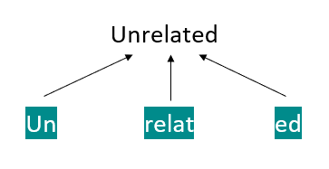

## Table of Contents

## What is subword segmentation in the context of machine learning?

Subword segmentation is a technique used in machine learning, especially in natural language processing, to break down words into smaller parts called subwords. This method helps handle the complexity of languages where new words are constantly being created or where words can be very long. By splitting words into subwords, the model can better understand and process text, making it more efficient and effective. For example, the word "unhappiness" could be split into "un", "happy", and "ness", allowing the model to recognize these common parts in other words too.

In practice, subword segmentation is often used in tasks like machine translation and text generation. It helps models deal with out-of-vocabulary words, which are words the model hasn't seen during training. By breaking down these new words into familiar subwords, the model can still make sense of them. This approach also reduces the size of the vocabulary the model needs to learn, making it easier to train and use. Overall, subword segmentation improves the performance of language models by making them more adaptable and capable of handling a wider variety of text.

## Why is subword segmentation important for natural language processing?

Subword segmentation is important for natural language processing because it helps machines understand and work with words better. In many languages, new words are made all the time, and some words can be very long. By breaking words into smaller parts, or subwords, the machine can learn these smaller pieces and then put them together to understand new or long words. For example, if a machine knows the subwords "un", "happy", and "ness", it can figure out the meaning of "unhappiness" even if it hasn't seen that exact word before.

This technique also makes it easier for machines to handle a big vocabulary. Instead of needing to learn every single word, the machine can learn a smaller set of subwords. This makes the training process faster and more efficient. It also helps with tasks like translating text from one language to another, where understanding the parts of words can be really helpful. Overall, subword segmentation makes language models smarter and more adaptable to different kinds of text.

## What are the main techniques used for subword segmentation?

One common technique for subword segmentation is called Byte Pair Encoding (BPE). BPE starts with a list of all the characters in a text and then looks for pairs of characters that appear together a lot. It then combines these pairs into new subwords. For example, if "th" appears often, BPE might turn it into a single subword. This process keeps going until a certain number of subwords are made. BPE is good because it can learn from the text itself and doesn't need a lot of rules set by people.

Another technique is called WordPiece, which is similar to BPE but has some differences. WordPiece also starts with characters and combines them into subwords, but it uses a different way to decide which pairs to combine. It looks at how often pairs appear and how much they help to make the text shorter. WordPiece is used a lot in models like BERT, which is a famous language model. Both BPE and WordPiece help machines understand words better by breaking them into smaller, more manageable parts.

A third technique is called Unigram Language Model. This method starts with a big list of possible subwords and then tries to find the best set of subwords that can explain the text well. It does this by removing subwords that don't help much and keeping the ones that do. This technique is good because it can handle different languages and types of text well. All these methods help machines learn from text more effectively by breaking words into smaller pieces that are easier to understand and work with.

## How does Byte Pair Encoding (BPE) work for subword segmentation?

Byte Pair Encoding (BPE) is a method for breaking words into smaller parts called subwords. It starts by looking at all the characters in a text and treating each character as a separate subword. Then, BPE looks for pairs of characters that appear together a lot. When it finds a pair that is common, it combines these two characters into a new subword. For example, if "th" appears often, BPE might turn it into a single subword. This process of finding and combining common pairs keeps going until a certain number of subwords are made. The goal is to end up with a set of subwords that can be used to represent the text more efficiently.

BPE is good because it learns from the text itself without needing a lot of rules set by people. It keeps making new subwords until it reaches a set number, like 30,000 subwords. This helps the machine understand words better by breaking them into smaller, more manageable parts. For example, the word "unhappiness" might be broken down into "un", "happy", and "ness". By using these subwords, the machine can handle new or long words more easily, even if it hasn't seen them before. This makes language models smarter and more adaptable to different kinds of text.

## What is the WordPiece model and how does it differ from BPE?

The WordPiece model is another way to break words into smaller parts called subwords. It starts with all the characters in a text and then combines them into subwords, similar to Byte Pair Encoding (BPE). But WordPiece uses a different way to decide which pairs to combine. It looks at how often pairs appear and how much they help to make the text shorter. For example, if combining "th" into one subword makes the text shorter and it appears often, WordPiece might choose to do that. This method is used a lot in models like BERT, which is a famous language model.

The main difference between WordPiece and BPE is how they choose which pairs to combine. BPE just looks at how often pairs appear and keeps combining the most common ones until it reaches a set number of subwords. WordPiece, on the other hand, also thinks about how much combining pairs will help to make the text shorter. This means WordPiece might not always choose the most common pair if another pair would make the text shorter. Both methods help machines understand words better by breaking them into smaller, more manageable parts, but WordPiece's approach can sometimes lead to a more efficient set of subwords.

## Can you explain the process of Unigram Segmentation?

Unigram Segmentation is a way to break words into smaller parts called subwords. It starts with a big list of possible subwords and then tries to find the best set of subwords that can explain the text well. It does this by removing subwords that don't help much and keeping the ones that do. For example, if the word "unhappiness" is in the text, Unigram might start with subwords like "un", "happy", "ness", and "unhappiness". It then looks at how well these subwords can represent the text and removes the ones that don't help much, like "unhappiness", keeping "un", "happy", and "ness".

The process of Unigram Segmentation keeps going until it finds the best set of subwords. It uses a scoring system to decide which subwords to keep. If a subword helps to explain the text better, it gets a higher score and is more likely to stay. This method is good because it can handle different languages and types of text well. By breaking words into smaller parts, Unigram helps machines understand and work with text more effectively.

## What are the advantages of using gradient-based subword tokenization?

Gradient-based subword tokenization is a way to break words into smaller parts that can help machines learn from text better. It uses math to figure out the best way to split words. This method can change how it splits words as it learns more, which means it can get better over time. For example, if it sees that splitting "unhappiness" into "un", "happy", and "ness" helps it understand the text better, it will keep doing that. This makes the machine smarter because it can adjust to new words and different kinds of text.

One big advantage of gradient-based subword tokenization is that it can work well with different languages. It doesn't need people to set a lot of rules. Instead, it learns from the text itself. This means it can handle new words or words that are used in different ways. Another advantage is that it can make the text shorter by using fewer subwords. This can help the machine process the text faster and use less memory. Overall, gradient-based subword tokenization makes language models more flexible and efficient.

## How do different subword segmentation techniques handle out-of-vocabulary words?

Different subword segmentation techniques handle out-of-vocabulary (OOV) words by breaking them down into smaller, known subwords. For example, if a machine has never seen the word "unhappiness" before, it can still understand it if it knows the subwords "un", "happy", and "ness". Byte Pair Encoding (BPE) does this by looking at the characters in the word and combining common pairs until it can represent the word with known subwords. WordPiece is similar but chooses pairs based on how often they appear and how much they help to make the text shorter. Unigram Segmentation starts with a big list of subwords and keeps the ones that help explain the text best, removing those that don't.

Gradient-based subword tokenization also helps with OOV words by adjusting how it splits words as it learns. This means it can get better over time at breaking new words into known parts. For example, if it learns that splitting "unhappiness" into "un", "happy", and "ness" helps it understand the text better, it will keep doing that. This method is good because it can handle different languages and new words without needing a lot of rules set by people. Overall, all these techniques make it easier for machines to understand and work with text that has words they haven't seen before.

## What are the challenges faced when implementing subword segmentation in multilingual models?

Implementing subword segmentation in multilingual models can be tough because languages are different. Each language has its own way of making words, and some languages use characters that others don't. For example, English uses the alphabet, but Chinese uses characters. This means that a model needs to learn a lot of different subwords to handle all these languages well. If the model doesn't learn enough subwords, it might not understand words in some languages correctly. This can make the model less good at tasks like translating text from one language to another.

Another challenge is that some languages might not have enough text for the model to learn from. If there isn't a lot of text in a certain language, the model might not learn the right subwords for that language. This can make the model worse at understanding and working with text in that language. Also, the model needs to balance learning subwords for different languages without making the vocabulary too big. A big vocabulary can make the model slower and use more memory. So, finding the right balance is important for making the model work well with many languages.

## How does subword segmentation impact the performance of neural machine translation models?

Subword segmentation helps neural machine translation models work better by breaking words into smaller parts. This makes it easier for the model to understand new or long words it hasn't seen before. For example, if the model knows the subwords "un", "happy", and "ness", it can figure out the meaning of "unhappiness" even if it hasn't seen that word before. This way, the model can handle out-of-vocabulary words more easily, which makes the translations more accurate and complete. It also helps the model learn from a smaller set of subwords, which makes training faster and more efficient.

Another way subword segmentation helps is by making the model more flexible with different languages. Each language has its own way of making words, and some languages use characters that others don't. By breaking words into subwords, the model can learn from many languages at the same time without needing a huge vocabulary. This means the model can translate text from one language to another more accurately. Overall, subword segmentation makes neural machine translation models smarter and more adaptable, leading to better performance in translating text.

## What metrics are used to evaluate the effectiveness of subword segmentation algorithms?

To evaluate how well subword segmentation algorithms work, people use different metrics. One common metric is the perplexity of the language model. Perplexity shows how well the model can predict the next word in a sentence. A lower perplexity means the model is better at understanding the text. Another important metric is the translation quality in machine translation tasks. This is often measured using BLEU (Bilingual Evaluation Understudy) scores. A higher BLEU score means the translations are more accurate and closer to what a human would say.

Another way to evaluate subword segmentation is by looking at the compression ratio. This measures how much smaller the text becomes when it is broken into subwords. A good compression ratio means the algorithm can represent the text using fewer subwords, which can make the model faster and use less memory. Also, the coverage of out-of-vocabulary (OOV) words is an important metric. This shows how well the algorithm can handle new words by breaking them into known subwords. A high coverage means the model can understand more words, even if it hasn't seen them before.

## How can subword segmentation be optimized for specific domains or languages?

Subword segmentation can be optimized for specific domains or languages by training the model on text that is relevant to that domain or language. For example, if you want to use the model for medical texts, you would train it on medical documents. This way, the model learns subwords that are common in medical language, like "cardi" for heart-related words. By focusing on the specific vocabulary of a domain or language, the model can break words into more meaningful subwords, which helps it understand and process the text better.

Another way to optimize subword segmentation is by adjusting the size of the vocabulary. If you are working with a language that has many unique characters or long words, you might need a larger vocabulary to capture all the important subwords. On the other hand, if you are working with a simpler domain, a smaller vocabulary might be enough. By tuning the number of subwords, you can make the model more efficient and accurate for the specific task. This balance helps the model perform better in translating or understanding text in the chosen domain or language.